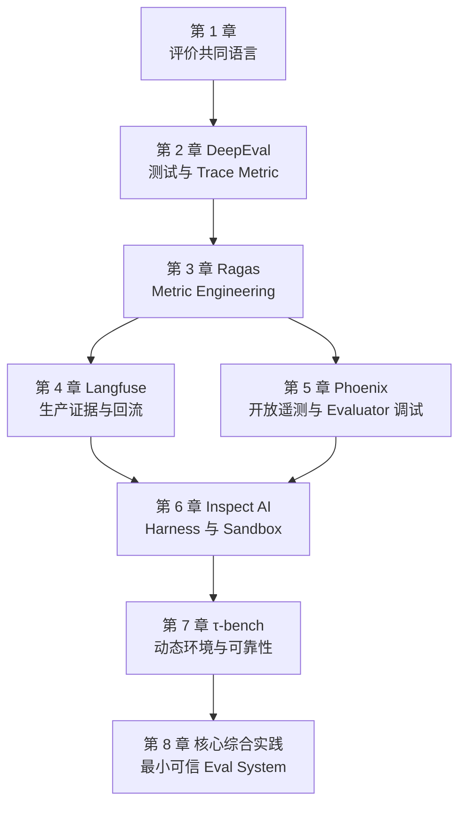

# AI Agent Evaluation：学习路线与章节目录

## 学完后应该能做什么

- 把 Model、Prompt、Tool Schema、Orchestrator、Memory 和 Agent Runtime 版本化为 Evaluation Subject，并把 Dataset/Harness Environment/Grader 固定在 RunManifest；
- 写出含初始状态、成功终态、禁止副作用和可解证据的 Task Contract；
- 让一次 Trial 留下可重建的 transcript、tool calls、environment state、cost 和 timing；
- 组合 deterministic oracle、trajectory rule、LLM judge 与 human calibration；
- 区分 outcome、process、安全、可靠性、效率和用户体验指标；
- 同时报告 pass@k、pass^k、slice、置信区间与失败类型；
- 审计 benchmark、grader 和 user simulator，而不只审计被测 Agent；
- 把离线 eval、CI gate、生产 trace 和失败样本回流连成闭环。

## 先修知识

开始前只需要：

- 理解 Agent 会调用模型和工具；
- 能阅读基本 Python；
- 知道测试用例、日志和数据库状态的含义。

统计估计、OpenTelemetry、sandbox、LLM judge calibration 和用户模拟会在对应章节按需引入。

## 贯穿案例与共同语言

第 1–6 章统一使用[Support Ticket Agent](CASE-STUDY.md)。共同证据结构是：

```text
Session → Trace → Agent/LLM/Tool Span → Environment State
                         ↓
                Score / Annotation / Grader Evidence
```

Langfuse 与 Phoenix 是并列案例：前者回答“生产失败怎样回流”，后者回答“开放 span 语义和 evaluator 怎样调试”。两章都读会更完整，但彼此不是产品级先修。

## 课程地图



## 第一部分：先定义什么叫“测对了”

### 第 1 章：[从答案评分到系统验证](01-AI-Agent-评价方法论.md)

核心问题：评价对象是模型、最终文本，还是包含工具、编排和环境的完整系统？

完成标准：能为自己的 Agent 写出 SubjectVersion、Task、Trial、Outcome、Trajectory、Grader、Harness 和 Suite 的严格定义。

## 第二部分：学习评价器与测试原语

### 第 2 章：[DeepEval](02-DeepEval-方案详解.md)

核心问题：怎样把 Golden、TestCase、Trace/Span、Metric 和 CI assertion 连成测试闭环？

MVP 完成标准：给同一 Agent 写一个确定性环境 metric 和一个 trace/span metric，并让失败定位到具体 span。语义 metric 的人工校准在第 3 章完成。

### 第 3 章：[Ragas](03-Ragas-方案详解.md)

核心问题：怎样把复杂质量拆成 single-aspect metric，并用人工 gold labels 校准 judge？

完成标准：实现一个自定义 MetricResult，报告 value、reason 和 trace；在人工校准集上计算 agreement。

## 第三部分：把真实运行变成可评价证据

### 第 4 章：[Langfuse](04-Langfuse-方案详解.md)

核心问题：怎样让线上 Observation、Score、Dataset 和 Experiment 形成持续质量回流？

MVP 完成标准：从生产 trace 选取一个失败 Observation，去敏后加入版本化 dataset，并在候选版本 Experiment 中重跑。CI 是进阶扩展。

### 第 5 章：[Phoenix](05-Phoenix-方案详解.md)

核心问题：开放的 OTel/OpenInference span 怎样承载 Agent 语义，Evaluator 自身又如何被调试？

完成标准：生成 AGENT/LLM/TOOL span 树，将 code/LLM annotation 绑定到正确 span，并能查看 evaluator trace。

## 第四部分：构造可重置、可复现的试验

### 第 6 章：[Inspect AI](06-Inspect-AI-方案详解.md)

核心问题：Task、Dataset、Solver/Agent、Sandbox、Scorer、Epoch 和 EvalLog 怎样成为一个 evaluation harness？

MVP 完成标准：在可重置 sandbox 中运行一个固定 Task，并从 EvalLog 重建一次失败。多 epochs 与 scaffold 对照是进阶扩展。

### 第 7 章：[τ-bench / τ³-bench](07-Tau-Bench-方案详解.md)

核心问题：有动态用户、领域政策和数据库副作用时，如何用终态与 pass^k 评价可靠性？

完成标准：运行同一任务多 trial，分别报告 DB outcome、过程 invariant、user-simulator error 和 pass^k。

## 第五部分：第 8 章核心综合实践

第 8 章采用分层完成标准：第 1–2 章后可以先做 MVP；完成第 1–7 章后再达到完整毕业线。完整项目包含：

1. Task Contract 与 SubjectVersion；
2. 可重置环境和完整 Trial evidence；
3. deterministic outcome oracle；
4. trajectory/safety rules；
5. 经人工样本校准的 LLM judge；
6. 重复 Trial、slice 与不确定性报告；
7. CI gate 与生产失败回流；
8. 对 benchmark、grader 和 simulator 的自测。

## 每章四遍法

1. **看测量对象**：当前工具评价的是最终文本、trace、span 还是环境终态？
2. **看证据链**：分数能追到哪条 observation、tool call 或 state diff？
3. **做失真推演**：judge、simulator、task、environment 或 grader 坏了会怎样？
4. **完成练习**：输出可重复的 task、trial、score 和 failure analysis。

## 按目标选择支线

| 目标 | 建议路径 |
|---|---|
| 快速建立 Agent 回归测试 | 1 → 2 → 第 8 章 MVP |
| 设计与校准语义指标 | 1 → 2 → 3 → 第 8 章 Metric 扩展 |
| 建立生产质量回流 | 1 → 2 → 3 → 4；按需补 5 |
| 学习开放 span 与 evaluator 调试 | 1 → 2 → 3 → 5；按需补 4 |
| 构建可重置 harness | 1 → 2 → 3 → 6 → 第 8 章 Harness 扩展 |
| 动态用户与高风险评价 | 1 → 2 → 3 → 6 → 7 → 第 8 章完整毕业线 |

## 研究参考

- [附录 A：六方案能力对比](appendix-a-六大方案对比与选型.md)
- [附录 B：论文与近期方法](appendix-b-权威论文与近期方法综述.md)
- [附录 C：综合参考架构](appendix-c-Agent-评价综合参考.md)
- [附录 D：平台维护卡片](appendix-d-platform-maintenance-cards.md)
- [练习答案与判分点](SOLUTIONS.md)
- [章节维护模板](_chapter-template.md)
