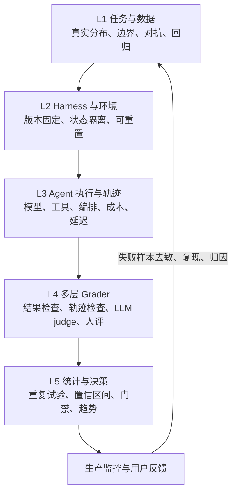
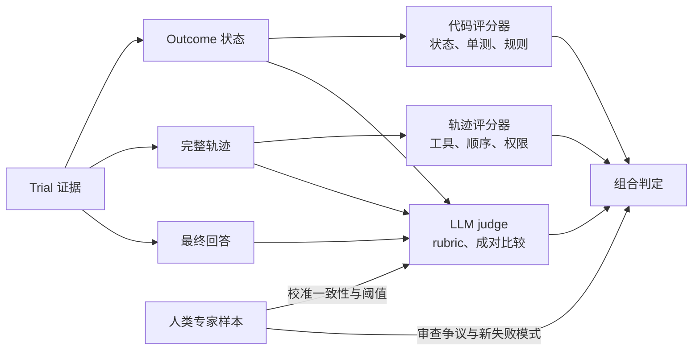
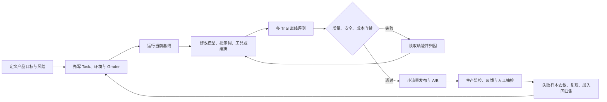

# 第 1 章 AI Agent 评价方法论：从答案评分到系统验证

> 更新日期：2026-07-31  
> 适用范围：会调用工具、跨多轮推进任务、修改外部状态或与用户持续交互的 AI Agent。

## 本章要解决的问题

Agent 会多轮决策、调用工具并修改环境，最终文本只覆盖很小一部分事实。本章先建立后续所有框架共用的评价语言和证据优先级。

## 本章目标

| 项目 | 内容 |
|---|---|
| 前置知识 | 理解一次 Agent 运行包含模型与工具 |
| 本章重点 | Subject、Task、Trial、Outcome、Trajectory、Grader、Harness、Suite |
| 第一遍重点 | 五层架构、grader 组合、多 Trial、Eval-Driven Development |
| 完成后应能回答 | 什么才是被测对象？分数依赖哪些证据？怎样区分能力与一致性？ |

## 核心心智模型

评价 Agent，不能只给最后一段回答打分。一个可信的评价体系至少要同时回答五个问题：

1. **结果对不对**：目标状态是否真的达成，而不是 Agent 只是声称“完成了”。
2. **过程是否合理**：工具、参数、顺序、重试和停止时机是否正确。
3. **边界是否守住**：是否越权、泄露数据、违反政策，失败时能否安全停止。
4. **表现是否稳定**：换一个样本、随机种子、模型版本或运行一次之后，成功率是否仍可信。
5. **上线后是否可控**：能否追踪失败、发现漂移、回放样本，并把线上失败沉淀回归测试。

因此，正确做法不是选择一个“万能指标”，而是建立一个由**任务集、隔离环境、完整轨迹、多类评分器、统计汇总、发布门禁和线上反馈**组成的闭环。Anthropic 对 Agent eval 的定义也把 task、trial、grader、transcript/trace、outcome、evaluation harness 和 suite 明确分开，并强调 Agent 的多轮工具使用和环境修改使传统单轮评测不够用：[Demystifying evals for AI agents](https://www.anthropic.com/engineering/demystifying-evals-for-ai-agents)。

## 评价对象到底是什么

不要把分数写成“模型 X = 82 分”。对 Agent，更准确的 Evaluation Subject 是：

```text
SubjectVersion =
  ModelVersion
  + SystemPromptVersion
  + ToolSchemaVersion
  + OrchestratorVersion
  + MemoryPolicyVersion
  + AgentRuntimeRevision
```

只改其中一项，都应该生成新的 SubjectVersion。同一个模型放进不同工具集和编排器，会表现为不同 Agent。Dataset、可重置测试环境、grader、simulator 和 runner/provider 依赖属于某次 Eval Run 的测量条件，应固定在 `RunManifest`，不要与被测 Agent 身份混在一起。

### 核心术语

| 术语 | 严格定义 | 常见混淆 |
|---|---|---|
| Task / Case | 一个有输入、初始环境和成功条件的测试问题 | 不是一条随手写的 prompt |
| Trial | Subject 对同一 Task 的一次独立尝试 | 一个 Task 只跑一次无法衡量随机性 |
| RunManifest | 一组 Trial 共享的 Subject、Dataset、Harness Environment、Grader 和依赖版本 | 不是 SubjectVersion 的重复副本 |
| Transcript / Trace / Trajectory | 一次 Trial 的完整步骤、模型输出、工具调用和状态变化 | 不是只有最终回答 |
| Outcome | Trial 结束后环境中可验证的最终状态 | Agent 的“已完成”声明不等于 Outcome |
| Grader / Scorer | 对 Outcome、Transcript 或最终输出执行判断的逻辑 | LLM judge 只是其中一种 |
| Harness | 负责装载任务、隔离环境、运行 Agent、记录轨迹和评分的基础设施 | 不是被测 Agent 本身 |
| Suite | 围绕某种能力或风险组织的一组 Task | 单一公开 benchmark 不是完整产品评测 |

## Agent 评价的五层架构



五层都需要存在。缺少环境隔离，结果可能被上一次 Trial 的残留状态污染；缺少轨迹，就只能看到失败而看不到原因；缺少重复试验和置信区间，小幅分数变化可能只是采样噪声；缺少线上反馈，离线数据会逐渐脱离真实分布。NIST AI RMF 的 Measure 部分同样要求测试方法、指标、工具、部署相似条件、局限性与生产监控被记录，并强调客观、可重复或可扩展的 TEVV（测试、评价、验证与确认）过程：[NIST AI RMF Core — Measure](https://airc.nist.gov/airmf-resources/airmf/5-sec-core/)。

## 应该测哪些维度

### 结果正确性（Outcome）

- 目标状态是否真的发生，例如数据库中是否创建了正确订单。
- 约束是否全部满足，而不只是主任务完成。
- 是否产生副作用，例如重复扣款、误删文件或错误通知。
- 结果能否由确定性程序验证；能确定性验证时，优先于 LLM judge。

### 轨迹与工具行为（Process）

- 是否选择了正确工具，参数是否正确。
- 是否遗漏必要步骤、调用了不必要工具或形成循环。
- 是否正确使用工具返回值，而非忽略证据后自行编造。
- 多 Agent 系统中，委派、交接和汇总是否保持上下文与责任边界。

注意：轨迹不应被机械地要求与“标准路径”完全一致。Agent 可能找到更短且同样合法的路径。严格路径匹配适合审计或合规约束，开放任务则应以 Outcome 为主、轨迹规则为辅。

### 安全与权限

- Prompt injection、越权工具调用、敏感数据泄露、危险操作。
- 是否请求必要的人类批准；拒绝后是否停止。
- 工具失败、网络超时或证据冲突时能否安全降级。
- 高风险动作是否满足最小权限、可审计和可恢复要求。

### 稳定性与鲁棒性

- 同一任务重复运行的成功一致性。
- 输入释义、长上下文、缺失信息、工具返回噪声、网络故障下的表现。
- 模型、提示词、工具版本升级后的回归。
- 不同用户群、语言和真实分布切片中的失败差异。

### 效率与体验

- 端到端延迟、模型 token、工具次数、费用、重试次数。
- 达成同样 Outcome 时是否有明显冗余。
- 对话 Agent 还要评价澄清质量、可理解性、语气和用户努力成本。

效率不能脱离质量单独优化。建议先设质量与安全硬门槛，再在通过的方案中比较成本和延迟。

## Grader 组合：确定性优先，模型评分补位，人类负责校准



### 确定性评分器

适合数据库状态、文件内容、单元测试、schema、精确数字、权限事件和不可发生的副作用。优点是便宜、稳定、可解释；缺点是容易漏掉语义质量，也可能把有效的替代解误判为失败。

### LLM judge

适合连贯性、完整性、语气、研究质量、复杂轨迹合理性。至少要做到：

- rubric 写成可观察的等级描述，不写“整体质量 1–5”。
- 输入中隐藏候选名称和模型身份，避免位置与品牌偏见。
- 输出结构化分数、理由和证据位置。
- 用人类专家集测 precision、recall、相关性或一致率，而不是默认 judge 正确。
- 关键门禁不要只依赖一个 judge；高风险场景保留人工复核。

### 人类评分

适合建立黄金集、校准 LLM judge、审查开放问题和发现未知失败。人评本身也要有 rubric、培训样例、盲评与复核；否则“人评”只是把主观性藏起来。

Anthropic 建议在可行时用确定性 grader，在需要语义灵活性时用模型 grader，并用人类评分进行验证和校准；同时强调定期阅读 transcript，检查失败是否公平，而不是只看总分：[Agent eval grader guidance](https://www.anthropic.com/engineering/demystifying-evals-for-ai-agents#types-of-graders-for-agents)。

## 非确定性：至少同时报告能力与一致性

如果每次 Trial 具有相同成功概率 `p`，并且在给定 Task 和实验配置后近似独立：

- `pass@k = 1 - (1 - p)^k`：k 次中至少成功一次，适合“多次尝试只需一个可用解”的场景。
- `pass^k = p^k`：k 次全部成功，适合用户要求每次都可靠的生产 Agent。

例如在该近似下，单次成功率 75%，连续三次全部成功约为 `0.75³ ≈ 42.2%`。但真实 Trial 可能共享 Task 难度、模型故障、工具故障或环境漂移，不能默认完全独立。若一个 Task 的 `n` 次 Trial 中有 `c` 次成功，τ-bench 风格的有限样本 `pass^k` 估计为 `C(c,k) / C(n,k)`，再跨 Task 聚合；需要外推到任务总体时，还应按 Task/Task Family 做分层 bootstrap 或其他能表达相关性的统计建模。

只报告 pass@1 会隐藏可靠性差距。实际报告还应包含：样本数、每任务 Trial 数、均值、分位数、置信区间、失败类型分布，以及相对基线的差异。Anthropic 对两项指标及其不同用途给出了相同区分：[pass@k 与 pass^k](https://www.anthropic.com/engineering/demystifying-evals-for-ai-agents#how-to-think-about-non-determinism-in-evaluations-for-agents)；NIST 也强调应先声明固定题集或任务总体等目标量，再选择相应估计与不确定性方法：[NIST AI 800-3](https://www.nist.gov/publications/expanding-ai-evaluation-toolbox-statistical-models)。

## 数据集应分层，不应只跑一个公开榜单

| Suite | 目的 | 数据来源 | 运行频率 |
|---|---|---|---|
| Smoke | 快速发现系统完全不可用 | 5–20 个稳定关键任务 | 每个提交 |
| Regression | 保证已经会的能力不退化 | 已修复缺陷和高频任务 | 每个 PR / 每日 |
| Capability | 测量当前能力边界 | 困难、低通过率、长程任务 | 定期或模型升级 |
| Adversarial / Safety | 验证边界与安全降级 | 威胁建模、红队、权限组合 | 每个重要版本 |
| Production replay | 检测分布漂移 | 去敏的真实成功与失败样本 | 持续抽样 |

Capability suite 应当有“可爬坡空间”；已经接近 100% 的任务更适合转入 Regression suite。每个 Task 都应有至少一个已知可通过的参考解，用来证明任务可解、环境可用、grader 没有自相矛盾。数据还要覆盖“应该做”和“不应该做”的双向样本，防止优化成一味调用工具或一味拒绝。

## 一条可落地的 Eval-Driven Development 闭环



建议门禁顺序：

1. 安全、越权和破坏性副作用：硬失败，不允许被平均分抵消。
2. 关键 Outcome：必须达到最低通过率及置信区间下界。
3. 回归集：应接近全通过，新增退化必须逐项解释。
4. 语义质量：通过校准后的 judge 与人工抽样。
5. 成本和延迟：在前四项通过后比较。

## 最常见的七个误区

1. 用最终文本相似度代替 Outcome 检查。
2. 每个任务只跑一次，然后把小幅变化当作真实提升。
3. 只用公开 benchmark，忽略自己的用户与工具分布。
4. 用未经人类校准的 LLM judge 做唯一发布门禁。
5. 用固定“黄金轨迹”惩罚所有不同但合法的解法。
6. 环境不隔离、工具和数据不版本化，却要求结果可复现。
7. 只做离线 eval，不读取轨迹、不接生产反馈，也不维护数据集。

## 本章练习

使用[贯穿案例](CASE-STUDY.md)中的一个 Task：写出 SubjectVersion、初始状态、成功终态、禁止副作用和一个确定性 oracle；准备 3 条离线 Trial fixture，其中至少一条“最终文本声称成功但环境状态错误”。本章只建立最小测量语言，20–50 个任务的数据集建设留到第 8 章。

### 练习验收

- 每个 Task 有初始状态、成功终态、禁止副作用和已知可通过解；
- SubjectVersion 包含模型、prompt、工具 schema、编排、memory 与 Agent runtime；RunManifest 另存环境与 grader；
- 3 条 Trial 能区分 outcome、process 与环境错误；
- 至少一个 grader 使用确定性环境事实，而不是最终文本或单一 LLM judge。

## 检查理解

1. 为什么“模型版本”不足以标识 Evaluation Subject？
2. Outcome 与 Agent 的完成声明有什么区别？
3. pass@k 与 pass^k 分别表达能力上限和连续可靠性的哪一面？
4. LLM judge 为什么必须用人工金标校准？
5. 评价系统缺少环境 reset 时会产生什么测量污染？

## 本章小结

可信 Agent evaluation 是一个测量系统：任务、环境、完整证据、分层 grader、重复试验和发布决策缺一不可。现在我们有了语言，但还没有把判断变成可执行测试；下一章用 DeepEval 建立 Case、Trace、Metric 与 CI 闭环。

## 参考资料

- [Anthropic — Demystifying evals for AI agents](https://www.anthropic.com/engineering/demystifying-evals-for-ai-agents)
- [NIST — AI RMF Core, Measure](https://airc.nist.gov/airmf-resources/airmf/5-sec-core/)
- [NIST — AI Risk Management Framework](https://www.nist.gov/itl/ai-risk-management-framework)
- [OpenAI Agents SDK — Tracing](https://openai.github.io/openai-agents-python/tracing/)

---

[课程目录](00-learning-guide.md) · [下一章：DeepEval](02-DeepEval-方案详解.md)
