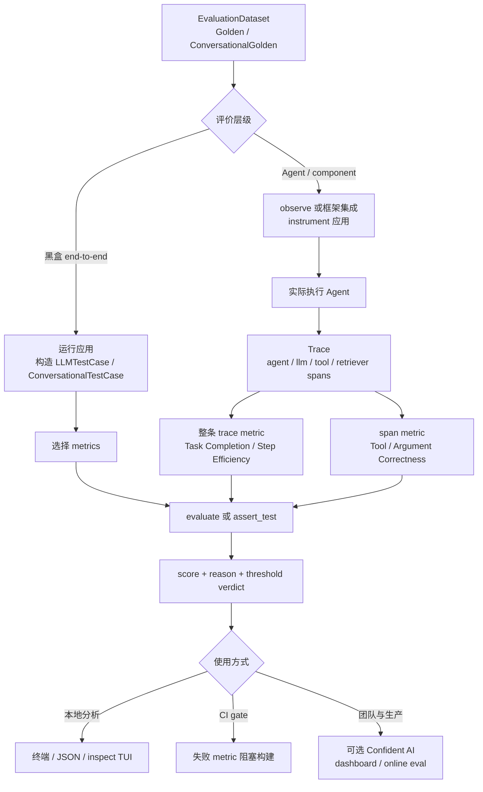

# 第 2 章 DeepEval：Case、Trace、Metric 与 CI Gate

> 核查日期：2026-07-31  
> 资料边界：仅使用官方 GitHub、官方文档与其采用方法的正式论文。分析性判断会明确标出，不把项目宣传语当作实证结论。

版本、许可与平台能力变化集中维护在[附录 D](appendix-d-platform-maintenance-cards.md)，不作为本章第一次阅读内容。

## 本章要解决的问题

第 1 章建立了评价语言，本章把它变成开发者熟悉的测试闭环：case 保存输入与期望，trace/span 保存过程证据，metric 产生单一维度判断，test run 将结果送入 CI。

## 本章目标

| 项目 | 内容 |
|---|---|
| 前置知识 | 第 1 章；Python 测试基础 |
| 本章重点 | Golden/TestCase、Trace/Span、Metric、Test Run、threshold |
| 第一遍重点 | end-to-end 与 component-level、tool metric、`assert_test` |
| 完成后应能回答 | metric 应挂在 trace 还是 span？哪些事实不能交给 LLM judge？ |

## 核心心智模型

DeepEval 把 `Golden → TestCase → Trace/Span → Metric → Test Run → CI gate` 连成可执行闭环：既能判断整个 Agent 是否完成任务，也能深入到 planner、LLM、tool、retriever 等组件定位失败。[Introduction](https://deepeval.com/docs/introduction) [Agent evaluation guide](https://deepeval.com/guides/guides-ai-agent-evaluation)

它尤其适合以下目标：

- 把 Agent 质量回归放进 PR/CI；
- 同时评价最终结果、工具使用、参数、计划和过程效率；
- 通过 trace/span 把“发现失败”和“定位失败”连起来；
- 统一管理单轮、多轮、RAG、MCP 和多模态评价。

但它不是完整的任务环境或业务真值系统。支付是否成功、文件是否正确写入、权限是否被越权等事实，仍应由确定性环境 oracle 验证；LLM judge 只能补充语义和策略层判断。


## 它实际评价什么

DeepEval 将评价对象分为两个层次：

1. **End-to-end**：把 LLM/Agent 应用看成黑盒，评价整体输入与输出；
2. **Component-level**：把实际运行 instrument 成 trace，对 agent、LLM、tool、retriever 等 span 单独评分。

一条 trace 对应完整运行，span 对应某个组件范围。内置 span type 有 `llm`、`retriever`、`tool`、`agent`；type 主要改善 trace 的语义和展示，不直接决定评分。[Tracing](https://deepeval.com/docs/evaluation-llm-tracing)

这使评价可以按三层展开：

- **Outcome**：Task Completion 判断最终是否完成目标；
- **Process**：Step Efficiency、Plan Quality、Plan Adherence 判断过程；
- **Action**：Tool Correctness、Argument Correctness 判断工具选择与参数。

官方 Agent 指南明确建议把 outcome/process 指标挂在完整 trace，把工具决策指标挂在做决定的 LLM span。[Agent evaluation guide](https://deepeval.com/guides/guides-ai-agent-evaluation)

## 核心抽象

| 抽象 | DeepEval 对应物 | 语义 |
|---|---|---|
| Evaluation Subject | 黑盒应用、完整 trace 或某个 span | 决定 metric 读取整条运行还是一个组件的证据。[Tracing](https://deepeval.com/docs/evaluation-llm-tracing) |
| Case | `LLMTestCase` / `ConversationalTestCase` | 单轮至少有 `input`、`actual_output`，可附期望、上下文和工具事实；多轮保存 turns/scenario/expected outcome。[single-turn](https://deepeval.com/docs/evaluation-test-cases) [multi-turn](https://deepeval.com/docs/evaluation-multiturn-test-cases) |
| Dataset | `EvaluationDataset` | 保存 `Golden` 或 `ConversationalGolden`；Golden 是运行应用前的测试素材，运行后转成 test case。一个 dataset 不能混合单轮与多轮。[Datasets](https://deepeval.com/docs/evaluation-datasets) |
| Run | Test Run | 一次 `evaluate()` 或 `deepeval test run` 的所有 case/metric 结果；多次 run 可比较成 experiment。[Evaluation introduction](https://deepeval.com/docs/evaluation-introduction) |
| Metric | 预置或自定义 metric | 决定需要哪些 case/trace 字段，并产生 score、reason 与 verdict。[Metrics introduction](https://deepeval.com/docs/metrics-introduction) |
| Score | `metric.score`、`metric.reason`、threshold verdict | 大部分指标是 0–1，达到 threshold 才通过；`threshold=None` 可只记录分数，`flaky=True` 可记录失败但不阻塞。[Test run semantics](https://deepeval.com/docs/evaluation-introduction) |
| Trace | Trace → nested spans | Trace 是 end-to-end case，span 是 component case；同一套字段语义可用于两层。[Tracing](https://deepeval.com/docs/evaluation-llm-tracing) |

## 能力覆盖

| 能力 | 支持程度 | 关键说明 |
|---|---|---|
| Dataset | 强 | 支持 code、JSON、JSONL、CSV、Hugging Face；也可与 Confident AI pull/push。[Datasets](https://deepeval.com/docs/evaluation-datasets) |
| Runner | 强 | `evaluate()` 用于脚本；`assert_test()` + `deepeval test run` 用于断言/CI；`evals_iterator()` 驱动 instrumented Agent。[CI docs](https://deepeval.com/docs/evaluation-unit-testing-in-ci-cd) |
| Metrics | 强 | 50+，覆盖通用 G-Eval/DAG、Agent、RAG、多轮、MCP、多模态和安全等。[Introduction](https://deepeval.com/docs/introduction) |
| LLM judge | 强但有成本/方差 | 大多数预置 metric 依赖 judge；默认 OpenAI，也支持 Anthropic、Gemini、Ollama/本地与自定义模型。[FAQ](https://deepeval.com/docs/faq) |
| Tool/trajectory | 强 | 工具名、参数、输出、顺序、exact match；trace metrics 还能看完整执行路径。[Tool Correctness](https://deepeval.com/docs/metrics-tool-correctness) |
| 多轮 | 强 | `ConversationalTestCase` 及 completeness、relevancy、faithfulness、role adherence、knowledge retention 等专用指标。[multi-turn](https://deepeval.com/docs/evaluation-multiturn-test-cases) |
| HITL | 部分 | 人工期望/rubric 可本地维护；非技术人员标注、评论与协作编辑主要属于 Confident AI 平台能力。[Datasets](https://deepeval.com/docs/evaluation-datasets) |
| CI | 强 | threshold 失败可让 assertion/build 失败；支持并行、cache、repeat、official baseline。[CI docs](https://deepeval.com/docs/evaluation-unit-testing-in-ci-cd) [CLI](https://deepeval.com/docs/command-line-interface) |
| Observability | 本地强，生产平台需云端 | OSS 有 trace/span、本地 JSON、终端 TUI；持续 online eval/dashboard 需 Confident AI。[CLI inspect](https://deepeval.com/docs/command-line-interface) [Online evals](https://deepeval.com/docs/getting-started) |
| 合成数据 | 强 | `Synthesizer` 生成单轮 goldens，`ConversationSimulator` 生成多轮 turns。[Datasets](https://deepeval.com/docs/evaluation-datasets) |

## 核心执行流程



关键点是先确定**评价范围**，再选 metric。只对最后一句回答做 Task Completion，会丢掉工具执行证据；把整条 trace 的指标挂到单个 span，也会让 judge 基于不完整事实做判断。

## 关键指标如何理解

### Task Completion

Task Completion 读取完整 trace，从 trace 提取 task 与 outcome，再由 LLM judge 评价二者 alignment。它是 referenceless、自解释指标，必须在 trace 范围执行。[Task Completion](https://deepeval.com/docs/metrics-task-completion)

风险在于：如果 trace 只记录 Agent 声称“已完成”，却没有外部系统状态，judge 可能把声明误当结果。因此高风险 side effect 必须额外写确定性 oracle。

### Tool Correctness

Tool Correctness 的核心分数是实际与期望工具的确定性比较；可以进一步比较参数/输出、顺序或 exact match。只有传入 `available_tools` 让它判断“所选工具是否最优”时，才加入 LLM judge，最终取两部分较低分。[Tool Correctness](https://deepeval.com/docs/metrics-tool-correctness)

这适合检查业务/安全不变量；如果多个调用顺序都正确，不应开启过强的 exact/order 约束。

### G-Eval 与 DAG

G-Eval 用自然语言 criteria 和 LLM judge 做通用主观评价；DAG 用决策图约束判断路径，更适合含确定性分支的规则。[G-Eval docs](https://deepeval.com/docs/metrics-llm-evals) [DAG docs](https://deepeval.com/docs/metrics-dag)

G-Eval 原论文在 summarization 上报告较高的人类相关性，但也提示 LLM evaluator 可能偏向 LLM 生成文本；不能把“human-like”理解为人类真值。[G-Eval paper](https://arxiv.org/abs/2303.16634)

## 最小 API

### 整条 Agent trace

```python
from deepeval.dataset import EvaluationDataset, Golden
from deepeval.metrics import TaskCompletionMetric
from deepeval.tracing import observe

@observe(type="agent")
def my_agent(user_input: str):
    # 内部继续 observe llm / tool / retriever spans
    return run_real_agent(user_input)

dataset = EvaluationDataset(
    goldens=[Golden(input="预订明天从上海到北京最便宜的航班")]
)

for golden in dataset.evals_iterator(
    metrics=[TaskCompletionMetric(threshold=0.7)]
):
    my_agent(golden.input)
```

官方 trace-based 用法就是通过 `evals_iterator()` 执行真实 Agent，让 metric 读取生成的完整 trace。[Task Completion](https://deepeval.com/docs/metrics-task-completion)

### 工具契约检查

```python
from deepeval import assert_test
from deepeval.metrics import ToolCorrectnessMetric
from deepeval.test_case import LLMTestCase, ToolCall, ToolCallParams

case = LLMTestCase(
    input="查询北京天气后换算为华氏度",
    actual_output="68°F",
    tools_called=[
        ToolCall(name="weather", input_parameters={"city": "北京"}),
        ToolCall(name="to_fahrenheit", input_parameters={"celsius": 20}),
    ],
    expected_tools=[
        ToolCall(name="weather", input_parameters={"city": "北京"}),
        ToolCall(name="to_fahrenheit", input_parameters={"celsius": 20}),
    ],
)

assert_test(
    case,
    [ToolCorrectnessMetric(
        evaluation_params=[ToolCallParams.INPUT_PARAMETERS],
        should_consider_ordering=True,
        threshold=1.0,
    )],
)
```

## 架构解释

DeepEval 可以拆为五层：

1. **Evidence schema**：Golden/TestCase 保存输入、期望、上下文和工具事实；
2. **Instrumentation**：`@observe` 或 callback 把运行变成 trace tree；
3. **Metric engine**：确定性规则、NLP、LLM judge、G-Eval/DAG 按需读取证据；
4. **Runner/reporting**：`evaluate`、pytest plugin、并发、缓存、重试、JSON/TUI；
5. **可选平台层**：Confident AI 承担跨 run 对比、协作、online eval 与生产监控。[Tracing](https://deepeval.com/docs/evaluation-llm-tracing) [Flags/configs](https://deepeval.com/docs/evaluation-flags-and-configs) [FAQ](https://deepeval.com/docs/faq)

最值得学习的设计是把“证据采集”和“质量判断”解耦：同一 trace 可以被不同 metric 读取，失败后还能回到具体 span。


## 硬限制与误用风险

1. **LLM judge 不是 ground truth。** 模型、prompt、版本和 sampling 都会改变结果；上线前必须用人工样本校准。[Metrics introduction](https://deepeval.com/docs/metrics-introduction)
2. **referenceless Task Completion 可能被不完整 trace 欺骗。** 业务 side effect 应由确定性检查补齐。
3. **expected tool path 可能过拟合实现。** 多条合法路径时，过强顺序/exact match 会误杀。
4. **trace-only metric 依赖正确 instrumentation。** 漏 span、错误 scope、缺 tool output 会让评价证据残缺。[Tracing](https://deepeval.com/docs/evaluation-llm-tracing)
5. **云端边界必须提前确认。** 本地 eval/trace/JSON/TUI 属于 OSS；协作、official baseline 与完整 online monitoring 依赖 Confident AI。[FAQ](https://deepeval.com/docs/faq)
6. **成本与稳定性不可忽略。** 官方提供并发、缓存、throttle、retry 和 ignore-errors，说明批量 judge 会遇到 rate limit、invalid JSON 与费用问题；CI 不应把 ignore-errors 当默认成功策略。[Flags/configs](https://deepeval.com/docs/evaluation-flags-and-configs)
7. **总分会掩盖失败分布。** 应按任务类型、工具、风险等级和用户群做 slice，并对随机 Agent 重复运行。


## 与其他层的边界

- **任务环境**：DeepEval 不负责构造浏览器、操作系统、数据库或沙箱；
- **业务 oracle**：外部状态和 side effects 由应用/测试夹具确定性验证；
- **统计层**：重复次数、置信区间、slice 和显著性由团队设计；
- **安全层**：可用安全/权限指标，但不能替代真实访问控制；
- **生产可观测性层**：OSS 可采集和本地查看，完整长期后台属于 Confident AI。[FAQ](https://deepeval.com/docs/faq)

## 本章练习

使用[贯穿案例](CASE-STUDY.md)建立 DeepEval 回归测试：完整 trace 使用 Task Completion，`update_ticket` span 使用 Tool Correctness，数据库终态由自定义确定性 metric 验证。目标时间为 30–60 分钟。

### 练习验收

- metric 挂载位置与所需 evidence 一致；
- 错误工具参数能定位到具体 span，而不是只得到整条 trace 低分；
- 外部 side effect 由环境 oracle 检查；
- 只有稳定、单一维度指标进入 CI gate。

## 检查理解

1. Golden 与运行后的 TestCase 有什么区别？
2. trace-level 与 span-level metric 分别适合什么？
3. threshold、flaky 与 ignore-errors 为什么不能混成一种失败语义？

## 本章小结

DeepEval 已把证据和判断写进测试，但 metric 本身是否可靠仍未解决：它可能混入多个维度，也可能与人类判断不一致。下一章用 Ragas 学习 evaluator engineering 与校准。

---

[上一章：评价方法论](01-AI-Agent-评价方法论.md) · [课程目录](00-learning-guide.md) · [下一章：Ragas](03-Ragas-方案详解.md)
