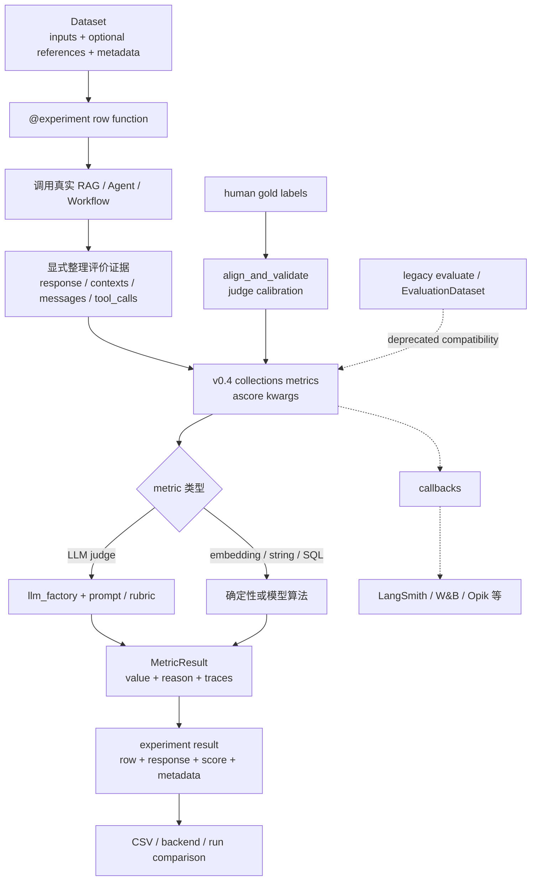

# 第 3 章 Ragas：Metric Engineering、Experiment 与 Judge Alignment

> 核查日期：2026-07-31  
> 资料边界：仅使用官方 GitHub、官方文档、官方源代码与正式论文。本文以 v0.4 推荐 API 为主，明确标出 legacy API 和分析性判断。

版本、许可与部署变化集中维护在[附录 D](appendix-d-platform-maintenance-cards.md)；正文只保留会改变学习 API 的 v0.4/legacy 分界。

## 本章要解决的问题

DeepEval 展示了测试闭环，本章进一步拆解“一个 metric 怎样才可信”：它应只测一个维度、保存理由与内部 trace，并用人工 gold labels 验证 judge agreement。

## 本章目标

| 项目 | 内容 |
|---|---|
| 前置知识 | 第 1–2 章；基本 RAG 概念有帮助 |
| 本章重点 | Dataset、Experiment、MetricResult、single-aspect metric、alignment |
| 第一遍重点 | v0.4 collections、`@experiment`、`ascore`、human calibration |
| 完成后应能回答 | reference-free 为什么不等于 ground truth？怎样证明 judge 与人类一致？ |

## 核心心智模型

Ragas 把重点放在 evaluator/metric engineering：RAG 质量分解、reference-free evaluation、合成数据、实验管理，以及用人工 gold labels 校准 LLM judge。Agent 侧主要消费已经序列化的 messages/tool calls，并不是完整的 Agent trace/runtime harness。[Ragas paper](https://aclanthology.org/2024.eacl-demo.16/) [available metrics](https://docs.ragas.io/en/stable/concepts/metrics/available_metrics/)

推荐它的场景：

- 深入理解 RAG 检索与生成的分层评价；
- 自己组织 `dataset → application call → metric → experiment result`；
- 编写离散、数值、排名或专用 Agent metric；
- 用人工评分验证 judge agreement；
- 已经能把 Agent 运行转换为 message/tool-call 序列。

采用前必须注意：v0.4 正在从 `evaluate()` + legacy sample metric 迁移到 `@experiment` + collections metric + `MetricResult`，旧教程很多仍可运行但已不是推荐架构。[v0.3 → v0.4 migration](https://docs.ragas.io/en/stable/howtos/migrations/migrate_from_v03_to_v04/)


## 方法根基：从 RAG 评价扩展到 Agent

RAGAs 原论文把 RAG 系统拆成 retrieval 与 LLM generation 两部分，重点评价：

- 检索是否找到相关、聚焦的上下文；
- 生成是否忠实使用上下文；
- 最终回答本身的质量。

其核心目标是在尽量不依赖人工 reference annotation 的情况下自动计算这些维度，从而加快 RAG 架构迭代。该工作发表于 EACL 2024 System Demonstrations。[Ragas paper](https://aclanthology.org/2024.eacl-demo.16/)

当前项目已扩展到：

- RAG metrics；
- Agent/tool metrics；
- 自定义 discrete/numeric/ranking metrics；
- testset generation；
- experiment tracking；
- prompt/judge alignment 与 optimization。[README](https://github.com/vibrantlabsai/ragas#supercharge-your-llm-application-evaluations-) [API references](https://docs.ragas.io/en/stable/references/)

但这种扩展没有改变它的基本形态：Ragas 更像“评价函数与实验数据层”，实际 Agent 如何执行、如何捕获内部 span，主要由使用者或外部 tracing 系统负责。

## v0.4 API 迁移

### 推荐新主线

官方 v0.4 推荐：

1. 用 `Dataset` 管理输入和 metadata；
2. 用 `@experiment` 包裹逐行 application call；
3. 从 `ragas.metrics.collections` 导入 metric；
4. 用 `metric.ascore(**kwargs)`；
5. 读取 `MetricResult.value/reason/traces`。

### Legacy 兼容层

以下仍可见，但不应作为新项目主线：

- `evaluate(dataset, metrics)`；
- `EvaluationDataset` + `SingleTurnSample/MultiTurnSample`；
- `single_turn_ascore(sample)` / `multi_turn_ascore(sample)`；
- 从 `ragas.metrics` 导入旧 metric。

官方 migration 明确说明 `evaluate()` 已 deprecated，collections metric 使用 kwargs 接口并返回结构化 `MetricResult`。[Migration](https://docs.ragas.io/en/stable/howtos/migrations/migrate_from_v03_to_v04/) 当前主分支 `evaluation.py` 也直接发出改用 `@experiment` 的弃用警告。[source](https://github.com/vibrantlabsai/ragas/blob/main/src/ragas/evaluation.py)

## 核心抽象

| 抽象 | Ragas 对应物 | 语义 |
|---|---|---|
| Evaluation Subject | 应用输出字段，或序列化 conversation/tool calls | Metric 按参数消费数据；Agent metric 通常接 messages 与 reference tool calls/outcome。[Agent metrics](https://docs.ragas.io/en/v0.4.1/concepts/metrics/available_metrics/agents/) |
| Case | experiment 的一行 dict/Pydantic row；兼容层为 `SingleTurnSample` / `MultiTurnSample` | 单轮可含 input、contexts、response、reference、rubrics；多轮含 Human/AI/Tool messages、reference_tool_calls、topics。[Schema](https://docs.ragas.io/en/latest/references/evaluation_schema/) |
| Dataset | v0.4 `Dataset`；legacy `EvaluationDataset` | Dataset 支持 backend 和结果落盘；EvaluationDataset 保证 sample 同型并支持 pandas/HF/CSV/JSONL。[Datasets](https://docs.ragas.io/en/v0.4.0/concepts/datasets/) [Schema](https://docs.ragas.io/en/latest/references/evaluation_schema/) |
| Run | `@experiment` 的一次 `.arun(dataset)` | 对每一行调用应用和 metrics，结果自动保存并携带 metadata。[Experiments](https://docs.ragas.io/en/stable/concepts/experimentation/) |
| Metric | collections metric 或自定义 decorator metric | 可使用 LLM、embedding、字符串、SQL/执行比较等算法。[Metrics](https://docs.ragas.io/en/stable/references/metrics/) |
| Score | `MetricResult(value, reason, traces)` | value 可以是离散类别、数值或 ranking，不要求所有指标都在同一 0–1 语义尺度。[MetricResult](https://docs.ragas.io/en/stable/references/metrics/#metricresult) |
| Trace | evaluator callbacks/trace，或应用保存的 trace URI | `evaluate()` callbacks 可接 LangSmith、W&B、Opik；被测 Agent 的完整 span tree 不是统一一等抽象。[Tracing callbacks](https://docs.ragas.io/en/stable/howtos/customizations/metrics/tracing/) |

## 能力覆盖

| 能力 | 支持程度 | 关键说明 |
|---|---|---|
| Dataset | 强 | Dataset/experiment 支持本地 CSV 工作流与可扩展 backend；legacy schema 支持 HF/pandas/CSV/JSONL。[Datasets](https://docs.ragas.io/en/v0.4.0/concepts/datasets/) |
| Runner | 中到强 | v0.4 推荐 `@experiment`；legacy `evaluate()` 有 executor、timeout/retry、exception handling、cancel、cost parser，但已 deprecated。[Experiments](https://docs.ragas.io/en/stable/concepts/experimentation/) [source](https://github.com/vibrantlabsai/ragas/blob/main/src/ragas/evaluation.py) |
| Metrics | RAG 强、Agent 中 | RAG 指标完整；Agent 集中在 topic、tool calls、goal，没有完整 plan/step/permission/loop trace taxonomy。[available metrics](https://docs.ragas.io/en/stable/concepts/metrics/available_metrics/) |
| LLM judge | 强且可校准 | 支持 LLM metric、自定义 prompt、few-shot alignment，也支持 non-LLM string/SQL metrics。[metrics overview](https://docs.ragas.io/en/latest/concepts/metrics/overview/) |
| Tool/trajectory | 中 | `ToolCallAccuracy` 比较序列和参数，支持 strict/flexible order；`ToolCallF1` 提供 precision/recall 视角；`AgentGoalAccuracy` 评价 outcome。[Agent metrics](https://docs.ragas.io/en/v0.4.1/concepts/metrics/available_metrics/agents/) |
| 多轮 | 中 | 有 `MultiTurnSample` message schema与 topic/tool/goal 指标，但主要评价消息序列，不是嵌套 span tree。[Schema](https://docs.ragas.io/en/latest/references/evaluation_schema/) |
| HITL | 校准强、工作台弱 | 可用 human scores 计算 alignment 并优化/验证 judge；MetricAnnotation 可加载人工标注 JSON。这不是内置 review queue/UI。[Human alignment](https://docs.ragas.io/en/stable/howtos/applications/vertexai_alignment/) [MetricAnnotation](https://docs.ragas.io/en/latest/references/evaluation_schema/#metricannotation) |
| CI | 可接入但需自定义 gate | CLI 支持 `ragas evals ... --baseline`；pass/fail threshold、flaky 与 assertion policy 需团队编码。[CLI](https://docs.ragas.io/en/stable/howtos/cli/) |
| Observability | 依赖外部工具 | callbacks 可接 LangSmith、W&B、Opik 等；Ragas 不提供完整 Agent observability backend。[Tracing callbacks](https://docs.ragas.io/en/stable/howtos/customizations/metrics/tracing/) |
| 合成数据 | RAG 强、Agent 未成熟 | RAG 使用 knowledge graph、transforms、scenario 与 single/multi-hop synthesizer；Agent/tool test generation 官方仍明确写“正在开发”。[RAG generation](https://docs.ragas.io/en/stable/concepts/test_data_generation/rag/) [Agent generation](https://docs.ragas.io/en/stable/concepts/test_data_generation/agents/) |

## 核心执行流程



官方将 experiment 组成拆为 test dataset、application endpoint 与 metrics，执行顺序是 setup → run → evaluate → store。[Experiments](https://docs.ragas.io/en/stable/concepts/experimentation/)

核心含义是：Ragas 不替使用者执行 Agent 或捕获全部内部状态。experiment row function 必须实际调用系统，并将 response、retrieved contexts、messages、tool calls 等字段整理给 metric。

## Agent 关键指标

### ToolCallAccuracy

`ToolCallAccuracy` 对比实际与期望 tool calls，评价工具序列和参数：

- strict order：顺序必须完全对齐；
- flexible order：适合可以并行或交换顺序的调用；
- final score 由参数准确率与序列 alignment 共同决定。

官方明确给出：工具正确但顺序错误时，strict mode 可直接得 0。因此只有当顺序是业务不变量时才启用。[Agent metrics](https://docs.ragas.io/en/v0.4.1/concepts/metrics/available_metrics/agents/)

### ToolCallF1

ToolCallF1 将工具调用看作集合匹配，给出 precision/recall/F1 风格结果，适合路径并非唯一但希望衡量多调用/漏调用的情况。参数错误会使相应调用不匹配。[Agent metrics](https://docs.ragas.io/en/v0.4.1/concepts/metrics/available_metrics/agents/)

### AgentGoalAccuracy

Agent Goal Accuracy 有带 reference 与不带 reference 的变体：前者将最终结果与期望比较，后者从交互推断用户目标并判断是否完成。[LlamaIndex Agent guide](https://docs.ragas.io/en/stable/howtos/integrations/llamaindex_agents/)

它仍需调用方提供足够的运行事实。只提供 Agent 的语言声明而没有外部状态，会留下“自报完成”的误判风险。

## 最小 API

### v0.4 ToolCallAccuracy

```python
import asyncio
from ragas.messages import AIMessage, HumanMessage, ToolCall
from ragas.metrics.collections import ToolCallAccuracy

async def main():
    trajectory = [
        HumanMessage(content="查询纽约天气，再换算为摄氏度"),
        AIMessage(
            content="先查询天气",
            tool_calls=[ToolCall(name="weather", args={"city": "New York"})],
        ),
        AIMessage(
            content="再换算温度",
            tool_calls=[ToolCall(name="to_celsius", args={"fahrenheit": 75})],
        ),
    ]
    expected = [
        ToolCall(name="weather", args={"city": "New York"}),
        ToolCall(name="to_celsius", args={"fahrenheit": 75}),
    ]

    result = await ToolCallAccuracy(strict_order=True).ascore(
        user_input=trajectory,
        reference_tool_calls=expected,
    )
    print(result.value, result.reason)

asyncio.run(main())
```

这是当前 collections API；legacy 版本使用 `MultiTurnSample` + `multi_turn_ascore()`，官方已标记将移除。[Agent metrics](https://docs.ragas.io/en/v0.4.1/concepts/metrics/available_metrics/agents/)

### 推荐 experiment 外壳

```python
from pydantic import BaseModel
from ragas import Dataset, experiment

class AgentEvalResult(BaseModel):
    response: str
    tool_accuracy: float

@experiment(AgentEvalResult)
async def run_agent_eval(row):
    run = await call_real_agent(row["input"])
    score = await tool_metric.ascore(
        user_input=run.messages,
        reference_tool_calls=row["reference_tool_calls"],
    )
    return AgentEvalResult(
        response=run.final_response,
        tool_accuracy=score.value,
    )

results = await run_agent_eval.arun(dataset)
```

官方 migration 推荐以 `@experiment` 替代 `evaluate()`，并使用 `MetricResult` 保存 score 与 reason。[Migration](https://docs.ragas.io/en/stable/howtos/migrations/migrate_from_v03_to_v04/)

## RAG 合成数据架构

Ragas 的 RAG testset generation 是值得单独学习的核心：

1. 文档被拆成 knowledge graph nodes；
2. extractors 提取 entities、themes、summaries 等属性；
3. relationship builders 用相似度/重叠建立节点关系；
4. scenario 组合 nodes、query length、style、persona；
5. query synthesizer 生成 single-hop 或 multi-hop query 与 reference。

官方文档给出的默认分布包含 single-hop specific、multi-hop abstract、multi-hop specific 查询。[RAG generation](https://docs.ragas.io/en/stable/concepts/test_data_generation/rag/)

不要把这一成熟度外推到 Agent test generation。Agent/tool 合成数据页面目前仍只有“正在开发、欢迎合作”的声明。[Agent generation](https://docs.ragas.io/en/stable/concepts/test_data_generation/agents/)

## Human-in-the-loop 与 judge 校准

Ragas 对 HITL 最有价值的部分不是 UI，而是 evaluator alignment：

1. 收集人工对同一样本的 gold score；
2. 运行 LLM metric 得到预测；
3. 计算 F1、Cohen's Kappa、agreement/correlation；
4. 用 instruction/few-shot optimization 对齐 prompt；
5. 划分 train/test 重新验证。

官方明确指出 LLM-based metric 会与人类判断不一致，因此应通过反馈循环做 alignment。[Human alignment](https://docs.ragas.io/en/stable/howtos/applications/vertexai_alignment/) Metric API 提供 `align_and_validate()`，会划分训练/测试集并返回 correlation 与 agreement rate。[Metrics API](https://docs.ragas.io/en/stable/references/metrics/)

这比“凭直觉选一个 judge 模型”更成熟，但标注数据、审阅流程与最终仲裁仍由使用团队负责。

## 架构解释

Ragas 可以拆为六层：

1. **Data layer**：Dataset/EvaluationDataset、backend、metadata；
2. **Application adapter**：experiment 函数调用真实系统并整理字段；
3. **Metric layer**：collections、LLM/embedding/string/SQL、自定义 decorator；
4. **Model/prompt layer**：`llm_factory`、prompts、cache、optimizer；
5. **Execution/experiment layer**：逐行 async execution、结果持久化与 run metadata；
6. **Calibration/telemetry layer**：human alignment、callbacks、cost/token usage。[API references](https://docs.ragas.io/en/stable/references/) [Experiments](https://docs.ragas.io/en/stable/concepts/experimentation/)

官方 metric design principles 特别强调 single-aspect、可解释、拆分复杂 prompt flow、使用足够 few-shot examples 提高 robustness。[Metrics overview](https://docs.ragas.io/en/latest/concepts/metrics/overview/)


## 硬限制与误用风险

1. **API 正在迁移。** `evaluate()`、legacy sample metrics 与 collections/experiment 并存，混用容易产生弃用警告和接口错误。[Migration](https://docs.ragas.io/en/stable/howtos/migrations/migrate_from_v03_to_v04/)
2. **Agent 能力比 RAG 能力薄。** 当前主指标是 tool、goal、topic；Agent synthetic generation 尚未完成。[Agent generation](https://docs.ragas.io/en/stable/concepts/test_data_generation/agents/)
3. **没有统一的被测 Agent span tree。** callbacks 主要追踪评价链；应用内部 trace 要由外部 tracer 或 metadata/URI 承担。[Tracing callbacks](https://docs.ragas.io/en/stable/howtos/customizations/metrics/tracing/)
4. **严格工具 reference 会惩罚等价路径。** strict order 只适用于真正不可交换的流程。
5. **reference-free 不等于客观真值。** 原论文减少人工 reference 依赖，但 LLM metric 仍依赖模型和 prompt；必须用人工集校准。[Ragas paper](https://aclanthology.org/2024.eacl-demo.16/) [Human alignment](https://docs.ragas.io/en/stable/howtos/applications/vertexai_alignment/)
6. **CI gate 要自己设计。** CLI 可比较 baseline，但 threshold、flaky、置信区间与 assertion policy 不是推荐 experiment API 的完整默认语义。[CLI](https://docs.ragas.io/en/stable/howtos/cli/)
7. **发布节奏需观察。** 最新 release 停在 v0.4.3，且该版本迁移面较大；上线前应固定版本并做 provider/integration spike。[Releases](https://github.com/vibrantlabsai/ragas/releases)
8. **平均分会掩盖风险。** RAG/Agent 都需按 query type、语言、工具、任务难度和安全等级切片。


## 与其他层的边界

- **Agent runtime/tracer**：Ragas 不负责完整执行与 span capture；
- **业务 oracle**：外部状态、权限和 side effects 由确定性验证承担；
- **CI policy**：团队自行把 MetricResult 与 experiment delta 变成 gate；
- **Observability**：通过 callbacks 接 LangSmith/W&B/Opik 等外部工具；
- **人工 gold set**：Ragas 可校准 metric，但不能自动创造可信的人类真值；
- **Agent scenario generator**：当前尚未达到 RAG generator 的成熟度。[Agent generation](https://docs.ragas.io/en/stable/concepts/test_data_generation/agents/)

## 本章练习

使用[贯穿案例](CASE-STUDY.md)写一个只判断“回复是否准确说明已完成的字段变更”的 single-aspect metric，输出 `MetricResult(value, reason, traces)`。必做校准集为 8 条人工标签；30 条以上和双人盲标作为进阶扩展。

### 练习验收

- metric 不同时混入事实正确性、文风和工具效率；
- experiment 保存逐样本输入、输出、score、reason 与版本 metadata；
- judge 有人工 agreement 结果和错误切片；
- Agent 内部 trace 缺失被明确记录为证据边界。

## 检查理解

1. reference-free metric 为什么仍需人工校准？
2. `MetricResult.traces` 对调试 evaluator 有什么价值？
3. Ragas 的 evaluation trace 与被测 Agent 的运行 trace 为什么不是同一件事？

## 本章小结

Ragas 解决了“判断器是否可信”，但这些实验仍主要发生在离线数据集。下一部分有两条并列路径：Langfuse 研究生产失败回流，Phoenix 研究开放 span 语义与 evaluator trace。

---

[上一章：DeepEval](02-DeepEval-方案详解.md) · [课程目录](00-learning-guide.md) · [并列路径 A：Langfuse](04-Langfuse-方案详解.md) · [并列路径 B：Phoenix](05-Phoenix-方案详解.md)
