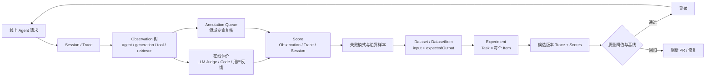

# 第 4 章 Langfuse：Observation、Score 与生产质量回流

> 核查日期：2026-07-31（Asia/Shanghai）  
> 证据范围：Langfuse 官方 GitHub 仓库、官方文档与官方发布页。

Core/EE、许可与部署维护信息见[附录 D](appendix-d-platform-maintenance-cards.md)。

## 本章要解决的问题

离线测试只能覆盖已知任务。真实 Agent 上线后，怎样把生产行为变成可定位、可标注、可回流的评价证据？本章研究 Observation-first 数据模型和持续质量闭环。

## 本章目标

| 项目 | 内容 |
|---|---|
| 前置知识 | 第 1–3 章；与 Phoenix 并列，不互为先修 |
| 本章重点 | Session、Trace、Observation、Score、Dataset、Experiment |
| 第一遍重点 | observation-first、online/offline eval、dataset source link、CI |
| 完成后应能回答 | Score 应绑定 Trace 还是具体 Observation？生产失败怎样进入回归集？ |

## 核心心智模型

Langfuse 把生产 Trace、在线自动评价、人工标注、Dataset、Experiment、质量指标和 CI 门禁连成闭环：线上失败样本进入回归集，候选版本在固定数据集上重跑，质量回归可以直接阻断 PR。[官方 README](https://github.com/langfuse/langfuse#readme)；[Evaluation Core Concepts](https://langfuse.com/docs/evaluation/core-concepts)；[Experiments in CI/CD](https://langfuse.com/docs/evaluation/experiments/experiments-ci-cd)

它尤其适合已经有线上 Agent、需要团队共同复核结果、同时关心任务质量、工具行为、成本和延迟的团队。真正的使用重点不是“接入一次 tracing”，而是建立稳定的 observation schema、人工校准集、分层指标和失败样本回流机制。


## 核心数据模型

### Session、Trace 与 Observation

Langfuse 使用三级组织方式：

- `Session`：一段跨多轮的会话或连续工作流。
- `Trace`：一次完整请求或 Agent run。聊天场景通常一轮一个 Trace。
- `Observation`：Trace 内的单个执行步骤，可以嵌套成树。[Observability Data Model](https://langfuse.com/docs/observability/data-model)；[Trace Best Practices](https://langfuse.com/docs/observability/best-practices)

Observation 有明确的 AI 语义类型：

- `generation`：一次模型生成，记录 prompt、模型、token、cost 等。
- `agent`：决定流程并协调模型与工具的 Agent 步骤。
- `tool`：一次工具或 API 动作。
- `retriever`：检索步骤。
- `chain`、`evaluator`、`embedding`、`guardrail`、`span`、`event` 等。[Observation Types](https://langfuse.com/docs/observability/features/observation-types)

Langfuse v4 采用 **observations-first** 数据模型：底层以一张不可变 Observation 表为中心，共享 `trace_id` 的记录构成 Trace，Trace 属性复制到每个 Observation。Trace-level input/output 已弃用；评价和查询应面向真正相关的 root span、LLM call、子 Agent 或 Tool Observation。[Langfuse v4](https://langfuse.com/docs/v4)

这项设计对 Agent 评价非常关键：最终答案错误、工具选错、参数错误和检索失败应分别落到不同 Observation 上，不能只给整条 Trace 一个模糊的低分。

### Score

`Score` 是统一评价结果，可关联到 Trace、Observation、Session 或 DatasetRun。它可以来自：

- 用户反馈或自定义 SDK/API；
- UI 手工评分；
- Annotation Queue；
- Code Evaluator；
- LLM-as-a-Judge。

Score 支持 Numeric、Categorical、Boolean 和 Text 类型。[Scores Data Model](https://langfuse.com/docs/evaluation/scores/data-model)；[Scores via SDK](https://langfuse.com/docs/evaluation/evaluation-methods/scores-via-sdk)

### Dataset 与 Experiment

- `Dataset` 是 `DatasetItem` 集合。
- `DatasetItem` 可保存 `input`、`expectedOutput`、`metadata`，并通过 `sourceTraceId`、`sourceObservationId` 追溯生产来源。
- `DatasetRun` 即一次 Experiment Run。
- `DatasetRunItem` 将 DatasetItem 与本次执行生成的 Trace/Observation 连接。
- Task 负责对每个 Item 运行被测 Agent；Evaluator 负责生成 Score；Run Evaluator 负责产生整次实验的聚合评价。[Experiments Data Model](https://langfuse.com/docs/evaluation/experiments/data-model)

## 核心评价闭环



这套闭环有三个重要不变量：

1. **问题粒度与评价对象一致。** 工具参数问题评 Tool/Generation Observation，整次任务成败评 root Observation 或 Trace。
2. **线上与离线共享评分语义，但不共享数据分布。** 线上是实时流量抽样；离线是固定 Dataset。生产失败样本需要有意识地回流，而不是把随机日志直接当 benchmark。
3. **Observation 的名称、类型和 input/output schema 是评价契约。** 随意改名或改变字段结构会破坏 evaluator mapping、Dashboard 和历史实验比较。[Trace Best Practices](https://langfuse.com/docs/observability/best-practices)

## Online 与 Offline Evaluation

### Online Evaluation

LLM-as-a-Judge 可以面向 Live Observations，按 observation type、trace name、tags、userId、sessionId、metadata 等过滤，并设置采样率控制成本。Code Evaluator 也可以运行于线上 Observation。结果成为 Score，随后进入 Tracing、Dashboard、Score Analytics 和 Metrics API。[LLM-as-a-Judge](https://langfuse.com/docs/evaluation/evaluation-methods/llm-as-a-judge)；[Code Evaluators](https://langfuse.com/docs/evaluation/evaluation-methods/code-evaluators)；[Metrics](https://langfuse.com/docs/metrics/overview)

推荐采用风险分层采样：

- 高风险动作、失败工具调用、低用户反馈：高采样率；
- 普通成功流量：低采样率；
- 安全、权限、结构化输出：优先使用确定性 Code Evaluator；
- 语义正确性、帮助度、语气：使用经过人工校准的 LLM Judge。

### Offline Evaluation

离线 Experiment 在固定 Dataset 上运行被测 Task。每个 DatasetItem 都生成独立 Trace，Evaluator 读取 input、output、expected output 与 metadata，生成 item-level Score；Run Evaluator 可生成整次实验的汇总分数。Python 与 JS/TS SDK runner 支持并发执行和自动 tracing。[Experiments via SDK](https://langfuse.com/docs/evaluation/experiments/experiments-via-sdk)；[Experiments Data Model](https://langfuse.com/docs/evaluation/experiments/data-model)

离线评价适合：

- Prompt、模型、工具描述或路由策略变更前的回归验证；
- 同一数据集上的多配置比较；
- 固定版本 Dataset 的 PR/release gate；
- 重复运行以观察 Agent 非确定性。

## LLM-as-a-Judge 与人工评价

Langfuse 提供 hallucination、context relevance、toxicity、helpfulness 等托管或合作方模板，也允许用 `{{variables}}` 编写自定义 rubric。Judge 模型必须支持 structured output。每次 Judge 执行本身会生成完整 Trace，可检查实际 prompt、模型响应、token、延迟、错误和重试状态。[LLM-as-a-Judge](https://langfuse.com/docs/evaluation/evaluation-methods/llm-as-a-judge)

Annotation Queue 用于让领域专家给 Trace、Observation 或 Session 添加 Score、Comment 和 Corrected Output；可以指定 Score Config、分配成员，并通过 API 管理任务。[Annotation Queues](https://langfuse.com/docs/evaluation/evaluation-methods/annotation-queues)

正确的 Judge 建设顺序是：

1. 先定义业务 rubric；
2. 人工标注一批代表样本；
3. 对比 Judge 与人工标签；
4. 分析不一致样本并修改 rubric/prompt；
5. 锁定 evaluator 版本后再扩展自动评分。

官方也明确建议使用人工标注样本校准 LLM Judge。模型给出的 reasoning 只能作为审计线索，不能自动等同于可靠解释。[LLM-as-a-Judge FAQ](https://langfuse.com/docs/evaluation/evaluation-methods/llm-as-a-judge)

## Agent 专项评价

### Tool Evaluation

Tool calls 是结构化字段，包含 `id`、`name`、`arguments`、`type`、`index`。Code Evaluator 可直接访问这些字段；LLM Judge 可映射完整数组或用 `$[*].name` 只读取工具名称。[Evaluate Tool Calls](https://langfuse.com/changelog/2026-07-10-evaluator-tool-calls)

建议至少拆成四项：

- 是否需要调用工具；
- 是否选择正确工具；
- 参数是否合法、安全、来自可靠输入；
- 是否正确处理工具成功、空结果和错误结果。

### Trajectory Evaluation

官方 Agent cookbook 在 Dataset 的 `expected_output.trajectory` 中保存预期工具序列，并分别评价最终回答、Trajectory 和查询参数。[Agent Evaluation Cookbook](https://langfuse.com/guides/cookbook/example_pydantic_ai_mcp_agent_evaluation)

平台不会自动知道唯一正确路径。实际设计应将以下信号分开：

- Task success 与终态；
- 必须发生的动作；
- 禁止动作和权限边界；
- 最大步数、token、cost 与延迟预算；
- Exact path 或顺序相似度。

只有在路径确实唯一时，才把 exact match 作为硬门槛。否则应允许多条有效、安全的 Trajectory。

### 多轮会话

推荐一轮对话一个 Trace、完整对话一个 Session。LLM-as-a-Judge 不能直接以 Session 作为自动触发目标，因为系统不知道 Session 何时真正结束；应在包含完整历史的 Observation 上评价，或给最终 Trace/Observation 添加 `conversation_end` 一类结束标记。Session-level Score 与人工 Session Annotation 仍然支持。[How to Evaluate Sessions](https://langfuse.com/resources/engineering/evaluating-sessions-conversations)

离线可用 persona/scenario Dataset 模拟多轮用户，与被测 Agent 交互，再由 Judge 评价完整对话。这类仿真用于覆盖预设场景，不能替代真实用户流量。[Multi-turn Simulation](https://langfuse.com/guides/cookbook/example_simulated_multi_turn_conversations)

## 推荐执行流程

1. 用 OTel 或 SDK 记录一次 Agent run；正确标记并嵌套 `agent/generation/tool/retriever`。
2. 建立用户反馈与 Annotation Queue，先定义业务真正关心的 Score Config。
3. 用人评集校准 Judge；确定性规则使用 Code Evaluator。
4. 按风险抽样线上流量，分析低分、分歧、Tool Error 和长路径。
5. 将代表性失败加入 Dataset；保存 Expected Answer、允许/禁止的 Tool、必要步骤和成功条件。
6. 对候选 Prompt、Model、Tool 或 Agent 版本运行 Experiment，同时检查质量、安全、成本、延迟和路径。
7. 在 CI 中固定 Dataset Version，以明确阈值或相对基线触发 `RegressionError`。
8. 上线后继续收集真实失败，定期审查 Dataset 覆盖率和 Judge-Human Agreement。

## 最小 API 示例

下面只展示 Experiment 的最小结构，真实项目应加入模型调用、异常处理、重复运行和阈值判断。API 形态来自官方 Experiment Runner。[Python Experiment Reference](https://python.reference.langfuse.com/langfuse/experiment)

```python
from langfuse import get_client

langfuse = get_client()
dataset = langfuse.get_dataset("agent-regression")

def task(item, **_):
    return run_agent(item.input["question"])

def tool_path_eval(*, output, expected_output, **_):
    return {
        "name": "tool_path_match",
        "value": output["tools"] == expected_output["tools"],
    }

result = dataset.run_experiment(
    name="candidate-v2",
    task=task,
    evaluators=[tool_path_eval],
    metadata={"prompt_version": "v2"},
)

print(result.format())
```

## CI 与 Observability

官方 `langfuse/experiment-action` 可以：

- 在 PR、push 或 release 时运行 Python/JS Experiment；
- 加载指定 Dataset 与 Dataset Version；
- 自动附加 commit SHA、branch、job URL、actor 等元数据；
- 将结果评论到 PR；
- 在 Experiment 抛出 `RegressionError` 时让 Job 失败。[Experiments in CI/CD](https://langfuse.com/docs/evaluation/experiments/experiments-ci-cd)

运行期 Observability 覆盖 Trace Tree、Agent Graph、Token、Cost、Latency、Tool Calls、Scores、Sessions、Dashboard 和 Metrics API。Langfuse 基于 OpenTelemetry，也可以让同一份遥测同时发送到其他后端。[Observability Data Model](https://langfuse.com/docs/observability/data-model)；[Metrics](https://langfuse.com/docs/metrics/overview)

门禁不应只看一个 Judge 平均分。推荐组合：

- Task Success / Safety：硬门槛；
- Tool Policy / Schema：硬门槛；
- Judge Quality：基线比较 + 允许波动区间；
- Cost / Latency：Guardrail；
- Error Rate：硬门槛；
- 关键 Slice：分别检查，不被总体均值掩盖。


## 硬限制与误用风险

1. **多轮终点不是自动语义。** 必须显式设计结束 Tag 或聚合 Observation。[Session Evaluation](https://langfuse.com/resources/engineering/evaluating-sessions-conversations)
2. **Local Dataset Experiment 能力较弱。** 官方说明本地数据只生成 Traces，不生成 DatasetRun，因此没有与平台 Dataset 同等的 Overview 和 Comparison。[Experiments Data Model](https://langfuse.com/docs/evaluation/experiments/data-model)
3. **LLM Judge 不是 Ground Truth。** 必须进行人工校准、Rubric 版本化和分歧分析。
4. **唯一 Trajectory 容易误伤有效路径。** 应优先检查成功、安全、必要/禁止动作和资源预算。
5. **生产自托管较重。** “Docker 能启动”不等于生产可运维。
6. **Open-core 有许可证边界。** 使用企业目录功能前需核查商业许可。[LICENSE](https://github.com/langfuse/langfuse/blob/main/LICENSE)
7. **部分 Evaluator API 仍在演进。** 官方将 Evaluator/Evaluation Rule Programmatic Endpoints 标为 unstable；应锁版本并做契约测试。[LLM-as-a-Judge API](https://langfuse.com/docs/evaluation/evaluation-methods/llm-as-a-judge)
8. **错误的 Observation Schema 会污染全部后续能力。** 不稳定名称、缺失 input/output、悬空 Tool Span 都会降低可观测和评价可靠性。


## 本章练习

使用[贯穿案例](CASE-STUDY.md)中的“状态未更新但文本声称成功”fixture，模拟一条生产 Trace：定位失败的 `update_ticket` Observation，添加确定性 code score 与人工 annotation，去敏后加入 Dataset，并在候选版本上重跑一次 Experiment。目标时间为 45–90 分钟。

### 练习验收

- [ ] 一次 Trace、一个 Observation、一次 Session 的边界已定义。
- [ ] Tool、Generation、Retriever、Agent Span 正确嵌套。
- [ ] Score 绑定到失败 Observation，而不是只给整条 Trace 一个总分。
- [ ] Dataset item 保留 source trace、task revision 和去敏记录。
- [ ] 候选版本 Experiment 能复现这个失败并输出 state-based score。
- [ ] 进阶：再补 judge calibration、CI、容量和部署设计；这些不属于本章必做验收。

## 检查理解

1. Session、Trace 与 Observation 分别聚合什么生命周期？
2. 为什么 observation-first 比只给整条 trace 一个总分更适合 Agent？
3. Local Dataset Experiment 与平台 DatasetRun 的能力边界是什么？
4. 线上失败进入回归集前需要哪些隐私与可复现处理？

## 本章小结

Langfuse 已解决“生产失败怎样回到离线实验”，但平台字段不等于开放语义标准。可并列阅读 Phoenix，比较同一贯穿案例怎样映射到 OpenInference，并怎样调试 evaluator 自身。

---

[上一章：Ragas](03-Ragas-方案详解.md) · [课程目录](00-learning-guide.md) · [可选对照：Phoenix](05-Phoenix-方案详解.md) · [汇合到 Inspect AI](06-Inspect-AI-方案详解.md)
