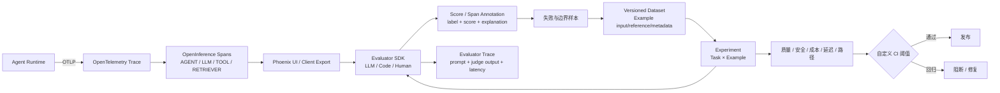

# 第 5 章 Arize Phoenix：OpenInference、Annotation 与 Evaluator Trace

> 核查日期：2026-07-31（Asia/Shanghai）  
> 证据范围：Arize Phoenix 官方 GitHub 仓库、Phoenix 官方文档与官方发布页；文中严格区分 Phoenix OSS 与 Arize AX。

许可、部署和 Phoenix OSS / Arize AX 的维护信息见[附录 D](appendix-d-platform-maintenance-cards.md)。

## 本章要解决的问题

生产 trace 只有具备稳定语义才能跨框架评价。本章学习怎样用 OpenTelemetry/OpenInference 表达 Agent、LLM、Tool 和 Retriever，并把 evaluator 本身也纳入可观测范围。

## 本章目标

| 项目 | 内容 |
|---|---|
| 前置知识 | 第 1–3 章；与 Langfuse 并列，不互为先修 |
| 本章重点 | OpenInference Span Kind、Annotation、Dataset Version、Evaluator Trace |
| 第一遍重点 | AGENT/LLM/TOOL span、score binding、tool/path evaluator |
| 完成后应能回答 | annotation 应绑定哪一步？怎样判断 evaluator 自己坏了？ |

## 核心心智模型

Phoenix 以 OpenTelemetry 和 OpenInference 为基础，把 Agent 的一次执行拆成 Agent、LLM、Tool、Retriever 等可检查 Span，再用 Code、LLM 或 Human Evaluator 生成 Score/Annotation，最后将失败样本沉淀为版本化 Dataset 并运行 Experiment。[Phoenix Overview](https://arize.com/docs/phoenix)；[GitHub README](https://github.com/Arize-ai/phoenix#readme)

Phoenix 最有价值的地方是评价过程透明：Tool Selection、Tool Invocation、Tool Response Handling、RAG 指标、Path Convergence 都可以拆开；Evaluator 本身也会被 Trace，便于检查 Judge 实际收到的输入、Prompt、输出、解释、耗时和错误。[Pre-built Metrics](https://arize.com/docs/phoenix/evaluation/pre-built-metrics)；[Evaluator Traces](https://arize.com/docs/phoenix/evaluation/llm-evals/evaluator-traces)

必须明确其产品边界：Phoenix OSS 能对生产 Trace 做客户端批量评价并回写 Annotation，但“Trace 流入即自动评价、阈值告警和生产监控动作”不是当前 Phoenix OSS 的内建 Online Eval 能力，官方将这类能力指向 Arize AX。[Evaluation](https://arize.com/docs/phoenix/evaluation/llm-evals/evaluator-traces)


## 核心数据模型

### Trace、Span 与 OpenInference

OpenTelemetry `Trace` 表示一次端到端执行，由有父子关系的 `Span` 组成。Span 保存名称、起止时间、状态、属性和事件。OpenInference 在 OTel 之上添加 AI 语义，常见 Span Kind 包括：

- `AGENT`：Agent 决策或协调步骤；
- `LLM`：模型调用；
- `TOOL`：工具执行；
- `RETRIEVER`：检索；
- `RERANKER`、`CHAIN`、`EMBEDDING` 等。[What Are Traces](https://arize.com/docs/phoenix/learn/tracing)

这使 Trace 不只是普通调用链，而是可用于 Agent 评价的行为图。最终答案失败后，可以继续定位是检索无关、工具返回错误、参数错误、模型没有使用工具结果，还是路径发生循环。

### Session

Session ID 是 Span Attribute。将它设置在父 Span 并通过 Context Propagation 传递后，Phoenix 会把跨多轮的 Traces 聚合成一个 Session。[Sessions](https://arize.com/docs/phoenix/tracing/tutorial/sessions)

### Score 与 Annotation

Phoenix Evals 的统一输出是 `Score`，关键字段包括：

- `name`：评价指标名称；
- `kind`：信号来源，`llm`、`code` 或 `human`；
- `score`、`label`、`explanation`；
- `direction`：maximize、minimize 或 none；
- `metadata`。[Client-side Evals](https://arize.com/docs/phoenix/evaluation/how-to-evals)

评价结果写回 Phoenix 后通常表现为 Span Annotation 或 Document Annotation。Annotation 可以来自人、LLM、Code 或用户反馈，并与原始执行 Span 绑定。[Annotation Concepts](https://arize.com/docs/phoenix/tracing/concepts-tracing/annotations-concepts)

### Dataset 与 Experiment

- Dataset 是版本化 Example 集合。
- Example 包含任意结构的 `input`、可选 `output/reference` 和 `metadata`。
- 每次插入、更新和删除都会产生 Dataset Version；Experiment 可固定在特定版本。
- Experiment 将某个 Dataset Version 的每个 Example 交给 Task，得到 Output 与 Trace。
- Evaluator 可以读取 input、output、expected/reference、metadata、trace_id 并生成 Score。[Dataset Concepts](https://arize.com/docs/phoenix/learn/datasets-and-experiments/datasets-concepts)；[Using Evaluators](https://arize.com/docs/phoenix/datasets-and-experiments/how-to-experiments/using-evaluators)

使用稳定 Example ID 更新 Dataset 时，Phoenix 可执行 diff，保留历史 Example 与 Experiment/Evaluation 关联，并生成新 Version。[Updating Datasets](https://arize.com/docs/phoenix/datasets-and-experiments/how-to-datasets/updating-datasets)

## 核心评价闭环



这套设计的核心是：OpenInference 保留 Agent 步骤语义，Evals 将不同评分方式统一为 Score，Annotation 把结果贴回原 Span，Dataset/Experiment 再把真实失败转成可复现测试。

## Online 与 Offline Evaluation

### Offline Evaluation

Offline 是 Phoenix OSS 的核心强项。Client SDK 可针对：

- Phoenix 中的生产或测试 Traces；
- Experiment Results；
- 任意 DataFrame 或应用数据；

运行 Code 或 LLM Evaluator。UI Server Eval 可以将 Evaluator 绑定到 Dataset，在 Playground 每次运行 Experiment 时自动评分。[Evaluation](https://arize.com/docs/phoenix/evaluation/llm-evals/evaluator-traces)；[Server Evals](https://arize.com/docs/phoenix/evaluation/server-evals/overview)

Experiment 支持 SDK 与 Playground 两种流程：定义 Dataset、Task、Evaluator 后运行，再从低分项进入对应 Trace 查看 Tool Call、模型参数和中间步骤。`dry_run` 可先对少量样本试运行，避免直接在全量 Dataset 上消耗模型调用。[Run Experiments](https://arize.com/docs/phoenix/datasets-and-experiments/how-to-experiments/run-experiments)

### 生产 Trace 评价的准确边界

Phoenix OSS 支持以下流程：

1. 查询或导出 Production Traces；
2. 用 Client SDK 批量运行 Evaluator；
3. 将结果作为 Span Annotation 写回；
4. 在 UI 中筛选失败与边界样本。[Run Evals on Traces](https://arize.com/docs/phoenix/evaluation/tutorials/run-evals-with-built-in-evals)

但当前 UI Server Eval 的目标是 Dataset/Playground Experiment。官方 Input Mapping 文档明确写明，未来才会把 Server Eval 扩展到 Incoming Traces；持续生产流量的实时评价、阈值触发和告警则指向 Arize AX。[Server Evals](https://arize.com/docs/phoenix/evaluation/server-evals/overview)；[Input Mapping](https://arize.com/docs/phoenix/evaluation/server-evals/input-mapping)；[Evaluation Boundary](https://arize.com/docs/phoenix/evaluation/llm-evals/evaluator-traces)

因此，如果使用 Phoenix OSS 做持续线上评价，需要自行增加 Cron、Queue 或 Worker：定期拉取新 Span、批量评价、回写 Annotation、生成告警或工单。

## LLM-as-a-Judge 与人工评价

Phoenix 的 Python/TypeScript Eval SDK 提供：

- 预置与自定义 LLM Evaluator；
- 自定义 Code Evaluator；
- Input Mapping / Binding；
- 同步与异步批处理；
- 并发、Rate Limit、Retry 处理；
- 统一 Score 输出。[Client-side Evals](https://arize.com/docs/phoenix/evaluation/how-to-evals)

预置指标包括 Faithfulness、Correctness、Document Relevance、Conciseness、Refusal、Tool Selection、Tool Invocation、Tool Response Handling，以及 Exact Match、Regex 等 Code Metric。[Pre-built Metrics](https://arize.com/docs/phoenix/evaluation/pre-built-metrics)

官方表示其 LLM Evaluator Template 在项目方 Golden Benchmark 上 F1 达到 85% 或更高。这个数字只能说明模板在其 Benchmark 上的表现，不能直接外推到你的领域；医疗、法律、企业 Policy、复杂工具权限等场景仍必须用领域人评集校准。[Pre-built Metrics](https://arize.com/docs/phoenix/evaluation/pre-built-metrics)

每次 Evaluator 执行会自动 Trace 到专门 Project，记录输入、准确 Prompt、Judge 输出、Explanation、Score 和 Timing。这使“评价器是否可靠”本身成为可观测对象。[Evaluator Tracing](https://arize.com/docs/phoenix/evaluation/llm-evals/evaluator-traces)

UI 支持 Categorical、Continuous 和 Freeform 人工 Annotation；SDK 可写入用户点赞/点踩等反馈，并记录 `annotator_kind` 与 metadata。人工结果可用于筛选 Trace、导出 Dataset、比较 Annotator 以及训练/校准 Judge。[Annotations Tutorial](https://arize.com/docs/phoenix/tracing/tutorial/annotations-and-evaluations)

## Agent 专项评价

### Tool Evaluation

Phoenix 提供三个清晰的工具评价层次：

- `ToolSelectionEvaluator`：是否选择存在、必要、最合适且安全的工具；
- `ToolInvocationEvaluator`：参数、JSON 格式和值是否正确安全；
- `ToolResponseHandlingEvaluator`：最终答案是否正确利用工具结果。[Pre-built Metrics](https://arize.com/docs/phoenix/evaluation/pre-built-metrics)

Tool Selection 会同时考虑可用工具集合、用户输入和已选工具，能够识别：

- 使用不存在的工具；
- 本不需要时调用工具；
- 需要工具却没有调用；
- 选择不相关或次优工具；
- 工具数量不合理。[Tool Selection](https://arize.com/docs/phoenix/evaluation/pre-built-metrics/tool-selection)

### Trajectory 与 Path Convergence

官方 Agent Cookbook 的 Path Convergence 做法是：

1. 为同类问题构建多种表达的 Dataset；
2. Task 运行 Agent 并记录步骤数；
3. 在成功输出中找最短路径；
4. 使用 `optimal_path_length / actual_path_length` 作为 Code Eval；
5. 将评价追加到 Experiment。[Evaluate an Agent](https://arize.com/docs/phoenix/cookbook/evaluation/evaluate-an-agent)

这个指标适合发现循环、重复 Tool Call 和不必要回退，但不能单独定义优秀 Agent。更短的路径也可能跳过安全检查或得到错误终态。正确顺序是：

1. 先 Gate Task Success 与 Safety；
2. 检查必须/禁止动作；
3. 再比较 Path Length、Cost、Token 与 Latency；
4. 对允许多路径的任务使用 Rubric Judge，而不是 Exact Path Match。

### 多轮会话

通过 Session Attribute 和 Context Propagation，Phoenix 可以聚合多轮 Traces。官方 Tutorial 演示把完整 Session 对话交给 LLM Judge，评价 Agent 是否在多轮中保持 Context Continuity。[Sessions](https://arize.com/docs/phoenix/tracing/tutorial/sessions)

Tool Selection 与 Invocation Evaluator 的官方 Release Note 也说明其适用于 Multi-tool 和 Multi-turn 交互；前提是应用提供 Conversation、Available Tools、Selected Tool 和 Arguments 等可评价输入。[Tool Evaluator Release Note](https://arize.com/docs/phoenix/release-notes/02-2026/02-01-2026-tool-selection-and-tool-invocation-evaluators)

## 推荐执行流程

1. 注册 Phoenix OTel Exporter，并用对应 OpenInference Instrumentor 自动记录框架和模型。
2. 为自定义步骤补充 `AGENT`、`TOOL`、`RETRIEVER` Span 与 Session ID。
3. 先人工检查 Trace，区分最终答案、检索、工具、参数、循环等失败类型。
4. 人工标注 20–50 个代表样本，建立 Task、Safety、Tool、Trajectory Rubric。
5. Exact、Schema、Range、Latency 使用 Code Evaluator；Correctness、Relevance、Faithfulness、Planning 使用经过校准的 LLM Evaluator。
6. 检查 Evaluator Trace，确认 Judge 实际看到了正确输入，且 Explanation 与 Label 一致。
7. 从负反馈、错误、慢路径和真实边界 Case 建立 Versioned Dataset，使用稳定 Example ID。
8. 先 `dry_run`，再对 Prompt、Model、Tool Variant 跑全量 Experiment。
9. 在 CI 中读取 Experiment 结果，自行实现 Baseline、Threshold 和 Exit Code。
10. 若要持续评价生产流量，自建 Scheduler/Worker；若需要实时评价和告警，单独评估商业平台或自建执行层。

## 最小 API 示例

下面只展示 Dataset、Task、Evaluator 与 Experiment 的最小结构。Phoenix 的 Client API 仍在快速演进，必须按锁定的 `arize-phoenix-client` 版本核对官方 API Reference。[Run Experiments](https://arize.com/docs/phoenix/datasets-and-experiments/how-to-experiments/run-experiments)

```python
from phoenix.client import Client
from phoenix.evals import create_evaluator

client = Client()  # PHOENIX_BASE_URL / PHOENIX_API_KEY
dataset = client.datasets.get_dataset(dataset="agent-regression")

def task(example_input):
    return run_agent(example_input["question"])

@create_evaluator(name="tool_path_match", kind="CODE")
def tool_path_match(output, expected):
    return output["tools"] == expected["tools"]

experiment = client.experiments.run_experiment(
    dataset=dataset,
    task=task,
    evaluators=[tool_path_match],
    experiment_name="candidate-v2",
)
```

官方文档中新的 `phoenix.client` API 与较早 `phoenix.experiments.run_experiment` Cookbook 示例并存，不能从不同版本文档中拼接 API。

## CI 与 Observability

Experiment 可以作为普通 Python/TypeScript 脚本放入 GitHub Actions 或 GitLab CI：

1. CI 拉取固定 Dataset Version；
2. 运行候选版本 Task；
3. 运行 Evaluators；
4. 读取汇总和关键 Slice；
5. 自行比较 Baseline 或 Threshold；
6. 以 Process Exit Code 决定是否阻断。

在本次核查的 Phoenix OSS 官方文档中，没有发现专用的 PR Comment / Regression Gate Action。因此应把阈值策略、历史基线、PR 报告和失败退出码算入自己的工程工作量。这里是对官方 OSS 文档能力边界的判断，不代表第三方生态不存在相关工具。[Run Experiments](https://arize.com/docs/phoenix/datasets-and-experiments/how-to-experiments/run-experiments)

Observability 基于 OTel/OpenInference，覆盖 Trace Tree、AGENT/LLM/TOOL/RETRIEVER Span、Token、Cost、Latency、Annotation、Session 和 Experiment Trace；官方列出 Python、TypeScript、Java、Go 及多种 Framework/Provider Instrumentor。[Tracing Integrations](https://github.com/Arize-ai/phoenix#tracing-integrations)


## 硬限制与误用风险

1. **Phoenix OSS 不等于 Arize AX。** Real-time Online Eval、Threshold Alert、超大 OLAP 和组织级多租户不能归入 Phoenix OSS。[Evaluation](https://arize.com/docs/phoenix/evaluation/llm-evals/evaluator-traces)；[Architecture](https://arize.com/docs/phoenix/phoenix-deployment-options)
2. **当前 Server Eval 目标是 Dataset/Experiment。** Incoming Trace 自动评分仍需 Client Batch 或自建 Scheduler。[Server Evals](https://arize.com/docs/phoenix/evaluation/server-evals/overview)；[Input Mapping](https://arize.com/docs/phoenix/evaluation/server-evals/input-mapping)
3. **ELv2 有托管服务限制和专利声明。** SaaS、再分发、嵌入商业产品前需法律审查。[LICENSE](https://github.com/Arize-ai/phoenix/blob/main/LICENSE)；[IP_NOTICE](https://github.com/Arize-ai/phoenix/blob/main/IP_NOTICE)
4. **最短路径不一定最好。** Path Convergence 必须放在 Task Success 与 Safety 之后。
5. **预置 Judge Benchmark 不能替代领域校准。** 必须建立人工标注集。
6. **单 Tenant 和 SQL Backend 是隔离/容量边界。** 多团队和超高 Trace Volume 需要部署规划。
7. **TypeScript Eval SDK 的成熟度低于 Python。** 官方 README 将 `@arizeai/phoenix-evals` 标为 Alpha；重要流水线需锁版本并做契约测试。[Packages](https://github.com/Arize-ai/phoenix#packages)
8. **不同年代 API 示例共存。** 不锁 SDK 版本容易产生无法运行的拼接代码。
9. **Annotation 不等于自动行动。** Score 写回后，告警、工单、阻断和重试仍需要外部编排。


## 本章练习

使用[贯穿案例](CASE-STUDY.md)生成 AGENT→LLM→TOOL span 树；为 `update_ticket` 分别运行 Invocation 与 Response Handling evaluator，并查看 evaluator trace 的输入映射、prompt、输出和错误。目标时间为 45–90 分钟。

### 练习验收

- [ ] AGENT、LLM、TOOL、RETRIEVER Span Kind 与父子关系正确。
- [ ] `update_ticket` span 的 input、output 和父子关系正确。
- [ ] Invocation 与 Response Handling 分开评价，失败可定位到具体 span。
- [ ] 每次 Evaluator Execution 的输入、输出、错误和 evidence reference 可查看。
- [ ] 进阶：再补 Session、Dataset、CI、Scheduler 和部署边界；这些不属于本章必做验收。

## 检查理解

1. OpenTelemetry 与 OpenInference 各自提供什么？
2. Tool Selection、Invocation 与 Response Handling 为什么应分开评分？
3. Evaluator Trace 怎样帮助区分 Agent failure 与 judge failure？
4. Phoenix OSS 与 Arize AX 的 online eval 边界是什么？

## 本章小结

Phoenix 已让 Agent evidence 与 evaluator evidence 都可观察，但还没有负责隔离环境、重置任务和重复运行。下一章用 Inspect AI 把这些证据装入可复现 harness。

---

[上一章：Ragas](03-Ragas-方案详解.md) · [课程目录](00-learning-guide.md) · [可选对照：Langfuse](04-Langfuse-方案详解.md) · [汇合到 Inspect AI](06-Inspect-AI-方案详解.md)
