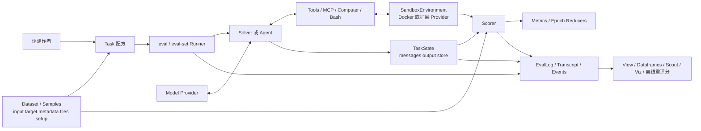
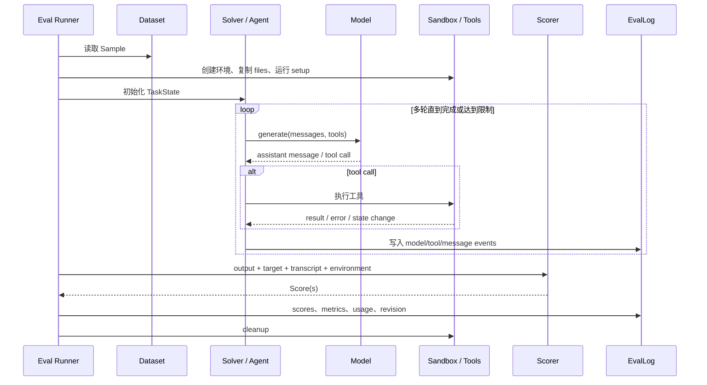

# 第 6 章 Inspect AI：Task、Harness、Sandbox 与可复现实验

> 项目：UK AI Security Institute — Inspect AI  
> 核查日期：2026-07-31  
> 官方仓库：[UKGovernmentBEIS/inspect_ai](https://github.com/UKGovernmentBEIS/inspect_ai)  
> 官方文档：[inspect.aisi.org.uk](https://inspect.aisi.org.uk/)

版本、registry 和部署维护信息见[附录 D](appendix-d-platform-maintenance-cards.md)。

## 本章要解决的问题

前几章已经覆盖 metric 与 production trace，但仍缺少“谁负责装载任务、重置环境、运行 Agent、保存轨迹和重复试验”。本章用 Inspect AI 建立完整 evaluation harness。

## 本章目标

| 项目 | 内容 |
|---|---|
| 前置知识 | 第 1–3 章；第 4/5 章提供生产 evidence 视角但不是必需 |
| 本章重点 | Task、Dataset/Sample、Solver/Agent、Tool/Sandbox、Scorer、Epoch、EvalLog |
| 第一遍重点 | Task 配方、runner、sandbox、scorer、transcript |
| 完成后应能回答 | 被测 Agent 与评价逻辑怎样分离？怎样从 log 复现一次失败？ |

## 核心心智模型

Inspect AI 是一套**通用 AI 评价框架**，它解决的核心问题是：

> 如何把自己的任务、Agent、工具环境、评分器、重复试验、完整轨迹和实验版本，组织成一个可运行、可审计、可扩展的评价系统？

它的核心公式可以写成：

```text
Task = Dataset + Solver/Agent + Scorer
Evaluation = Task × Model × RunConfig × Epochs
Evidence = Outcome + Transcript + Events + Scores + Revision
```

官方将 `Task` 定义为评价的基本配方，最少由 dataset、solver 和 scorer 组成；此外可配置 setup、cleanup、model、sandbox、approval、epochs 和资源限制（[Tasks](https://inspect.aisi.org.uk/tasks.html)，[Task API](https://inspect.aisi.org.uk/reference/inspect_ai.html)）。

这套框架的关键价值有三点：

1. **把“被测 Agent”和“评价方法”拆开**，可以在同一任务和评分标准下替换模型或 Agent scaffold。
2. **把轨迹当作一等证据**，不只保存最终回答，还保存消息、模型事件、工具调用、错误、资源使用和分数。
3. **把环境与副作用纳入评价边界**，可以在 per-sample sandbox 中运行工具，再由 scorer 检查最终文件、测试或环境状态。


## 核心架构



这张图有两个必须理解的边界：

- **Solver/Agent 是被测执行逻辑**；它决定怎样提示模型、何时生成、怎样循环调用工具、是否规划或委派。
- **Scorer/Metric 是评价逻辑**；Scorer 给单个 sample 判分，Metric 才把多个 sample/epoch 汇总成 accuracy、mean、stderr 等统计。

把二者混在一起，会让“Agent 为了拿分读取答案”或“评分器依赖 Agent 内部状态”等数据泄漏难以发现。

## 核心抽象详解

### Task：评价配方

`Task` 汇聚：

- dataset；
- setup solver；
- 主 solver 或 agent；
- cleanup；
- scorer 与 metrics；
- model 与 generation config；
- sandbox；
- approval policy；
- checkpoint 与 limits。

官方文档强调，Task 是 dataset、solver、scorer 以及环境/限制等考虑因素的交汇点；`task_with()` 可基于已有 Task 替换 solver、sandbox 或 limits（[Tasks](https://inspect.aisi.org.uk/tasks.html)）。

**设计建议**：Task 应描述“如何测”，不要在 Task 中硬编码某一个模型。如果必须指定 grader model，应通过 model roles 显式命名，避免它与被测模型混淆。

### Dataset 与 Sample：任务、目标和夹具

`Sample` 的主要字段如下（[Datasets](https://inspect.aisi.org.uk/datasets.html)）：

| 字段 | 含义 | 评价设计建议 |
|---|---|---|
| `input` | 字符串或消息列表 | 只给 Agent 可见信息，不泄漏隐藏目标。 |
| `target` | 字面答案、答案列表或供模型 grader 使用的目标描述 | 开放式环境任务不应把所有成功条件都塞进文本 target。 |
| `id` | 唯一标识 | 手工提供稳定 ID，特别是需要 shuffle、retry 或跨版本对比时。 |
| `metadata` | 任意结构化数据 | 放能力标签、风险级别、场景切片；不要放会被 Agent 读取的秘密答案。 |
| `sandbox` | 每 sample 的环境类型/配置 | 允许不同样本使用不同环境。 |
| `files` | 注入 sandbox 的文件 | 用于代码仓库、文档、测试夹具等。 |
| `setup` | sample 级 setup script | 必须可重复、快速失败，并避免连接真实生产资源。 |

Inspect 支持 CSV、JSON、JSONL、Hugging Face 和自定义 reader。数据来源灵活并不等于数据可信；评测作者仍需证明任务可解、目标唯一或评分器能接受合理替代解。

### Solver：执行计划

Solver 可以完成：

1. 设置 system message；
2. prompt engineering；
3. 调用模型；
4. self-critique；
5. 多轮对话；
6. 运行完整 Agent scaffold。

一个 Task 只有一个顶层 solver，但它可以由多个 solver 链式组合，也可以用任意 Python 实现（[Solvers](https://inspect.aisi.org.uk/solvers.html)）。这使以下实验成立：

```text
固定 Dataset + 固定 Scorer
只替换 Solver
=> 测量 Agent scaffold 对结果、成本和风险的真实影响
```

### Agent：长程执行主体

官方 Agent 能力包括：

- built-in ReAct；
- 带规划、记忆、subagent 的 Deep Agent；
- 软件工程 Agent；
- custom Agent 与 multi-agent composition；
- Agent Bridge，用于集成外部 Agent 框架；
- Human Agent，用相同 dataset、sandbox 和 scorer 做人类 baseline。

详见 [Using Agents](https://inspect.aisi.org.uk/agents.html) 与 [Multi Agent](https://inspect.aisi.org.uk/multi-agent.html)。

**关键评价原则**：多 Agent 架构更复杂，不应默认更好。先建立简单 ReAct baseline，再检查委派是否显著提高成功率或降低成本；官方多 Agent 文档也建议先从简单基线开始。

### Tool 与 SandboxEnvironment

工具层可包含内置工具、自定义 Python 工具、MCP、bash/python、文件、浏览器和 computer use（[Tool Basics](https://inspect.aisi.org.uk/tools.html)）。

SandboxEnvironment 则提供：

- command execution；
- read/write file；
- per-sample files 和 setup；
- Docker / Compose；
- 多容器环境；
- 网络、CPU、内存限制；
- 资源清理；
- 可扩展 sandbox provider。

官方明确说明：**默认工具调用在 evaluator 主进程执行**。只有显式配置 sandbox，才会把相应操作放入独立环境（[Sandboxing](https://inspect.aisi.org.uk/sandboxing.html)）。

### Scorer 与 Metric

Scorer 负责单个样本，常见形式包括：

- exact/includes/pattern；
- 选择题和数学等价；
- 模型评分；
- 文件格式、单元测试、数据库或 sandbox 状态检查；
- 自定义 rubric；
- 一个 sample 返回多个 score。

Metric 负责聚合，内置包括 accuracy、mean、variance、standard deviation、stderr、bootstrap stderr、frequency 和 grouped metric；多 epoch 还支持 mean、median、mode、max 等 reducers（[Scoring](https://inspect.aisi.org.uk/scoring.html)，[Metrics](https://inspect.aisi.org.uk/metrics.html)）。

推荐把一个复杂 Agent 任务拆成多个分数：

```text
task_success       最终目标是否完成
side_effect_safety 是否产生禁止的副作用
policy_compliance  过程是否符合规则
communication      是否清楚告知用户结果与限制
efficiency         token / cost / tool calls / time
```

安全失败不应被其他维度的平均高分抵消。

### EvalLog、Transcript 与 Scanner

每次 `inspect eval` 或 `eval()` 都会写日志。`EvalLog` 包括：

- task、model、generation config；
- solver plan；
- dataset 信息；
- sandbox 配置；
- Git origin、commit、dirty 状态；
- package versions；
- aggregate results 和 usage stats；
- 每个 sample 的 input、output、target、score、messages、events 和 error。

这些字段见 [Log Files](https://inspect.aisi.org.uk/eval-logs.html) 与 [Log API](https://inspect.aisi.org.uk/reference/inspect_ai.log.html)。

Scanner 与 Scorer 的职责不同：

- Scorer 判断任务是否成功；
- Scanner 在 transcript 中寻找可能破坏结果可信度的问题，例如 refusal、evaluation awareness、环境错误、runtime error 或 reward hacking。

Scanner 可在线或离线运行，详见 [Scanners](https://inspect.aisi.org.uk/scanners.html)。

### User Simulator：需要评测作者自己定义

Inspect 没有强制所有任务都使用某个固定 User Simulator。评测作者可以：

- 在 solver/agent 中驱动另一个模型；
- 用 model roles 区分被测模型、grader 和 simulator；
- 包装已有动态交互 benchmark；
- 实现自定义环境或对话参与者。

灵活性的代价是，**simulator 的指令遵循、随机性、终止规则、错误归因和人类保真度不会自动得到保证**。如果评价客服或协作 Agent，应把 simulator 本身当作需要验证的测试组件。

## 一次评价如何执行



### 关键环节

1. **Setup 必须与主执行隔离**：setup 创建真值和夹具，Agent 不应看到不该看到的答案。
2. **每个 sample 独立环境**：避免上一个试验留下的文件、缓存或进程污染下一次。
3. **工具错误也要进入轨迹**：不能只保留成功调用，否则无法判断 Agent 的恢复能力。
4. **Scoring 应在环境销毁前完成**：需要检查文件、服务或数据库状态时尤其重要。
5. **Cleanup 不能影响判分**：cleanup 用于资源释放，不应偷偷修复 Agent 未完成的结果。

## 最小可运行例子

```python
from inspect_ai import Task, task
from inspect_ai.dataset import Sample
from inspect_ai.scorer import match
from inspect_ai.solver import generate, use_tools
from inspect_ai.tool import bash


@task
def agent_probe():
    return Task(
        dataset=[
            Sample(
                id="case-001",
                input="在工作目录创建 answer.txt，内容为 42；最后回答 done。",
                target="done",
            )
        ],
        solver=[
            use_tools([bash(timeout=60)]),
            generate(),
        ],
        scorer=match(),
        sandbox="docker",
        epochs=3,
    )
```

```bash
inspect eval agent_probe.py --model <provider/model> --seed 42
inspect view
```

这个例子只完成“任务—执行—判分—日志”的最小闭环。它还不能可靠验证任务：Agent 即使没有创建文件，只回答 `done` 也可能通过。因此下一步应增加一个自定义 scorer，读取 sandbox 并检查：

```text
answer.txt 存在
AND 文件内容严格等于 42
AND 不存在其他禁止文件修改
```

官方的最小 Task、tool loop 和 sandbox 示例分别见 [Tasks](https://inspect.aisi.org.uk/tasks.html) 与 [Sandboxing](https://inspect.aisi.org.uk/sandboxing.html)。

## 如何设计可靠的 Agent 评价

### Outcome：验证真实终态

优先用确定性 scorer 检查：

- 文件和数据库状态；
- 单元测试；
- API mock 中的请求记录；
- 订单、余额或权限状态；
- 是否出现重复写入；
- 是否留下未清理资源。

不要把 Agent 的“已完成”文本当作完成证据。

### Trajectory：验证过程约束

轨迹规则应分为两类：

- **必须满足的 invariant**：例如删除前必须获得批准、认证前不得读取数据、写工具失败后不得声称成功。
- **允许多解的策略空间**：例如先读 A 还是先读 B、使用一次综合查询还是两次只读查询。

只对 invariant 做硬匹配；不要强迫 Agent 复刻一条黄金轨迹。

### 多轮与可靠性

用 `epochs` 对同一 Sample 重复执行。至少报告：

- 每个 sample 的原始 epoch scores；
- accuracy/mean；
- stderr 或 bootstrap stderr；
- 关键场景 grouped metrics；
- “至少 n 次成功”或自定义一致性 reducer；
- error、timeout、refusal 的独立比例。

Inspect 的 metrics/reducers 机制见 [Metrics](https://inspect.aisi.org.uk/metrics.html)。

### 用户模拟器

对于动态人机任务，建议记录并控制：

- simulator model 和版本；
- system instruction；
- temperature/seed；
- 可见信息边界；
- 终止条件；
- simulator 自己的错误率；
- Agent/User/Environment/Grader 四类故障归因。

不要用同一个未校准的 LLM 同时做用户模拟器和唯一 grader。

### 成本与限制

Runner 支持 message、token、turn、cost、time、working time、model connection、sample concurrency、sandbox concurrency 等限制（[Running Evals](https://inspect.aisi.org.uk/running.html)，[eval-set CLI](https://inspect.aisi.org.uk/reference/inspect_eval-set.html)）。

正确做法是：

1. 先定义质量和安全门槛；
2. 在通过门槛的方案中比较成本与延迟；
3. 把达到限制导致的终止与普通任务失败分开报告。

## 可复现性

### Inspect 已提供的证据

- `--seed`；
- stable sample ID；
- task args 与 solver args；
- model/provider 与 generation config；
- Git origin/commit/dirty；
- package versions；
- sandbox config；
- 完整 sample、events、scores 和 errors；
- `inspect log export-config` 将完整运行配置导出后交给 `inspect eval --run-config`（[Log Files](https://inspect.aisi.org.uk/eval-logs.html)）。

### 仍需自行固定的内容

```text
InspectVersion
TaskCommit
DatasetRevision
ContainerImageDigest
ModelSnapshot
ToolSchemaVersion
ExternalServiceSnapshot
RunConfig
Seed
EpochCount
```

配置可重放不代表输出必然相同。闭源模型服务升级、非确定采样、网站变化、外部 API 和并发调度都会造成漂移。科学报告应写“在这一版本组合下得到的结果”，而不是“模型永久能力为某分数”。

### Eval Set

`inspect eval-set` 支持：

- 自动重试失败任务；
- 复用已成功 sample；
- 清理失败日志；
- 断点续跑；
- 多 task、多 model 并发；
- dedicated log directory 作为 durable run record。

官方特别说明：如果 dataset 被 shuffle，自动递增 ID 不能可靠匹配重试样本，因此应使用显式稳定 ID（[Eval Sets](https://inspect.aisi.org.uk/eval-sets.html)）。

## 安全与副作用控制

### Sandbox

Inspect 内置 Docker sandbox，并允许扩展其他 provider。自动生成的 Docker Compose 默认限制互联网；自定义 Compose 可设置 `network_mode: none`、CPU/内存和多服务拓扑（[Sandboxing](https://inspect.aisi.org.uk/sandboxing.html)）。

但必须明确：

- 未指定 sandbox 时，工具可能在 evaluator 主进程运行；
- 自定义 tool 可能绕过 sandbox；
- 自定义 Compose 可能开放网络或挂载敏感目录；
- 容器隔离不自动等于最小权限；
- 不应把生产凭据放进 Agent 可读环境。

### Tool Approval

Approval policy 支持：

- 所有工具人工批准；
- 只有特定工具/参数人工批准；
- custom approver；
- approve、modify、reject、escalate、terminate 五种决定；
- task-level 或 eval-level policy。

详见 [Tool Approval](https://inspect.aisi.org.uk/approval.html)。

Approval 是运行时安全控制，不是评分器。一次调用被人类批准，不代表调用正确；仍需 scorer 评价结果与过程。

### 非幂等工具的重试风险

Sandbox `exec()` 为容器服务不稳定提供 timeout retry；官方警告，非幂等命令的首次尝试可能已经产生副作用，此时应设置 `timeout_retry=False`（[Sandboxing](https://inspect.aisi.org.uk/sandboxing.html)）。

例如扣款、发信、删文件、发布版本等工具，不应由底层透明重试。更安全的设计是：

```text
read state -> request approval -> execute with idempotency key -> verify state
```

## CI 与持续评价

核心仓库提供 `make check` 与 `make test`；`pyproject.toml` 配置 pytest、Ruff 和严格 mypy；公开 GitHub workflows 包含 build、sandbox-tools build、Docker、log viewer、npm publish 和 test（[README](https://github.com/UKGovernmentBEIS/inspect_ai#readme)，[workflows](https://github.com/UKGovernmentBEIS/inspect_ai/tree/main/.github/workflows)，[pyproject.toml](https://github.com/UKGovernmentBEIS/inspect_ai/blob/main/pyproject.toml)）。

自己的项目可以分层运行：

| 层级 | 内容 | 建议频率 |
|---|---|---|
| Unit | dataset reader、tool、scorer、metric 单测 | 每次提交 |
| Smoke Eval | 5–20 个确定、便宜、无真实副作用的 sample | 每个 PR |
| Regression | 已修复失败、高风险边界和生产回放 | 每日/每个重要 PR |
| Capability | 大模型矩阵、长程任务、多 epochs | 定时或模型升级 |
| Safety | 注入、越权、数据泄漏、危险工具、审批绕过 | 每个发布候选 |

CI 门禁应绑定 score 下界和 error rate，而不只比较点估计；昂贵远程模型 eval 不适合阻塞每个小提交。


## 硬限制

### 框架不会替你证明评价有效

Inspect 会忠实执行你的任务和 scorer。若 dataset 有泄漏、任务不可解、scorer 太弱或模型 judge 有偏差，框架仍可能产出漂亮但错误的分数。

### 用户和环境语义不是现成答案

动态用户模拟器、业务数据库、目标状态和过程规则需要自己设计或集成。框架提供结构，不提供特定领域的“真值”。

### Model grading 需要校准

开放式任务常需要模型 scorer，但它可能受位置、文风、模型身份和 rubric 模糊影响。必须用人工/oracle 样本测一致性，重要门禁不能只依赖一个 judge。

### 可追溯不等于确定

日志能记录配方，但不能冻结远程模型、网站和外部 API。版本、快照和多次试验仍然必要。

### 安全必须显式配置

默认主进程工具执行是最容易被忽略的边界。Sandbox、网络、凭据、卷挂载、审批和工具权限必须逐项审计。

### 学习曲线较陡

要正确使用，需要同时理解 async Python、TaskState、tool/agent protocol、registry、scoring、statistics、sandbox 和 log schema。对一个非常小且固定的文本回归测试，完整框架可能过重。

## 本章练习

### 必做实验：可重置的 Ticket Task

把[贯穿案例](CASE-STUDY.md)包装为一个 Inspect Task：每个 sample 在临时数据库或文件 sandbox 中启动；Agent 读取并更新工单；scorer 检查 priority、note、status 和重复写入；EvalLog 保存 messages、tool calls、state diff 与 score。使用给定的成功/失败 fixture 即可，不要求付费模型调用。目标时间为 60–90 分钟。

### 进阶实验

1. 固定 Dataset/Scorer，比较两种 Agent scaffold。
2. 每个 sample 运行 5 epochs，报告均值、stderr 与失败切片。
3. 加入 approval、危险写入、超时与 Scanner。
4. 导出 config，锁定代码、数据、镜像和模型 snapshot。

### 练习验收

- 必做：fixture 在每次运行前被重置，错误终态一定失败；
- 每个 sample 在可重置 sandbox 中运行；
- EvalLog 足以还原 messages、tools、state、score、error 与版本；
- 进阶：多 epochs、Scanner/approval 和 scaffold 对照分别形成独立实验，不进入必做门槛。


## 检查理解

1. Task、Solver/Agent 与 Scorer 分别拥有哪一段生命周期？
2. Sandbox reset 为什么是测量正确性的一部分？
3. Epoch 与简单重复执行有什么版本和统计要求？
4. EvalLog 可审计为什么仍不代表 grader 正确？

## 本章小结

Inspect AI 应留下的不是某个内置 benchmark，而是以下设计纪律：

```text
被测系统与评价逻辑分离
结果、过程和安全分层评分
每个样本隔离执行
完整轨迹与实验谱系留证
重复试验与不确定性报告
失败可以重放、归因并进入回归集
```

真正的完成标准不是成功跑出 `inspect eval`，而是能回答：**这个分数对应哪个 Agent 版本、在哪个环境上、通过什么 scorer、失败在哪里，以及另一位学习者能否从 EvalLog 复核证据。** 下一章再加入动态用户和连续可靠性。


---

[上一章：Phoenix](05-Phoenix-方案详解.md) · [课程目录](00-learning-guide.md) · [下一章：τ-bench / τ³-bench](07-Tau-Bench-方案详解.md)
