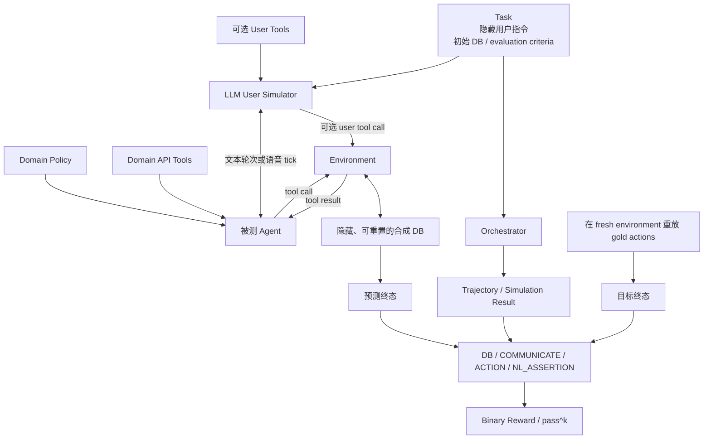
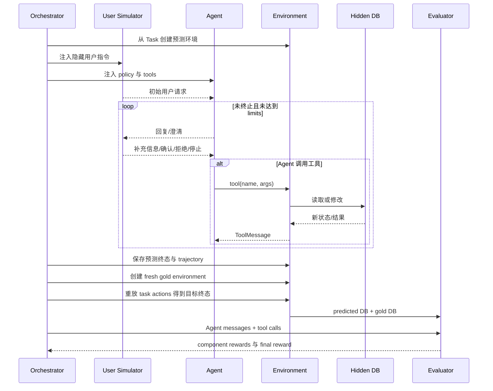

# 第 7 章 τ-bench / τ³-bench：动态用户、环境终态与可靠性

> 核查日期：2026-07-31  
> 当前官方入口：[sierra-research/tau2-bench](https://github.com/sierra-research/tau2-bench)  
> 当前实现名称：τ³-bench 1.0.1  
> 原始论文：[τ-bench，ICLR 2025](https://proceedings.iclr.cc/paper_files/paper/2025/file/1b126cc38b8638e07bef37e7b2bb72bf-Paper-Conference.pdf)

仓库、版本和 task/grader 维护边界见[附录 D](appendix-d-platform-maintenance-cards.md)；本章只保留会改变评价结论的版本事实。

## 本章要解决的问题

静态任务无法覆盖用户继续回应、政策约束和数据库副作用。本章研究动态 Tool–Agent–User 闭环，重点不是 leaderboard，而是终态 oracle、用户模拟失真和连续可靠性。

## 本章目标

| 项目 | 内容 |
|---|---|
| 前置知识 | 第 1–3、6 章；第 4/5 章为可选 evidence 视角 |
| 本章重点 | Domain、Task、User Simulator、Environment、Orchestrator、Evaluator、pass^k |
| 第一遍重点 | trial loop、DB/COMMUNICATE reward、版本主键、failure attribution |
| 完成后应能回答 | 终态成功为什么仍可能过程违规？user simulator 失败怎样单独归因？ |

## 先避免用错项目

**不要从旧的 [`sierra-research/tau-bench`](https://github.com/sierra-research/tau-bench) 仓库开始新的正式评价。**

旧仓库的任务已被官方标记为 outdated；当前实验应从后继仓库 [`sierra-research/tau2-bench`](https://github.com/sierra-research/tau2-bench) 开始，并固定明确的 task/grader revision。具体版本、Python、许可和历史谱系统一查[附录 D](appendix-d-platform-maintenance-cards.md)。本章只保留一条教学原则：**benchmark 版本是实验主键，修复前后的成绩不能混表。**

## 核心心智模型

τ-bench 家族是一套针对**多轮 Tool-Agent-User 交互**的 benchmark 与仿真框架。它测试的不是“模型能否回答一道静态题”，而是：

> Agent 是否能在信息不完整、用户会继续回应、业务规则复杂、工具会修改数据库的情况下，稳定完成正确且合规的业务结果？

它最重要的设计有四个：

1. **LLM User Simulator 是一等参与者**：用户拥有隐藏目标，Agent 必须通过对话收集信息。
2. **工具拥有真实的模拟副作用**：API 会读写隐藏数据库，不是只返回一段文本。
3. **默认以最终数据库状态评分**：允许存在多条合法对话或只读查询路径。
4. **使用 `pass^k` 衡量一致性**：关注同一任务连续多次是否都能成功，而不是只看一次幸运结果。

## 原始 τ-bench 测量模型

原论文把每个任务建模为 POMDP：

```text
State       S = S_db × S_user
Action      A = A_db ∪ A_user
Observation O = O_db ∪ O_user
Transition  数据库转移确定；用户转移由 LLM 随机采样
Reward      R(final state, communication)
```

数据库状态对 Agent 和用户隐藏，只能通过 API tools 读取或修改；Agent 还会收到 domain-specific policy。用户状态包含隐藏 task instruction 和已有对话历史；原始设计中，用户看不到 Agent 与 API 的内部工具交互（[论文 §3](https://proceedings.iclr.cc/paper_files/paper/2025/file/1b126cc38b8638e07bef37e7b2bb72bf-Paper-Conference.pdf)）。

### 原始领域规模

| Domain | 合成数据库 | API 工具 | 任务数 |
|---|---:|---:|---:|
| τ-retail | 500 users、50 products、1,000 orders | 7 write、8 read-only | 115 |
| τ-airline | 500 users、300 flights、2,000 reservations | 6 write、7 read-only | 50 |

数据来自 [论文 Table 1](https://proceedings.iclr.cc/paper_files/paper/2025/file/1b126cc38b8638e07bef37e7b2bb72bf-Paper-Conference.pdf)。这些是原始论文数据，不能直接当作当前每个 task split 的数量。

当前 τ³-bench 的 domain 列表是：

- `mock`；
- `airline`；
- `retail`；
- `telecom`；
- `banking_knowledge`。

同时支持 text half-duplex 和 voice full-duplex（[当前 README](https://github.com/sierra-research/tau2-bench#readme)）。

## 核心架构



架构的关键不是“是否调用了参考答案中的每一个工具”，而是区分：

- **参考轨迹**：task author 给出的一条可行路径，用来在 fresh environment 上构造目标 DB 终态；
- **Agent 实际轨迹**：可以包含不同顺序或额外的合理只读查询；
- **最终成功条件**：预测 DB 终态等价、必要信息已告知用户，并满足显式启用的其他 evaluator。

当前官方 evaluation 文档专门澄清：`evaluation_criteria.actions` 默认不是唯一正确轨迹，只有 `reward_basis` 包含 `ACTION` 时才逐项要求工具调用匹配（[Task Schema and Evaluation](https://github.com/sierra-research/tau2-bench/blob/main/docs/evaluation.md)）。

## 核心抽象详解

### Domain

每个 domain 包含：

- policy；
- Agent 可调用的 tools；
- tasks；
- 可选 user tools；
- DB/data model；
- environment factory；
- task splits。

当前 domain 目录的标准结构包括 `data_model.py`、可选 `user_data_model.py`、`tools.py`、可选 `user_tools.py`、`environment.py` 和 utilities；DB 与 toolkit 分别继承框架基类（[Domains README](https://github.com/sierra-research/tau2-bench/blob/main/src/tau2/domains/README.md)）。

**设计含义**：policy、tools 和 DB schema 必须一起版本化。只改工具参数或规则文本，task 的难度、合法路径和 scorer 语义都可能变化。

### Task 与 Evaluation Criteria

Task 向 User Simulator 提供隐藏目标，同时提供用于评分的 criteria。当前官方文档列出的关键字段包括：

| 字段 | 作用 |
|---|---|
| `actions` | 一条参考工具调用轨迹；始终用于在 fresh gold environment 上导出目标 DB 状态。 |
| `communicate_info` | Agent 必须向用户传达的字符串信息。 |
| `nl_assertions` | 由 LLM judge 检查的自然语言断言；当前文档标注 WIP。 |
| `reward_basis` | 决定哪些 evaluator 真正参与最终 reward 乘积。 |

默认 airline、retail、telecom 的 `reward_basis` 是 `DB + COMMUNICATE`（[Evaluation](https://github.com/sierra-research/tau2-bench/blob/main/docs/evaluation.md)）。

### Agent

Agent 是 system under test。当前实现提供两种协议：

| 模式 | 基类 | 必须实现的方法 |
|---|---|---|
| 文本、轮流对话 | `HalfDuplexAgent` | `get_init_state()`、`generate_next_message()` |
| 语音/流式、按 tick | `FullDuplexAgent` | `get_init_state()`、`get_next_chunk()` |

Agent 构造器接收：

```python
tools: list[Tool]
domain_policy: str
```

LLM Agent 还通过 mixin 接收 model 与 model args。框架内置 `LLMAgent`；自定义 Agent 通过 factory 注册（[Agent Developer Guide](https://github.com/sierra-research/tau2-bench/blob/main/src/tau2/agent/README.md)）。

### User Simulator

User Simulator 不是简单的固定回复脚本。它接收：

- 隐藏用户身份、目标、偏好与约束；
- 当前对话历史；
- 可选 user tools；
- 模型与采样参数。

原始仓库提供四种 simulator strategy（[旧 README](https://github.com/sierra-research/tau-bench#user-simulators)）：

- `llm`：直接生成用户回复；
- `react`：先生成 reasoning trace；
- `verify`：生成候选，直到 verifier 接受；
- `reflection`：在 verifier 反馈下迭代改写。

当前语音模式使用 `VoiceStreamingUserSimulator`，可以模拟 yield、interrupt、wait 等全双工行为（[τ³-bench 1.0.0 Release](https://github.com/sierra-research/tau2-bench/releases/tag/v1.0.0)）。

### Environment、DB 与 Tools

Environment 承载：

- hidden DB；
- domain policy；
- Agent tools；
- user tools；
- deterministic database transitions。

工具分为读取与写入。读取工具让 Agent发现用户、订单、航班、账户或知识；写工具会取消、修改、退货、预订或退款。

原始 retail policy 还要求 consequential DB update 前列出动作细节并获得用户明确确认，并规定一次只能调用一个工具（[Retail policy](https://github.com/sierra-research/tau-bench/blob/main/tau_bench/envs/retail/wiki.md)）。这说明 benchmark 测的不是函数选择本身，还包括身份验证、信息收集、确认和规则遵循。

### Orchestrator

当前 Orchestrator 有两类（[Orchestrator README](https://github.com/sierra-research/tau2-bench/blob/main/src/tau2/orchestrator/README.md)）：

| Orchestrator | 通信 | 工具执行 | 轨迹 |
|---|---|---|---|
| `Orchestrator` | half-duplex，一次一方发送完整消息 | 同步、立即返回 | `list[Message]` |
| `FullDuplexOrchestrator` | tick-based，双方可同时产生 chunk | tick 内同步执行 | `list[Tick]` |

文本 Orchestrator 的典型循环：

```text
Agent message -> User response -> Agent tool call -> Environment result -> Agent
```

Full-duplex `Tick` 会记录：

- agent/user chunk；
- 双方 tool calls；
- tool results；
- user transcript；
- 配置 tick duration；
- wall-clock duration。

### Evaluator 与 Reward

当前 evaluator 主要包括（[Evaluation](https://github.com/sierra-research/tau2-bench/blob/main/docs/evaluation.md)）：

- `DB`：预测环境的终态是否与 gold environment 的终态一致；
- `COMMUNICATE`：`communicate_info` 中的必要字符串是否出现在 Agent 消息；
- `ACTION`：显式启用时，参考 actions 是否都能在 Agent tool calls 中找到匹配；
- `NL_ASSERTION`：LLM judge 是否认为自然语言断言成立，当前仍是 WIP。

最终 reward 是 `reward_basis` 中各分量的乘积。因此任一硬条件为 0，整个 trial 失败。

### Trajectory 与 Simulation Result

轨迹至少承担三类作用：

1. 查看 Agent、User、Environment 的完整交互；
2. 离线重新评分；
3. 错误归因和 failure taxonomy。

原始旧仓库还提供历史 airline/retail trajectories，原因是完整 benchmark 成本较高（[旧 README](https://github.com/sierra-research/tau-bench#historical-trajectories)）。

### Gym Interface

当前实现提供 Gymnasium-compatible 接口：

- `AgentGymEnv`：以 Agent 身份对抗用户模拟器；
- `UserGymEnv`：以 User 身份对抗自动 Agent。

它允许 step-by-step 控制，适合 RL、训练、play mode 和对单步 transition 的诊断（[Gym README](https://github.com/sierra-research/tau2-bench/blob/main/src/tau2/gym/README.md)）。

## 一次文本 Trial 如何执行



### 关键环节

#### 信息不对称

Agent 不应看到隐藏 task annotation；否则会把用户目标和金标动作直接泄漏给被测系统。User Simulator 也不应看到不符合真实用户认知的内部工具轨迹。

#### Fresh Gold Environment

参考 actions 必须在一份新的环境上重放，不能复用已经被 Agent 修改过的预测环境。否则 gold state 会受被测轨迹污染。

#### 终态等价

Agent 可以执行不同的合理只读查询，只要最终 write state 等价。只有确实具有唯一合规路径的任务，才应启用 `ACTION` scorer。

#### 终止与失败

应分别记录：

- 用户正常结束；
- 任务完成；
- max steps；
- too many errors；
- Agent/User API infrastructure error；
- voice/realtime provider error。

Infrastructure failure 不应被静默算成 Agent 能力失败，也不能被无限重试隐藏。

## 当前最小运行方法

### 安装

```bash
git clone https://github.com/sierra-research/tau2-bench
cd tau2-bench
uv sync
```

当前项目要求 Python `>=3.12,<3.14`，使用 `uv`。可选 extra 包括：

```bash
uv sync --extra voice
uv sync --extra knowledge
uv sync --extra gym
uv sync --extra dev
uv sync --all-extras
```

官方安装说明见 [README Quick Start](https://github.com/sierra-research/tau2-bench#quick-start)。

### 运行五个 airline task

```bash
tau2 run --domain airline \
  --agent-llm gpt-4.1 \
  --user-llm gpt-4.1 \
  --num-trials 4 \
  --num-tasks 5 \
  --save-to learning-airline
```

结果保存到 `data/simulations/`，可用：

```bash
tau2 view
```

查看。官方 quick start 见 [当前 README](https://github.com/sierra-research/tau2-bench#quick-start)。

### 自定义 Agent 的最小协议

```python
class MyAgent(HalfDuplexAgent[MyState]):
    def get_init_state(self, message_history=None) -> MyState:
        ...

    def generate_next_message(self, message, state):
        # 这里可以调用任意模型、planner、memory 或 guardrail
        return assistant_message, new_state
```

再提供 factory 并注册 Agent 名称：

```python
def create_agent(tools, domain_policy, **kwargs):
    return MyAgent(
        tools=tools,
        domain_policy=domain_policy,
        llm=kwargs["llm"],
        llm_args=kwargs.get("llm_args"),
    )
```

完整 contract 与注册方式见 [Agent Developer Guide](https://github.com/sierra-research/tau2-bench/blob/main/src/tau2/agent/README.md)。

## Scoring：为什么终态分数有价值，也为什么还不够

### 原始 Reward

原论文定义：

```text
r = r_action × r_output ∈ {0,1}
```

- `r_action`：最终数据库是否等于唯一 ground-truth outcome；
- `r_output`：Agent 回复是否包含用户需要的信息。

这种规则判分速度快，也允许对话和只读查询路径有随机变化（[论文 §3 Reward](https://proceedings.iclr.cc/paper_files/paper/2025/file/1b126cc38b8638e07bef37e7b2bb72bf-Paper-Conference.pdf)）。

### 最大评分盲点

论文明确承认：`r=1` 可能只是成功的必要非充分条件。例如 Agent 未取得明确用户确认就执行 return，最终数据库仍可能正确，因此得到满分（[论文 §3 Reward](https://proceedings.iclr.cc/paper_files/paper/2025/file/1b126cc38b8638e07bef37e7b2bb72bf-Paper-Conference.pdf)）。

因此，正式评价应把评分拆成：

| 维度 | 推荐判定 |
|---|---|
| Outcome | DB 终态等价、必要信息正确 |
| Authentication | 认证前是否访问或披露客户数据 |
| Confirmation | consequential write 前是否获得明确确认 |
| Policy | 是否违反 domain-specific rule |
| Tool honesty | 工具报错后是否仍声称成功 |
| Side effects | 是否重复写、误删、误退、修改错误对象 |
| Efficiency | turns、tool calls、tokens、cost、time |

其中认证、确认和危险副作用应做硬门禁，而不是与流畅度平均。

### 不要精确匹配整条黄金轨迹

Agent 可能：

- 先查用户再查订单；
- 先查订单再补充认证；
- 做额外安全只读确认；
- 用一个综合只读工具代替多个工具。

只要过程合法且终态等价，就不应因为路径不同失败。当前官方文档正是为了避免误读 `actions` 而专门解释其默认语义（[Evaluation](https://github.com/sierra-research/tau2-bench/blob/main/docs/evaluation.md)）。

## `pass^k`：评价可靠性而不是幸运

### 定义

如果同一 task 做 `n` 次 trial，其中 `c` 次成功，有限样本中的 `pass^k` 估计为 `C(c,k) / C(n,k)`：从这些 Trial 中无放回抽取 k 次时，**k 次全部成功**的比例，再跨 task 平均。它与“k 次中至少一次成功”的 pass@k 方向相反（[论文 §3](https://proceedings.iclr.cc/paper_files/paper/2025/file/1b126cc38b8638e07bef37e7b2bb72bf-Paper-Conference.pdf)）。

直觉上，只有当每次 Trial 具有相同成功概率 `p` 且近似独立时，才可以写成：

```text
pass@k ≈ 1 - (1-p)^k
pass^k ≈ p^k
```

真实 Trial 可能共享 User Simulator 偏差、Task 难度、模型故障和基础设施错误，相关性会让 `p^k` 近似失真。因此正式报告应优先给出 task-level 原始 Trial、组合估计、Task/Domain 切片和置信区间，而不是只根据总体平均成功率推算高阶可靠性。

### 为什么重要

生产客服 Agent 通常没有“失败七次，第八次成功也算成功”的机会。用户关心每次都可靠，因此 `pass^k` 比 pass@k 更接近生产要求。

原论文中，即使最佳 gpt-4o function-calling Agent 在 retail 平均 task success 超过 60%，`pass^8` 仍低于 25%（[论文 §5.1](https://proceedings.iclr.cc/paper_files/paper/2025/file/1b126cc38b8638e07bef37e7b2bb72bf-Paper-Conference.pdf)）。这说明单次通过率会掩盖脆弱性。

### 报告要求

至少同时报告：

- task 数；
- 每 task trial 数；
- average reward / pass^1；
- `pass^k` 的 k；
- Agent/User/Infrastructure error；
- domain/task split；
- benchmark/grader version；
- agent model 与 user model；
- scaffold、prompt、tools 是否修改。

只有运行一次，不能报告可信的高阶 `pass^k`。

## User Simulator 的可信度

### 原论文证据

论文比较 llm、react、verify、reflection 四种策略，并人工检查 airline 三次 trial 中随机抽取的 50 条失败轨迹。所有策略里，由 User Simulator 引起的错误比例低于 4%；reflection 的准确率最高（[论文 §5.3](https://proceedings.iclr.cc/paper_files/paper/2025/file/1b126cc38b8638e07bef37e7b2bb72bf-Paper-Conference.pdf)）。

这是正面证据，但不能被过度解释：

- 只检查了特定 domain/model/失败样本；
- 是失败轨迹中的归因比例，不是所有用户行为的绝对正确率；
- 人工归因也可能有判断误差；
- 新模型、语音模式和新 domain 需要重新验证。

### 论文承认的限制

原论文 Discussion 明确列出：

- task instruction 可能有 typo 或 ambiguity；
- 用户可能不了解 domain policy；
- simulator 可能计算错误、忘记长上下文或偏离 instruction；
- task curation 使用 gpt-4-turbo function-calling Agent 调整 prompt，存在 curation bias。

详见 [论文 Discussion](https://proceedings.iclr.cc/paper_files/paper/2025/file/1b126cc38b8638e07bef37e7b2bb72bf-Paper-Conference.pdf)。

### 正确的错误归因

失败应先分四类：

```text
Agent Fault
User Simulator Fault
Environment / Infrastructure Fault
Task / Grader Fault
```

旧仓库提供 LLM 驱动的 auto error identification，但 README 明确警告它可能不准确（[旧 README](https://github.com/sierra-research/tau-bench#auto-error-identification)）。高风险结论仍需人工抽样校准。

## 可复现性与版本边界

### 必须固定的实验主键

```text
RepositoryCommit
TauVersion
Domain
TaskSplit
TaskAndGraderRevision
AgentImplementation
AgentModelAndArgs
UserSimulatorModelAndArgs
RetrievalConfig
Seed
NumTrials
MaxStepsAndErrors
Concurrency
DependencyLockfile
```

当前 Orchestrator API 接收 `seed`，CLI 支持多 trial 和结果持久化（[Orchestrator README](https://github.com/sierra-research/tau2-bench/blob/main/src/tau2/orchestrator/README.md)）。官方 leaderboard 指南把默认 scaffold/prompt/tools 视为 standard submission；修改 scaffold、额外工具、多模型 router、domain-specific training 等属于 custom submission（[Leaderboard Submission](https://github.com/sierra-research/tau2-bench/blob/main/docs/leaderboard-submission.md)）。

### 1.0.1 不可比事件

τ³-bench 1.0.1 修复 `banking_knowledge` 的 grading 和 task data。官方明确说明：

- `<1.0.1` 与 `>=1.0.1` 的 `banking_knowledge` 分数不可比较；
- 旧 results 可用 `tau2 evaluate-trajs --fresh-tasks` 重评分；
- 如需复现旧行为，pin `pre-v1.0.1`；
- 该次修复不影响其他 domain。

证据见 [Changelog 1.0.1](https://github.com/sierra-research/tau2-bench/blob/main/CHANGELOG.md) 与 [v1.0.1 Release](https://github.com/sierra-research/tau2-bench/releases/tag/v1.0.1)。

### 这次修复教会了什么

官方 release 记录的问题包括：

- 额外的安全只读调用曾污染参与 DB hash 的记录，使谨慎 Agent 被判失败；
- `25` 和 `25.0` 曾产生不同 deterministic record ID/DB hash；
- 一部分 gold trajectory 不可由真实 Agent 实现；
- 工具排序与文档冲突；
- task 数据中的退款金额错误。

这不是旁枝末节，而是 benchmark engineering 的核心：**任务、工具、数据库、gold state 和 grader 共同组成测量仪器，任何一处 bug 都会改变模型排名。**

## Security、Sandbox 与副作用

### 核心业务副作用

普通 airline/retail/telecom task 的工具修改的是本地合成数据库。优点是：

- trial 可从相同状态重置；
- 不会真的取消航班或修改真实订单；
- 能快速比较预测终态和 gold 终态；
- 可运行多 trial。

但这不代表真实生产安全已经验证。现实 API 还会有：

- auth token 与权限；
- 并发写冲突；
- 幂等 key；
- 网络 timeout；
- partial failure；
- audit log；
- irreversible external communication。

### Knowledge Sandbox

当前 `banking_knowledge` 提供不同 retrieval config（[Knowledge Retrieval](https://github.com/sierra-research/tau2-bench/blob/main/src/tau2/knowledge/README.md)）：

- 完全离线：`no_knowledge`、`full_kb`、`golden_retrieval`、`grep_only`、`bm25`；
- embedding：OpenAI 或 OpenRouter/Qwen；
- shell：`terminal_use`；
- 综合：`alltools` / `alltools-qwen`。

其中 shell 使用 Anthropic `sandbox-runtime` 做 filesystem isolation；官方说明可以选 `bm25` 等不需要 API key 或 sandbox 的配置。

### 安全边界

不应把 benchmark Agent 直接连接真实生产 API：

- User Simulator 会主动推动写操作；
- Agent 可能犯错或重复调用；
- evaluator 的重跑语义假设环境可重置；
- 没有通用的人类 approval policy；
- 合成 DB 的成功不证明生产权限和失败处理正确。

生产前应另建 staging/mocked integration layer，并增加认证、确认、最小权限、幂等和 rollback 验证。


## CI 与工程状态

当前仓库包含 `tests/`；`pyproject.toml` 定义：

- pytest；
- pytest-xdist；
- Ruff；
- pre-commit；
- full-duplex integration marker，真实集成测试需要 OpenAI Realtime API 与 TTS。

见 [pyproject.toml](https://github.com/sierra-research/tau2-bench/blob/main/pyproject.toml)。

核查时公开 `.github/workflows` 目录只列出：

- leaderboard deploy；
- S3 submissions sync；
- leaderboard test。

没有看到核心 Python test suite 的公开 GitHub Actions workflow（[workflows 目录](https://github.com/sierra-research/tau2-bench/tree/main/.github/workflows)）。因此应准确表述为“有测试套件”，不能自动推断“所有核心提交都由公开 CI 强制验证”。

### 自己使用时应增加的 CI

1. domain schema 与 task JSON validation；
2. 每个 reference action 可在 fresh environment 重放；
3. gold outcome 唯一性；
4. 只读调用不改变参与评分的 DB state；
5. 数值、时间、排序 canonicalization；
6. scorer mutation testing；
7. 5–10 个固定 mock smoke tasks；
8. benchmark version compatibility gate；
9. leaderboard submission metadata completeness。


## 硬限制

### 领域覆盖有限

核心是合成客服业务。结果不能直接代表代码 Agent、浏览器开放世界、科学研究、多 Agent 协作或真实生产系统。

### 终态成功可能漏掉过程违规

未经确认就写 DB、先泄露数据后恢复、使用错误信息碰巧达到同一终态，都可能逃过单纯终态评分。必须加入 process invariants。

### User Simulator 不是人类分布

模型、prompt、temperature 和知识水平会影响交互。不同 simulator 可能改变 Agent 排名；必须交叉模型并做人类抽查。

### Benchmark 自己会有 bug

旧仓库已过时，当前 1.0.1 又出现 grading break。任何不带 task/grader version 的分数都不完整。

### 模拟 API 简化了现实

论文明确说明 schema、API 和 policy 相对现实经过简化（[论文 Benchmark Construction](https://proceedings.iclr.cc/paper_files/paper/2025/file/1b126cc38b8638e07bef37e7b2bb72bf-Paper-Conference.pdf)）。真实系统的权限、失败、并发和审计更复杂。

### 成本较高

原论文估算 gpt-4o Agent + gpt-4 User 跑完整 retail 单 trial 约 200 美元，主要成本来自长 policy 和 tool definitions（[论文 Cost Analysis](https://proceedings.iclr.cc/paper_files/paper/2025/file/1b126cc38b8638e07bef37e7b2bb72bf-Paper-Conference.pdf)）。当前价格虽已变化，多 trial、双模型和 voice 仍会放大成本。

### 旧成绩不可随意混表

原始 τ-bench、τ²、τ³、task-fix 前后以及 1.0.1 grading boundary 都必须分开。只写“Tau Bench score”是不合格的实验报告。

## 本章练习

### 必做实验：离线 trajectory fixture

使用同一 Task 的 4 条离线 trajectory（2 成功、2 失败），不要调用模型。重放终态、计算 `pass^1 / pass^2 / pass^4`，并按以下标签归因：

```text
wrong tool
wrong argument
wrong decision / policy
wrong information
partial completion
user simulator error
environment error
task / grader error
```

再增加三条过程规则：

1. 认证前不得访问/披露客户数据；
2. consequential write 前必须获得明确确认；
3. 工具失败后不得声称成功。

目标时间为 45–90 分钟；核心是理解终态成功、过程合规与连续可靠性是三个不同判断。

### 进阶实验

1. 运行当前 τ³-bench base split，并固定 task/grader revision。
2. 做 Policy Ablation。
3. 更换 User Simulator 并单独报告 simulator-induced error。
4. 重放 gold actions、测试只读工具、检查合法替代路径。

### 练习验收

- 必做 fixture 能重放，并保存 task/grader revision；
- 同一 Task 的 4 条 trajectory 能报告 pass@1 与 pass^k；
- DB outcome、COMMUNICATE、过程 invariant 和 simulator error 分开；
- 进阶：真实 benchmark 运行、gold action QA 和合法替代路径不进入必做门槛。


## 检查理解

1. 为什么默认 gold actions 不是唯一正确轨迹？
2. DB 终态满分可能漏掉哪些过程违规？
3. pass@k 与 pass^k 为什么不能互换？
4. 怎样区分 Agent failure、User Simulator failure 与 benchmark bug？
5. 为什么版本修复后旧成绩不能直接混表？

## 本章小结

τ-bench 把 Agent 评价从静态问答推进到：

```text
隐藏用户目标
+ 多轮随机对话
+ 领域政策
+ 可读写工具
+ 可重置环境
+ 终态验证
+ 多次试验的一致性
```

当前正确的实践是：

1. 使用 [`sierra-research/tau2-bench`](https://github.com/sierra-research/tau2-bench)；
2. pin **τ³-bench 1.0.1** 或明确的更高版本；
3. 使用标准 `base` split 进行 Agent evaluation；
4. 报告 Agent 和 User Simulator 的完整配置；
5. 用多 trials 报告 `pass^k`；
6. 在 DB/COMMUNICATE 之外补充过程安全评分；
7. 对 User、Environment、Task 和 Grader 故障做独立归因。

只有做到这些，τ-bench 才是在测“Agent 的可靠能力”，而不是在测某次随机对话、某个旧 task 文件或某个 grader bug。下一章把 Subject、Task、Run、Trial 和 Score 记录收敛为一套自己的评价系统。


---

[上一章：Inspect AI](06-Inspect-AI-方案详解.md) · [课程目录](00-learning-guide.md) · [下一章：核心综合实践](08-capstone-agent-eval-system.md)
