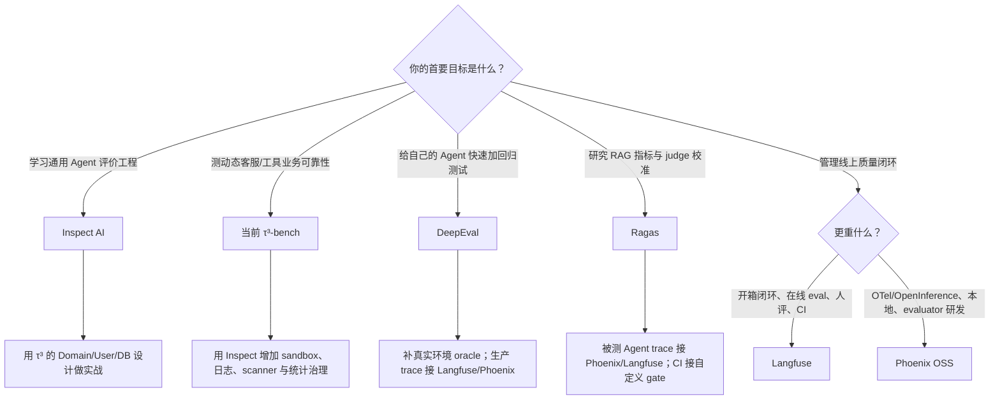
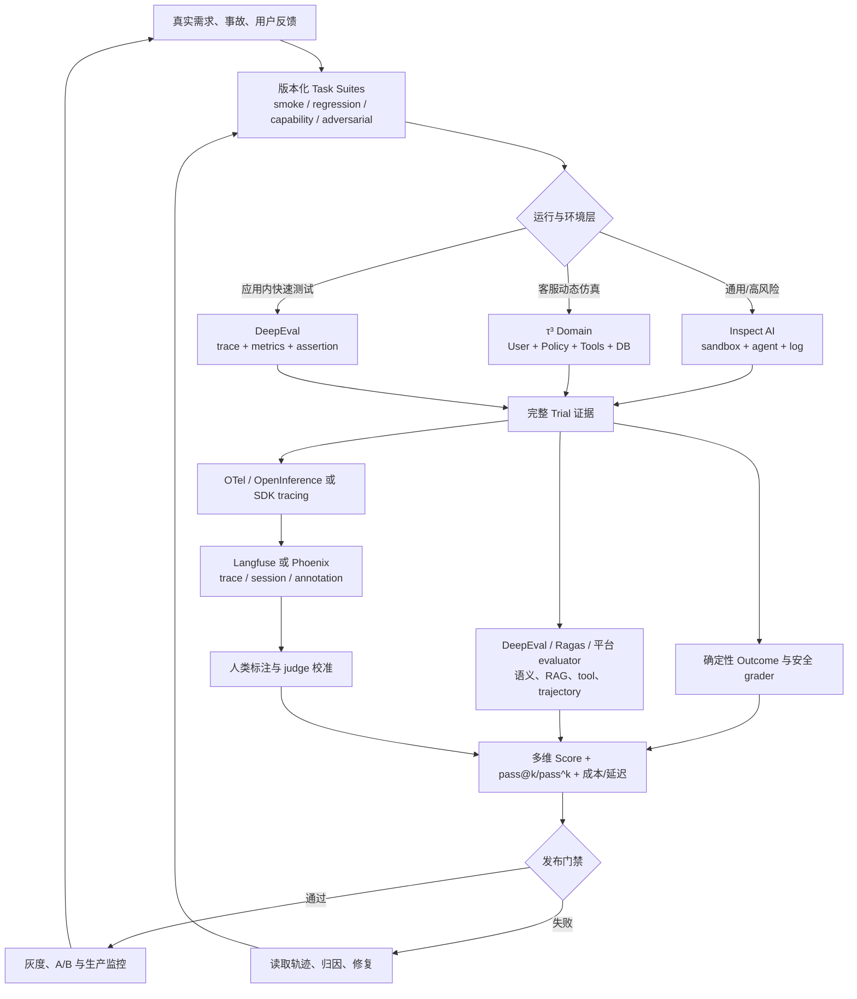

# 附录 A：六大 AI Agent 评价方案对比与组合边界

> 对比日期：2026-07-31  
> 项目：DeepEval、Ragas、Langfuse、Arize Phoenix、Inspect AI、τ-bench 家族（当前实现为 τ³-bench）  
> 评分性质：基于官方仓库、官方文档与正式论文的分析性判断，不是项目方评级。

## 1. 最重要的结论

六个方案不在同一层，不能靠 star 数或一个总分选“冠军”：

| 层级 | 方案 | 它主要解决什么 |
|---|---|---|
| 通用 evaluation harness | **Inspect AI** | 如何定义任务、运行 Agent、隔离环境、记录轨迹、评分、统计和复现 |
| 动态领域 benchmark | **τ³-bench** | 如何在用户模拟器、领域政策、工具和可重置数据库中测客服 Agent 的多轮可靠性 |
| 代码级测试框架 | **DeepEval** | 如何把 Agent/RAG/对话质量写成类似 pytest 的指标与 CI 回归测试 |
| 指标与实验工具包 | **Ragas** | 如何拆解 RAG 质量、设计 evaluator、生成数据并用人类标签校准 judge |
| 生产评价平台 | **Langfuse** | 如何把线上 tracing、自动/人工评分、数据集实验和 PR 门禁连成闭环 |
| 开放遥测与评价平台 | **Phoenix** | 如何用 OTel/OpenInference 观察 Agent，并编程式研究、调试 evaluator 和实验 |

学习顺序应先建立共同语言，再从较小的测试与 metric 原语进入生产证据，最后阅读 Inspect 与 τ³-bench 的完整 harness 和动态环境。项目选择仍按实际目标决定：DeepEval 偏代码级门禁，Ragas 偏 metric engineering，Langfuse/Phoenix 偏证据闭环，Inspect/τ³ 偏完整试验系统。

最终成熟架构通常是组合，而不是六选一。

## 2. 当前状态与关键风险快照

| 项目 | 截止日状态 | 许可 | 时效性/采用风险 |
|---|---|---|---|
| [DeepEval](https://github.com/confident-ai/deepeval) | v4.1.5，2026-07-29；高活跃 | Apache-2.0 | Agent 指标覆盖快，但大量 metric 依赖 LLM judge；生产协作能力与 OSS/Confident AI 平台边界要分清 |
| [Ragas](https://github.com/vibrantlabsai/ragas) | v0.4.3，2026-01-13；维护中 | Apache-2.0 | v0.4 正处 API 迁移，旧 `evaluate()` 与新 `@experiment` 教程并存；应锁版本并走 migration guide |
| [Langfuse](https://github.com/langfuse/langfuse) | v4.2.0，2026-07-31；高活跃 | MIT core + 商业 EE | 自托管生产组件较重；先核对目标功能是否属于 EE；v4 observation-first 需要理解新数据模型 |
| [Phoenix](https://github.com/Arize-ai/phoenix) | v19.10.0，2026-07-28；高活跃 | Elastic License 2.0 + 专利声明 | 不能把 Arize AX 的实时线上评价/告警算入 Phoenix OSS；对外托管服务需法律审查 |
| [Inspect AI](https://github.com/UKGovernmentBEIS/inspect_ai) | 0.3.251，2026-07-29；高频维护，Beta classifier | MIT | 通用而学习曲线高；框架不会自动修复糟糕任务和弱 grader；sandbox 必须显式配置 |
| [τ³-bench](https://github.com/sierra-research/tau2-bench) | 1.0.1，2026-07-15；当前 repo 名仍为 tau2-bench | MIT | 原 `tau-bench` 仓库已明确过时；1.0.1 修过破坏可比性的 grader/task bug，必须固定 task/grader 版本 |

### 一个必须单独强调的版本结论

旧 [`sierra-research/tau-bench`](https://github.com/sierra-research/tau-bench) 仅适合复现原始历史结果。它的 README 已明确标注 airline/retail tasks 过时。当前使用入口是 [`sierra-research/tau2-bench`](https://github.com/sierra-research/tau2-bench)，但项目当前名称与内容已经升级为 τ³-bench。新实验至少要记录仓库 commit/tag、domain、task split、grader 版本、Agent/User 模型、Trial 数和 seed。

## 3. 能力矩阵：0–5 表示项目直接提供的能力

评分遵循 [方法论文档](01-AI-Agent-评价方法论.md) 的定义：0 是不在项目范围；5 是该能力为核心且形成完整工作流。可通过大量自建胶水实现，不等于项目原生支持。

| 维度 | DeepEval | Ragas | Langfuse | Phoenix OSS | Inspect AI | τ³-bench |
|---|---:|---:|---:|---:|---:|---:|
| Agent 原生性 | **5** | 2 | 4 | 4 | **5** | **5** |
| 真实 Outcome / 副作用验证 | 3 | 2 | 3 | 3 | **5** | **5** |
| 轨迹、工具与多轮分析 | **5** | 3 | 4 | 4 | **5** | 4 |
| Grader 类型与可定制性 | **5** | 4 | **5** | **5** | **5** | 3 |
| 重复 Trial 与统计可靠性 | 3 | 3 | 3 | 4 | **5** | **5** |
| 环境隔离与实验复现 | 2 | 2 | 2 | 3 | **5** | **5**（限自身领域） |
| 生产 tracing 与反馈闭环 | 2（OSS） | 1 | **5** | 3 | 1 | 0 |
| CI / 回归门禁 | **5** | 2 | **5** | 3 | 4 | 2 |
| 宽松许可与扩展自由度 | **5** | **5** | 4 | 3 | **5** | **5** |

### 3.1 如何读表，而不是误读表

- τ³-bench 的环境隔离是**领域内很强**：每次 Trial 都能从同一模拟数据库开始；它不是通用代码 sandbox。
- Langfuse/Phoenix 的 Outcome 分数来自“能挂自定义 code evaluator”，但它们本身不提供业务数据库模拟器；你仍须编写 oracle。
- DeepEval 的 Task Completion 很适合端到端评分，但如果 trace 没有真实数据库/文件状态，judge 可能只看到 Agent 的“已完成”声明；所以不等于天然具备真实 Outcome 验证。
- Ragas 能对 Agent message/tool calls 评分，但被测 Agent 的完整 span tree 不是统一一等对象，因此 Agent 原生性和诊断能力低于 DeepEval/Inspect。
- Inspect 的生产闭环低分不代表不能长期运行，而是它定位为离线 evaluation harness，不是线上质量运营平台。

## 4. 严格逐项对比

### 4.1 谁最理解“Agent”而非单轮 LLM

**第一梯队：Inspect、DeepEval、τ³-bench。**

- Inspect 的 Agent/Solver、Tool、Sandbox、Approval、Event Log、Scanner 都是执行层一等抽象；同一 Dataset/Scorer 可替换 Agent scaffold，适合区分“模型能力”和“编排能力”。[Inspect Agents](https://inspect.aisi.org.uk/agents.html)
- DeepEval 把完整 Trace 与 Agent/LLM/Tool/Retriever Span 分开，并将 Task Completion、Tool Correctness、Step Efficiency、Plan 等设为 Agent 指标。[DeepEval Agent guide](https://deepeval.com/guides/guides-ai-agent-evaluation)
- τ³-bench 原生包含被测 Agent、LLM User Simulator、Domain Policy、Tools、Environment/DB 与 Orchestrator，最接近动态客服 Agent 的真实交互形态。[τ³ current repo](https://github.com/sierra-research/tau2-bench)

Langfuse 和 Phoenix 能忠实记录 Agent/tool spans，并能挂评价，但不会定义业务成功。Ragas 主要消费已经整理好的 message/tool-call 序列。

### 4.2 谁最会验证“真的完成了”

**Inspect 和 τ³-bench 最强。**

- Inspect scorer 可直接读取每 Sample 的 sandbox，检查文件、数据库、测试或进程状态；这让“最终文本说 done”与“环境真的改变”明确分离。[Inspect multiple scorers and sandbox access](https://inspect.aisi.org.uk/multiple-scorers.html)
- τ³-bench 在 fresh environment 重放 gold actions 得到目标数据库状态，再比较 Agent Trial 后的数据库状态；对业务副作用提供了强确定性 oracle。[τ evaluation design](https://github.com/sierra-research/tau2-bench/blob/main/docs/evaluation.md)

但 τ 的 final-state reward 仍可能漏掉“未经用户确认就执行写操作”这类过程违规。正确扩展是：Outcome gate + trajectory invariants 两层都必须通过，而不是改用唯一黄金路径。

### 4.3 谁的工具/轨迹评价最强

- **DeepEval**：工具名、参数、输出、顺序、exact match 可确定性比较；Task Completion/Step Efficiency 等可读整条 trace，适合应用回归。
- **Phoenix**：Tool Selection、Invocation、Response Handling 三分法最有教学价值；path convergence 示例让“选择—调用—利用—收敛”可以分别诊断。[Phoenix pre-built metrics](https://arize.com/docs/phoenix/evaluation/pre-built-metrics)
- **Inspect**：不假定唯一评价方法，但拥有完整 tool event、sandbox、custom scorer/scanner，扩展上限最高。
- **Langfuse**：structured tool calls、observation mapping、expected trajectory cookbook 很适合生产记录和自定义 evaluator。
- **Ragas**：ToolCallAccuracy/F1 能做顺序、参数和 reference tool calls 对比，适合已有序列，但不负责捕获运行时内部证据。
- **τ³-bench**：真实多轮工具写操作很强；默认评价更偏终态和必要信息，过程 invariants 需补充。

### 4.4 谁的 Grader 体系最可信

没有任何项目可以让 LLM judge 自动变成真值。框架成熟度与 grader 有效性是两回事。

- Inspect、DeepEval、Langfuse、Phoenix 都能组合 code-based 与 model-based grader。
- Ragas 对 **judge alignment** 的方法讲得最明确：用 human gold labels 计算一致性并优化/验证 evaluator。[Ragas human alignment](https://docs.ragas.io/en/stable/howtos/applications/vertexai_alignment/)
- Langfuse 的 Annotation Queue 最适合团队化的人评与 corrected output 工作流。
- Phoenix 会 trace evaluator 自身的 prompt、输入、输出、分数、延迟和错误，最适合调试“grader 为什么这样判”。
- τ³ 的 database oracle 最客观，但通信、自然语言 assertion、policy 过程仍需要额外 grader 或人工审计。

严格做法是：确定性 Outcome 为主；LLM judge 评语义维度；人工黄金集定期校准；对 judge-human 分歧做单独切片，不用平均分掩盖。

### 4.5 谁最重视随机性与统计

**Inspect 与 τ³-bench 最好。**

- Inspect 的 epochs、reducers、stderr、bootstrap、grouped metrics 和 eval-set 适合一般统计实验。[Inspect metrics](https://inspect.aisi.org.uk/metrics.html)
- τ³ 继承 τ-bench 的 `pass^k`：同一 Task 的 k 次 Trial 必须全部成功，直接暴露用户实际关心的一致性。[τ-bench ICLR paper](https://proceedings.iclr.cc/paper_files/paper/2025/file/1b126cc38b8638e07bef37e7b2bb72bf-Paper-Conference.pdf)
- Phoenix Experiment 支持 repetitions，且 dataset 明确版本化。
- DeepEval、Ragas、Langfuse 能重复运行和比较，但置信区间、power、分层抽样及显著性仍主要由团队设计。

### 4.6 谁最适合生产闭环

**Langfuse 第一，Phoenix 第二。**

Langfuse 的优势是一个系统里同时有 live observation sampling、LLM/code evaluator、用户反馈、Annotation Queue、Dataset/Experiment、质量/成本/延迟 dashboard，以及 first-party GitHub Action/RegressionError。[Langfuse evaluation overview](https://langfuse.com/docs/evaluation/overview)

Phoenix 的优势是 OTel/OpenInference、中立采集、本地启动、evaluator SDK 和 evaluator tracing；但 Phoenix OSS 对 incoming production traces 的实时自动评价与阈值告警不是一等内建闭环，通常要自己加 scheduler/batch，或评估商业 Arize AX。[Phoenix evaluation](https://arize.com/docs/phoenix/evaluation/llm-evals/evaluator-traces)

DeepEval OSS 偏本地测试；持续在线评价与共享 dashboard 的完整体验属于 Confident AI 平台。Ragas 更像可嵌入工具包。Inspect 和 τ³ 不应被当作 production observability backend。

### 4.7 谁最适合 CI

- **DeepEval**：最像 pytest，threshold → assertion → build failure，学习成本最低。
- **Langfuse**：不仅能在 CI 跑实验，还有专用 Experiment GitHub Action、PR comment、版本 pin 和 regression exception，团队体验最完整。
- **Inspect**：可以稳定地把 smoke/task/scorer/sandbox 测试加入流水线；昂贵模型矩阵更适合定时运行。
- **Phoenix**：可脚本化 experiment，但 threshold、退出码和 PR 报告需自己写。
- **Ragas**：能比较 baseline，但推荐 experiment API 不是强断言模型，门禁策略由团队实现。
- **τ³**：更适合周期 benchmark；双模型、多 Trial 和 voice 成本不适合每个小提交。

## 5. 选型决策树

## 6. 按真实目标给推荐组合

### 6.1 学习 Agent 评价的最佳路线

**方法论 → DeepEval → Ragas → Langfuse/Phoenix → Inspect AI → τ³-bench → 综合实践。**

1. 用方法论文档写 Task Contract、SubjectVersion 和证据优先级。
2. 用 DeepEval 把一个关键回归场景写成可失败的测试。
3. 用 Ragas 练习 single-aspect metric 与 judge alignment。
4. 用 Langfuse/Phoenix 让生产 trace、annotation 和 dataset 形成闭环。
5. 用 Inspect 重建可重置、可复现的 evaluation harness。
6. 用 τ³ 运行动态用户与数据库任务，报告 pass^k 和四类失败。
7. 完成[最小可信 Agent Evaluation System](08-capstone-agent-eval-system.md)。

这条路线把评价器、证据平台、运行 harness 和动态 benchmark 按依赖逐层引入。

### 6.2 普通产品 Agent：最快建立质量门禁

**DeepEval + 自定义 Outcome oracle + Langfuse 或 Phoenix tracing。**

- DeepEval 管本地数据集、Agent/Tool metrics 和 CI assertion。
- 业务代码负责检查数据库、文件、支付、权限和副作用。
- Langfuse/Phoenix 保存完整线上 trace，低分/失败样本回流回归集。
- LLM judge 仅评语义质量，并用人工集校准。

### 6.3 RAG / Research Agent

**Ragas + Phoenix，或 Ragas + Langfuse。**

- Ragas 分开评价检索 context precision/recall/relevance、回答 faithfulness 与最终质量。
- Phoenix 适合调试 Retriever/LLM/Tool spans 和 evaluator 自身；Langfuse 适合持续线上抽样、人评和 CI 闭环。
- 对研究 Agent 额外增加：每条主张是否有引用、引用是否支持主张、来源权威性、覆盖率、时效性、相互冲突证据处理。
- 公开网页不断变化，保存 source snapshot 或内容 hash；否则相同任务并不可复现。

### 6.4 客服、订单、银行等业务 Agent

**τ³-bench 领域模型 + Inspect 运行治理 + Langfuse 生产闭环。**

- τ³ 提供 User Simulator、Policy、Tools、Hidden DB、Final-state evaluator 与 pass^k。
- Inspect 提供通用 sandbox、approval、scanners、实验配置与统计。
- Langfuse 采集真实线上 Session/Observation、用户反馈和人工标注，再把真实失败回流模拟任务。
- 发布门禁必须将任务完成、政策合规和越权副作用设为独立硬条件。

### 6.5 高风险或强合规 Agent

**Inspect + 确定性 Outcome/Policy checks + 人类专家 + 生产遥测。**

不要让 LLM judge 决定最终准入。先用 sandbox 与最小权限运行，关键动作由 approval policy 或真实审批系统控制；用 code scorer 检查 outcome、权限事件和审计日志；LLM judge 只补充开放语义；领域专家定期盲评并校准。NIST AI RMF 也要求在部署相似条件下验证、记录局限性、监控生产表现，并把安全、可靠性、透明与问责纳入评价：[NIST AI RMF Core](https://airc.nist.gov/airmf-resources/airmf/5-sec-core/)。

## 7. 推荐的组合架构

### 这个架构的五个不变量

1. **运行与评分解耦**：一次完整 Trial 证据可以被不同 grader 反复评分。
2. **Outcome 与轨迹分开**：结果正确不能抵消越权过程；路径不同也不自动等于失败。
3. **版本进入结果主键**：模型、prompt、tool schema、Agent scaffold、task、grader、环境都必须记录。
4. **安全是硬门禁**：越权、数据泄露、破坏性副作用不能被平均质量分抵消。
5. **线上失败回流，但先去敏和复现**：生产 trace 不是直接可用的 benchmark；要清理隐私、稳定初始状态、定义成功条件。

## 8. 如果只能选一个

| 约束 | 选择 | 原因 |
|---|---|---|
| 只选一个来系统学习 Agent eval | **Inspect AI** | 核心抽象最完整；能学任务、Agent、工具、沙箱、评分、统计、日志和复现 |
| 只选一个快速接入现有 Python Agent | **DeepEval** | pytest 风格、Agent metrics、trace/span 和 CI 断言最直接 |
| 只选一个做生产质量运营 | **Langfuse** | online/offline/human/dataset/experiment/CI 闭环最完整 |
| 只选一个做开放遥测与 evaluator 研究 | **Phoenix OSS** | OTel/OpenInference、可编程 eval 和 evaluator tracing 最透明 |
| 只选一个做 RAG/研究指标实验 | **Ragas** | RAG 分解、metric engineering、数据生成和 judge alignment 最突出 |
| 只选一个测客服 Agent 可靠性 | **当前 τ³-bench** | 动态用户、多轮、政策、工具、DB 终态和 pass^k 直指真实业务可靠性 |

## 9. 四周实践计划

### 第 1 周：建立共同语言

- 阅读 [AI Agent 评价方法论](01-AI-Agent-评价方法论.md)。
- 明确 Task、Trial、Transcript、Outcome、Grader、Harness、Suite。
- 为一个熟悉的 Agent 写 20 条 task card；每条包含初始状态、成功终态、禁止副作用。
- 用 DeepEval 把 5 条稳定任务接入本地测试。

### 第 2 周：Metric 与生产证据

- 用 Ragas 写一个 single-aspect metric，并建立人工校准集。
- 用 Phoenix 或 Langfuse 采集 AGENT/LLM/TOOL evidence。
- 将一个去敏失败样本加入版本化 Dataset。

### 第 3 周：通用 Harness 与 CI

- 用 Inspect 建一个小 Task：Dataset + Agent + Docker sandbox + state scorer + transcript scanner。
- 比较同一 Agent 不同 prompt/model/tool 版本，不比较未固定的混合系统。
- 跑当前 τ³-bench 小样本，多 Trial 计算 pass^k，并区分四类故障来源。

### 第 4 周：综合系统与反馈闭环

- 完成[核心综合实践](08-capstone-agent-eval-system.md)。
- 形成固定周报：Outcome、Policy、Tool、Quality、pass^k、成本、延迟、错误率、置信区间与新失败类型。

## 10. 一句话选择

**Inspect 教你建测量系统，τ³ 教你设计动态任务，DeepEval 教你把质量写进测试，Ragas 教你造与校准尺子，Phoenix 教你看清过程，Langfuse 教你把整套评价长期运营起来。**
