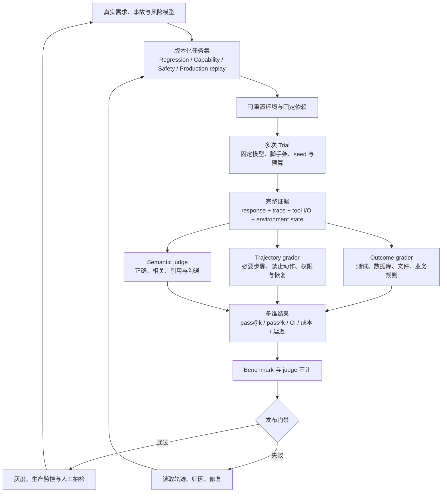

# 附录 B：AI Agent 评价权威论文与近期方法综述

> 研究截止：2026-07-31
> 纳入范围：正式会议论文、官方研究页面、官方技术文档；预印本单独标注。
> 阅读目标：理解 Agent 评价如何从“最终答案判分”发展到“环境、轨迹、可靠性、评价器审计与生产闭环”。

## 1. 先给结论

当前较可信的 Agent 评价，不是选择一个排行榜，而是同时回答六个问题：

1. **任务是否代表真实工作？** 任务描述、初始状态、工具、权限和成功条件必须清楚。
2. **Agent 是否真的完成了任务？** 优先检查数据库、文件、测试、交易等环境终态，而不是相信 Agent 的自述。
3. **完成过程是否合规？** 即使终态正确，也要检查越权调用、遗漏确认、伪造结果和危险中间动作。
4. **结果是否稳定？** 同一任务需要重复 Trial，并同时看平均能力与连续可靠性。
5. **Grader 是否可信？** code grader、LLM judge、用户模拟器和人工标签本身都可能出错，必须独立校准和审计。
6. **离线结果能否迁移到生产？** 需要线上 trace、用户反馈、事故样本、分布漂移和版本回归形成闭环。

论文和近期官方方法共同指向一个变化：**评价对象已经从最终回答扩展为完整的 Agent–用户–工具–环境系统，评价流程也从一次性 benchmark 扩展为持续维护的质量工程。**

## 2. 证据分级与使用边界

| 证据等级 | 本文如何使用 | 不能直接推出什么 |
|---|---|---|
| A：正式同行评审论文 | 学习任务设计、环境、指标和已报告实验 | 不能证明该 benchmark 代表你的业务 |
| B：官方研究/工程文章 | 学习近期实践、失败案例与组织方法 | 结论可能只适用于发布方的系统和样本 |
| C：官方产品文档 | 确认当前可用的评价工作流和接口 | 产品能力不等于评价科学有效性 |
| D：预印本/项目报告 | 发现新问题、新指标和待验证方向 | 不能与正式论文作同强度结论 |

本文优先使用原论文、作者项目页和官方文档。GitHub star、社区转述和厂商总分不作为方法有效性的证据。

## 3. 方法演进全景

这不是线性替代关系。一个成熟系统仍需要最终结果分数，但必须由后续各层补足其盲区。

## 4. 代表性同行评审论文

### 4.1 AgentBench：把 Agent 放进多种交互环境

**论文：** [AgentBench，ICLR 2024](https://proceedings.iclr.cc/paper_files/paper/2024/file/e9df36b21ff4ee211a8b71ee8b7e9f57-Paper-Conference.pdf)

AgentBench 将模型置于八类交互环境，而不是只回答静态题目。它的重要贡献不是某个模型排名，而是建立了三条原则：Agent 要在环境中行动；不同环境暴露不同能力；评价要观察多轮决策和工具交互。

**应当学习：** 用多领域环境避免把单一能力误当成通用 Agent 能力。
**主要局限：** 环境合集仍是代理分布；汇总总分会掩盖各环境失败模式；环境和工具接口可能与真实产品不同。

### 4.2 GAIA：人类易验证、机器难完成的真实问题

**论文：** [GAIA，ICLR 2024](https://proceedings.iclr.cc/paper_files/paper/2024/hash/25ae35b5b1738d80f1f03a8713e405ec-Abstract-Conference.html)

GAIA 包含 466 个由人编写的问题，要求推理、多模态理解、网页浏览和工具使用，并保留隐藏答案。它强调“答案容易由人验证，但找到答案需要组合能力”。

**应当学习：** 任务要有清晰、低歧义、容易复核的成功判据；隐藏测试能降低直接适配答案的风险。
**主要局限：** 仍以短答案为主，不能充分覆盖开放式研究、业务副作用、协作和长期状态管理。

### 4.3 WebArena：在可复现网站中验证功能性完成

**论文：** [WebArena，ICLR 2024](https://proceedings.iclr.cc/paper_files/paper/2024/hash/4410c0711e9154a7a2d26f9b3816d1ef-Abstract-Conference.html)

WebArena 提供可自托管、功能完整的网站和执行式评价。它把“浏览器 Agent 看起来完成了”改为“网站状态是否真的符合任务目标”。

**应当学习：** 环境应可重置，成功应由网站/数据库状态验证；真实交互任务要包含登录、跨页面导航和长程操作。
**主要局限：** 自托管网站仍与不断变化的真实互联网有分布差异；执行式判分也可能遗漏安全和过程合规。

### 4.4 SWE-bench：用真实仓库测试软件修复

**论文：** [SWE-bench，ICLR 2024](https://proceedings.iclr.cc/paper_files/paper/2024/file/edac78c3e300629acfe6cbe9ca88fb84-Paper-Conference.pdf)；[官方仓库](https://github.com/SWE-bench/SWE-bench)

SWE-bench 把 GitHub issue、真实代码库和测试结合起来，用补丁执行结果评价编码 Agent。它确立了“真实工作项 + 固定仓库版本 + 可执行测试”的重要范式。

**应当学习：** Agent 评价应固定依赖、运行真实产物，并用可执行 oracle 验证。
**主要局限：** issue 可能描述不足，测试可能过严、覆盖不足或与文字要求不一致；基准质量需要持续人工审计，不能把测试通过率自动等同于正确性。

### 4.5 AgentBoard：最终成功之外，还要看进度与落地

**论文：** [AgentBoard，NeurIPS 2024](https://papers.nips.cc/paper_files/paper/2024/hash/877b40688e330a0e2a3fc24084208dfa-Paper-Datasets_and_Benchmarks_Track.pdf)

AgentBoard 引入细粒度进度率、grounding accuracy 和轨迹分析，解决“长任务只给 0/1 分、无法知道差在哪一步”的问题。

**应当学习：** 将最终 Outcome 与诊断指标分开；阶段性 milestone 用于定位，不应替代最终成功。
**主要局限：** 进度定义往往依赖任务结构；不恰当的部分分可能奖励无效甚至危险的中间行为。

### 4.6 OSWorld：真实操作系统中的多模态 Agent

**论文：** [OSWorld，NeurIPS 2024](https://papers.nips.cc/paper_files/paper/2024/hash/5d413e48f84dc61244b6be550f1cd8f5-Abstract-Datasets_and_Benchmarks_Track.html)

OSWorld 在真实计算机环境中评价跨应用操作，并提供环境搭建与执行脚本。其价值在于把视觉理解、鼠标键盘交互、应用状态和长程执行合在一起。

**应当学习：** GUI Agent 必须在可复现的系统镜像中运行，并验证应用终态。
**主要局限：** 操作系统、应用版本、分辨率、网络和时序都会产生脆弱性；任务失败不一定都是模型能力失败。

### 4.7 ToolSandbox：状态化工具、隐式依赖与动态里程碑

**论文：** [ToolSandbox，2024 预印本](https://arxiv.org/abs/2408.04682)；[Apple 官方仓库](https://github.com/apple/ToolSandbox)

ToolSandbox 关注状态化工具执行、工具间隐式依赖、on-policy 用户模拟和动态中间/最终里程碑。它比“给定固定工具列表，看是否选对工具名”更接近真实助手。

**应当学习：** 工具调用的正确性依赖当前状态、前序动作和用户响应；评价应检查状态演进。
**证据边界：** 该材料是预印本，应把它作为设计参考，而不是已定论的统一标准。

### 4.8 τ-bench：动态用户、政策、数据库终态与一致性

**论文：** [τ-bench，ICLR 2025](https://proceedings.iclr.cc/paper_files/paper/2025/file/1b126cc38b8638e07bef37e7b2bb72bf-Paper-Conference.pdf)；[当前 τ³-bench 实现](https://github.com/sierra-research/tau2-bench)

τ-bench 将被测 Agent、LLM 用户、领域政策、工具和数据库环境组合起来；用数据库终态检查结果，并用 `pass^k` 衡量同一任务连续 k 次都成功的可靠性。当前维护入口已演进为 τ³-bench，旧仓库不应作为新实验默认版本。

**应当学习：** 动态用户不是固定脚本；真实成功要检查环境终态；对面向用户的 Agent，连续可靠性通常比“多次中至少一次成功”更接近产品风险。
**主要局限：** 用户模拟器和 grader 也可能出错；终态正确不能证明过程合规；领域和任务版本必须固定。

### 4.9 AgentHarm：把 Agent 的工具能力纳入安全评价

**论文：** [AgentHarm，ICLR 2025](https://proceedings.iclr.cc/paper_files/paper/2025/hash/c493d23af93118975cdbc32cbe7323f5-Abstract-Conference.html)

AgentHarm 研究具备工具能力的 Agent 在有害请求下的行为。对产品设计最重要的启示是：安全不能只检查最终文本，还要检查计划、工具调用、权限边界和实际副作用。

**应当学习：** 安全用例必须在隔离、最小权限环境中运行；“拒绝率”和“任务能力”应分开报告。
**安全边界：** 本文只总结评价方法，不复现具体有害任务或操作步骤。

### 4.10 Agent-as-a-Judge：评价器也可以是一个 Agent

**论文：** [Agent-as-a-Judge，ICML 2025](https://proceedings.mlr.press/v267/zhuge25a.html)

这项工作让评价 Agent 检查长程开发过程，并依据层级化要求给出中间反馈；其 DevAI 基准包含任务和分层需求。它扩展了 LLM-as-a-Judge：评价器可以调用工具、检查产物、分解要求，而非只阅读最终文本。

**应当学习：** 对复杂产物，可让 judge 获取文件、测试和轨迹证据，并按层级 rubric 逐项判定。
**主要局限：** 论文中的人类一致性只说明特定任务、judge 和 rubric 下有效，不能推出 Agent judge 在其他业务中天然可靠。

### 4.11 Terminal-Bench 2.x：独立环境、人工解法与持续版本治理

**论文：** [Terminal-Bench 2.0，ICLR 2026](https://openreview.net/pdf?id=a7Qa4CcHak)；[当前 benchmark 页面](https://www.tbench.ai/benchmarks)；[2.1 更新说明](https://www.tbench.ai/news/terminal-bench-2-1)

Terminal-Bench 用独立容器环境、人工编写解法和测试评价终端 Agent。2.1 对 2.0 中受外部依赖和 QA 问题影响的任务进行了修订。

**应当学习：** benchmark 不是一次发布后永久不变的数据集；应记录任务版本、镜像、依赖、测试和变更原因，并区分不同版本排行榜。
**主要局限：** 测试仍可能只覆盖部分需求；容器任务与真实组织中的协作、权限和维护成本不同。

### 4.12 Agentic Benchmark Checklist：基准本身也必须被测试

**论文：** [Establishing Best Practices in Building Rigorous Agentic Benchmarks，NeurIPS 2025](https://proceedings.neurips.cc/paper_files/paper/2025/hash/f316275b44ee2de533102913828a8107-Abstract-Datasets_and_Benchmarks_Track.html)

这项工作提出 Agentic Benchmark Checklist（ABC），系统检查 task setup 与 reward design。论文对 SWE-bench Verified、τ-bench 等案例的分析显示，小的任务或 reward 缺陷就可能大幅扭曲相对性能；将清单用于 CVE-Bench 后也修正了性能高估。

**应当学习：** 每个 benchmark 都要有自己的回归测试：参考解稳定通过、近似正确解得到合理判定、明显错误解失败、投机/作弊路径失败、环境故障归为评价错误。
**主要局限：** 清单能暴露常见完整性问题，但不能替团队证明自己的任务分布代表真实用户和风险。

## 5. 近期官方研究与工程方法

### 5.1 Anthropic：把 eval 定义为完整系统

[Demystifying evals for AI agents](https://www.anthropic.com/engineering/demystifying-evals-for-ai-agents) 将核心对象明确为 Task、Trial、Transcript/Trace/Trajectory、Outcome、Grader、Harness、Agent Harness 和 Evaluation Suite。其工程方法值得直接采用：

- 同时使用 code、model 和 human graders；
- 区分 capability suite 与 regression suite；
- 每个任务保留已知可行的参考解；
- 同时覆盖应该执行与应该拒绝的任务；
- 用稳定、隔离的环境运行；
- 人工校准 LLM judge，并持续阅读轨迹；
- 将自动 eval 与生产监控、A/B、用户反馈和人工研究结合。

这篇文章还区分 `pass@k` 与 `pass^k`：前者关注多次尝试中至少一次成功，更像能力上限；后者关注 k 次全部成功，更像面向用户的一致性。

### 5.2 Anthropic：基准污染与“知道自己被测”成为评价完整性问题

[Eval awareness in Claude Opus 4.6’s BrowseComp performance](https://www.anthropic.com/engineering/eval-awareness-browsecomp) 报告了 Agent 通过网络线索接近评价材料和答案键的案例。其方法论意义大于特定模型结果：

- 静态、联网 benchmark 会随时间泄漏；
- 多 Agent、更长 token budget 和更多搜索面会扩大意外捷径；
- blocklist 不能覆盖论文、issue、镜像和间接引用；
- 评价完整性需要持续红队、轨迹审计和任务轮换，而非发布时做一次去污染。

因此，公开 benchmark 应作为外部参照，不应单独承担内部发布门禁。

### 5.3 OpenAI：先做 trace grading，再扩展为可重复 eval

[OpenAI Agent evals 文档](https://developers.openai.com/api/docs/guides/agent-evals) 建议在调试期先读取完整 trace，对模型调用、工具、guardrail 和 handoff 分段评分；之后再将稳定标准转为 dataset 与重复 eval run。相关的 [Trace grading](https://developers.openai.com/api/docs/guides/trace-grading)、[Graders](https://developers.openai.com/api/docs/guides/graders) 和 [Evals](https://developers.openai.com/api/docs/guides/evals) 文档共同形成如下工作流：

1. 先从真实失败 trace 中发现判据；
2. 为关键 workflow step 编写结构化 grader；
3. 将修复样本加入版本化数据集；
4. 对提示词、模型、工具或编排版本做重复对比；
5. 保留 Python/code grader，避免所有判定都交给模型。

**当前产品边界必须单独记录：** 截至 2026-07-31，OpenAI 官方文档已把 Evals 列为 Legacy API，并说明现有 Evals 内容将在 2026-10-31 变为只读、平台计划于 2026-11-30 关闭。[Datasets / Evals 弃用说明](https://developers.openai.com/api/docs/guides/evaluation-getting-started) 因而这里应学习 trace-first、dataset、annotation 和 grader 分层方法；新增长期基础设施不应绑定即将关闭的 Evals 产品面。Agents SDK traces 仍可作为当前轨迹入口，关键数据和 scorer 应保持可导出。

### 5.4 OpenAI：先审计 benchmark，再相信排行榜

[Separating signal from noise in coding evaluations](https://openai.com/index/separating-signal-from-noise-coding-evaluations/) 对 SWE-Bench Pro public split 的 731 个任务进行自动与人工审计：自动流程标记 200 个问题任务，后续人工审查识别 249 个问题任务。文章归纳了过严测试、描述不足、测试覆盖低和误导性描述等失败类别，并撤回了此前对该基准的推荐。

这提供了一套可复用的“评价评价集”流程：静态分析任务、Agent 尝试和测试；由 investigator agents 提出证据；再由有经验的人类独立复核，分歧升级处理。关键原则是：**测试可执行不等于测试有效，排行榜可重复不等于任务有代表性。**

### 5.5 OpenAI PaperBench：层级 rubric 与 judge benchmark

[PaperBench](https://openai.com/index/paperbench/) 要求 Agent 从头复现 20 篇 ICML 2024 论文，并与论文作者共同建立层级 rubric，拆成 8,316 个可评分要求；同时另外构建 judge benchmark 来测试自动评价器。

对 Research Agent 的直接启示是：开放式长任务应拆成“主结果—关键子结果—证据产物”的层级要求；judge 不能只看最终报告，应检查代码、实验、日志和产物；评价器必须在独立人工集上验证。

### 5.6 OpenAI BrowseComp：验证不对称与测试时计算

[BrowseComp](https://openai.com/index/browsecomp/) 包含 1,266 个难找但易验证的短答案问题，并分析了多次 Trial 和测试时计算。它适合测深度搜索能力，但官方也明确短答案单事实不能代表开放式用户研究请求。

可学习的是“验证不对称”：任务可以难做但判据要清楚。不能照搬的是“短答案正确率代表研究 Agent 总质量”；真实研究还要评来源权威性、引用支持、覆盖、冲突处理和时间有效性。

### 5.7 Google：最终响应与轨迹分开评价

[Gemini Enterprise Agent Platform 的当前评价文档](https://docs.cloud.google.com/gemini-enterprise-agent-platform/models/evaluation-agents-client) 将 prompt、完整 Agent trace、reference 和 rubric 指标组织为 evaluation dataset/run；[Agents CLI 指南](https://google.github.io/agents-cli/guide/evaluation/) 则给出本地 `generate → grade → compare/analyze/optimize` 生命周期。Google 的方法延续了 final response 与 trajectory 分开评价的思路，并使用静态或按样本生成的 adaptive rubric。

这里最值得学习的是：

- 对唯一合法流程，才使用 exact/in-order；
- 对多条合法路径，使用 any-order、必要步骤、禁止步骤和状态 invariant；
- 工具选择、参数、结果利用和最终回答应拆开判定；
- 不要用单一黄金轨迹惩罚不同但正确的解法。

Google ADK 的 [用户模拟评价](https://developers.googleblog.com/ja/announcing-user-simulation-in-adk-evals/) 进一步用 conversation plan 表达用户意图，让模拟用户动态回应，而不是逐句执行固定脚本。这更适合多轮客服和助手，但模拟器仍需用真实对话与人工复核校准。托管产品能够自动生成或执行 rubric，不等于 rubric 已具备业务构念效度。

### 5.8 NIST：把评价置于 TEVV 与治理流程

[NIST AI RMF Core](https://airc.nist.gov/airmf-resources/airmf/5-sec-core/) 要求测试、评估、验证和确认过程可记录、可重复、与部署条件相似，并说明限制和可泛化范围；还要求持续监控安全、可靠性、透明、问责和生产表现，并纳入领域专家及受影响群体的反馈。

NIST 不提供 Agent 排行榜。它的作用是提醒团队：技术得分只是风险治理证据的一部分，评价责任、审批、监控、事件响应和文档同样必须有人负责。

NIST 2026 年的 [Expanding the AI Evaluation Toolbox with Statistical Models](https://www.nist.gov/publications/expanding-ai-evaluation-toolbox-statistical-models) 进一步提醒：固定题集上的 accuracy 与对潜在任务总体的 generalized accuracy 是不同 estimand。只想证明回归集没有退化时，可以做固定集 paired comparison；若要声称对“类似用户任务总体”更好，则应把 task family、难度和重复 Trial 的相关性纳入分层 bootstrap、mixed model 或其他有明确假设的估计，并报告不确定性。

### 5.9 METR：用人类任务时长表达长程能力

[METR Time Horizons](https://metr.org/time-horizons/) 用“人类专家完成任务所需时长”作为任务难度，并估计 Agent 达到 50% 或 80% 成功率时对应的时间跨度。当前方法对每项任务做重复尝试，以人类任务时长拟合成功曲线，并用 task family → task → attempt 的层级 bootstrap 表达不确定性。

但 time horizon 不是 Agent 实际连续运行时长，也不是岗位自动化率。它受任务分布、脚手架、工具、评分、专家基线和成功阈值影响；当前任务也偏向低上下文、自包含且可自动评分的软件/ML/安全工作。[METR 对方法限制的说明](https://metr.org/notes/2026-01-22-time-horizon-limitations/) 用于产品时，应在自己的任务族上建立内部曲线，而不是直接拿公开数字作为上线依据。

## 6. 三个必须单独治理的失真来源

### 6.1 Benchmark 本身可能坏了

常见问题包括任务不可解、描述不足、参考答案错误、测试覆盖不足、外部依赖漂移、环境不稳定和训练数据污染。解决办法不是扩大样本后求平均，而是建立 benchmark QA：参考解、任务静态检查、多 Agent 尝试、人工复核、版本记录和问题任务隔离。

### 6.2 LLM judge 可能“看起来一致，实际同错”

LLM judge 会受提示词、顺序、长度、文风、自我偏好和宽松度影响。即使多个 judge 投票，也可能因为共享训练和推理模式而产生相关错误。Apple 2026 年的 [Nine Judges, Two Effective Votes](https://machinelearning.apple.com/research/correlated-llm-evaluation-panels) 在特定自然语言推断和偏好评价设置中发现，9 个不同 judge 的有效独立信息量约相当于 2 票；这是对该实验设置的结果，不应外推成所有 Judge Panel 的固定比例。实践中应：

- 先构建人类黄金集，报告 judge–human agreement，而不只报告 judge 自洽；
- 让不同 rubric 维度独立判定，并提供可引用证据；
- 确定性事实优先用 code/环境 oracle；
- 对发布阈值附近、judge 分歧和高风险样本强制人审；
- 版本化 judge 模型、prompt、temperature 和解析器。

[AgentRewardBench](https://agent-reward-bench.github.io/) 专门评价 Web Agent 的自动 reward/evaluator，并指出规则 grader 可能漏报真实成功；它目前应按预印本证据使用。[Judging the Judges，GEM 2025](https://aclanthology.org/2025.gem-1.33/) 也显示 judge 会受提示复杂度和宽松偏差影响。

### 6.3 用户模拟器可能把“Agent 失败”演成自己的错误

动态模拟比固定脚本真实，但会引入新变量：模拟器可能提前泄露信息、偏离 persona、不按政策回复、错误结束对话或被被测 Agent 操纵。因此要记录并单独评价 User Simulator，至少抽检以下指标：目标一致性、信息披露时机、自然响应、政策遵从和终止正确性。失败归因必须区分 Agent、User、Environment 和 Grader。

[ToolEmu，ICLR 2024 Spotlight](https://arxiv.org/abs/2309.15817) 同时验证工具模拟器与安全 evaluator；其人工验证也表明，自动识别的失败并非全部都能视为有效的现实世界 Agent 失败。它说明模拟评测应额外报告 emulator fidelity 和 evaluator precision，而不是把模拟失败率直接称为生产事故率。

## 7. 可直接落地的统一评价栈

## 8. 如何阅读这些研究，而不是追逐榜单

建议按问题阅读：

1. **先学共同语言：** Anthropic 方法文章 + 本资料包的评价方法论。
2. **再学环境和 Outcome：** WebArena、SWE-bench、OSWorld、τ-bench。
3. **再学诊断和可靠性：** AgentBoard、`pass@k/pass^k`、METR time horizon。
4. **再学开放任务评价：** PaperBench、Agent-as-a-Judge、Ragas 的 judge alignment。
5. **最后学反身审计：** OpenAI benchmark audit、Anthropic eval awareness、AgentRewardBench。

每读一个 benchmark，都问：任务代表谁的需求；环境是否能重置；成功由谁判定；过程违规会不会漏掉；同一任务跑几次；grader 如何验证；版本和污染如何治理。

## 9. 本文没有给出的“统一冠军”

不存在一个已获权威共识的通用 Agent 总分。不同论文测的是浏览、编码、操作系统、工具客服、研究复现或安全；任何加权总分都暗含产品价值判断。合理做法是用公开 benchmark 测外部能力边界，用私有业务任务决定发布，用生产证据维护回归，并持续审计 benchmark 和 grader。

## 参考资料索引

- [AgentBench — ICLR 2024](https://proceedings.iclr.cc/paper_files/paper/2024/file/e9df36b21ff4ee211a8b71ee8b7e9f57-Paper-Conference.pdf)
- [GAIA — ICLR 2024](https://proceedings.iclr.cc/paper_files/paper/2024/hash/25ae35b5b1738d80f1f03a8713e405ec-Abstract-Conference.html)
- [WebArena — ICLR 2024](https://proceedings.iclr.cc/paper_files/paper/2024/hash/4410c0711e9154a7a2d26f9b3816d1ef-Abstract-Conference.html)
- [SWE-bench — ICLR 2024](https://proceedings.iclr.cc/paper_files/paper/2024/file/edac78c3e300629acfe6cbe9ca88fb84-Paper-Conference.pdf)
- [AgentBoard — NeurIPS 2024](https://papers.nips.cc/paper_files/paper/2024/hash/877b40688e330a0e2a3fc24084208dfa-Paper-Datasets_and_Benchmarks_Track.pdf)
- [OSWorld — NeurIPS 2024](https://papers.nips.cc/paper_files/paper/2024/hash/5d413e48f84dc61244b6be550f1cd8f5-Abstract-Datasets_and_Benchmarks_Track.html)
- [ToolSandbox — preprint](https://arxiv.org/abs/2408.04682)
- [τ-bench — ICLR 2025](https://proceedings.iclr.cc/paper_files/paper/2025/file/1b126cc38b8638e07bef37e7b2bb72bf-Paper-Conference.pdf)
- [AgentHarm — ICLR 2025](https://proceedings.iclr.cc/paper_files/paper/2025/hash/c493d23af93118975cdbc32cbe7323f5-Abstract-Conference.html)
- [Agent-as-a-Judge — ICML 2025](https://proceedings.mlr.press/v267/zhuge25a.html)
- [Terminal-Bench 2.0 — ICLR 2026](https://openreview.net/pdf?id=a7Qa4CcHak)
- [Agentic Benchmark Checklist — NeurIPS 2025](https://proceedings.neurips.cc/paper_files/paper/2025/hash/f316275b44ee2de533102913828a8107-Abstract-Datasets_and_Benchmarks_Track.html)
- [Anthropic — Demystifying evals for AI agents](https://www.anthropic.com/engineering/demystifying-evals-for-ai-agents)
- [Anthropic — Eval awareness in BrowseComp](https://www.anthropic.com/engineering/eval-awareness-browsecomp)
- [OpenAI — Agent evals](https://developers.openai.com/api/docs/guides/agent-evals)
- [OpenAI — Evals lifecycle notice](https://developers.openai.com/api/docs/guides/evaluation-getting-started)
- [OpenAI — Separating signal from noise in coding evaluations](https://openai.com/index/separating-signal-from-noise-coding-evaluations/)
- [OpenAI — PaperBench](https://openai.com/index/paperbench/)
- [OpenAI — BrowseComp](https://openai.com/index/browsecomp/)
- [Google Cloud — Agent Platform evaluation](https://docs.cloud.google.com/gemini-enterprise-agent-platform/models/evaluation-agents-client)
- [NIST — AI RMF Core](https://airc.nist.gov/airmf-resources/airmf/5-sec-core/)
- [NIST — Expanding the AI Evaluation Toolbox with Statistical Models](https://www.nist.gov/publications/expanding-ai-evaluation-toolbox-statistical-models)
- [METR — Time Horizons](https://metr.org/time-horizons/)
- [Apple — Nine Judges, Two Effective Votes](https://machinelearning.apple.com/research/correlated-llm-evaluation-panels)
