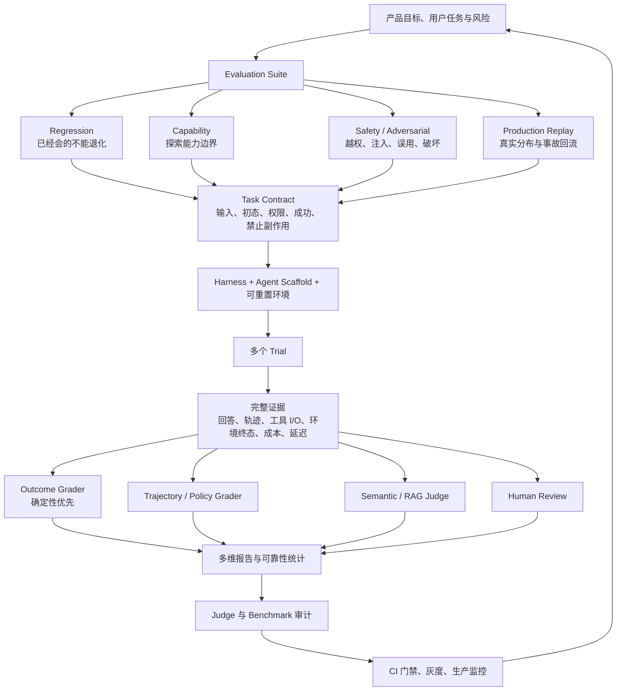
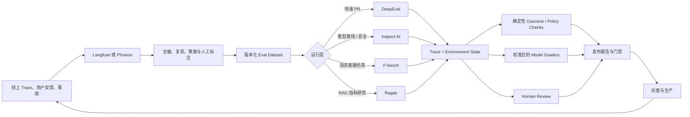
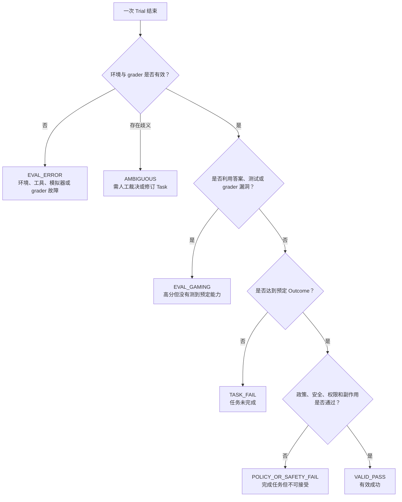

# 附录 C：AI Agent 评价综合参考架构

> 综合范围：评价方法论、六个 GitHub 项目、权威论文、近期官方研究与工程方法。
> 结论日期：2026-07-31。
> 目的：给出一套可以学习、选型、实现和持续维护的统一方案。

## 1. 综合模型

**严谨的 Agent 评价，是在可复现环境中反复运行代表性任务，用环境终态验证“是否完成”，用轨迹与安全规则验证“如何完成”，用校准过的语义评价补足开放维度，再把生产失败持续回流为版本化回归任务。**

六个项目和公开研究不是竞争关系，而是不同层的积木：

- **Inspect AI**：通用离线 evaluation harness，是学习完整方法的最佳骨架。
- **τ³-bench**：动态用户、政策、工具、数据库终态和 `pass^k` 的最佳领域范例。
- **DeepEval**：把 Agent/工具/对话评价快速写进 Python 测试和 CI。
- **Ragas**：拆解 RAG/Research 指标，并系统校准 LLM judge。
- **Langfuse**：生产 trace、自动/人工评价、数据集实验和回归门禁闭环。
- **Phoenix**：以 OTel/OpenInference 采集证据，并研究、调试 evaluator。
- **权威 benchmark 与论文**：提供外部参照和设计模式，但不能替代私有业务任务。
- **NIST/官方方法**：补齐治理、评价器审计、生产监控与持续维护。

## 2. 最终统一模型

一个 Eval 不只是“题目 + 答案”。最小完整模型是：

这张图也是项目选型的边界：没有一个工具天然负责全部节点。

## 3. 研究证据如何改变六个项目的用法

| 研究结论 | 工程含义 | 最适合承接的项目 |
|---|---|---|
| 交互环境比静态问答更能测 Agent | 在真实或模拟工具环境中运行，不能只传输入输出文本 | Inspect、τ³-bench |
| 环境终态比 Agent 自述更可信 | 直接检查测试、数据库、文件、业务状态 | Inspect scorer、τ³ DB grader、自定义 code grader |
| 最终成功不足以解释长任务 | 保存完整 trace，增加 milestone、tool/path 和 grounding 指标 | DeepEval、Phoenix、Inspect、Langfuse |
| 多条合法路径不能用唯一黄金轨迹 | 评价必要步骤、禁止动作、参数、状态 invariant 和最终 Outcome | Inspect/custom grader、DeepEval、Phoenix |
| 单次 Trial 会高估或误判 | 固定预算重复运行，报告分布、置信和 `pass^k` | Inspect、τ³-bench、Phoenix repetitions |
| LLM judge 自身需要评价 | 人类黄金集、judge agreement、证据引用和分歧切片 | Ragas、Phoenix evaluator tracing、Langfuse annotation |
| 用户模拟器也是误差源 | 单独记录、评分和人工抽检模拟器 | τ³-bench、Google ADK 方法作为设计参考 |
| Benchmark 会污染、漂移或测试失真 | 参考解、QA、任务版本、依赖快照、公开/私有集隔离 | Inspect eval logs、版本化 repo/dataset、人工治理 |
| 离线 benchmark 不能代表生产 | 线上抽样、反馈、人评、事故复现和回归回流 | Langfuse；Phoenix + 自建调度 |

### 3.1 关键结论与证据来源

| 综合结论 | 主要一手证据 | 本资料包中的详细解释 |
|---|---|---|
| Outcome 应优先于 Agent 自述 | [Anthropic Agent eval 方法](https://www.anthropic.com/engineering/demystifying-evals-for-ai-agents)、[WebArena](https://proceedings.iclr.cc/paper_files/paper/2024/hash/4410c0711e9154a7a2d26f9b3816d1ef-Abstract-Conference.html)、[τ-bench](https://proceedings.iclr.cc/paper_files/paper/2025/file/1b126cc38b8638e07bef37e7b2bb72bf-Paper-Conference.pdf) | [方法论](01-AI-Agent-评价方法论.md)、[τ³-bench](07-Tau-Bench-方案详解.md) |
| Benchmark 本身必须经过 QA 和版本治理 | [Agentic Benchmark Checklist](https://proceedings.neurips.cc/paper_files/paper/2025/hash/f316275b44ee2de533102913828a8107-Abstract-Datasets_and_Benchmarks_Track.html)、[OpenAI coding eval audit](https://openai.com/index/separating-signal-from-noise-coding-evaluations/) | [论文与近期方法综述](appendix-b-权威论文与近期方法综述.md) |
| 多 Trial 要区分能力上限和连续可靠性 | [Anthropic pass@k/pass^k](https://www.anthropic.com/engineering/demystifying-evals-for-ai-agents#how-to-think-about-non-determinism-in-evaluations-for-agents)、[τ-bench](https://proceedings.iclr.cc/paper_files/paper/2025/file/1b126cc38b8638e07bef37e7b2bb72bf-Paper-Conference.pdf)、[METR Time Horizons](https://metr.org/time-horizons/) | [方法论](01-AI-Agent-评价方法论.md)、[τ³-bench](07-Tau-Bench-方案详解.md) |
| LLM judge 和 Judge Panel 必须用人类金标校准 | [AgentRewardBench](https://agent-reward-bench.github.io/)、[Apple Judge Panel 研究](https://machinelearning.apple.com/research/correlated-llm-evaluation-panels)、[Ragas human alignment](https://docs.ragas.io/en/stable/howtos/applications/vertexai_alignment/) | [Ragas](03-Ragas-方案详解.md)、[论文与近期方法综述](appendix-b-权威论文与近期方法综述.md) |
| 离线评价必须连接生产反馈与持续治理 | [Anthropic holistic evaluation](https://www.anthropic.com/engineering/demystifying-evals-for-ai-agents)、[NIST AI RMF Measure](https://airc.nist.gov/airmf-resources/airmf/5-sec-core/) | [Langfuse](04-Langfuse-方案详解.md)、[六方案对比](appendix-a-六大方案对比与选型.md) |

## 4. 推荐的分层技术架构

### 4.1 默认推荐组合

如果目标是从学习走到生产，推荐：

**Inspect AI + 自定义业务环境/Outcome grader + DeepEval + Langfuse。**

- Inspect AI 负责重型离线评测、sandbox、重复 Trial、日志、统计和能力/安全套件。
- 自定义业务环境负责真正的初态、工具副作用与 Outcome oracle。
- DeepEval 负责开发期快速回归、trace/span 指标和 PR 断言。
- Langfuse 负责线上观察、反馈、人工标注、数据集实验和持续回流。
- Ragas 只在 RAG/Research 场景加入；τ³-bench 只在动态客服/业务工具学习或领域仿真时加入。

如果必须坚持开放遥测、轻量本地和 evaluator 研发，将 Langfuse 换成 **Phoenix OSS**；但生产自动抽样、实时评价和告警需要自己补调度与门禁，或另行评估商业能力。

### 4.2 分层数据流

## 5. 每个关键环节应该怎样做

### 5.1 任务设计：先写 Task Contract

每个任务至少记录：

| 字段 | 必须回答的问题 |
|---|---|
| `task_id/version` | 这是哪个不可变版本？修改 grader 后是否升级版本？ |
| 用户目标 | 用户真正想完成什么，而不是期望 Agent 说什么？ |
| 初始环境 | 数据库、文件、网页、账户、权限和时间状态是什么？ |
| 可用工具 | 工具 schema、真实副作用、失败模式和权限是什么？ |
| 成功终态 | 哪些环境事实必须成立？ |
| 过程约束 | 哪些确认、认证、顺序和政策必须遵守？ |
| 禁止副作用 | 哪些状态绝不能发生？ |
| 可接受路径 | 是否有多条合法解法？哪些步骤只是参考而非强制？ |
| 预算 | 最大 turns、tokens、时间、工具次数和成本是多少？ |
| 证据 | grader 读取哪些环境、trace 或人工标签？ |

每个任务应有参考解或最小可通过证明；同时保留“应该执行”和“应该拒绝”的双向样本，避免 Agent 通过一味行动或一味拒绝刷分。

### 5.2 环境与 Harness：控制你真正想测的变量

- 固定 Agent scaffold、system prompt、工具版本、模型参数和预算；比较模型时不要同时改编排。
- 每个 Trial 从干净快照开始；真实外部 API 尽量使用录制、模拟或测试账号。
- 对代码、浏览器、系统和危险工具使用 sandbox 与最小权限。
- 保存镜像、依赖、数据、日期和网络策略；网页型任务保存来源快照或内容 hash。
- 记录重试、超时、provider error 和环境故障，不能把基础设施失败算成模型失败。

### 5.3 证据采集：必须能重建“发生了什么”

最小 trace 包含：模型输入输出、工具名/参数/结果、handoff、guardrail、时间、token、成本、错误、环境变更和最终响应。敏感信息需在采集或入库前去敏。

只保存最终回答，会让以下问题无法回答：选错工具还是参数错；工具成功后是否正确使用结果；是否在失败后诚实恢复；是否未授权写入；哪个步骤造成成本激增；是 Agent、用户模拟器、环境还是 grader 出错。

### 5.4 Grader：使用证据优先级，而不是一律 LLM judge

推荐优先级：

1. **环境/代码 oracle：** 测试、数据库、文件 hash、权限事件、结构化业务规则。
2. **轨迹 invariant：** 必要确认、禁止调用、参数约束、重试和恢复规则。
3. **模型 grader：** 正确性、相关性、沟通质量、引用支持和开放式 rubric。
4. **人工专家：** 高风险、边界样本、judge 分歧、新分布和抽样校准。

LLM judge 必须输出结构化结果、理由和证据位置。门禁阈值附近的样本要进行人工复核；judge 模型、prompt 和解析器变更视为评价版本变更。

### 5.5 指标：最终成功、诊断和运营指标不要混成一个总分

| 类别 | 推荐指标 | 用途 |
|---|---|---|
| Outcome | task success、final-state match、test pass | 决定是否真的完成 |
| Safety/Policy | 越权率、禁止副作用、确认/认证遵从 | 硬门禁 |
| Reliability | pass@k、pass^k、成功率区间、失败模式分布 | 区分能力上限和用户一致性 |
| Trajectory | tool selection、参数、结果利用、必要/禁止步骤、进度 | 定位问题 |
| Semantic/RAG | correctness、faithfulness、context precision/recall、citation support | 评价开放质量 |
| Operations | 延迟、token、成本、工具次数、超时、错误率 | 上线权衡 |

不要用加权平均掩盖安全失败。例如 100 分回答质量不能抵消一次未经授权的转账；安全和关键 Outcome 必须作为独立硬条件。

### 5.6 重复 Trial：同时报告 `pass@k` 与 `pass^k`

- `pass@k`：k 次中至少一次成功，回答“给足尝试，是否有能力做到”。
- `pass^k`：同一任务连续 k 次全成功，回答“用户反复使用时是否可靠”。

两者适用目标不同。探索模型能力看 `pass@k`；产品稳定性看 `pass^k`。`1-(1-p)^k` 和 `p^k` 只在同一成功概率、近似独立 Trial 的条件下成立；有限样本应保留每个 Task 的成功次数，并以 `C(c,k) / C(n,k)` 等 task-level 估计聚合。还应报告样本数、Trial 数、随机设置、失败类别、Task/Domain 切片和置信区间，不能只给一个小数点精确的平均值。

### 5.7 Benchmark 与 evaluator 审计：评价系统也要有测试

每次重要版本至少做：

- 参考解能否稳定通过；明显错误解能否稳定失败；
- Task、参考解、测试和自然语言要求是否一致；
- 外部依赖、网站、时间和数据是否漂移；
- judge 与人工黄金集的一致性及各切片差异；
- 多 judge 是否只是相关投票，而非独立证据；
- 用户模拟器是否偏离目标或泄露信息；
- 公开 benchmark 是否存在答案泄漏或 Agent 主动寻找答案键；
- 更新后是否保留旧版本结果，避免跨版本伪比较。

失败归因建议不要只用 pass/fail，而使用六态模型：

这样可以避免把环境故障记成 Agent 失败，也不会把未经授权、政策违规或禁止副作用笼统称为“作弊”。`EVAL_GAMING` 专门表示利用答案、测试或 grader 漏洞；`POLICY_OR_SAFETY_FAIL` 则表示 Outcome 已完成但过程或副作用不可接受。每个状态都应保留证据和裁决理由，并在报告中分别统计。

### 5.8 发布与生产：Eval-Driven Development 闭环

推荐门禁顺序：

1. 禁止副作用、权限和安全检查全部通过；
2. 关键 Outcome 达到阈值，且置信区间下界可接受；
3. Regression suite 接近全通过，所有例外有负责人和到期时间；
4. 校准后的语义/RAG 质量没有显著退化；
5. 成本、延迟和失败恢复在预算内；
6. 小流量灰度，持续观察真实分布和人工抽检。

线上失败需去敏、确认可复现、补 grader、加入回归集。这样评价数据集才是活的产品资产，而不是一次性报告。

## 6. 场景化最终选型

| 你的场景 | 主方案 | 必须补足 | 不建议 |
|---|---|---|---|
| 从零学习 Agent eval | Inspect AI + τ³-bench | DeepEval 做轻量对照 | 一开始就搭重型生产平台 |
| 普通工具 Agent | DeepEval + 业务 Outcome oracle + Langfuse | 重型定期 eval 用 Inspect | 只评最终文本 |
| RAG / Research Agent | Ragas + Phoenix 或 Langfuse | 引用支持、来源权威、时效、网页快照 | 只看 faithfulness 一个指标 |
| 动态客服/订单/银行 | τ³ 的领域设计 + Inspect + Langfuse | 用户模拟器 QA、政策过程 invariant、pass^k | 固定对话脚本和唯一黄金路径 |
| 编码/终端 Agent | Inspect sandbox + 测试 + 仓库/容器版本 | 需求–测试一致性人工审计 | 把测试通过率直接当绝对真值 |
| GUI/浏览器 Agent | 可重置网站/OS + execution grader | 视觉状态、网络漂移、权限和恢复 | 在不可复现公网环境只跑一次 |
| 高风险 Agent | Inspect + code policy/outcome + 人类专家 + 生产审计 | 最小权限、审批、事件响应 | 让 LLM judge 单独做准入决定 |

## 7. 面向 Research Agent 的专门评分卡

由于用户常见目标是“检索、分析并形成报告”，建议将 Research Agent 单列评价：

| 维度 | 判据 | 推荐 grader |
|---|---|---|
| 任务完成 | 是否回答全部子问题并交付要求格式 | rubric + 人工抽样 |
| 来源权威性 | 是否优先原论文、官方文档、一手数据 | 允许域/来源类型规则 + judge |
| 引用正确性 | 引用页面是否真正支持对应主张 | claim–citation pair judge + 人审 |
| 覆盖率 | 关键主张是否都有证据，是否遗漏反例 | claim extraction + coverage |
| 时效性 | 易变化事实是否按截止日核验 | 日期/版本规则 + source snapshot |
| 冲突处理 | 是否发现并解释来源不一致 | rubric |
| 推断透明度 | 事实、来源声明和分析推断是否分开 | rubric |
| 研究过程 | 搜索是否收敛、是否重复、是否越界 | trace grader |
| 成本与延迟 | 质量提升是否值得额外搜索和 token | code metrics |
| 评价可靠性 | judge 是否经人工黄金集校准 | judge–human agreement |

BrowseComp 可测“找到难找事实”，PaperBench 可启发“长程研究产物与层级 rubric”，但真实 Research Agent 必须额外评价来源、引用、覆盖和冲突。

## 8. 最小可行落地方案

如果今天开始，不需要一次搭完所有系统：

### 第 1 周：建立 30 个任务

- 10 个高频成功任务；
- 10 个历史失败/边界任务；
- 5 个应该拒绝的任务；
- 5 个工具故障、超时和恢复任务。

为每项写 Task Contract 和参考解，对关键 Outcome 写确定性检查。

### 第 2 周：建立证据与基线

保存完整 trace 和环境终态；每任务至少 3–5 个 Trials；记录模型、prompt、tool、seed、预算、成本和延迟；人工阅读全部失败与随机成功样本。

### 第 3 周：校准 grader 和门禁

建立人类黄金集；测 judge agreement；将安全和关键 Outcome 设为硬门禁；报告 `pass@k`、`pass^k` 和失败类型，而非单一总分。

### 第 4 周：接入 CI 与生产反馈

PR 只跑便宜的 smoke/regression；每日跑完整 regression；模型或架构升级跑 capability/safety；线上 trace 和用户反馈经去敏、复现后回流。

## 9. 学习顺序

1. [AI Agent 评价方法论](01-AI-Agent-评价方法论.md)：建立共同语言。
2. [DeepEval](02-DeepEval-方案详解.md)：把 case、trace、metric 和 CI 连起来。
3. [Ragas](03-Ragas-方案详解.md)：学习 metric engineering 与 judge alignment。
4. [Langfuse](04-Langfuse-方案详解.md) 与 [Phoenix](05-Phoenix-方案详解.md)：建立生产证据和 evaluator 调试能力。
5. [Inspect AI](06-Inspect-AI-方案详解.md)：学习完整 harness、sandbox 和实验谱系。
6. [τ-bench / τ³-bench](07-Tau-Bench-方案详解.md)：学习动态交互、终态与可靠性。
7. 完成[最小可信 Agent Evaluation System](08-capstone-agent-eval-system.md)。
8. 最后按需查阅[六方案对比](appendix-a-六大方案对比与选型.md)与[论文综述](appendix-b-权威论文与近期方法综述.md)。

## 10. 最终检查清单

当以下问题都能明确回答时，才算建立了可用的 Agent 评价体系：

- [ ] 我们知道哪些真实用户任务和风险被评价，哪些没有。
- [ ] 每个 Task 都有可解证明、初始状态、成功终态和禁止副作用。
- [ ] 环境、工具、数据、模型、脚手架和 grader 都已版本化。
- [ ] 保存了足够完整且已去敏的 trace 与环境证据。
- [ ] Outcome 主要由确定性 oracle 判定，而不是 Agent 自述。
- [ ] 多条合法轨迹不会被唯一参考路径错误惩罚。
- [ ] 安全、权限和过程约束是独立硬门禁。
- [ ] 每个任务运行多个 Trials，并报告可靠性与不确定性。
- [ ] LLM judge 在人类黄金集上校准，并审查分歧切片。
- [ ] User Simulator、Benchmark 和 grader 自身也有 QA。
- [ ] 公开 benchmark 只作外部参照，私有业务集决定发布。
- [ ] 线上反馈、事故和分布漂移能持续回流 Regression suite。

## 11. 最终建议

学习阶段，不要从“哪个平台功能最多”开始，而要先用 Inspect AI 和 τ³-bench 看懂 Task、Trial、环境、Outcome、轨迹、grader 和可靠性；实施阶段先为自己的关键任务写确定性 Outcome oracle，再选择 DeepEval 做快速门禁、Langfuse/Phoenix 做证据闭环、Ragas 做 RAG evaluator 工程。

最需要长期保持的原则只有三条：**测真实完成，不测自我声明；测重复可靠，不测一次好运；评价评价器，不盲信分数。**
