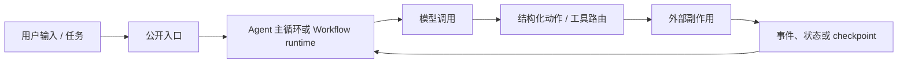

# 方法、候选池与“优秀”的定义

## 1. 研究问题

“优秀”至少包含四个互不等价的问题：

1. **影响大不大**：采用、贡献者、下游明确继承或致敬；
2. **设计是否扎实**：循环、状态、失败恢复、安全边界能否落到源码；
3. **是否适合生产**：持久化、取消、预算、审批、沙箱、遥测、部署；
4. **是否值得学习**：核心路径能否追踪，抽象是否能迁移到自己的项目。

因此不采用“stars + discussions = 总冠军”。热度只占“采用与社区”的一部分，并按本节锚点与其他静态证据共同判断。

## 2. 可审计评分框架

这里的分数是**结构化分析者证据评分**，不是 benchmark、用户成功率测量或统计估计。分析者按下面的锚点阅读冻结提交，在相邻锚点间以整数插值；每个整数分都必须在[评分账本](02-scoring-ledger.md)中有一条简明理由，并能继续追到逐项目文档中的固定 SHA 源码或一方资料。总分只做七个维度的算术相加，不附加没有重复测量支持的误差区间。

| 维度 | 权重 | 主要静态证据 | 反例约束 |
|---|---:|---|---|
| 采用与社区 | 20 | 日期级 stars/forks、contributors、近期 push/release、是否启用 Discussions | stars 最多表达使用/关注代理量；开放 issue 多不自动扣分；未采集 maintainer response，因此不评分 |
| 原创性与影响 | 20 | 论文、ADR、独特机制；下游一方 `built on/inspired by` | 依赖、兼容和媒体报道不算致敬 |
| 执行与状态 | 20 | 主循环、状态模型、checkpoint、恢复、取消、并发 | README 自称 durable 不够，必须能追到代码 |
| 安全控制面覆盖 | 15 | 结构化工具 schema、审批、sandbox、policy、secret、资源/网络隔离等公开控制 primitives | 只评价静态可见的控制面覆盖，不代表控制有效性、抗绕过能力或生产安全等级已经实测 |
| 可观测与质量 | 10 | typed events、trace、cost、eval、回放、测试 | 有日志或测试目录不等于已验证质量 |
| 可学习与迁移 | 10 | 核心路径局部性、类型、示例、概念密度 | 小代码不自动等于好设计 |
| 维护与许可 | 5 | 活跃状态、OSS 许可、迁移/弃用说明 | maintenance mode 必须显式扣分 |

### 2.1 各维度评分锚点

锚点描述“至少达到什么证据水平”。0 分表示没有可核验公开证据或存在相反证据；满分表示本研究所能从公开静态材料观察到的覆盖上限，而不是现实能力上限。

| 维度 | 低档 | 中档 | 高档 | 满分锚点 |
|---|---|---|---|---|
| 采用与社区（20） | 1–5：小众或历史停滞，社区面证据很少 | 6–10：有稳定使用与维护信号 | 11–15：较广采用、贡献广度、近期活动等证据形成组合，不要求每项齐备 | 16–20：头部采用并有多项强社区/活动信号；单项缺失不自动计 0，也不要求 Discussions 必须启用 |
| 原创性与影响（20） | 1–5：主要组合既有机制，原创性和影响证据都很少 | 6–10：有局部独特机制，或有范围有限的采用/致谢证据 | 11–17：形成多项可辨识机制，或存在明确 S/A 级采用、启发、承接证据 | 18–20：满足两条路径之一——多个相互配合的机制由官方仓库固定 SHA 源码共同支持并构成清晰体系；或有多项独立 S/A 级一方证据证明广泛继承/影响 |
| 执行与状态（20） | 1–5：简单循环，状态/失败语义不清 | 6–10：显式循环和状态，但恢复、取消或并发较弱 | 11–15：主要状态和失败路径可追，具部分恢复/并发 | 16–20：执行、持久状态、恢复、取消和并发语义大体完整 |
| 安全控制面覆盖（15） | 1–3：只有 prompt 约束或基础工具 schema | 4–7：有 schema/policy/隔离中的部分 primitives | 8–11：副作用前存在多层策略、审批或隔离控制 | 12–15：审批、策略、隔离、网络/资源边界等公开 primitives 覆盖完整；仍不证明有效性 |
| 可观测与质量（10） | 1–2：基本日志或零散测试 | 3–5：事件/测试/错误路径有一部分结构化证据 | 6–8：typed events、trace、回放、测试等覆盖多项 | 9–10：运行态观测和质量支撑面非常完整；不等于本研究已执行测试 |
| 可学习与迁移（10） | 1–2：核心路径难定位且高度产品耦合 | 3–5：可追踪但需跨多个复杂子系统 | 6–8：关键抽象清楚，有类型/示例可迁移 | 9–10：主路径短而清楚，概念能直接用于教学或复现 |
| 维护与许可（5） | 1：maintenance mode、停滞或许可边界显著受限 | 2：维护/迁移或许可存在较大不确定性 | 3：可用但活动、release 或许可有局部疑问 | 4：活跃且许可清楚，仅有轻微边界 | 5：快照日附近活跃、OSS 许可清楚、无弃用信号 |

“原创性与影响”允许沿原创性或外部影响任一路径评分，不要求同时满足；账本必须说明高分来自哪条路径。18–20 分若走原创性路径，必须有不止一项相互配合的机制，并由官方仓库固定 SHA 源码共同支持；这里的“原创性”是分析者基于源码做出的归纳，不冒充上游自称。若存在一方设计说明，可作为增强证据，但不是必备条件。若走影响路径，必须有多项独立 S/A 级一方证据。B 级 `thanks` / acknowledgement 只能证明致谢，不能单独支持 18–20 分，也不得写成核心架构继承。

“采用与社区”的 stars、forks、contributors、近期 push/release 与 `has_discussions` 是证据组合，不是每项都必须具备的检查清单。字段为 N/A 时不自动计 0 分，但必须披露缺失，也不能据此声称贡献者广度或发布质量；例如 MAF 与 Agents SDK 可以凭采用规模和近期活动进入 11–15 档，但 contributors 为 N/A 时不得用 contributors 加分或写成“贡献广”。

具体打分采用相邻锚点间的整数判断，不把分数解释成等距测量。总分仅用于宽档阅读：0–39 为证据不足，40–59 为局部覆盖，60–74 为中等覆盖，75–89 为高覆盖，90–100 为很高覆盖；档名仍只描述本框架下的静态证据。92 与 91 落在同一档，只表示两个算术结果非常接近，不支持“前者统计显著领先后者”的结论；同分档内不建立严格名次。

## 3. 候选池快照

研究记录中保存了一份日期为 2026-07-31 的 GitHub REST 字段转录：头部样本包括 AutoGPT（185.7k stars）、browser-use（107.4k）、Codex（102.9k）、OpenHands（82.7k）、MetaGPT（69.6k）、AutoGen（60.1k）、CrewAI（56.4k）、LangGraph（38.6k）、smolagents（28.6k）、OpenAI Agents SDK（28.3k）和 Microsoft Agent Framework（12.5k）。原始 API payload 与日内抓取时间没有留存，因此这些数值应视为**日期级历史记录**，而不是本包内可独立重放的原始快照。字段口径可由 [GitHub REST repository endpoint](https://docs.github.com/en/rest/repos/repos#get-a-repository) 复核；逐行转录与 provenance 见 [`data/community-snapshot-2026-07-31.csv`](data/community-snapshot-2026-07-31.csv)。

最终样本不是纯热度 Top 9，而是按**机制覆盖**抽样：

| 样本 | 保留原因 | 没用什么替代它 |
|---|---|---|
| LangGraph | reducer + BSP/superstep + checkpoint 是清晰的可恢复运行时 | 不以 DeepAgents 代替，因为要先研究底层机制 |
| Microsoft Agent Framework | AutoGen 的官方当前承接者，兼具 Agent、Workflow、middleware、OTel | 不把 maintenance-mode AutoGen 当当前首选 |
| OpenAI Agents SDK | 小公共原语与生产能力平衡 | 比只看 Swarm 更接近当前实践 |
| CrewAI | 角色/任务的高层 UX 与 Flow 低层编排并存 | 代表“易用抽象”的代价 |
| smolagents | 最短的可读 ReAct / CodeAct 主路径 | 生产能力不是保留它的主要理由 |
| Codex | 生产级编码 Agent 的审批、沙箱、工具路由与 typed protocol | stars 受产品热度影响，不据此判第一 |
| OpenHands | 完整 UI—Server—SDK—Workspace 架构，事件化会话 | 当前主仓已不是唯一执行核心，必须跨仓阅读 |
| browser-use | 垂直领域状态/动作重构的代表 | 不和通用编排框架直接比总分 |
| AutoGen | 消息总线、多 Agent topic、selector 的历史影响 | 仅作历史基线，不作绿地项目推荐 |

未展开的强候选包括 Gemini CLI、DeepAgents、Pydantic AI、Google ADK、SWE-agent、AutoGPT、MetaGPT、open_deep_research。排除通常是机制重复、当前维护状态、许可/边界不清，或篇幅下的类别代表性选择，不表示项目“不优秀”。

## 4. “被引用 / 致敬”的证据等级

| 等级 | 允许的表述 | 示例 |
|---|---|---|
| S | 实现、组件或产品明确建立在上游之上 | 下游 README 写 `built using` / `based on` |
| A | 官方明确说明受其启发或承接经验 | MAF “builds on lessons learned from AutoGen” |
| B | 致谢或局部借鉴，不能证明核心架构继承 | OpenManus 对 OpenHands/browser-use 的 acknowledgement |
| 未验证 | 模型“经常提到”、搜索摘要相似、只存在依赖 | 不计分 |

可复核的一方例子：

- [AutoGen 官方 README](https://github.com/microsoft/autogen/blob/027ecf0a379bcc1d09956d46d12d44a3ad9cee14/README.md#L177) 明确把 Microsoft Agent Framework 描述为承接其经验的后继（A）。
- [smolagents 的下游 DeepMath](https://github.com/IntelLabs/DeepMath/blob/18223a3055304249b450ee2d35cc86fc56e4e81c/README.md#L46) 明确写推理实现基于 smolagents（S）。
- [OpenManus acknowledgement](https://github.com/FoundationAgents/OpenManus/blob/52a13f2a57d8c7f6737eefb02ccf569594d44273/README.md#L175-L179) 对 browser-use 与 OpenHands 表达支持/感谢，只能算 B。

“被更多模型引用”无法从公开 GitHub 数据观察；除非模型厂商的一方材料明确引用，否则标为未验证。这比让模型自报训练记忆更严格，也更可复现。

## 5. 源码冻结协议

每篇文档都记录默认分支 SHA，并用固定提交的 GitHub 链接追踪至少两条路径：

审计时分别问：输入如何进入、下一步如何决定、副作用在哪里发生、失败后什么状态仍可信、谁有权批准危险动作、如何重放/恢复、观察者能看到什么。

## 6. 限制

- 指标是时间点快照，不能预测未来维护质量。
- 社区表只留存日期级转录，没有原始 API payload 或可验证的日内抓取时间；`has_discussions` 是仓库是否启用 Discussions 的布尔字段，不是讨论数量。
- 本研究没有采集 maintainer response time/rate，因此该项没有进入评分；不能从开放 issue 数反推维护者响应质量。
- 没有统一 benchmark 能公平覆盖 coding、browser、SDK、multi-agent workflow。
- 本研究做静态源码追踪，没有对课程中的十个仓库执行统一端到端实测；2026-07-31 的社区与评分快照只覆盖原九项目，OpenWorker 使用 2026-08-05 的独立补充证据。性能与成功率不作未经验证的排名。
- Discussion 未启用不代表无社区，讨论可能发生在 issues、Discord 或官方论坛。
