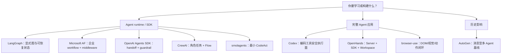

# 最终横向对比：没有总冠军，只有适配问题的设计

## 1. 样本地图



> 追加说明：OpenWorker 于 2026-08-05 完成独立源码审计，作为[桌面知识工作 Agent 的补充样本](agents/07-openworker.md)收录。它不进入本页基于 2026-07-31 统一快照的九项目评分与排序。

## 2. 证据评分

分数按[方法文档](00-methodology.md#2-可审计评分框架)的 100 分框架给出，属于结构化分析者证据评分。每个分项的理由和追溯入口见[评分账本](02-scoring-ledger.md)；总分可由七个分项直接相加。没有重复测量支持误差估计，因此不再给出“±3”之类的区间。相邻分数和同一分档不构成统计显著差异或严格排名。

### 运行时 / SDK

| 项目 | 社区 20 | 原创/影响 20 | 执行/状态 20 | 安全控制面覆盖 15 | 观察/质量 10 | 学习 10 | 维护 5 | 总分 | 最强项 |
|---|---:|---:|---:|---:|---:|---:|---:|---:|---|
| LangGraph | 17 | 18 | 20 | 10 | 9 | 8 | 5 | **87** | checkpoint、interrupt、BSP 状态运行时 |
| Microsoft Agent Framework | 14 | 16 | 19 | 13 | 10 | 7 | 5 | **84** | workflow、middleware、OTel、跨语言生产面 |
| OpenAI Agents SDK | 15 | 16 | 18 | 14 | 10 | 9 | 5 | **87** | 小原语、guardrail、handoff、RunState |
| CrewAI | 18 | 15 | 16 | 10 | 8 | 7 | 5 | **79** | 角色/任务易用性与 Flow 双层模型 |
| smolagents | 15 | 17 | 13 | 8 | 7 | 10 | 5 | **75** | 最清楚的 ReAct / CodeAct 教学路径 |
| AutoGen（历史） | 18 | 20 | 15 | 8 | 7 | 8 | 1 | **77** | topic/message runtime 与 selector 谱系 |

分数相近不代表互换或严格排序：LangGraph 的 87 是“显式可恢复编排”，Agents SDK 的 87 是“精简 Agent 原语 + 安全/可观测挂点”。MAF 的 84 与这两个 87 同属高分证据档，差异主要记录当前生态历史较短、代码表面积大，并非能力缺失或统计意义上的落后。AutoGen 的历史影响很高，但 maintenance mode 使它不该作为绿地项目默认选择。

### 完整 Agent 应用

| 项目 | 社区 20 | 原创/影响 20 | 执行/状态 20 | 安全控制面覆盖 15 | 观察/质量 10 | 学习 10 | 维护 5 | 总分 | 最强项 |
|---|---:|---:|---:|---:|---:|---:|---:|---:|---|
| Codex | 20 | 17 | 19 | 15 | 9 | 7 | 5 | **92** | 工具路由、审批、sandbox、typed lifecycle |
| OpenHands | 18 | 19 | 19 | 14 | 9 | 7 | 5 | **91** | UI—Agent Server—SDK—Workspace 完整系统 |
| browser-use | 20 | 19 | 17 | 11 | 8 | 8 | 5 | **88** | 浏览器专用状态表示与动作恢复闭环 |

这里的高分说明它们都是完整产品工程样本，不表示可直接替代 SDK，也不支持把 92、91、88 排成具有统计意义的名次。Codex 的高 stars 和开放 issue 同时受产品用户规模影响；其 15/15 只表示公开源码中审批、沙箱、策略、网络与工具执行等控制 primitives 在本框架下覆盖完整，不表示这些控制已通过有效性或抗绕过实测，更不表示系统达到生产 L4。

## 3. 用同一段控制流看九种实现

通用 Agent 可以抽象成下面六步，但各项目真正的设计差异在每一步由谁负责：

```python
while not terminal:
    observation = observe(state, environment)
    intent = model.decide(observation, available_actions)
    decision = authorize(intent, policy, human)
    result = execute(decision, isolation, cancellation)
    state = record_and_reduce(state, intent, result)
    terminal = choose_next(state, budgets, errors)
```

| 项目          | `observe`                        | `authorize`                   | `record_and_reduce`                  | `choose_next`                  |
| ----------- | -------------------------------- | ----------------------------- | ------------------------------------ | ------------------------------ |
| LangGraph   | channel state snapshot           | 集成方 / interrupt               | reducer + superstep checkpoint       | graph edges / Command          |
| MAF         | AgentContext / workflow messages | approval middleware + session | executor state + WorkflowCheckpoint  | workflow edges/middleware      |
| Agents SDK  | generated/session items          | tool guardrail + approval     | serializable RunState                | Runner 的 NextStep 类型           |
| CrewAI      | task context/messages            | tool/agent 层策略                | Crew output 或 Flow state             | process / listener / router    |
| smolagents  | AgentMemory                      | 工具 schema；代码隔离由 executor      | ActionStep + observations            | final check / max steps        |
| Codex       | history + world/step context     | centralized approval policy   | typed ResponseItem + session history | turn loop / model final        |
| OpenHands   | event-derived conversation view  | analyzer + confirmation       | append event，再重建 view                | status/budget/stuck/hooks      |
| browser-use | DOM/selector/screenshot summary  | domain/action/browser policy  | AgentHistory + browser state         | done/failure/loop budgets      |
| AutoGen     | message/thread context           | 应用或 handler                   | Agent state + message events         | subscriptions/manager/selector |

这张表也解释了为什么“都支持工具调用”没有比较价值：真正决定生产可靠性的，是授权发生在模型前还是副作用前、失败是否进入可恢复状态、以及恢复后会不会重新执行已经成功的动作。

## 4. 共同机制矩阵

| 能力 | LangGraph | MAF | Agents SDK | CrewAI | smolagents | Codex | OpenHands | browser-use | AutoGen |
|---|---|---|---|---|---|---|---|---|---|
| 核心调度 | BSP 图 | 图 Workflow / Agent | Runner loop | Task/Crew + Flow | ReAct/CodeAct | turn sampling loop | event-sourced conversation | browser step loop | message/topic runtime |
| 持久恢复 | 强：checkpoint/thread | 强：checkpoint/store | 强：serializable RunState | 中强：Flow persistence | 弱 | 强：session/history/compaction | 强：event log/server persistence | 中：history/state | 中：save/load state |
| HITL | interrupt/Command | approval middleware/workflow | approval + resume | Flow HITL | 非一等能力 | approval policy | security analyzer + confirm | pause/stop hooks | 可由消息模式组合 |
| 并发 | superstep tasks | workflow executors | tool/agent runner | crew/flow modes | 并行 tool calls | async tools/multi-agent | resource-lock parallel tools | 多动作受浏览器约束 | async message dispatch |
| 安全边界 | 交给集成方较多 | middleware + session policy | tool guardrail/sandbox hooks | 主要由工具/集成方承担 | local executor 非 sandbox | 最强：approval + sandbox + network policy | workspace + analyzer + confirmation | domain/action/browser policy | 主要由应用承担 |
| 可观测 | state/checkpoint/stream | OpenTelemetry | tracing/session/items | events/tracing integration | monitor/callback | typed protocol/events | event log/metrics/hooks | history/cost/step telemetry | message/event runtime |
| 学习门槛 | 中高 | 高 | 中低 | 中 | 低 | 很高 | 很高 | 中高 | 中高 |

### “支持恢复”实际恢复了什么

| 项目 | 持久/恢复单元 | 恢复后会不会重新做工作 | 最重要的边界 |
|---|---|---|---|
| LangGraph | channel versions、pending writes、task/checkpoint | interrupt 从节点开头重跑；成功 task 的 writes 可回填 | interrupt 前副作用必须幂等；图/schema 要兼容 |
| MAF | committed shared state、executor state、messages、pending requests | 从下一 superstep 或 HITL response 继续 | graph signature 必须一致；pending state 不进 checkpoint |
| Agents SDK | model responses、generated/session items、processed response、approval、sandbox/trace state | interrupted turn 不重新调用模型；只解析未决工具/审批 | `RunState` schema、Agent identity 和 tool identity 要稳定 |
| CrewAI | Crew checkpoint、Flow checkpoint、`@persist` 业务 state | 取决于使用哪一层；Flow 还区分继续与 fork | 三种状态系统不能混成一个 resume 语义 |
| smolagents | 进程内 AgentMemory / executor state | 没有一等跨进程 durable resume | fallback final 不是恢复；本地代码 state 也不是 checkpoint |
| Codex | typed conversation history、turn/mailbox state、tool call/output items | tool call 先记账；取消后可看到未完成意图 | 产品级 session 语义复杂，外部 tool 仍需幂等 |
| OpenHands | event log、conversation view、unmatched actions、Server persistence | 待确认 action 直接执行，不重新采样 | event/action/observation 配对必须完整 |
| browser-use | AgentHistory、browser/session state 与运行状态 | 主要是运行内重试/重观察，不应推断 exactly-once 跨进程恢复 | DOM/selector 随页面变化失效 |
| AutoGen | 已实例化 Agent 的 `save_state()` | 可恢复 Agent 自身数据 | 该版本不保存 subscription state 和在途 queue envelopes |

这个差异是本研究最重要的源码结论之一：恢复能力不能用一个布尔列表示。必须明确 checkpoint 里有什么、什么没保存，以及恢复入口是否重新触发模型或外部副作用。

## 5. 最值得迁移的设计

### 5.1 把“决定”和“副作用”分离

Codex 的模型输出先变成 typed tool call，再经过 router、approval、sandbox 和执行；OpenHands 也在 action 与 observation 之间插入安全分析和资源锁。可迁移原则是：**模型没有直接执行权，它只有提出结构化意图的权力**。

### 5.2 状态必须有合并语义，而不只是一个可变字典

LangGraph 的 reducer 与 superstep 明确回答“并行节点写同一状态时怎么合并”；OpenHands 的事件日志回答“执行后如何重建当前视图”；Agents SDK 的 RunState 回答“审批暂停后如何序列化并继续”。这是三种可组合的状态设计。

### 5.3 垂直 Agent 要重新设计 observation 和 action

browser-use 的价值不是给通用 Agent 加一个 Playwright tool，而是把 DOM、selector map、截图、页面特定 action 和失败恢复组织成闭环。通用工具列表无法自动产生这个领域模型。

### 5.4 多 Agent 首先是上下文和所有权问题

AutoGen 的 topic、MAF 的 workflow executor、Agents SDK 的 handoff、CrewAI 的 manager 都能“让多个 Agent 说话”。真正差异在于：谁拥有下一步、状态放哪、失败由谁恢复、handoff 后旧 Agent 是否仍有权行动。多角色 prompt 不是多 Agent 架构。

## 6. 主要反模式

- **用 star 替代工程审计**：产品仓与库的 star 来源不同。
- **让模型自由生成 shell 字符串后直接执行**：必须有 schema、policy、approval 与隔离。
- **只有 transcript，没有可恢复状态**：审批、重启、重放都会变得脆弱。
- **把 memory 当成无限聊天记录**：长程 Agent 需要 compaction/condensation、预算和可验证的外部状态。
- **把多 Agent 当角色扮演**：没有调度、终止、状态所有权和错误传播，就只是多个 prompt。
- **把本地代码解释器叫 sandbox**：smolagents 源码明确警告 LocalPythonExecutor 不是安全沙箱。

## 7. 选择建议

| 目标 | 首选 | 次选 | 原因 |
|---|---|---|---|
| 学懂最小 Agent loop | smolagents | Agents SDK | 主循环局部、动作与 observation 清楚 |
| 构建需暂停/恢复的业务流程 | LangGraph | MAF | checkpoint、graph、interrupt 是一等概念 |
| 企业多 Agent 与遥测 | MAF | Agents SDK | middleware、OTel、workflow、hosting 面更完整 |
| Python 中快速做可靠 Agent | Agents SDK | CrewAI | 公共原语少，guardrail/session/trace 已成体系 |
| 角色/任务驱动团队原型 | CrewAI | AutoGen（仅维护旧系统） | 高层抽象上手快 |
| 构建编码 Agent | OpenHands SDK | 参考 Codex | OpenHands 更易复用；Codex 更适合研究完整安全执行面 |
| 构建浏览器 Agent | browser-use | 通用 SDK + 自建领域层 | 状态/动作/恢复已经领域化 |

## 8. 课程学习顺序

本页是机制比较附录，正式课程顺序以[学习路线与章节目录](agents/00-learning-guide.md)为准：

1. **Agent 基础**：smolagents → OpenAI Agents SDK；
2. **状态与领域闭环**：LangGraph → browser-use；
3. **安全与产品运行时**：Codex → OpenHands → OpenWorker；
4. **核心综合实践**：实现一个具有 typed tools、领域 observation、审批、持久恢复和副作用身份的最小 runtime；
5. **多 Agent 与企业编排**：CrewAI → Microsoft Agent Framework → AutoGen。

学习目标不是记住十个项目的 API，而是能独立回答：**下一步由谁决定、状态如何合并、失败如何恢复、副作用如何获权、运行如何被观察。**

## 9. 与闭源 / 部分开源前沿方案的连接

Anthropic、OpenAI 与 Kimi 的公开方案没有改变前面的五个问题，但把三个扩展方向推得更远：

| 前沿路线 | 核心扩展 | 可从本研究哪些开源项目开始复现 |
|---|---|---|
| Anthropic | subagent 上下文隔离、压缩回传、planner-generator-evaluator、分层 containment | LangGraph 的并行子图与 checkpoint；OpenHands 的事件与 evaluator；Codex 的沙箱 |
| OpenAI | ChatGPT agent 统一浏览器/终端/连接器；Codex 用共享 harness 服务 CLI、IDE、App、Web | Codex 的 thread/approval/sandbox；Agents SDK 的 run state、handoff 与 guardrail |
| Kimi | PARL 训练 Commander 动态拆分和并行；用 critical path 衡量加速 | MAF / LangGraph 动态 fan-out；AutoGen selector；再自行加入并行收益评估 |

详细架构图、等价伪代码、证据等级、第三方反证和未知边界见[主流闭源 / 部分开源 Agent 专题](11-proprietary-agent-landscape.md)。

论文、system card 与近期工程文章的分层阅读清单见[权威论文与近期文章导读](12-authoritative-literature-guide.md)；将源码、厂商方案和文献统一后的最终设计判断见[AI Agent 设计、源码与文献综合总结](13-integrated-synthesis.md)。
