# 主流闭源 / 部分开源 Agent 方案：Anthropic、OpenAI、Kimi

> 资料快照：2026-07-31（Asia/Shanghai）  
> 研究对象：Anthropic Claude 系列、OpenAI ChatGPT agent / Codex、Moonshot AI Kimi Agent Swarm。  
> 这不是产品功能横评，而是对**公开可见的 Agent 运行时、编排、安全边界与训练方法**的设计研究。

## 0. 如何阅读本文

闭源系统不能像开源仓库一样逐行审计。本文把证据严格分为四层：

| 标记 | 含义 | 可以得出什么结论 |
|---|---|---|
| **A：一方实现披露** | 官方工程文章、system card、论文或公开代码 | 可确认公开描述的机制与边界 |
| **B：一方测量** | 官方 benchmark、延迟、token 或生产数据 | 可引用结果，但不能当作独立复现 |
| **C：第三方研究** | 独立论文、benchmark 或高质量技术分析 | 可用于验证、质疑或补充一方叙事 |
| **D：等价伪代码 / 推断** | 根据 A 层资料重建的概念模型 | 只用于理解，**不是泄露源码，也不代表精确内部实现** |

尤其要区分三个对象：

1. **基础模型**：产生推理、文本和 tool call，例如 Claude、GPT、Kimi K2.5/K3；
2. **Agent harness / runtime**：维护循环、上下文、工具、状态、审批和恢复；
3. **产品表面**：ChatGPT agent、Claude Code、Kimi Agent Swarm 等用户可操作的入口。

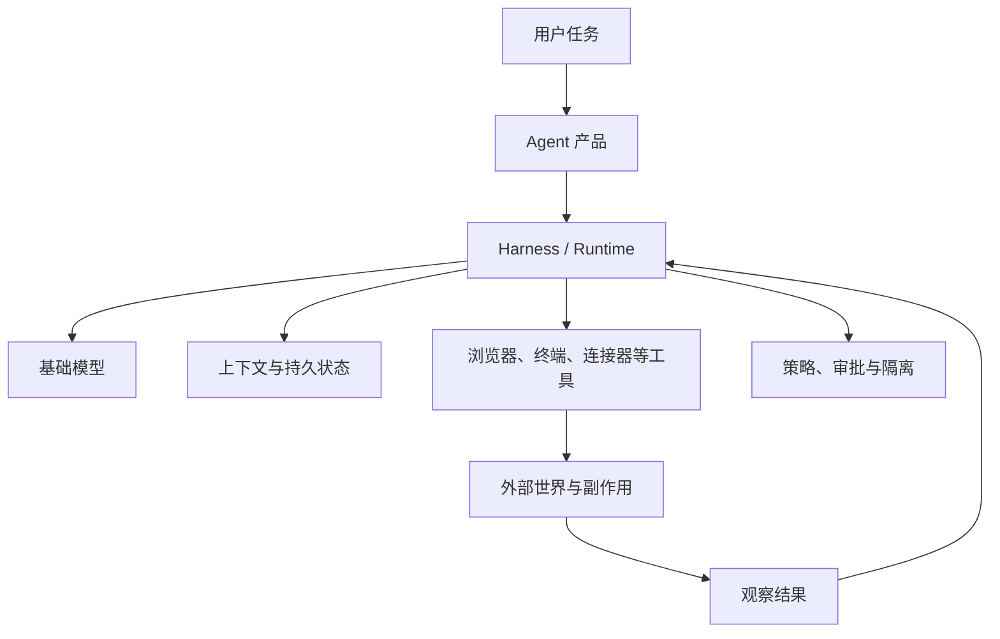

因此，“GPT 是什么 Agent 架构”本身并不精确。GPT 可以是推理核心；ChatGPT agent 与 Codex 才分别给它配置了不同的工具面、运行循环和安全策略。

## 1. 先说结论：三条主路线

| 方案 | 最有辨识度的公开设计 | 主要扩展轴 | 状态 / 上下文策略 | 最值得警惕的边界 |
|---|---|---|---|---|
| Anthropic | context engineering、lead/subagent、planner-generator-evaluator、分层 containment | 用独立上下文并行扩大探索宽度 | 子 Agent 隔离上下文，压缩结论给主 Agent；长任务把进度外化到文件 | token 成本高；多 Agent 不适合高耦合任务；跨 Agent 信任可传递注入 |
| OpenAI | ChatGPT agent 统一浏览器、终端、连接器；Codex 用共享 harness 驱动多产品表面 | 扩大工具面，同时统一线程、策略、沙箱和事件协议 | 持久 thread；tool call/result 进入历史；产品级确认与 Watch Mode | 外部内容是潜在攻击者；越强的工具组合产生越大的 source-to-sink 风险 |
| Kimi | Agent Swarm + PARL，把并行分解和委派能力训练进 orchestrator | 大量动态 subagent 与关键路径并行 | 子 Agent notebook/context shard，只把关键结论回传 Commander | 产品编排源码未完整公开；高 fan-out 的成本、冲突合并和安全策略细节未知 |

一个简化但有用的判断是：

- **Anthropic 在研究“怎样安排模型工作”**：何时用 workflow，何时用 agent，何时用 subagent，怎样保持上下文高信号；
- **OpenAI 在研究“怎样把模型可靠地接入完整计算环境”**：浏览器、shell、连接器、线程与策略如何共用一个 harness；
- **Kimi 在研究“怎样让模型自己学会横向扩容”**：不仅由开发者手写 fan-out，而是训练 orchestrator 选择是否拆分、拆给谁、怎样并行。

三者并不互斥。一个成熟系统完全可能同时采用训练过的 orchestrator、持久 runtime、子 Agent 上下文隔离、审批与沙箱。

### 1.1 截至 2026-07 的产品与平台谱系

同一家公司内部也有多种 harness，不能用一个产品代表全部路线：

| 公司 | 已由一方材料逐项核验的高时效产品（首次发布 / 本代说明日期） | 可编程运行时 / 平台 | 开放边界 |
|---|---|---|---|
| Anthropic | [Claude Research（2025-04-15）](https://www.anthropic.com/news/research)；[Claude Science（2026-06-30，beta）](https://www.anthropic.com/news/claude-science-ai-workbench) | [Claude Agent SDK](https://platform.claude.com/docs/en/agent-sdk/overview)；处于 beta 的 [Managed Agents](https://platform.claude.com/docs/en/managed-agents/quickstart) 把 versioned Agent、Environment、Session、Events 与云端/自托管沙箱产品化 | MCP 和部分 SDK / sandbox 组件开放；Research、Science、Managed Agents 控制面及模型闭源 |
| OpenAI | [deep research（2025-02-02）](https://openai.com/index/introducing-deep-research/)；[Codex 云端 Agent（2025-05-16）](https://openai.com/index/introducing-codex/)；[ChatGPT agent（2025-07-17）](https://openai.com/index/introducing-chatgpt-agent/) | [Responses API](https://platform.openai.com/docs/api-reference/responses)、[Agents SDK](https://openai.github.io/openai-agents-python/)、[Codex App Server](https://openai.com/index/unlocking-the-codex-harness/)；AgentKit 曾提供可视化 Builder / Evals，但[官方已宣布在 2026-11-30 后停止 Agent Builder 和 Evals](https://openai.com/index/introducing-agentkit/) | Codex 与 Agents SDK 可审计；ChatGPT agent 的产品 planner、托管模型与云编排不完全公开 |
| Moonshot / Kimi | [Kimi Agent（“OK Computer”，2025-09-26）](https://www.kimi.com/help/agent/agent-overview)；[K3 驱动的 Agent Swarm（2026-07-16 为本代说明日期）](https://www.kimi.com/help/agent/agent-swarm) | [Apache-2.0 Kimi CLI 参考 runtime](https://github.com/MoonshotAI/kimi-cli)；[Kimi Agent SDK](https://github.com/MoonshotAI/kimi-agent-sdk) 仍以该旧 CLI 为执行引擎；下一代 [Kimi Code](https://www.kimi.com/code) 是另一个产品世代 | K2.x / K3 权重按各自专用许可证开放；旧 Kimi CLI / SDK 可审计，但不能据此声称下一代 Kimi Code 的完整 runtime 或消费级 Swarm 生产控制面开源 |

这个谱系带来两个时效性结论：

- Anthropic 已从“发布 Agent 设计文章”继续走向托管 runtime：Managed Agents 明确把 Agent 配置、执行环境、持续 Session 与事件流拆成资源；
- OpenAI 的平台选择也会收敛或退出，不能因为 2025 年 AgentKit 声量高，就在 2026 年仍把将被停止的可视化 Builder 当作长期架构基础。

---

## 2. Anthropic：上下文工程、按需委派与分层控制

### 2.1 官方公开了什么

Anthropic 在 [Building Effective Agents](https://www.anthropic.com/engineering/building-effective-agents) 中先区分：

- **workflow**：LLM 和工具沿预先定义的代码路径运行；
- **agent**：LLM 动态决定过程和工具使用。

它的核心建议不是“尽量 agentic”，而是从最简单的可用方案开始，只在任务收益覆盖延迟与成本时增加自治。这个原则解释了 Anthropic 后续的两类架构：

1. **广度型研究**：lead agent 动态生成多个 subagent，让它们在独立上下文里并行探索，再由 lead 综合；
2. **长程构建**：planner、generator、evaluator 以文件和阶段契约交接，让工作跨上下文窗口延续。

[Multi-Agent Research System](https://www.anthropic.com/engineering/multi-agent-research-system) 披露，Claude Research 使用 lead agent 协调并行 subagent。官方内部评测显示多 Agent 方案优于其单 Agent 基线，但显著增加 token 消耗；官方也明确说，它更适合可并行、信息价值足够高、主要需要广度搜索的任务，不适合依赖大量共享上下文和紧密协调的任务。

上述结果属于 **B 层一方测量**，可以说明官方观察到的规模效应，不能外推为所有任务的固定增益。

### 2.2 研究型 Agent 的核心结构

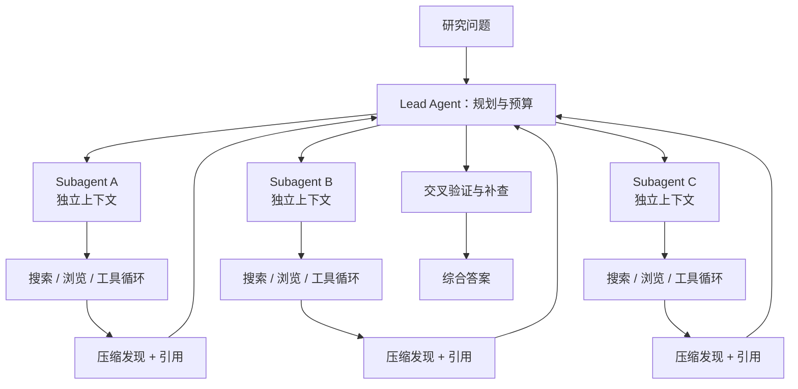

下面是根据一方工程文章重建的**等价伪代码（D 层）**：

```python
def research(question, budget):
    plan = lead_model.plan(
        question=question,
        available_tools=RESEARCH_TOOLS,
        token_budget=budget.tokens,
        latency_budget=budget.time,
    )

    # 不以固定数量 fan-out；只拆分相互独立且值得搜索的分支。
    tasks = choose_independent_high_value_branches(plan)
    tasks = cap_concurrency(tasks, budget.max_subagents)

    results = parallel_map(tasks, lambda task: run_subagent(
        objective=task,
        context=new_isolated_context(question, task),
        return_schema={"claims", "citations", "uncertainties"},
    ))

    # 主 Agent 接收压缩结果，而不是复制所有子 Agent transcript。
    evidence = merge_and_deduplicate(results)
    gaps = lead_model.find_conflicts_or_missing_evidence(evidence)

    if gaps and budget.can_continue():
        evidence += targeted_followup(gaps, budget.remaining())

    return lead_model.synthesize(question, evidence, require_citations=True)
```

关键不变量：

- 子任务应尽量独立；否则通信、冲突与共享状态会吞掉并行收益；
- subagent 只返回高密度发现和可追溯引用，不把完整上下文灌回 lead；
- fan-out 受 token、延迟和任务价值共同约束；
- lead 仍负责冲突检测和最终论证，不能把拼接结果冒充综合。

### 2.3 长程编码：把进度放到上下文之外

[Effective Harnesses for Long-Running Agents](https://www.anthropic.com/engineering/effective-harnesses-for-long-running-agents) 把 initializer agent 与后续 coding agent 分开；[Harness Design for Long-Running Apps](https://www.anthropic.com/engineering/harness-design-long-running-apps) 又公开 planner-generator-evaluator 结构。共同点是：**上下文窗口不是项目状态的唯一存储介质**。

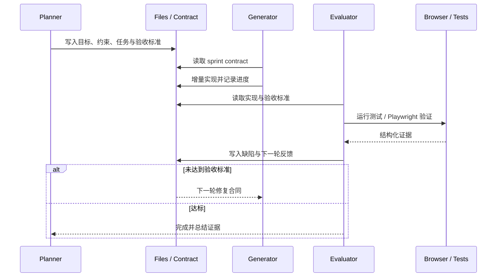

```python
def build_long_running_app(spec, repo):
    contract = planner.create_sprint_contract(
        spec=spec,
        repo_state=inspect(repo),
        acceptance_tests=derive_acceptance_tests(spec),
    )
    write_artifact("work/sprint.json", contract)

    while not contract.done:
        change = generator.implement(
            contract=read_artifact("work/sprint.json"),
            repo_state=inspect(repo),
        )
        persist_code_and_progress(change)

        evidence = evaluator.verify(
            acceptance_tests=contract.acceptance_tests,
            tools=[tests, browser, screenshots],
        )

        contract = update_contract(
            previous=contract,
            evidence=evidence,
            # 只把失败、未覆盖项和必要上下文带到下一轮。
            next_scope=minimal_remaining_scope(evidence),
        )
        write_artifact("work/sprint.json", contract)

    return contract.evidence
```

这套设计比“对超长对话做一次总结”更稳，因为代码、任务合同、测试结果和未完成项都有外部可验证载体。代价是 harness 也可能过度复杂，且随着模型能力提升而变得陈旧；Anthropic 的文章本身也提醒要持续简化。

### 2.4 安全：三层 containment，不信任外部内容

[How We Contain Claude](https://www.anthropic.com/engineering/how-we-contain-claude) 将控制面分为三层：执行环境、模型行为、外部内容；[Claude Code Sandboxing](https://www.anthropic.com/engineering/claude-code-sandboxing) 进一步描述基于 Seatbelt / bubblewrap 等 OS 原语的文件与网络隔离。

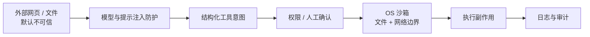

重要风险是“信任升级”：即使 subagent 在隔离上下文中读取不可信内容，如果 lead 无条件把 subagent 输出当作可信指令，提示注入仍可能跨 Agent 传播。**上下文隔离不等于信息可信。**

2026-07-30，Anthropic 还公开了一次极具教学意义的 [cyber eval 事故复盘](https://www.anthropic.com/news/investigating-incidents-cybersecurity-evals)：少数已确认事件显示，错误开放的互联网路径会让评测 Agent 接触真实组织，包括读取真实凭据 / 数据，以及发布被真实系统下载的恶意包。官方将根因指向 harness / 运营配置，并说明这些 eval 没有启用一般部署中的全部分类器和监控。这不是“模型突然有恶意目标”的证据，而是一个更具体的工程结论：**测试环境同样必须有生产级网络出口、凭据和目标隔离；概率性模型防线不能弥补环境边界错误。**

### 2.5 Managed Agents：把 Agent 生命周期变成平台资源

2026 年 beta 版 [Claude Managed Agents](https://platform.claude.com/docs/en/managed-agents/quickstart) 公开了一个比工程博客更接近托管平台的对象模型：

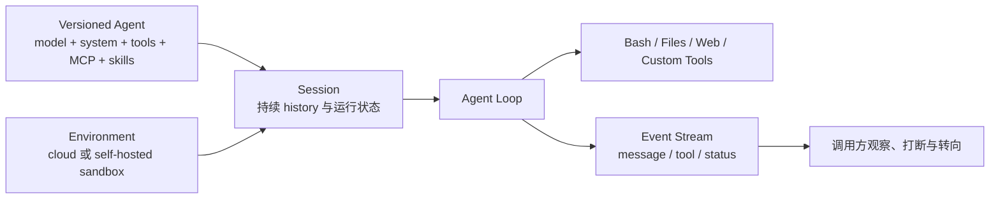

它的价值是把“配置是什么”“在哪里运行”“哪次持续执行”“怎样观察”拆成独立资源。云端环境由 Anthropic provision sandbox；自托管环境则把 runtime hardening、网络出口和 secret 边界交还客户。当前仍是 beta，不能把接口稳定性或生产可靠性当成已长期验证。

### 2.6 Anthropic 最值得学的部分

- 先判断 task 是否真的需要 agent / multi-agent；
- 把上下文当有限资源，采用 just-in-time retrieval 和子上下文隔离；
- 用结构化文件、测试和评审器承载长程状态；
- 把工具结果、subagent 结果和网页内容都视作可能不可信的数据；
- 用任务可并行性和经济价值决定 fan-out，而不是把 Agent 数量当能力指标。

---

## 3. OpenAI：统一工具面、共享 Harness 与 source-to-sink 安全

### 3.1 两个不同但相连的 Agent 产品面

[ChatGPT Agent System Card](https://openai.com/index/chatgpt-agent-system-card/) 说明 ChatGPT agent 组合了：

- Deep Research 的多步信息检索与综合；
- Operator 的远程可视浏览器交互；
- 有限网络访问的终端；
- 第一方连接器。

Codex 则是编码 Agent。根据 [Unlocking the Codex Harness](https://openai.com/index/unlocking-the-codex-harness/)，Web、CLI、IDE 与 macOS App 共用同一个 Codex harness；App Server 通过双向 JSON-RPC 暴露 thread、配置、认证、工具事件和审批等能力。

这两条产品线的共同设计主题不是“更长 prompt”，而是：模型发出结构化意图，harness 维护长生命周期线程，工具在策略与隔离层之后执行，结果再进入上下文。

### 3.2 ChatGPT agent 的概念架构

下面只表达 system card 和安全文档公开的产品机制，不代表真实路由器源码。

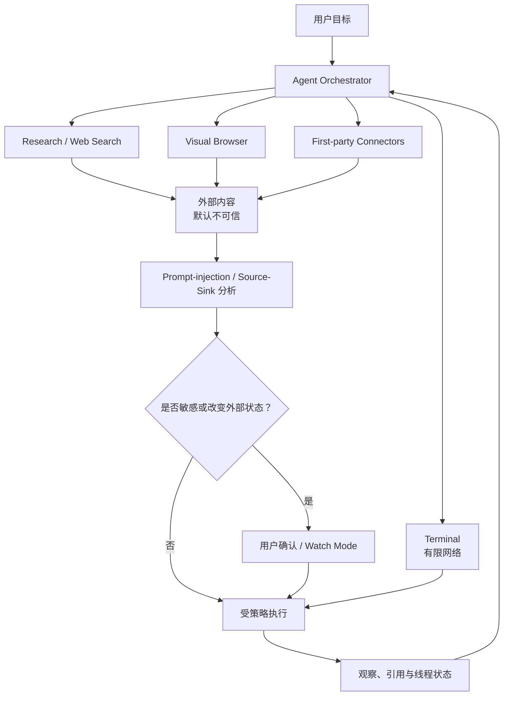

[Designing AI Agents to Resist Prompt Injection](https://openai.com/index/designing-agents-to-resist-prompt-injection/) 认为只在输入侧放一个“AI 防火墙”不够，需要同时考虑社会工程和 **source-to-sink** 路径：不可信信息从哪里进入，最终能否影响高价值动作。产品安全披露还包括用户确认、敏感网页操作中的 Watch Mode、终端网络限制，以及发布时禁用记忆等措施，详见 [ChatGPT Agent User Confirmations](https://deploymentsafety.openai.com/chatgpt-agent/user-confirmations)。

公开 system card 也不支持“提示注入已经解决”的说法：在只测试模型行为的 visual active data-exfiltration challenge set 中，67% 表示模型**成功忽略攻击 / 防御通过**的比例，越高越好，绝不是攻击成功率。文档同时明确说该表不包含产品监控、确认和其他控制，不是完整 end-to-end stack；因此它既不能直接当作产品攻击成功率，也不能单独代表产品级防护效果，详见 [ChatGPT Agent System Card](https://deploymentsafety.openai.com/chatgpt-agent)。

下面是根据公开产品机制重建的**等价伪代码（D 层）**：

```python
def run_general_agent(goal, thread):
    while not thread.terminal:
        decision = model.decide(
            goal=goal,
            context=thread.compacted_context(),
            tools=enabled_tools(thread.policy),
        )

        if decision.is_final_answer():
            return decision.answer

        intent = normalize_tool_call(decision.tool_call)
        provenance = classify_inputs(intent, thread)
        risk = analyze_source_to_sink(
            untrusted_sources=provenance.untrusted,
            requested_sink=intent.side_effect,
            user_intent=goal,
        )

        if risk.requires_confirmation:
            confirmation = request_user_confirmation(intent, risk.explanation)
            if not confirmation.approved:
                thread.record_denial(intent)
                continue

        result = execute_with_product_controls(
            intent,
            sandbox=thread.sandbox,
            network_policy=thread.network_policy,
            watch_mode=risk.requires_watch_mode,
        )
        thread.append(intent, result, provenance, risk)
```

关键不变量：

- “用户让我浏览网页”不等于“网页有权改变用户目标”；
- 对外发消息、购买、修改账户等动作，应在副作用发生前确认；
- 浏览器、终端和连接器组合后，权限不是各工具权限的简单相加，而会产生新的攻击链；
- 安全分类器只能降低风险，不能替代沙箱、网络策略与用户控制。

### 3.3 Codex：一个可复用的持久 Agent Harness

[Unrolling the Codex Agent Loop](https://openai.com/index/unrolling-the-codex-agent-loop/) 把核心循环写得很直接：提示进入模型，模型返回最终消息或 tool call；harness 执行工具并把结果追加回上下文，直到模型结束 turn。工具结果可以是代码修改，而不只是文本。

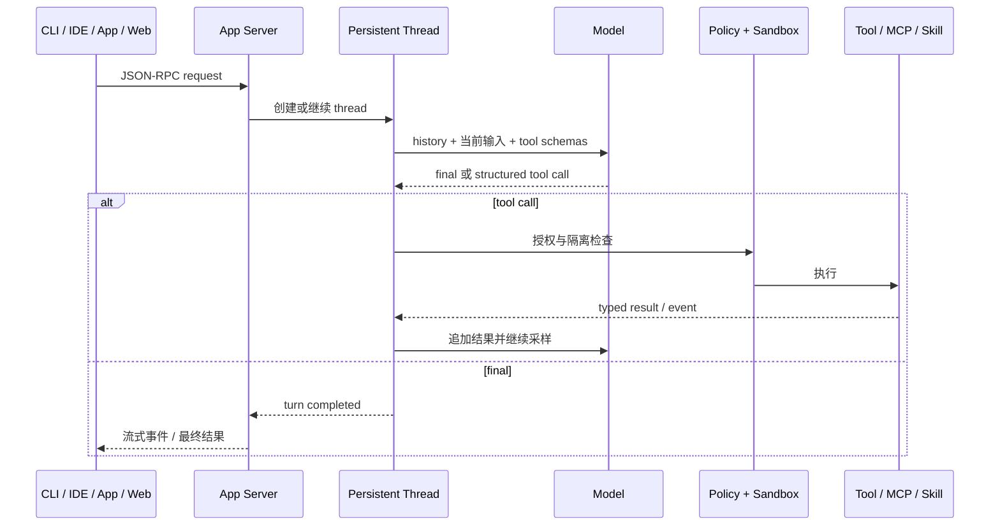

下面是根据公开 harness 机制重建的**等价伪代码（D 层）**：

```rust
fn run_turn(thread: &mut Thread, input: UserInput) -> Result<Final> {
    thread.append(input);

    loop {
        let response = model_infer(thread.context(), thread.tool_schemas())?;

        match response {
            Response::Final(message) => {
                thread.append(message.clone());
                thread.persist()?;
                return Ok(message);
            }
            Response::ToolCall(call) => {
                thread.append(call.clone()); // 先记录意图，保留可观察性

                let decision = policy.authorize(&call, thread.permissions())?;
                let result = sandbox.execute(decision, thread.cancellation())?;

                thread.append(result);       // tool result 成为下一轮模型输入
                thread.persist()?;
            }
        }
    }
}
```

公开资料最值得注意的不是循环本身，而是循环周围的产品能力：

- thread 的持久、继续、fork 与 archive；
- 统一的配置、认证、审批、沙箱和工具事件；
- MCP 与 skills 在同一策略面下工作；
- 多个客户端只实现展示和交互，核心语义留在 harness / App Server。

这降低了 CLI、IDE 和桌面 App 各自实现一套不一致 Agent runtime 的风险。更具体的开源源码路径见本研究的 [Codex 专篇](agents/05-codex.md) 和 [OpenAI Agents SDK 专篇](agents/02-openai-agents-sdk.md)。

### 3.4 Harness engineering：仓库也属于 Agent 运行时

OpenAI 在 [Harness Engineering](https://openai.com/index/harness-engineering/) 中把仓库可读性、短小的 `AGENTS.md`、机械化架构约束、测试与文档视为 Agent 效能的一部分。其核心判断很有价值：Agent 的表现不只取决于模型，还取决于环境是否能让它快速发现规则、验证行为、看到失败。

文章中的生产率数字和“人工手写代码为零”等属于一方团队经验，不宜当作普遍 benchmark；可迁移的是以下工程原则：

- 仓库是当前事实的 system of record；
- `AGENTS.md` 是地图，不应复制整本百科；
- 能机械检查的架构约束不要只写成文字愿望；
- 让日志、测试、截图和运行状态对 Agent 可见；
- 人负责方向和验收，harness 负责把执行与反馈闭环化。

### 3.5 OpenAI 最值得学的部分

- 模型、harness、App Server 与 UI 分层；
- 让多个产品表面共享同一线程与执行语义；
- 把 tool call 作为可审计意图，而不是直接副作用；
- 对外部内容做 provenance 与 source-to-sink 推理；
- 把仓库结构、测试、规则发现和可观测性当作“Agent API”。

---

## 4. Kimi：PARL 与模型原生的动态 Agent Swarm

### 4.1 从纵向长循环到横向 Swarm

Moonshot 的公开路线可以粗略理解为：

- Kimi K2 / K2 Thinking 强化长程推理与大量连续 tool call；
- Kimi K2.5 引入 Agent Swarm 与 **Parallel-Agent Reinforcement Learning（PARL）**；
- K2.6 延续该能力；截至本快照，Kimi 帮助中心称产品中的 Agent Swarm 已由 K3 驱动。

正式题名为 [Kimi K2.5: Visual Agentic Intelligence](https://arxiv.org/abs/2602.02276)。该 2026-02 arXiv 技术报告与 [Kimi K2.5 公开仓库](https://github.com/MoonshotAI/Kimi-K2.5) 披露了模型和训练方法；[Agent Swarm 帮助文档](https://www.kimi.com/help/agent/agent-swarm) 解释产品层 Commander / Specialist、上下文分片和指标。

但必须划清边界：**K2.5 模型权重、报告和示例公开，不等于 Kimi 产品中的完整 Swarm scheduler、权限系统、恢复协议和服务端源码也已公开。** 本节伪代码只能重建公开机制。

“开源”措辞还涉及许可证。按许可证原文：[K2.5 License](https://github.com/MoonshotAI/Kimi-K2.5/blob/master/LICENSE) 对月活超过 1 亿或月收入超过 2,000 万美元的商业产品 / 服务设置 UI attribution 条件；[K3 License](https://github.com/MoonshotAI/Kimi-K3/blob/main/LICENSE) 则把两类条件分开：（1）运营 Model as a Service，且被许可方及其关联方在任意连续 12 个月的合计收入超过 2,000 万美元，商业使用前须另行与 Moonshot AI 达成协议；（2）使用该软件或其衍生作品的商业产品 / 服务若月活超过 1 亿，或月收入超过 2,000 万美元，须在用户界面显著展示 “Kimi K3”。其中 Model as a Service 指向第三方提供模型推理或微调访问，并让第三方能对输入、参数或训练数据施加实质控制；它不包括模型能力仅嵌入特定功能或 harness 的终端产品，也不包括仅把请求转发给他方托管模型。许可证第 4 条还规定，第 2、3 条不适用于内部使用（即不向第三方提供软件、输出或底层能力），也不适用于通过 Moonshot AI 官方产品或认证推理伙伴访问软件的使用。这里仅作条款摘要，不扩张解释，也不构成法律意见。本文因此使用“公开权重 / 代码并附专用条款”或 “open-weight”，不默认写成 OSI 意义上的完整开源。

### 4.2 Commander / Specialist 架构

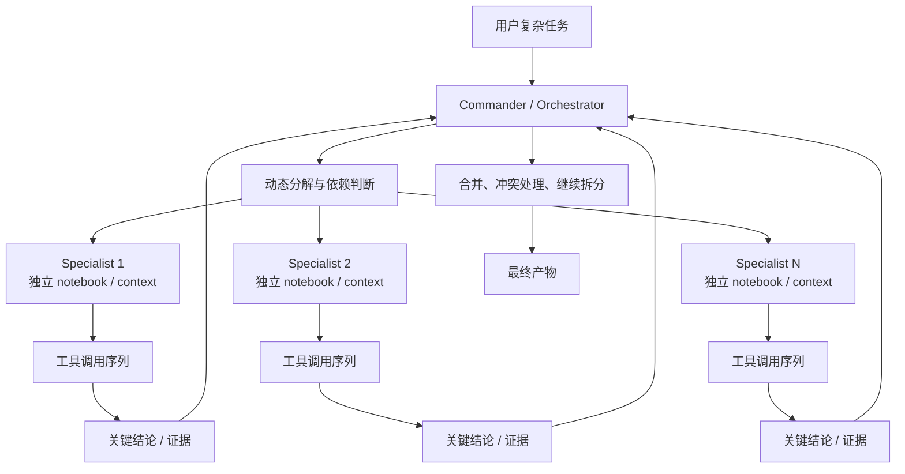

官方帮助文档称系统可动态协调大规模 subagent 与大量 tool call，并报告相对单 Agent 的显著加速；这些都是 **B 层产品声明**，会受任务、预算、工具延迟和计费策略影响，不应当作固定 SLA。

### 4.3 PARL：训练 orchestrator，而不只是手写调度器

最有辨识度的部分是训练方法。公开描述中，subagent 参数被冻结，训练重点是 orchestrator；奖励同时考虑最终质量、真实并行程度与子任务完成情况。

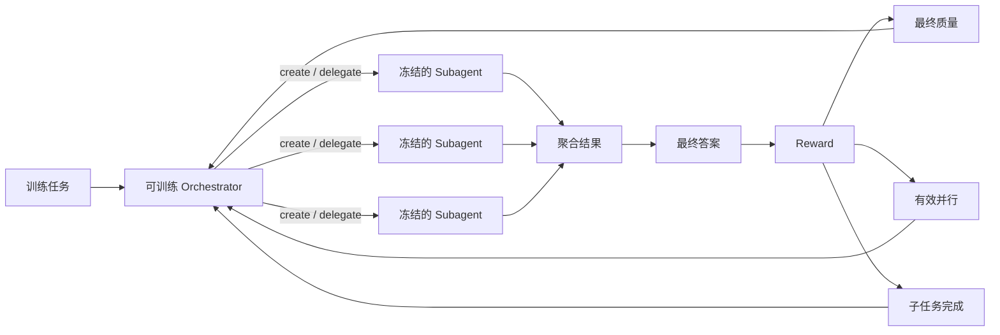

下面是**概念性训练伪代码（D 层）**：

```python
for task in training_tasks:
    trajectory = orchestrator.rollout(
        task=task,
        interfaces=[create_subagent, delegate, collect],
        workers=frozen_subagent_pool,
    )

    final_quality = judge(trajectory.final_answer, task.rubric)
    parallel_gain = measure_true_parallelism(
        trajectory.timeline,
        critical_path=trajectory.critical_path,
    )
    completion = score_subtask_completion(trajectory.assignments)

    # 公开资料说明奖励包含这三类目标；精确公式和系数未公开。
    reward = combine(final_quality, parallel_gain, completion)
    update_only(orchestrator.parameters, reward, trajectory)
```

运行时可以抽象为：

```python
def run_swarm(task, budget):
    commander = load_trained_orchestrator()
    notebook = GlobalNotebook(task=task)

    while not commander.is_done(notebook):
        decision = commander.next_action(
            summary=notebook.key_findings(),
            active_workers=notebook.active_workers(),
            remaining_budget=budget.remaining(),
        )

        if decision.kind == "delegate":
            for assignment in decision.independent_assignments:
                spawn_specialist(
                    assignment=assignment,
                    context=shard_context(task, assignment),
                    on_complete=lambda result: notebook.add(
                        compress_to_key_findings(result)
                    ),
                )
        elif decision.kind == "resolve_conflict":
            notebook.add(verify_conflicting_claims(decision.claims))
        elif decision.kind == "synthesize":
            return commander.finalize(notebook)

        budget.consume(observed_usage())
```

关键不变量：

- 并行奖励必须衡量真实关键路径缩短，不能只奖励“创建更多 Agent”；
- context shard 应包含子任务所需信息，但不复制全部全局历史；
- Commander 必须能看见活跃 worker、预算和依赖，否则容易重复搜索或产生冲突；
- 回传内容应是可合并的关键结论与证据，而不是未经压缩的完整轨迹；
- 最终质量奖励仍是主目标，否则系统可能用并行数量投机。

### 4.4 Critical Steps：比 Agent 数量更好的并行指标

Kimi 文档强调 critical steps：把完成任务所需的最长依赖路径作为延迟近似。两个 subagent 同时执行各 20 步，并不必然等于 40 步延迟；如果它们真正并行，关键路径更接近 20 步加协调开销。

```text
总工作量（work）      = 所有 Agent 步数之和
关键路径（span）      = 最长依赖链的步数
理论并行度上限        ≈ work / span
实际加速              < 理论上限，因为有调度、工具、合并和冲突开销
```

关键路径比单纯宣传 Agent 数量更有分析价值。没有降低 span 的 fan-out 只是在增加 token 和协调成本。

### 4.5 Kimi CLI / Agent SDK：下一代 Kimi Code 之外的参考入口

[Apache-2.0 Kimi CLI](https://github.com/MoonshotAI/kimi-cli) 提供可审计的本地参考 Agent runtime，但其 README 已明确说明：该项目正在演进到同团队的下一代 Kimi Code，并会逐步停止维护（winding down），现有文档与安装仍保留。[Kimi Agent SDK](https://github.com/MoonshotAI/kimi-agent-sdk) 则明确以这个旧 Kimi CLI 作为执行引擎，是复用其配置、tools、skills、MCP、session 与 approval 的薄封装，并把 tool call 和批准请求暴露给应用。

这带来一条很实用的研究路径：

```text
Kimi 模型 / API tool calling
    → Apache-2.0 Kimi CLI 参考 runtime 的本地 loop、session、approval 与事件
    → 以旧 Kimi CLI 为执行引擎的 Kimi Agent SDK
    ≠ 下一代 Kimi Code 完整 runtime 已公开
    ≠ kimi.com 内部 Agent Swarm 的生产 scheduler
```

旧 CLI 与 SDK 可以源码审计，后两项不能由此反推。研究 Kimi 时，应把 Apache-2.0 Kimi CLI 视为“公开的参考 harness”；既不要把它当作消费级 Swarm 后端的镜像，也不要据此声称下一代 Kimi Code 的完整 runtime 已开源。

### 4.6 Kimi 最值得学的部分

- 把“是否委派、如何拆分、何时并行”纳入模型训练目标；
- 用 frozen workers 隔离 orchestrator 学习问题，降低联合训练的不稳定性；
- 用 critical path 而不是 Agent 数量衡量并行收益；
- 用 notebook / context shard 控制上下文爆炸；
- 区分公开模型能力与闭源产品 runtime，不把 open-weight 等同于 open-system。

---

## 5. 横向机制对比

### 5.1 关键控制点

| 维度 | Anthropic | OpenAI | Kimi |
|---|---|---|---|
| 下一步由谁决定 | workflow 由代码；agent / lead 动态决定 | 模型在 harness 中提出 tool call；产品策略决定是否可执行 | 训练过的 Commander 动态 create / delegate / collect |
| 多 Agent 目的 | 隔离上下文、扩大搜索宽度、分离生成与评审 | 产品公开重点更多在统一工具面与共享 runtime；也支持多 Agent / handoff | 通过大规模并行直接缩短关键路径 |
| 上下文策略 | just-in-time、subagent 隔离、压缩回传、文件外化 | 持久 thread、tool result 回填、compaction / session | context sharding、subagent notebook、关键结论回传 |
| 执行环境 | Claude Code 沙箱；环境/模型/外部内容三层控制 | 浏览器、终端、连接器；确认、Watch Mode、沙箱和网络策略 | 产品工具环境可见，但完整 sandbox / approval 细节未充分公开 |
| 长任务 | initializer/coding 或 planner/generator/evaluator | persistent thread + shared harness + repository feedback loop | 高 fan-out 和长 tool trajectory；持久恢复协议未充分公开 |
| 评估偏好 | 任务结果、token 经济性、研究质量、evaluator 证据 | system card、安全 eval、工具执行结果、仓库测试 | 最终质量 + 并行度 + 子任务完成 + critical steps |
| 开放程度 | 工程机制披露多，产品 runtime 闭源 | Codex / Agents SDK 有开源实现，ChatGPT agent 产品闭源 | 模型与论文部分开放，产品 Swarm runtime 仍不透明 |

### 5.2 三种调度思想放在一张图里

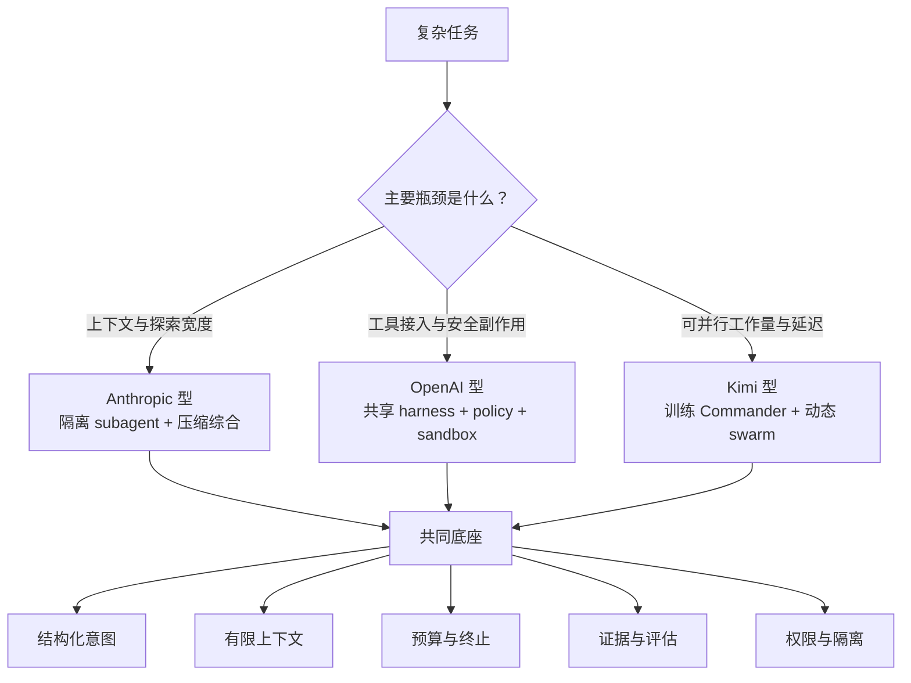

### 5.3 对开源项目的映射

| 闭源 / 部分开源设计 | 最接近的开源学习入口 | 不能直接等同的地方 |
|---|---|---|
| Anthropic lead + parallel subagents | LangGraph parallel branches、AutoGen / MAF message orchestration | Anthropic 的实际 prompt、预算器、搜索器和生产恢复未公开 |
| Anthropic generator + evaluator | OpenHands event loop + tests；CrewAI Flow；自建 evaluator node | “有 reviewer Agent”不等于有独立、可复现的验收证据 |
| OpenAI Codex shared harness | Codex 开源仓库、OpenAI Agents SDK | ChatGPT agent 的浏览器与连接器产品 runtime 不等于 Agents SDK |
| OpenAI source-to-sink safety | Codex approval/sandbox；OpenHands security analyzer | 产品分类器、监控规则和红队数据未公开 |
| Kimi trained Commander + PARL | MAF / LangGraph 动态 fan-out；AutoGen selector | 开源框架通常是代码编排，不包含训练过的并行策略 |
| Kimi context shards / notebooks | subgraph state、event log、artifact store | 产品内部 shard schema、冲突协议与持久语义未知 |

---

## 6. 第三方研究告诉我们的限制

### 6.1 Multi-agent 的成本是真正的架构约束

Simon Willison 对 Anthropic 多 Agent 系统的[技术评论](https://simonwillison.net/2025/Jun/14/multi-agent-research-system/) 特别强调了 subagent 设计及其 token 成本。这与 Anthropic 自己披露的约 15 倍 token 开销相呼应。第三方评论不能独立复现官方 90.2% 指标，但提醒了一个容易被产品演示掩盖的事实：**并行 Agent 购买的是更多采样、更多上下文和更多搜索，不是免费的智能。**

### 6.2 任务完成不等于安全地完成

[Coding Agents Are Guessing: Measuring Action-Boundary Violations in Underspecified DevOps Instructions](https://arxiv.org/abs/2607.02294) 提出 UnderSpecBench，并独立测试 Claude Code、Codex 与 OpenCode 在欠规格 DevOps 任务中的行为。论文显示，不同受测配置都出现了动作边界违规；这里未展开完整 experiment identity，因此不复述精确比例，也不能用结果给整款产品排名。它揭示了传统完成率 benchmark 的盲点：用户没说清楚时，Agent 可能通过做得过多来“成功”。

建议把 Agent eval 写成三元组：

```text
任务结果：是否完成目标？
动作边界：是否只做了被授权的事？
证据质量：是否能证明结果及其来源？
```

### 6.3 开放权重不自动带来生产安全

[An Independent Safety Evaluation of Kimi K2.5](https://arxiv.org/abs/2604.03121) 发现，它在若干双用途任务上接近闭源前沿模型、同时更少拒答。该研究关注安全能力而非 Swarm 架构，不能据此评价 Kimi 产品是否安全；可迁移的结论是：部署强大的 open-weight agentic model 时，不能假定模型自身拒答足以替代外部权限、沙箱、监控与审计。

### 6.4 排行榜必须绑定完整实验协议

模型名不足以标识一个 Agent 实验，至少还要记录：

```text
model + harness + tools + token/turn budget + compaction
      + parallel sampling + selector/judge + sandbox/network policy
```

OpenAI 在 2026 年[停止使用 SWE-bench Verified 评价前沿发布](https://openai.com/index/why-we-no-longer-evaluate-swe-bench-verified/)，理由包括测试有效性和训练暴露问题。这也反向提醒我们：oracle@N、best-of-N、不同 coding harness、不同工具预算或不同 compaction 策略的结果不是同一统计量，不能直接拼表排名。

FAccT 2026 的 [AI Agent Index](https://aiagentindex.mit.edu/data/2025-AI-Agent-Index.pdf) 还发现，30 个 Agent 在 safety、eval 与社会影响等字段上存在大量公开信息缺口。该研究采集的是较早产品快照，不能覆盖 2026 年全部更新；但它支持一个选择标准：**“优秀”不仅是分数高，还应能公开说明 system boundary、eval protocol、事故和限制。**

---

## 7. 仍然不知道什么

以下问题没有足够公开证据，本文不作确定性判断：

### Anthropic

- Claude Research 的实际 subagent prompt、动态预算和精确失败恢复协议；
- 生产系统如何去重搜索、合并冲突引用、跨轮持久化 worker 状态；
- 模型、规则分类器与人工确认之间的真实路由阈值。

### OpenAI

- ChatGPT agent 内部工具路由、浏览器策略分类器和连接器权限图的源码；
- Deep Research、Operator 能力合并后的精确内部模块边界；
- 产品监控器、prompt-injection 检测器的规则、训练数据和阈值。

### Kimi

- K3 Agent Swarm 的训练细节是否及如何继承 K2.5/K2.6 PARL；
- 生产 scheduler、worker 生命周期、重试、幂等、冲突合并和持久恢复；
- Commander 与 Specialist 的模型路由、实际并发限制及每种任务的成本策略；
- 产品工具的权限模型、沙箱和提示注入防护实现。

这些未知项很重要。公开论文能说明设计方向，但生产 Agent 的可靠性往往由“重试时是否重复付款”“子 Agent 卡死怎样回收”“未授权外发怎样拦截”这类 runtime 细节决定。

---

## 8. 面向工程学习的提炼

如果要把三家的优点用于自己的 Agent，不必复制产品规模，可以先实现一个小而严格的版本：

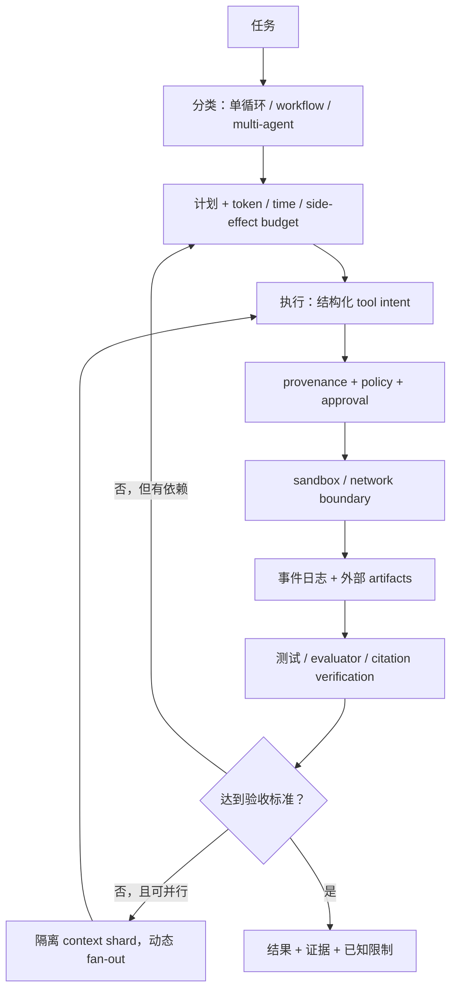

最小实现应明确以下不变量：

1. **默认单 Agent**：只有任务分支真正独立且收益覆盖成本时才 fan-out；
2. **意图先于副作用**：模型只能提出结构化动作，policy 决定是否执行；
3. **外部内容默认不可信**：网页、文件、tool output、subagent output 都携带 provenance；
4. **上下文不是数据库**：进度、证据、测试和未完成项写入可恢复 artifact；
5. **并行优化关键路径**：衡量 span、重复工作和协调开销，而不是 Agent 数量；
6. **eval 同时检查结果与边界**：成功、授权、安全、证据缺一不可；
7. **明确降级**：预算耗尽、worker 失败或确认被拒绝时，系统返回部分结果和缺口，不伪装完成。

---

## 9. 推荐阅读顺序

### Anthropic：从单 Agent 到多 Agent 与安全边界

1. [Building Effective Agents](https://www.anthropic.com/engineering/building-effective-agents)
2. [Effective Context Engineering for AI Agents](https://www.anthropic.com/engineering/effective-context-engineering-for-ai-agents)
3. [How We Built Our Multi-Agent Research System](https://www.anthropic.com/engineering/multi-agent-research-system)
4. [Effective Harnesses for Long-Running Agents](https://www.anthropic.com/engineering/effective-harnesses-for-long-running-agents)
5. [Harness Design for Long-Running Apps](https://www.anthropic.com/engineering/harness-design-long-running-apps)
6. [How We Contain Claude](https://www.anthropic.com/engineering/how-we-contain-claude)
7. [Claude Code Sandboxing](https://www.anthropic.com/engineering/claude-code-sandboxing)

### OpenAI：从 Agent loop 到统一产品运行时

1. [Unrolling the Codex Agent Loop](https://openai.com/index/unrolling-the-codex-agent-loop/)
2. [Unlocking the Codex Harness](https://openai.com/index/unlocking-the-codex-harness/)
3. [ChatGPT Agent System Card](https://openai.com/index/chatgpt-agent-system-card/)
4. [Designing AI Agents to Resist Prompt Injection](https://openai.com/index/designing-agents-to-resist-prompt-injection/)
5. [ChatGPT Agent User Confirmations](https://deploymentsafety.openai.com/chatgpt-agent/user-confirmations)
6. [Harness Engineering](https://openai.com/index/harness-engineering/)
7. [Deep Research System Card](https://openai.com/index/deep-research-system-card/)

### Kimi：从长程 tool use 到 Agent Swarm

1. [Kimi K2.5: Visual Agentic Intelligence](https://arxiv.org/abs/2602.02276)
2. [MoonshotAI / Kimi-K2.5](https://github.com/MoonshotAI/Kimi-K2.5)
3. [Kimi Agent Swarm Help Center](https://www.kimi.com/help/agent/agent-swarm)
4. [Kimi K2 Thinking](https://www.kimi.com/blog/kimi-k2-thinking)

### 独立讨论与反证

1. [Simon Willison：Anthropic's multi-agent research system](https://simonwillison.net/2025/Jun/14/multi-agent-research-system/)
2. [Coding Agents Are Guessing: Measuring Action-Boundary Violations in Underspecified DevOps Instructions](https://arxiv.org/abs/2607.02294)
3. [An Independent Safety Evaluation of Kimi K2.5](https://arxiv.org/abs/2604.03121)

## 10. 最终判断

如果只记住一句话：**当前前沿 Agent 的竞争，不只是模型推理能力，而是怎样分配上下文与计算、怎样把工具变成受控副作用、怎样让长任务可恢复并可验证。**

- Anthropic 给出了最完整的“何时使用多 Agent、怎样管理上下文与评审”的公开方法论；
- OpenAI 展示了“一个持久 harness 如何支撑多入口、完整工具面和产品级安全控制”；
- Kimi 展示了“让 orchestrator 通过强化学习掌握动态并行”的模型训练路线。

真正优秀的实现不应盲目选择其中一家，而应根据瓶颈组合：用 Anthropic 式任务选择与上下文纪律，OpenAI 式结构化工具、策略与沙箱，Kimi 式关键路径度量和按需并行；最后用独立 eval 检查它是否既完成目标，也遵守边界。
