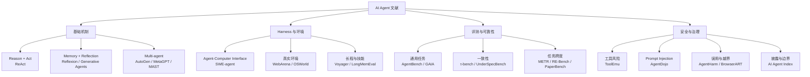
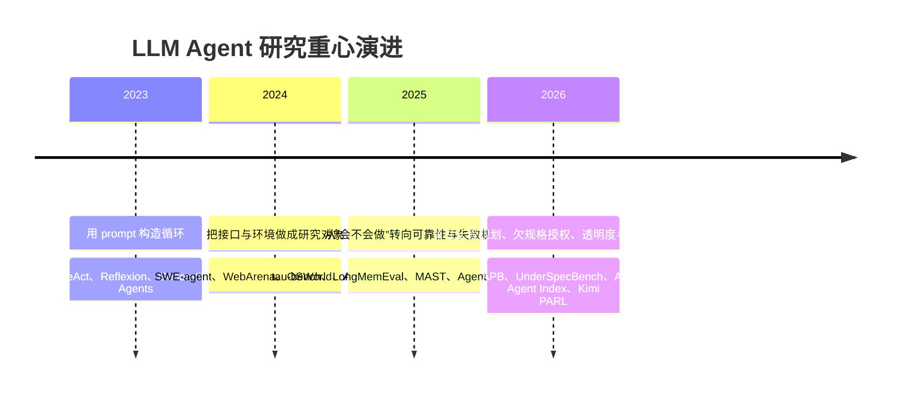
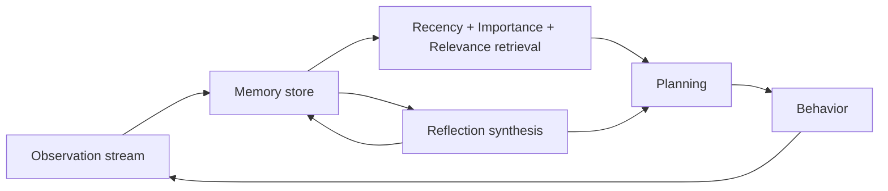
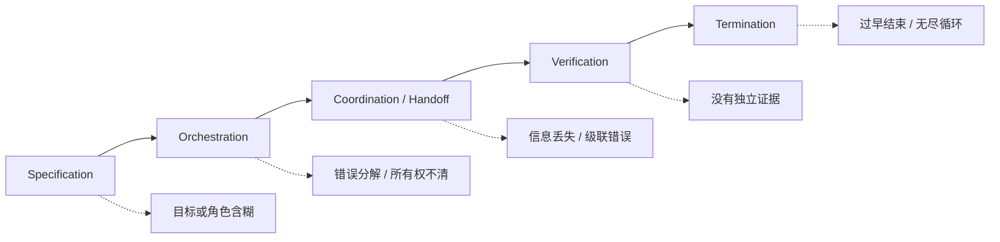

# AI Agent 权威论文与近期文章导读

> 文献快照：2026-07-31（Asia/Shanghai）  
> 目标：不是罗列“最火论文”，而是建立从 Agent 循环、状态与工具，到真实环境评测、安全与生产治理的可追溯阅读体系。  
> 选择原则：优先同行评审论文、论文官方页面、机构技术报告、system card 与官方工程复盘；预印本和厂商自测明确标记。

## 0. 证据等级与筛选规则

| 发表 / 材料类型等级 | 材料类型 | 本文如何使用 |
|---|---|---|
| **P1** | ICLR、NeurIPS、ICML、UIST、FAccT 等正式发表论文 | 支撑已评审的方法、benchmark 设计与实验发现 |
| **P2** | arXiv 预印本、机构技术报告、开放权重模型报告 | 用于追踪最新方向；明确写“预印本 / 技术报告”，不冒充同行评审 |
| **P3** | 官方 system card、工程文章、事故复盘、源码文档 | 支撑产品架构与部署事实；性能数字视为一方测量 |

另用一条正交的**来源视角轴**标注材料：**一方**（系统或产品提供方）、**独立第三方**（不隶属于被评对象的原创研究 / 审计）与**二次评论**（综合、解读或评论）。来源视角不与 P1–P3 排序：例如一方模型技术报告可以是 P2，独立论文也可以是 P1 或 P2，二次评论不另设 P4 等级。

不采用以下“权威性捷径”：

- 不以引用量或社交媒体热度代替方法质量；
- 不把 arXiv 上传写成“发表于 ICLR / NeurIPS”，除非 proceedings 可核验；
- 不把模型 benchmark 写成 Agent 产品可靠性；
- 不把旧 leaderboard 数字脱离 model、harness、tools、budget 与 judge 重复传播；
- 不用厂商博客证明厂商产品优于竞品，只用它解释公开机制与一方观察。

## 1. 文献地图：Agent 研究究竟在研究什么



文献演进可以概括成四个阶段：



---

## 2. 第一组：理解 Agent 核心循环与记忆

### 2.1 ReAct：Reasoning 与 Acting 交错

- **论文**：[ReAct: Synergizing Reasoning and Acting in Language Models](https://arxiv.org/abs/2210.03629)
- **状态**：ICLR 2023，P1。
- **核心贡献**：让模型交替产生 reasoning trace、action 和环境 observation；reasoning 更新计划，action 获取新的外部事实。
- **经典参考价值**：今天大量 `think → tool call → observation → think` Agent loop 与这一抽象相似；本文没有据此断言具体下游实现的谱系。
- **局限**：论文证明的是提示与交互模式，不提供持久状态、授权、幂等、并发或生产恢复。

> **代码声明**：本文所有程序代码示例均为作者根据论文公开机制重写的教学等价伪代码，不是论文或官方实现源码。

```python
while not done:
    thought = model.reason(history)
    action = model.choose_action(thought, tools)
    observation = environment.execute(action)
    history += [thought, action, observation]
```

**源码连接**：[smolagents](agents/01-smolagents.md) 最适合观察最小 ReAct / CodeAct；[Codex](agents/05-codex.md) 展示这个循环如何被 thread、approval、sandbox 与 typed events 包围。

### 2.2 Reflexion：不更新权重的语言反馈学习

- **论文**：[Reflexion: Language Agents with Verbal Reinforcement Learning](https://proceedings.nips.cc/paper_files/paper/2023/file/1b44b878bb782e6954cd888628510e90-Paper-Conference.pdf)
- **状态**：NeurIPS 2023，P1。
- **核心贡献**：把外部或模拟反馈转成文字反思，写入 episodic memory，在后续 trial 中改进行为，而不做梯度更新。
- **工程价值**：给“失败总结—下一轮重试”提供了经典模板。
- **局限**：自我反思可能合理但错误；如果没有外部 verifier，它容易把猜测写入长期记忆并放大。

```python
result = run_trial(task, episodic_memory)
feedback = verifier.evaluate(result)
reflection = model.reflect(result, feedback)
episodic_memory.append(reflection)
```

**源码连接**：可与 [OpenHands](agents/06-openhands.md) 的 observation/event、[LangGraph](agents/03-langgraph.md) 的 checkpoint 结合，但反思文本不应替代真实事件和测试证据。

### 2.3 Generative Agents：检索、反思、规划组成记忆架构

- **论文**：[Generative Agents: Interactive Simulacra of Human Behavior](https://research.google/pubs/generative-agents-interactive-simulacra-of-human-behavior/)
- **状态**：ACM UIST 2023，P1。
- **核心贡献**：保存自然语言经验流，按相关性、时近性和重要性检索；定期把经历综合为高层 reflection，再用于计划行为。
- **工程价值**：区分“原始事件”“派生总结”“当前计划”三类状态；这是理解后续常见 Agent memory 模式的经典参考，但不在缺少显式证据时断言具体实现受其影响。
- **局限**：评测目标主要是行为可信度，不是事实准确、生产恢复或权限安全。



### 2.4 Voyager：课程、技能库与可执行长期记忆

- **论文**：[Voyager: An Open-Ended Embodied Agent with Large Language Models](https://arxiv.org/abs/2305.16291)
- **状态**：TMLR 2024；P1。项目与代码见 [Voyager](https://voyager.minedojo.org/)。
- **核心贡献**：自动课程负责选择下一个目标；成功的程序进入可检索技能库；执行错误和自验证驱动代码迭代。
- **工程价值**：长期记忆不必只保存文本，也可以保存经过环境验证的可执行技能。
- **局限**：Minecraft 提供相对明确的反馈和可复用程序；开放网页、企业系统的状态和权限更不稳定。

### 2.5 LongMemEval：长期记忆不是“能搜到一句话”

- **论文**：[LongMemEval: Benchmarking Chat Assistants on Long-Term Interactive Memory](https://proceedings.iclr.cc/paper_files/paper/2025/hash/d813d324dbf0598bbdc9c8e79740ed01-Abstract-Conference.html)
- **状态**：ICLR 2025，P1。
- **核心贡献**：把长期记忆拆成信息提取、跨 session 推理、时间推理、知识更新和 abstention 五种能力。
- **工程价值**：memory eval 必须检查“旧信息被新信息覆盖”和“不知道时拒绝”，不能只测向量检索 recall。
- **局限**：面向聊天助手；对代码、文件系统和外部副作用的 checkpoint 语义覆盖有限。

### 2.6 三篇补充基础文献：训练工具、搜索规划、层级上下文

| 论文 | 状态 | 回答的问题 | 最重要的限制 |
|---|---|---|---|
| [Toolformer](https://proceedings.neurips.cc/paper_files/paper/2023/hash/d842425e4bf79ba039352da0f658a906-Abstract-Conference.html) | NeurIPS 2023，P1 | 模型怎样从少量示例自监督学习何时调用 API、调用哪个、怎样使用返回值 | 研究模型内工具学习，不包含生产审批、事务和恢复 |
| [Language Agent Tree Search（LATS）](https://openreview.net/forum?id=njwv9BsGHF) | ICML 2024，P1 | 怎样用 tree search、环境反馈、反思和价值估计探索/回溯 Agent trajectory | 采样昂贵；不可逆真实副作用不能像模拟节点一样随意回溯 |
| [MemGPT](https://arxiv.org/abs/2310.08560) | arXiv 预印本，P2 | 怎样借鉴虚拟内存，把有限上下文和外部存储组织成层级工作集 | 截至快照仍按预印本处理；模型自己换页可能错误保留或丢弃信息 |

三者分别属于模型训练、推理期搜索和 context runtime，不应都被模糊地称作“Agent memory / planning”。

---

## 3. 第二组：接口和环境比 Prompt 更重要

### 3.1 SWE-agent：Agent-Computer Interface（ACI）

- **论文**：[SWE-agent: Agent-Computer Interfaces Enable Automated Software Engineering](https://proceedings.neurips.cc/paper_files/paper/2024/hash/5a7c947568c1b1328ccc5230172e1e7c-Abstract-Conference.html)
- **状态**：NeurIPS 2024，P1。
- **核心贡献**：把 Agent 当作一种特殊计算机用户，为其重新设计文件查看、编辑、导航和测试接口；实验表明接口设计显著影响行为和成功率。
- **工程价值**：工具不只是 API schema，还决定模型能观察什么、每步修改多大、错误是否容易恢复。
- **局限**：论文早期 benchmark 数字已经过时；设计结论比绝对分数更值得保留。

**源码连接**：[browser-use](agents/04-browser-use.md) 同样不是“多加一个 Playwright tool”，而是重做浏览器 observation、selector 与 action space；[Codex](agents/05-codex.md) 则把 ACI 放入安全执行面。

### 3.2 WebArena：可复现的真实网站环境

- **论文**：[WebArena: A Realistic Web Environment for Building Autonomous Agents](https://proceedings.iclr.cc/paper_files/paper/2024/hash/4410c0711e9154a7a2d26f9b3816d1ef-Abstract-Conference.html)
- **状态**：ICLR 2024，P1。
- **核心贡献**：提供自托管、功能完整的电商、论坛、代码协作和 CMS 网站，以最终功能状态评估长程任务。
- **关键发现**：论文显示当时的 Agent 基线与人类表现存在显著差距；由于这里未同时展开 model、harness、budget、metric 与论文版本，不复述脱离实验身份的精确百分比。
- **工程价值**：网页 Agent eval 应重置初始环境并检查最终状态，而不是用截图相似或 LLM 主观判断代替。

### 3.3 OSWorld：跨应用真实桌面

- **论文**：[OSWorld: Benchmarking Multimodal Agents for Open-Ended Tasks in Real Computer Environments](https://papers.nips.cc/paper_files/paper/2024/hash/5d413e48f84dc61244b6be550f1cd8f5-Abstract-Datasets_and_Benchmarks_Track.html)
- **状态**：NeurIPS 2024 Datasets and Benchmarks，P1。
- **核心贡献**：369 个跨 Ubuntu、Windows、macOS 的真实应用任务，带环境初始化和 execution-based evaluator。
- **关键发现**：论文基线中 Agent 与人类表现存在显著差距，主要瓶颈包括 GUI grounding 和操作知识；由于这里未同时展开完整实验身份，不复述精确百分比。
- **工程价值**：computer-use 可靠性是视觉、状态、操作和恢复的系统乘积，不是视觉模型单项分数。

### 3.4 SWE-bench：真实 GitHub issue 作为执行评测

- **论文**：[SWE-bench: Can Language Models Resolve Real-world GitHub Issues?](https://proceedings.iclr.cc/paper_files/paper/2024/hash/edac78c3e300629acfe6cbe9ca88fb84-Abstract-Conference.html)
- **状态**：ICLR 2024 Oral，P1。
- **核心贡献**：把真实 issue、仓库基线和 fail-to-pass / pass-to-pass 测试组合成可执行软件工程任务。
- **历史意义**：推动编码 Agent 从片段生成转向 repository-level 修改。
- **重要时效修正**：OpenAI 在 2026 年宣布[不再用 SWE-bench Verified 衡量前沿模型发布](https://openai.com/index/why-we-no-longer-evaluate-swe-bench-verified/)，理由包括测试问题与训练暴露；旧排行不能脱离版本和污染风险引用。

### 3.5 TheAgentCompany：模拟数字员工，而不是单一工具用户

- **论文**：[TheAgentCompany: Benchmarking LLM Agents on Consequential Real World Tasks](https://proceedings.neurips.cc/paper_files/paper/2025/hash/0d744742f6fac4d1134c019b7cef3c8a-Abstract-Datasets_and_Benchmarks_Track.html)
- **状态**：NeurIPS 2025 Datasets and Benchmarks，P1。
- **核心贡献**：Agent 需要浏览、写代码、运行程序，并在模拟公司中与“同事”沟通；final proceedings 的基线显示 Agent 与人类知识工作仍有显著差距。本文未完整列出 model、harness、metric 与版本身份，因此不保留精确比例，也不把基线当作当前产品上限。
- **工程价值**：真实知识工作是多系统状态与组织规则的组合，不能由一个 coding 或 web benchmark 代表。
- **局限**：模拟公司仍不是现实企业，凭据、非结构化政治关系和生产事故成本被简化。

### 3.6 Terminal-Bench：命令行结果必须真的可执行

- **论文**：[Terminal-Bench: Benchmarking Agents on Hard, Realistic Tasks in Command Line Interfaces](https://arxiv.org/abs/2601.11868)
- **状态**：ICLR 2026，P1；论文主要描述 Terminal-Bench 2.0。
- **核心贡献**：以隔离容器、真实命令行任务、人工参考解法和可执行测试评估 terminal Agent；2.0 包含 89 个高难任务。
- **工程价值**：把“生成看起来合理的 shell / patch”与“环境中的真实结果通过测试”分开，也暴露 model 与 harness 无法完全解耦的问题。
- **局限**：公开 benchmark 仍可能污染；依赖、容器和任务也需持续版本化。

### 3.7 OSWorld 2.0：从点按任务进入多小时工作流

- **论文**：[OSWorld 2.0: Benchmarking Computer Use Agents on Long-Horizon Real-World Tasks](https://arxiv.org/abs/2606.29537)
- **状态**：2026-06 arXiv 预印本，P2。
- **核心贡献**：扩展为 108 个长程真实工作流，人类中位完成时间约 1.6 小时；同时报告完整成功、部分完成和安全结果。
- **关键发现**：论文即使给出较长步数预算，最佳配置的完整成功率仍然有限，并观察到约束遗忘、遗漏动态信息、隐藏状态恢复、缺少澄清和跳过验证等问题；本文未完整展开 model、harness、budget、metric 与版本身份，因此不复述精确百分比。
- **局限**：非常新、未同行评审、复现成本高；不能与 2024 OSWorld 基线直接做模型进步百分比计算。

---

## 4. 第三组：从成功率走向可靠性与诊断

### 4.1 AgentBench：早期跨环境通用 Agent 基准

- **论文**：[AgentBench: Evaluating LLMs as Agents](https://proceedings.iclr.cc/paper_files/paper/2024/file/e9df36b21ff4ee211a8b71ee8b7e9f57-Paper-Conference.pdf)
- **状态**：ICLR 2024，P1。
- **核心贡献**：用八类环境评估多轮、开放式决策，指出长程推理、决策和指令遵循是主要失败源。
- **价值**：建立“Agent 必须在环境中评价”的基本共识。
- **局限**：模型与环境版本已老，今天更适合作为方法史，而非当前产品排行。

### 4.2 GAIA：人类简单、Agent 困难的通用助手任务

- **论文**：[GAIA: a Benchmark for General AI Assistants](https://proceedings.iclr.cc/paper_files/paper/2024/hash/25ae35b5b1738d80f1f03a8713e405ec-Abstract-Conference.html)
- **状态**：ICLR 2024，P1。
- **核心贡献**：466 个需要推理、多模态、浏览和工具的真实问题；强调鲁棒完成普通人能做的任务，而不是只提高专业考试难度。
- **关键发现**：论文当时的 Agent 基线与人类表现存在显著差距；这里未展开完整 experiment identity，因此不复述精确比例。
- **局限**：答案型 benchmark 对副作用、授权和过程错误覆盖较弱；联网内容也会随时间漂移。

### 4.3 τ-bench：一次成功远远不够

- **论文**：[τ-bench: A Benchmark for Tool-Agent-User Interaction in Real-World Domains](https://proceedings.iclr.cc/paper_files/paper/2025/hash/1b126cc38b8638e07bef37e7b2bb72bf-Abstract-Conference.html)
- **状态**：ICLR 2025，P1。
- **核心贡献**：模拟零售与航空客服，Agent 一边与用户对话，一边调用数据库工具并遵守领域政策；用最终 DB state 校验结果。
- **最重要贡献**：提出 `pass^k`：对每个任务，计算 `k` 个独立同分布（i.i.d.）trial 全部成功的概率，再跨任务平均。论文中即使单次成功尚可，一致性仍显著下降。

```text
pass@k：k 次中至少一次成功，奖励多试几次
pass^k：逐任务计算 k 个 i.i.d. trials 全部成功的概率，再跨任务平均

事务、客服和重复执行场景更关心 pass^k、错误分布和副作用；搜索、候选生成或 best-of-N 场景仍可能更关心 pass@k。两者回答不同问题，不能互相替代。
```

### 4.4 METR Time Horizon：把任务长度纳入能力测量

- **论文**：[Measuring AI Ability to Complete Long Software Tasks](https://papers.neurips.cc/paper_files/paper/2025/file/85069585133c4c168c865e65d72e9775-Paper-Conference.pdf)
- **状态**：NeurIPS 2025，P1；更新方法见 [METR Time Horizons](https://evals.alignment.org/time-horizons/)。
- **核心贡献**：以人类专家完成任务所需时长表征任务难度，估计 Agent 达到 50% 成功率的 task-completion time horizon。
- **工程价值**：解释“Agent 能偶尔做很难的事，却不能稳定接管日常长任务”的表面矛盾。
- **局限**：人类耗时不等于单一难度；任务分布、harness、模型版本和提示都会改变 horizon，不能将其理解成 Agent 实际运行时间。

### 4.5 RE-Bench 与 PaperBench：研究型 Agent 的两种测法

| 文献 | 状态 | 测量对象 | 最值得学的设计 |
|---|---|---|---|
| [RE-Bench](https://proceedings.mlr.press/v267/wijk25a.html) | ICML 2025，P1 | 限时 AI R&D 优化任务，Agent 与人类专家比较 | 比较不同时间预算下的产出，而不只看最终一次答案 |
| [PaperBench](https://openai.com/index/paperbench/) | OpenAI 2025 技术报告 / 开放 benchmark，P2/P3 | 从零复现 20 篇 ICML 2024 论文 | 8,316 个分层 rubric 项，并单独评估自动 judge |

PaperBench 的一方实验显示，受测 Agent 离完整论文复现仍有明显距离。这里未同时展开 model、harness、budget、metric 与报告版本，因此不复述精确百分比；更重要的是它把大任务分解为可审计 rubric，并承认 judge 自身也需要 benchmark。

### 4.6 Agent Planning Benchmark：先诊断计划，再看执行

- **论文**：[Agent Planning Benchmark: A Diagnostic Framework for Planning Capabilities in LLM Agents](https://arxiv.org/abs/2606.04874)
- **状态**：2026-06 arXiv 预印本，P2；截至快照未把它写成正式会议信息。
- **核心贡献**：4,209 个多模态样例、22 个领域，分开评估整体计划、反馈条件下的逐步计划、额外/损坏工具和无解任务。
- **关键发现**：论文报告长程规划、工具噪声、校准拒绝和 inference-time refinement 仍有系统性不足。
- **工程价值**：end-to-end 失败不应全部归因于“模型不聪明”；要区分计划错误、工具错误、环境错误和执行错误。

### 4.7 UnderSpecBench：完成任务也可能已经越权

- **论文**：[Coding Agents Are Guessing: Measuring Action-Boundary Violations in Underspecified DevOps Instructions](https://arxiv.org/abs/2607.02294)；UnderSpecBench 是 benchmark 名。
- **状态**：2026-07 arXiv 预印本，P2。
- **核心贡献**：69 类欠规格 DevOps 任务，检查 Agent 是否在模糊要求下跨越动作边界。
- **关键发现**：论文显示，不同受测配置都出现了动作边界违规；这里未展开完整 experiment identity，因此不复述精确比例。
- **局限**：特定任务和配置不能用于给 Claude Code、Codex 或 OpenCode 做总体安全排名。
- **工程价值**：eval 应同时检查目标完成和授权边界；“多做一些”可能提高完成率，却降低可信度。

---

## 5. 第四组：Multi-Agent 的收益、边界和失败

### 5.1 AutoGen：可对话 Agent 抽象

- **论文**：[AutoGen: Enabling Next-Gen LLM Applications via Multi-Agent Conversations](https://openreview.net/forum?id=BAakY1hNKS)
- **状态**：COLM 2024，P1。早期 arXiv 技术报告后来获得正式发表，不能继续只标预印本。
- **核心贡献**：把 LLM、工具、人类组合为 conversable agents，以消息对话表达协作与控制。
- **机制代表**：manager、group chat、proxy agent 是其对话式多 Agent 抽象中的代表模式；本文不在缺少显式 built-on / inspired-by 证据时断言具体下游谱系。
- **局限**：消息抽象本身不解决状态所有权、exactly-once 副作用、终止和错误传播。

### 5.2 MetaGPT：SOP 比自由聊天更可靠

- **论文**：[MetaGPT: Meta Programming for A Multi-Agent Collaborative Framework](https://proceedings.iclr.cc/paper_files/paper/2024/hash/6507b115562bb0a305f1958ccc87355a-Abstract-Conference.html)
- **状态**：ICLR 2024，P1。
- **核心贡献**：把软件团队的 Standardized Operating Procedures 编入 prompt 序列，按角色交付结构化中间产物，降低自由对话的级联幻觉。
- **工程价值**：多 Agent 的价值来自责任、artifact 和验收边界，而不是角色名称数量。
- **局限**：预设 SOP 适合可预测流程；开放任务需要动态调度、恢复和冲突仲裁。

### 5.3 Why Do Multi-Agent LLM Systems Fail?：失败分类比新框架更重要

- **论文**：[Why Do Multi-Agent LLM Systems Fail?](https://proceedings.neurips.cc/paper_files/paper/2025/hash/b1041e52d3be19f0a9bc491657488e4a-Abstract-Datasets_and_Benchmarks_Track.html)
- **状态**：NeurIPS 2025 Datasets and Benchmarks，P1。
- **核心贡献**：MAST taxonomy 将失败分为 specification/system design、inter-agent misalignment、task verification/termination 三大类，并提供 MAST-Data。
- **工程价值**：当多 Agent 失败时，应定位信息丢失、角色/任务不匹配、错误传播、验证不足和终止错误，而不是只更换模型。



### 5.4 Kimi K2.5 PARL：把并行调度纳入训练

- **论文**：[Kimi K2.5: Visual Agentic Intelligence](https://arxiv.org/abs/2602.02276)
- **状态**：2026-02 arXiv 预印本 / 技术报告，P2；模型与部分代码开放，产品 Swarm runtime 未完整开源。
- **核心贡献**：训练 orchestrator 动态创建和委派冻结 subagent；奖励包含最终质量、真实并行和子任务完成。
- **工程价值**：多 Agent 不必完全依靠手写调度，调度策略本身也可训练；critical path 比 Agent 数量更能反映收益。
- **局限**：一方性能指标、调度源码和生产安全协议缺乏独立复现。

---

## 6. 第五组：安全必须存在于模型之外

### 6.1 ToolEmu：先在模拟工具环境找高风险长尾

- **论文**：[Identifying the Risks of LM Agents with an LM-Emulated Sandbox](https://proceedings.iclr.cc/paper_files/paper/2024/hash/7274ed909a312d4d869cc328ad1c5f04-Abstract-Conference.html)
- **状态**：ICLR 2024，P1。
- **核心贡献**：用 LM 模拟工具执行与环境，扩展高风险场景测试；初始 benchmark 覆盖 36 个高风险 toolkit、144 个测试。
- **关键发现**：人工评估显示，模拟环境识别出的一部分失败能够对应有效的现实失败；这里未展开完整 experiment identity，因此不复述精确比例。
- **局限**：LM-emulated sandbox 不是安全隔离，也不是现实工具的完全替代；它是风险发现器。

### 6.2 AgentDojo：Prompt injection 是工具数据的信任问题

- **论文**：[AgentDojo: A Dynamic Environment to Evaluate Prompt Injection Attacks and Defenses for LLM Agents](https://proceedings.nips.cc/paper_files/paper/2024/hash/97091a5177d8dc64b1da8bf3e1f6fb54-Abstract-Datasets_and_Benchmarks_Track.html)
- **状态**：NeurIPS 2024 Datasets and Benchmarks，P1。
- **核心贡献**：97 个现实任务、629 个安全测试；在邮件、银行、旅行等工具环境中注入不可信数据，联合测 utility 与 security。
- **关键发现**：无攻击时 Agent 也会任务失败；攻击与防御都不能用单一成功率概括。
- **工程价值**：每个 tool result 都应携带 provenance；外部内容不能取得与 system/user intent 相同的指令权。

### 6.3 AgentHarm：聊天拒答不等于 Agent 拒绝执行

- **论文**：[AgentHarm: A Benchmark for Measuring Harmfulness of LLM Agents](https://proceedings.iclr.cc/paper_files/paper/2025/hash/c493d23af93118975cdbc32cbe7323f5-Abstract-Conference.html)
- **状态**：ICLR 2025，P1。
- **核心贡献**：110 个显式恶意的多步 Agent 任务及扩展版本，覆盖欺诈、网络犯罪、骚扰等 11 类风险。
- **关键发现**：论文发现部分模型无需 jailbreak 就会配合恶意 Agent 请求，通用 jailbreak 还能在多步执行中保留能力。
- **工程价值**：安全 eval 必须测试完整 trajectory、tool effect 和持续能力，而不是只检查第一句回答。

### 6.4 Aligned LLMs Are Not Aligned Browser Agents

- **论文**：[Aligned LLMs Are Not Aligned Browser Agents](https://proceedings.iclr.cc/paper_files/paper/2025/hash/42f92b78a6695f60db0cd38b54d57a41-Abstract-Conference.html)
- **状态**：ICLR 2025，P1。
- **核心贡献**：BrowserART 用合成和真实网站测试 100 类有害浏览行为，研究聊天模型拒答能否迁移到浏览器 Agent。
- **关键发现**：作为 chatbot 会拒绝的 backbone，包装成浏览器 Agent 后不一定继续拒绝。
- **工程价值**：alignment 是 model × harness × tools × context 的系统属性，不是模型标签。

### 6.5 AI Agent Index：透明度也是优秀标准

- **论文**：[The 2025 AI Agent Index: Documenting Technical and Safety Features of Deployed Agentic AI Systems](https://doi.org/10.1145/3805689.3806728)
- **状态**：ACM FAccT 2026，P1。
- **核心贡献**：系统记录 30 个已部署 Agent 的技术、评测、安全与社会影响披露。
- **关键发现**：大量 safety/evaluation 字段缺少公开信息；能力营销远比系统边界透明度普遍。
- **工程价值**：评选“优秀 Agent”时，system card、威胁模型、事故披露、独立测试和可复现 eval 都应进入评分。

### 6.6 2026 新安全研究：不要只测静态攻击

- **论文**：[Adaptive Evaluation of Out-of-Band Defenses Against Prompt Injection in LLM Agents](https://arxiv.org/abs/2606.26479)
- **状态**：2026-06 arXiv 预印本，P2。
- **核心贡献**：主张安全控制移到模型之外，同时指出外部 policy defense 也不能只在固定攻击集上验证；攻击者应知道防御并自适应测试。
- **工程价值**：deterministic policy 是重要进步，但仍需明确 threat model、adaptive attack、utility 和 bypass surface。
- **谨慎点**：这是近期预印本，应等待更多独立复现，不把单一实验写成防御定论。

### 6.7 ToolSandbox：同时检查 milestones 与 minefields

- **论文**：[ToolSandbox: A Stateful, Conversational, Interactive Evaluation Benchmark for LLM Tool Use Capabilities](https://aclanthology.org/2025.findings-naacl.65/)
- **状态**：Findings of NAACL 2025，P1；准确说法是 Findings，不笼统写成 NAACL 主会论文。
- **核心贡献**：提供 stateful tools、隐式状态依赖、on-policy 用户模拟器，并让动态 grader 同时检查应达到的 milestone 和不应触发的 minefield。
- **工程价值**：补上 memory/session 与真实 world state 之间的评测空档；“消息记住了”不等于工具世界状态正确。
- **局限**：仍是模拟 API 和用户；无法覆盖现实 SaaS 的权限、并发、网络和故障组合。

---

## 7. 2026 年近期必读文章与技术披露

以下以一方工程披露、技术报告和近期预印本为主，对理解当前生产 Agent 更直接。日期列统一称为“材料 / 事件日期”：优先使用页面明确发布日期；页面未标注时，可以使用一方材料明确记载的官方事件或发布日，但必须在单元格中说明日期语义，不能以仓库更新时间代替发布日。各表按该日期大致倒序。

### 7.1 Anthropic

| 文章 | 材料 / 事件日期 | 作者 / 机构 | 材料类型 / 来源视角 | 主要价值与证据边界 | 核验日期 |
|---|---|---|---|---|---|
| [Investigating Cybersecurity Eval Incidents](https://www.anthropic.com/news/investigating-incidents-cybersecurity-evals) | 2026-07-30 | Anthropic | P3，一方事故披露 | eval 环境误连真实目标的事故与根因；极具部署价值，但仍是一方复盘 | 2026-08-01 |
| [How We Contain Claude](https://www.anthropic.com/engineering/how-we-contain-claude) | 2026-05-25 | Anthropic | P3，一方工程 / 安全文章 | 环境、模型、外部内容三层 containment；仍应寻找第三方验证 | 2026-08-01 |
| [Quantifying Infrastructure Noise in Agentic Coding Evals](https://www.anthropic.com/engineering/infrastructure-noise) | 2026-02-05 | Anthropic | P3，一方工程测量 | Terminal-Bench 2.0 中资源配置可造成最高约 6 个百分点波动；应固定并披露 VM/CPU/RAM/timeout | 2026-08-01 |
| [Demystifying Evals for AI Agents](https://www.anthropic.com/engineering/demystifying-evals-for-ai-agents) | 2026-01-09 | Anthropic | P3，一方实践指南 | task、trial、grader、trace、outcome 与 harness 术语；不是统一独立 benchmark | 2026-08-01 |
| [Effective Harnesses for Long-Running Agents](https://www.anthropic.com/engineering/effective-harnesses-for-long-running-agents) | 2025-11-26 | Anthropic | P3，一方工程文章 | initializer/coding Agent、外部进度 artifact；示例 harness 不等于唯一最佳架构 | 2026-08-01 |
| [Effective Context Engineering for AI Agents](https://www.anthropic.com/engineering/effective-context-engineering-for-ai-agents) | 2025-09-29 | Anthropic Applied AI team | P3，一方工程文章 | just-in-time context、压缩与 subagent 隔离；具体产品实现未完全公开 | 2026-08-01 |
| [How We Built Our Multi-Agent Research System](https://www.anthropic.com/engineering/multi-agent-research-system) | 2025-06-13 | Anthropic | P3，一方工程文章 | lead/subagent、token 经济性、适用任务；90.2% 和约 15× token 是内部测量 | 2026-08-01 |
| [Building Effective Agents](https://www.anthropic.com/engineering/building-effective-agents) | 2024-12-19 | Anthropic | P3，一方方法论文章 | workflow 与 agent 的定义；不是产品源码 | 2026-08-01 |

### 7.2 OpenAI

| 文章 | 材料 / 事件日期 | 作者 / 机构 | 材料类型 / 来源视角 | 主要价值与证据边界 | 核验日期 |
|---|---|---|---|---|---|
| [Designing AI Agents to Resist Prompt Injection](https://openai.com/index/designing-agents-to-resist-prompt-injection/) | 2026-03-11 | Thomas Shadwell、Adrian Spânu / OpenAI | P3，一方安全文章 | source-to-sink、安全不只靠输入 firewall；公开原则多于检测器源码 | 2026-08-01 |
| [Why SWE-bench Verified No Longer Measures Frontier Coding Capabilities](https://openai.com/index/why-we-no-longer-evaluate-swe-bench-verified/) | 2026-02-23 | OpenAI | P3，一方研究披露 | benchmark 污染和测试有效性的官方修正；也提醒其他厂商历史分数应重新审视 | 2026-08-01 |
| [Harness Engineering](https://openai.com/index/harness-engineering/) | 2026-02-11 | Ryan Lopopolo / OpenAI | P3，一方工程文章 | 仓库可读性、机械约束、测试反馈成为 Agent API；生产率数字是一方团队经验 | 2026-08-01 |
| [Unlocking the Codex Harness](https://openai.com/index/unlocking-the-codex-harness/) | 2026-02-04 | Celia Chen / OpenAI | P3，一方工程文章 | 共享 App Server、持久 thread、JSON-RPC 产品边界；云端 scheduler 与模型仍不完全公开 | 2026-08-01 |
| [Unrolling the Codex Agent Loop](https://openai.com/index/unrolling-the-codex-agent-loop/) | 2026-01-23 | Michael Bolin / OpenAI | P3，一方工程文章 | prompt / inference / tool call / result 的 harness 循环；可与开源 Codex 交叉验证 | 2026-08-01 |
| [ChatGPT Agent System Card](https://deploymentsafety.openai.com/chatgpt-agent) | 2025-07-17 | OpenAI | P3，一方 system card | 浏览器、终端、连接器、确认与安全 eval；launch-time 配置不自动代表所有 2026 路径 | 2026-08-01 |

### 7.3 Moonshot / Kimi

| 材料 | 材料 / 事件日期 | 作者 / 机构 | 材料类型 / 来源视角 | 主要价值与证据边界 | 核验日期 |
|---|---|---|---|---|---|
| [Kimi K3](https://github.com/MoonshotAI/Kimi-K3) | 2026-07-16（模型发布事件；权重于 2026-07-27 发布） | Moonshot AI | P2，一方模型报告 / 公开权重仓库 | 当前 open-weight 模型、长上下文与 agentic eval 配置；模型开放不等于消费产品 runtime 开放 | 2026-08-01 |
| [Kimi K2.5: Visual Agentic Intelligence](https://arxiv.org/abs/2602.02276) | 2026-02-02 | Kimi Team / Moonshot AI | P2，一方 arXiv 预印本 / 技术报告 | PARL 与动态 Agent Swarm；生产 scheduler 未开源；[K2.5 License](https://github.com/MoonshotAI/Kimi-K2.5/blob/master/LICENSE) 另见原文 | 2026-08-01 |
| [Kimi Agent Swarm](https://www.kimi.com/help/agent/agent-swarm) | 2026-01-27（Agent Swarm 功能引入日；页面未标注发布日期） | Moonshot AI | P3，一方产品帮助文档 | Commander/Specialist、context shard、critical steps；产品规模与加速指标属一方口径 | 2026-08-01 |
| [Kimi CLI 参考 runtime](https://github.com/MoonshotAI/kimi-cli) | 未标注 | Moonshot AI | P3，一方 Apache-2.0 源码仓库 | 可审计本地 loop、tools、session、approval；项目已公告逐步 winding down，并迁移到下一代 Kimi Code | 2026-08-01 |
| [Kimi Agent SDK](https://github.com/MoonshotAI/kimi-agent-sdk) | 未标注 | Moonshot AI | P3，一方 Apache-2.0 SDK 源码仓库 | 以旧 Kimi CLI 为执行引擎的薄封装；不是 PARL 训练实现，也不能证明下一代 Kimi Code 完整 runtime 开源 | 2026-08-01 |

### 7.4 高质量第三方阅读

| 材料 | 材料 / 事件日期 | 作者 / 机构 | 材料类型 / 来源视角 | 为什么值得读与限制 | 核验日期 |
|---|---|---|---|---|---|
| [Beyond the Leaderboard: A Synthesis of Tool-Use, Planning, and Reasoning Failures in Large Language Model Agents](https://arxiv.org/abs/2607.05775) | 2026-07-07 | Wael Albayaydh、Rui Zhao、Ivan Flechais | P2，二次评论型 arXiv 预印本 | 综合 2023–2026 年相关研究；属于二次综合而非新实验 | 2026-08-01 |
| [Coding Agents Are Guessing: Measuring Action-Boundary Violations in Underspecified DevOps Instructions](https://arxiv.org/abs/2607.02294) | 2026-07-02 | Zimo Ji 等 | P2，独立第三方 arXiv 预印本 | 把“做过头”定义为可评测的授权失败；限于特定 DevOps 设置 | 2026-08-01 |
| [An Independent Safety Evaluation of Kimi K2.5](https://arxiv.org/abs/2604.03121) | 2026-04-03 | Zheng-Xin Yong 等 | P2，独立第三方 arXiv 预印本 | 补充 open-weight agentic model 的独立安全视角；只评模型 / 研究设置，不能外推 Kimi 产品或 K3 | 2026-08-01 |
| [Simon Willison：Anthropic's Multi-Agent Research System](https://simonwillison.net/2025/Jun/14/multi-agent-research-system/) | 2025-06-14 | Simon Willison | 二次评论；不设 P4 | 把官方架构与 token 成本放回工程语境；不是独立 benchmark | 2026-08-01 |

---

## 8. 推荐阅读路线

### 路线 A：两小时理解 Agent 机制

1. ReAct：看清 reasoning/action/observation；
2. SWE-agent：理解 interface 为什么决定表现；
3. τ-bench：理解一次成功为什么不够；
4. AgentDojo：理解 tool output 为什么是不可信输入；
5. 本研究的[最终横向对比](10-comparison.md)。

### 路线 B：两天理解生产 Agent

1. ReAct、Reflexion、Generative Agents；
2. WebArena、OSWorld、SWE-bench；
3. LongMemEval、τ-bench、METR Time Horizon；
4. ToolEmu、AgentDojo、AgentHarm、UnderSpecBench；
5. Anthropic / OpenAI / Kimi 的官方工程披露；
6. 对照[十个开源 Agent 源码案例](README.md)验证抽象如何落地。

### 路线 C：研究多 Agent

1. AutoGen（COLM 2024）：消息抽象；
2. MetaGPT：SOP 与 artifact；
3. MAST：多 Agent 失败分类；
4. Anthropic Research：上下文隔离和 token 成本；
5. Kimi K2.5：训练动态 orchestrator；
6. 用 LangGraph / MAF 实现带预算、状态所有权和独立 verifier 的最小实验。

### 路线 D：研究安全与治理

1. ToolEmu：风险发现；
2. AgentDojo：间接提示注入；
3. AgentHarm / BrowserART：模型对齐不能直接迁移到 Agent；
4. UnderSpecBench：欠规格与越权；
5. AI Agent Index：披露透明度；
6. Anthropic cyber-eval 事故 + OpenAI source-to-sink 文章：回到生产控制面。

---

## 9. 文献共同支持的十条结论

1. **Agent 是系统，不是模型别名。** 同一个模型换 observation、tool schema、sandbox 和 memory，表现与风险都会变化。
2. **ReAct loop 只是起点。** 生产可靠性来自循环外的状态、审批、隔离、幂等、取消和事件协议。
3. **接口设计是能力的一部分。** SWE-agent、WebArena 和 OSWorld 都说明环境可见性与动作空间会决定 Agent 上限。
4. **记忆必须有语义。** 原始事件、事实、反思、计划和可执行技能不应混入一个向量库。
5. **长任务的主要敌人是复合失败。** 单步错误、上下文漂移和不稳定工具会随轨迹长度非线性累积。
6. **一次成功不能代表可靠。** 在事务、客服和重复执行等要求稳定复现的场景，`pass^k` 应按“逐任务计算 `k` 个 i.i.d. trials 全部成功的概率，再跨任务平均”解释；它与失败分布、恢复成功率和副作用错误比 best-of-N 更接近这类生产需求。搜索、候选生成和 best-of-N 选择场景仍可能关注 `pass@k`。
7. **Multi-agent 是并行与上下文技术。** 没有独立任务、状态所有权、handoff schema、验证和终止协议，增加角色只会增加错误面。
8. **模型安全不能替代系统控制。** prompt injection、恶意用户、欠规格请求分别需要 provenance、policy、confirmation 和 sandbox。
9. **Benchmark 是完整实验协议。** 必须记录 model、harness、tools、budget、compaction、sampling、judge 和 environment version。
10. **透明度属于质量。** 能解释边界、披露事故、开放 eval 和列出未知项的 Agent，比只有漂亮分数的系统更值得信任。

## 10. 暂不纳入核心列表的材料

以下材料可能有启发，但本文没有把它们作为主要证据：

- 只有 arXiv 标题、没有可复现实验或明确方法增量的大而全 survey；
- 厂商或咨询机构没有实验协议的“Agent 趋势报告”；
- 只展示 demo、没有环境重置与 execution-based evaluator 的 benchmark；
- 使用不同模型、工具和预算，却只按最终百分比排序的排行榜；
- 无法确认会议接收状态、把“submitted to”写成“published at”的文章；
- 把 GitHub star、营销引用或模型口头提及当作架构影响证据的帖子。

本文保留“正式发表、预印本、一方工程披露、第三方反证”的边界，是为了让这份导读在模型和产品快速更新后仍能继续使用。
