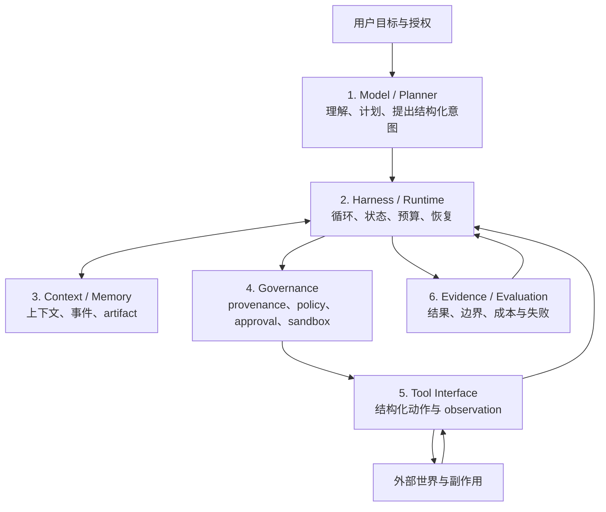
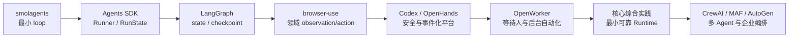
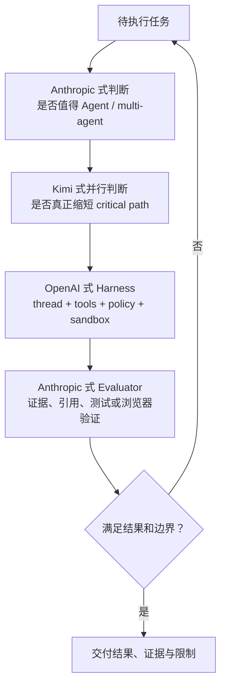
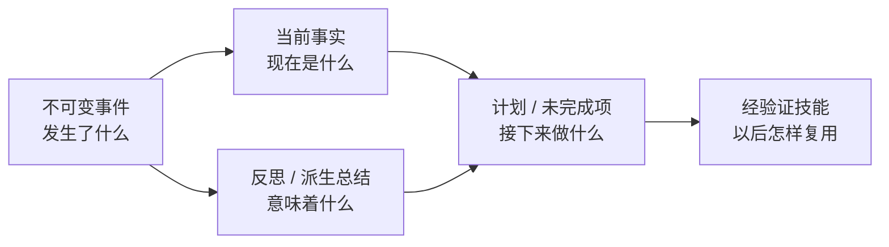
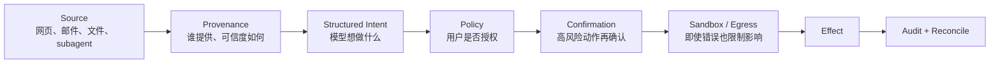
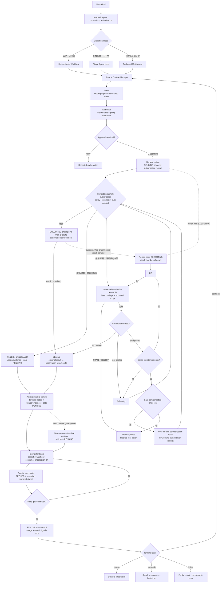
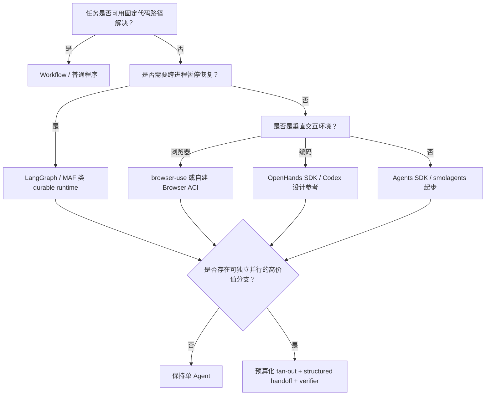

# AI Agent 设计、源码与文献综合参考

> 使用方式：完成第 1–7 章与核心综合实践后阅读。第一遍只读第 0、1、2、6、7、9 节，建立全局地图；真正实现过 runtime 后，再精读第 5 节的生产协议与不变量。本文把十个源码案例、公开工程方案和 2022–2026 年核心文献组合成一张参考架构。  
> 目标：回答三个问题——可靠 Agent 由哪些层组成、不同项目的机制怎样组合、哪些工程问题仍未解决。

## 0. 综合模型

**优秀的 AI Agent 不是“最会自主思考的模型”，而是能在明确授权范围内，把不确定模型决策转化为可观察、可恢复、可验证副作用的系统。**

它至少由六层组成。第一层 **Model / Planner** 只负责理解目标、形成计划并提出结构化意图；授权规则只存在于 **Governance**，不能藏在模型提示词里。**Context / Memory** 和 **Tool Interface** 是与 Harness 协作的独立层：前者供给和沉淀状态，后者承载受约束的动作与 observation，并不是 Harness 内部职责的重复命名。



这六层中，基础模型只位于第一层。图中的编号表达职责分层，不表示所有运行时调用都必须按编号串行；例如 Harness 会同时与 Context 和 Tool 协作，但 policy 的唯一归属仍是 Governance。开源源码、厂商工程披露和论文共同支持这个判断：

- ReAct 解释最小循环；
- SWE-agent 证明接口设计会改变能力；
- LangGraph、MAF、Agents SDK 展示状态与恢复；
- Codex、OpenHands 展示审批、事件和执行环境；
- Anthropic 展示 context engineering 与按需 subagent；
- OpenAI 展示共享 harness 与 source-to-sink 安全；
- Kimi 展示训练动态并行 orchestrator；
- τ-bench、AgentDojo、UnderSpecBench 说明完成率远远不够。

---

## 1. 可靠系统的三个工程门槛

源码中的功能数量不能代替下面三个工程门槛：

1. 恢复门槛：崩溃、暂停、审批后能继续，且不会盲目重复副作用；
2. 安全门槛：存在 provenance、policy、approval、sandbox / network 等系统控制；
3. 评测门槛：同时检查 outcome、多次可靠性、动作边界和证据。

三项门槛必须分别验证。checkpoint 不能证明外部副作用不会重复，approval 不能替代 sandbox，最终答案正确也不能证明过程没有越权。课程中的每个案例只负责提供部分机制，综合实践负责把它们放入同一运行时并进行故障注入。

### 1.1 不同任务应使用不同优秀标准

| 任务 | 最重要的能力 | 典型误判 |
|---|---|---|
| 编码 Agent | 仓库理解、测试反馈、patch 约束、沙箱、恢复 | 只看 SWE-bench 百分比 |
| 浏览器 Agent | DOM/视觉 grounding、页面状态、注入防护、确认 | 只看是否能点到按钮 |
| 研究 Agent | 搜索覆盖、来源质量、引用正确、冲突综合 | 把长答案当深研究 |
| 企业 Workflow | durable state、审批、幂等、审计、连接器权限 | 把多个角色 prompt 当企业级多 Agent |
| 持续个人 Agent | memory 更新/遗忘、定时、隐私、可撤销 | 把无限聊天记录当长期记忆 |
| Agent Swarm | 可分解性、critical path、重复率、合并与成本 | 用 subagent 数量证明更强 |

---

## 2. 十个开源项目各自教会什么

| 项目 | 最值得学习的设计 | 不应从它推断什么 |
|---|---|---|
| [smolagents](agents/01-smolagents.md) | 最容易逐行理解的 ReAct / CodeAct 循环 | 本地 Python executor 不是安全 sandbox |
| [OpenAI Agents SDK](agents/02-openai-agents-sdk.md) | Runner、handoff、guardrail、session、trace 的小原语组合 | 不等于 ChatGPT agent 的内部 runtime |
| [LangGraph](agents/03-langgraph.md) | reducer、superstep、checkpoint、interrupt，把 Agent 变成可恢复图状态机 | 它不会自动替你设计权限与领域工具 |
| [browser-use](agents/04-browser-use.md) | 浏览器 observation、selector map、action registry、失败重观察 | 通用网页成功率不能外推高风险交易可靠性 |
| [Codex](agents/05-codex.md) | typed tool intent、approval、sandbox、network policy、持久 thread | 开源客户端不代表全部云端模型与调度开放 |
| [OpenHands](agents/06-openhands.md) | event-sourced conversation、Agent Server、资源锁、安全确认 | event log 本身不保证外部工具 exactly-once |
| [OpenWorker](agents/07-openworker.md) | durable Inbox、跨重启审批恢复、canonical/outbound 分离与定时授权 | 审批耐久不等于 shell 隔离或副作用 exactly-once |
| [CrewAI](agents/08-crewai.md) | Crew 角色任务与 Flow 持久流程的双层抽象 | 多角色不自动产生可靠调度和恢复 |
| [Microsoft Agent Framework](agents/09-microsoft-agent-framework.md) | Agent 与 Workflow、middleware、session、OTel 和企业 hosting | 抽象丰富不等于学习成本低 |
| [AutoGen](agents/10-autogen-historical.md) | topic/message runtime 和多 Agent 对话的历史影响 | 官方已转向 MAF；不宜作为新项目默认答案 |

### 2.1 学习顺序为什么重要



如果一开始就读 Codex、OpenHands 或企业 Workflow，容易被大量协议、服务和治理代码淹没。课程先建立最小循环和状态语义，再进入领域、安全、产品与多 Agent，完整路径见[课程目录](agents/00-learning-guide.md)。

---

## 3. 三家前沿方案各自推进了什么

详细证据见[闭源 / 部分开源 Agent 专题](11-proprietary-agent-landscape.md)。综合判断如下：

| 路线 | 核心推进 | 对开源实现的启发 | 最大未知 |
|---|---|---|---|
| Anthropic | 把 context engineering、任务可分解性、subagent 隔离和 evaluator 作为中心设计 | 给 LangGraph / MAF 节点加上下文预算、压缩回传和独立验收 | Research/Cowork/Managed Agents 生产调度、分类器和恢复细节 |
| OpenAI | 统一浏览器、终端、连接器；用共享 harness 服务 CLI/IDE/App/Web；强调 source-to-sink | 参考 Codex typed intent、thread、approval、sandbox 和 App Server 分层 | ChatGPT agent planner、产品监控器和云端 scheduler |
| Kimi | PARL 训练 Commander 自主拆分与并行；用 critical steps 衡量 span | 在动态 fan-out 外增加并行收益、重复工作和合并质量的 eval | K3 Swarm 训练继承、生产 scheduler、安全与权限体系 |

三条路线可以组合，而不是互相替代：



---

## 4. 文献对源码分析的六个关键修正

核心文献见[权威论文与近期文章导读](12-authoritative-literature-guide.md)。

### 4.1 ReAct 不是完整 Agent 架构

ReAct 证明 reasoning/action/observation 交错有用，但没有回答 checkpoint、approval、sandbox 和 cancellation。源码中 smolagents 接近论文抽象；Codex 和 OpenHands 才展示生产外壳。

### 4.2 Memory 不是一个向量数据库

Generative Agents、Voyager、LongMemEval 与源码共同显示，至少要区分：



事件应可追溯；事实应允许更新；反思带不确定性；计划可失效；技能必须有适用条件和验证证据。把五者混进 semantic search 会产生陈旧事实和 memory poisoning。

### 4.3 Tool schema 之外还有 Agent-Computer Interface

SWE-agent、WebArena、OSWorld 与 browser-use 都说明：

- observation 是否紧凑、稳定、有身份；
- action 是否可组合、可撤销、可授权；
- 环境是否可重置并提供真实反馈；
- evaluator 是否检查最终状态；

这些问题往往比“工具有多少个”更决定表现。

### 4.4 多 Agent 的默认答案应该是“不使用”

只有同时满足以下条件才值得 fan-out：

1. 子任务大体独立；
2. 每个分支有足够的信息价值；
3. 输出可以结构化合并或独立验证；
4. 并行能缩短 critical path；
5. token、工具和失败成本在预算内；
6. orchestrator 能看见 worker 生命周期和状态所有权。

否则单 Agent + tools、固定 workflow 或 planner/evaluator 两阶段通常更稳。

### 4.5 Benchmark 结果必须带实验身份证

```yaml
agent_eval:
  model: exact-version
  harness: name-and-commit
  tools: schemas-and-versions
  environment: resettable-version
  budgets:
    tokens: N
    turns: N
    wall_time: N
  context:
    compaction: policy-version
    memory: schema-version
  sampling:
    attempts: N
    selector: none-or-judge-version
  governance:
    approvals: policy
    network: policy
  metrics:
    - task_success
    - pass_power_k
    - boundary_violations
    - recovery_success
    - cost_and_latency
```

没有这些信息，“模型 A 在 benchmark 上高于模型 B”通常不能转化成架构选择。

### 4.6 安全是 action mediation，不只是内容过滤

AgentDojo、AgentHarm、BrowserART、UnderSpecBench 和三家公司事故/系统卡共同支持：



模型防注入训练、外部 policy、用户确认和 sandbox 是互补层；任何一层都不应被宣传成单点解决方案。

---

## 5. 推荐的生产 Agent 参考架构

### 5.1 核心控制流



### 5.2 等价伪代码

下面是参考协议，不对应任何具体框架 API。关键点是把外部动作当成有持久状态的协议，而不是一次普通函数调用。授权票据随 action 持久绑定 policy / contract 的身份与版本、动作范围、有效期、撤销引用和授权上下文；旧票据只证明当时允许，不是恢复时的永久通行证。`PENDING` 首次执行、对账确认未执行后的重试、同 key 幂等重试和补偿，都必须在副作用前按当前 policy、contract 与 auth context 重验。补偿 intent 还要取得自己的授权票据；reconcile 若需要读取外部系统，也要以单独、最小范围的授权执行。

启动恢复产生的每个 outcome 都必须先经过 invariant、预算和终止检查，才能回到 Model / Planner。一次 gate 调用开始时发现的所有 `gate=PENDING` action 构成结算快照：即使其中一个已经给出终态信号，也必须先为整批 action 持久化 evaluation、usage `consume_once` 与 gate receipt，再在循环后合并终态，不能让终态跳过同批已完成 action 的用量或评估。

```python
from enum import StrEnum


class ActionStatus(StrEnum):
    PENDING = "PENDING"
    EXECUTING = "EXECUTING"
    SUCCEEDED = "SUCCEEDED"
    FAILED = "FAILED"
    UNKNOWN = "UNKNOWN"


class GateStatus(StrEnum):
    PENDING = "PENDING"
    APPLIED = "APPLIED"


class AuthorizationReceipt:
    policy_id: str
    policy_version: str
    contract_id: str
    contract_version: str
    authorized_scope: object
    issued_at: object
    expires_at: object | None
    revocation_ref: str | None
    revocation_epoch: int
    auth_context_digest: str


class ToolCapability:
    supports_idempotency: bool
    supports_reconcile: bool
    supports_compensate: bool
    reconciliation_locators: set[str]  # external_identity / idempotency_key / action_id


class DurableActionRecord:
    id: str
    tool_name: str
    intent: object
    decision: object
    authorization_receipt: AuthorizationReceipt
    status: ActionStatus
    idempotency_key: str | None
    external_identity: str | None
    reconciliation_locator: tuple[str, str] | None
    execution_constraints: dict
    external_result: object | None
    observation: object | None
    usage: object
    evidence: object
    gate_status: GateStatus | None
    gate_receipt: object | None
    compensates_action_id: str | None


class RecoveryOutcome:
    action_ids: list[str]
    status: ActionStatus
    usage: object
    evidence: object


class Pause(Exception):
    action_id: str


def pause_for_manual_reconciliation(action, session):
    session.transition(action.id, ActionStatus.UNKNOWN)
    session.escalate_for_manual_reconciliation(action)
    session.blocked_on_action = action.id
    session.checkpoint()
    raise Pause(action.id)


def ensure_no_unresolved_unknown(session):
    unresolved = session.first_unresolved_action(ActionStatus.UNKNOWN)
    if unresolved is not None:
        pause_for_manual_reconciliation(unresolved, session)


def fail_without_execution(action, session, authorization_check):
    """已确认动作未执行时，把失效授权结算为可审计终态，而不是重放。"""
    session.pair_result_and_observation(
        action.id,
        external_result=None,
        observation=authorization_check.reason,
        status=ActionStatus.FAILED,
        usage=zero_usage(),
        evidence=authorization_failure_evidence(authorization_check),
        gate_status=GateStatus.PENDING,
    )
    return session.action_outcome(action.id)


def revalidate_before_side_effect(
    action,
    session,
    policy,
    contract,
    *,
    external_state,
):
    """每次可能产生副作用前，都以当前授权上下文重验原票据及动作范围。"""
    check = policy.revalidate_authorization(
        receipt=action.authorization_receipt,
        intent=action.intent,
        current_policy_version=policy.version,
        current_contract=contract,
        current_auth_context=session.current_auth_context(),
    )
    session.persist_authorization_check(action.id, check)

    if check.allowed:
        # 新票据仍绑定 policy/contract 版本、scope、expiry、revocation 与 auth context。
        session.replace_authorization_receipt(action.id, check.authorization_receipt)
        return check
    if external_state == "NOT_APPLIED":
        return fail_without_execution(action, session, check)

    # 外部状态未知时，撤销/过期/越界授权只能进入单独受权的 reconcile 或人工暂停；
    # 即使工具支持幂等 key，也不得把旧票据当成重放许可。
    return pause_for_manual_reconciliation(action, session)


def authorize_reconciliation(action, tool, session, policy, contract):
    """reconcile 也是独立外部操作；按最小只读范围单独授权和审计。"""
    reconcile_intent = tool.describe_reconciliation(
        action.reconciliation_locator,
        requested_scope="read external status for this action only",
    )
    decision = policy.authorize(
        reconcile_intent,
        provenance_for_reconciliation(action, session.events),
        contract,
        auth_context=session.current_auth_context(),
    )
    if decision.requires_confirmation:
        decision = human_confirm(reconcile_intent, decision.risk)
    if not decision.allowed:
        return None

    receipt = bind_authorization_receipt(
        decision,
        policy=policy,
        contract=contract,
        auth_context=session.current_auth_context(),
    )
    session.persist_reconciliation_authorization(action.id, receipt)
    return decision.execution_constraints


def create_compensation_action(original, tool, session, policy, contract):
    """补偿也是副作用：创建独立记录，不在 UNKNOWN 分支中裸调用。"""
    compensation_intent = tool.describe_compensation(original)
    compensation_tool = tool_registry.resolve(compensation_intent.tool_name)
    capability = compensation_tool.capability

    # 补偿不是原授权的隐式延伸；它必须带来源重新经过 policy 与确认。
    provenance = provenance_for_compensation(original, session.events)
    decision = policy.authorize(
        compensation_intent,
        provenance,
        contract,
        auth_context=session.current_auth_context(),
    )
    if decision.requires_confirmation:
        decision = human_confirm(compensation_intent, decision.risk)
    if not decision.allowed:
        session.append_denial(compensation_intent, decision.reason)
        return pause_for_manual_reconciliation(original, session)

    # 自动补偿至少要有一条可安全收敛的恢复路径。
    if not (capability.supports_idempotency or capability.supports_reconcile):
        return None

    action_id = session.new_action_id()
    key = action_id if capability.supports_idempotency else None
    external_identity = external_identity_for(compensation_intent)
    locator = choose_supported_locator(
        capability.reconciliation_locators,
        external_identity=external_identity,
        idempotency_key=key,
        action_id=action_id,
    )
    if not capability.supports_idempotency and locator is None:
        return None

    compensation = session.create_action_record(
        id=action_id,
        intent=compensation_intent,
        decision=decision,
        authorization_receipt=bind_authorization_receipt(
            decision,
            policy=policy,
            contract=contract,
            auth_context=session.current_auth_context(),
        ),
        status=ActionStatus.PENDING,
        idempotency_key=key,
        external_identity=external_identity,
        reconciliation_locator=locator,
        execution_constraints=narrowest_constraints(
            original.execution_constraints,
            decision.execution_constraints,
        ),
        usage=zero_usage(),
        evidence=None,
        gate_status=None,
        gate_receipt=None,
        compensates_action_id=original.id,
    )
    session.link_compensation(original.id, compensation.id)
    session.checkpoint()
    return compensation, compensation_tool


def recover_action(action, tool, session, policy, contract) -> RecoveryOutcome:
    """恢复协议：先对账；能力契约与当前授权都允许时才重放或补偿。"""
    capability = tool.capability

    # PENDING 已持久化，但尚未进入可能触发副作用的执行区间。
    if action.status == ActionStatus.PENDING:
        return execute_recorded_action(
            action,
            tool,
            session,
            policy,
            contract,
            external_state="NOT_APPLIED",
        )

    if (
        capability.supports_reconcile
        and action.reconciliation_locator is not None
        and tool.can_reconcile(action)
    ):
        reconcile_constraints = authorize_reconciliation(
            action,
            tool,
            session,
            policy,
            contract,
        )
        if reconcile_constraints is None:
            return pause_for_manual_reconciliation(action, session)
        locator_kind, locator_value = action.reconciliation_locator
        external = tool.reconcile(
            locator_kind,
            locator_value,
            constraints=reconcile_constraints,
        )
        if external.proves_succeeded:
            session.pair_result_and_observation(
                action.id,
                external_result=external.result,
                observation=observe(external.result),
                status=ActionStatus.SUCCEEDED,
                usage=external.usage,
                evidence=external.reconciliation_evidence,
                gate_status=GateStatus.PENDING,
            )
            return session.recovery_outcome(action.id)
        if external.proves_not_applied:
            return execute_recorded_action(
                action,
                tool,
                session,
                policy,
                contract,
                external_state="NOT_APPLIED",
            )

    # 工具不能对账，或对账结果不足以确认外部世界是否已改变。
    session.transition(action.id, ActionStatus.UNKNOWN)
    session.checkpoint()

    if capability.supports_idempotency and action.idempotency_key is not None:
        # 这是工具明确承诺的同 key 收敛，不是盲目重放。
        return execute_recorded_action(
            action,
            tool,
            session,
            policy,
            contract,
            external_state="UNKNOWN",
        )

    # 未知动作若还要通过补偿产生新副作用，原动作授权也必须仍在当前窗口内；
    # 撤销或过期只能继续受权 reconcile，或停给人工，不能转入自动补偿链。
    revalidate_before_side_effect(
        action,
        session,
        policy,
        contract,
        external_state="UNKNOWN",
    )

    # 补偿动作自身不再递归创建“补偿的补偿”；它未知时必须人工处理。
    if action.compensates_action_id is not None:
        return pause_for_manual_reconciliation(action, session)

    existing = session.compensation_for(action.id)
    if existing is not None:
        compensation_tool = tool_registry.resolve(existing.tool_name)
        if existing.status != ActionStatus.SUCCEEDED:
            compensation_outcome = recover_action(
                existing,
                compensation_tool,
                session,
                policy,
                contract,
            )
        else:
            compensation_outcome = session.recovery_outcome(existing.id)
        if session.status_of(existing.id) == ActionStatus.SUCCEEDED:
            session.resolve_as_compensated(
                action.id,
                existing.id,
                usage=zero_usage(),
                evidence=compensation_evidence(existing.id),
                gate_status=GateStatus.PENDING,
            )
            return session.combine_recovery_outcomes(
                original_action_id=action.id,
                outcomes=[compensation_outcome],
            )
        return pause_for_manual_reconciliation(existing, session)

    if capability.supports_compensate and tool.compensation_is_safe_when_unknown(action):
        prepared = create_compensation_action(
            action,
            tool,
            session,
            policy,
            contract,
        )
        if prepared is not None:
            compensation, compensation_tool = prepared
            compensation_outcome = execute_recorded_action(
                compensation,
                compensation_tool,
                session,
                policy,
                contract,
                external_state="NOT_APPLIED",
            )
            if session.status_of(compensation.id) == ActionStatus.SUCCEEDED:
                session.resolve_as_compensated(
                    action.id,
                    compensation.id,
                    usage=zero_usage(),
                    evidence=compensation_evidence(compensation.id),
                    gate_status=GateStatus.PENDING,
                )
                return session.combine_recovery_outcomes(
                    original_action_id=action.id,
                    outcomes=[compensation_outcome],
                )

    return pause_for_manual_reconciliation(action, session)


def execute_recorded_action(
    action,
    tool,
    session,
    policy,
    contract,
    *,
    external_state,
):
    authorization_check = revalidate_before_side_effect(
        action,
        session,
        policy,
        contract,
        external_state=external_state,
    )
    if isinstance(authorization_check, RecoveryOutcome):
        return authorization_check

    capability = tool.capability
    session.transition(action.id, ActionStatus.EXECUTING)
    session.checkpoint()  # 必须发生在外部副作用之前。

    key = action.idempotency_key if capability.supports_idempotency else None
    try:
        external_result = tool.execute(
            action.intent,
            idempotency_key=key,
            constraints=narrowest_constraints(
                action.execution_constraints,
                authorization_check.execution_constraints,
            ),
            cancellation=session.cancellation,
        )
    except ConfirmedNotApplied as error:
        session.pair_result_and_observation(
            action.id,
            external_result=error,
            observation=observe(error),
            status=ActionStatus.FAILED,
            usage=error.usage,
            evidence=failure_evidence(error),
            gate_status=GateStatus.PENDING,
        )
        return session.action_outcome(action.id)

    # 在同一持久事务中绑定终态、外部结果、observation、usage/evidence，
    # 并把 gate 设为 PENDING。
    # 若进程在 execute 成功后、此事务提交前崩溃，记录仍为 EXECUTING，
    # 恢复入口会先 reconcile，而不会假定失败并直接重放。
    session.pair_result_and_observation(
        action.id,
        external_result=external_result,
        observation=observe(external_result),
        status=ActionStatus.SUCCEEDED,
        usage=external_result.usage,
        evidence=result_evidence(external_result),
        gate_status=GateStatus.PENDING,
    )
    return session.action_outcome(action.id)


def apply_pending_gates(session, contract, budgets, action_ids=None):
    """结算本次快照中的全部 durable gate，然后才合并并返回终态。"""
    actions = prioritize_actions(
        list(session.terminal_actions_with_gate(GateStatus.PENDING)),
        preferred_action_ids=action_ids,
    )
    for action in actions:
        # evaluator 对同一 durable evidence 必须可重复；结果按 action ID 只持久化一次。
        evaluation = session.evaluation_for(action.id)
        if evaluation is None:
            evaluation = evaluator.check_step_invariants(
                session,
                contract,
                action_status=action.status,
                action_evidence=action.evidence,
            )
            session.persist_evaluation_once(action.id, evaluation)

        # 若在这里与 gate 提交之间崩溃，同一 ledger key 会返回原 receipt，不会双扣。
        budget_receipt = budgets.consume_once(action.id, action.usage)
        terminal_signal = terminal_signal_for(action, evaluation, budgets)

        # 每个 gate 独立持久化；terminal signal 也进入 receipt，供崩溃后重新合并。
        session.commit_applied_gate(
            action.id,
            gate_status=GateStatus.APPLIED,
            gate_receipt={
                "evaluation": evaluation,
                "budget": budget_receipt,
                "terminal_signal": terminal_signal,
            },
        )

    # 禁止在循环内提前 return：本次调用发现的每个已完成 action 都必须先完成
    # evaluation 与 consume_once。合并也读取此前已持久化但尚未消费的 signal，
    # 因而“最后一个 gate 已提交、终态尚未提交”处崩溃仍可恢复。
    signals = session.unconsumed_terminal_signals()
    terminal_decision = merge_terminal_signals(signals, session, budgets)
    if terminal_decision is not None:
        session.commit_terminal_decision_once(
            terminal_decision,
            consumed_signal_ids=[signal.id for signal in signals],
        )
        return result_for_terminal_state(session)
    return None


def run_agent(goal, session, policy, budgets):
    contract = normalize_goal_and_authority(goal, policy)
    mode = choose_execution_mode(contract)

    # 先补做已终态但 gate 未应用的动作；完成前不得恢复其他副作用。
    terminal_result = apply_pending_gates(session, contract, budgets)
    if terminal_result is not None:
        return terminal_result

    for action in session.actions_with_status(
        ActionStatus.PENDING,
        ActionStatus.EXECUTING,
        ActionStatus.UNKNOWN,
    ):
        # 前一个恢复可能已连带解决其补偿记录；按 durable state 再判断一次。
        if session.status_of(action.id) not in {
            ActionStatus.PENDING,
            ActionStatus.EXECUTING,
            ActionStatus.UNKNOWN,
        }:
            continue
        outcome = recover_action(
            action,
            tool_registry.resolve(action.tool_name),
            session,
            policy,
            contract,
        )
        terminal_result = apply_pending_gates(
            session,
            contract,
            budgets,
            action_ids=outcome.action_ids,
        )
        if terminal_result is not None:
            return terminal_result
    ensure_no_unresolved_unknown(session)

    while not session.terminal:
        # UNKNOWN 是硬暂停门槛；未解决前禁止生成新 proposal 或触发新副作用。
        ensure_no_unresolved_unknown(session)
        context = context_manager.build(
            contract=contract,
            durable_state=session.state,
            recent_events=session.events,
            token_budget=budgets.remaining_tokens,
        )

        proposal = model.propose_next(
            context=context,
            tools=policy.allowed_tool_schemas(contract),
            mode=mode,
        )

        if proposal.is_final:
            evidence = evaluator.verify_result(
                proposal.result,
                contract.acceptance_criteria,
                session.events,
            )
            if evidence.satisfies_result_and_boundary:
                return complete(proposal.result, evidence)
            session.record_verification_failure(evidence)
            continue

        intent = validate_schema(proposal.intent)
        provenance = trace_inputs_that_influenced(intent, session.events)
        decision = policy.authorize(
            intent,
            provenance,
            contract,
            auth_context=session.current_auth_context(),
        )

        if decision.requires_confirmation:
            decision = human_confirm(intent, decision.risk)
        if not decision.allowed:
            session.append_denial(intent, decision.reason)
            continue

        tool = tool_registry.resolve(intent.tool_name)
        capability = tool.capability
        action_id = session.new_action_id()
        key = action_id if capability.supports_idempotency else None
        external_identity = external_identity_for(intent)
        locator = choose_supported_locator(
            capability.reconciliation_locators,
            external_identity=external_identity,
            idempotency_key=key,
            action_id=action_id,
        )

        # authorize 之后先创建 durable action；幂等 key 只交给明确支持它的工具。
        action = session.create_action_record(
            id=action_id,
            intent=intent,
            decision=decision,
            authorization_receipt=bind_authorization_receipt(
                decision,
                policy=policy,
                contract=contract,
                auth_context=session.current_auth_context(),
            ),
            status=ActionStatus.PENDING,
            idempotency_key=key,
            external_identity=external_identity,
            reconciliation_locator=locator,
            execution_constraints={
                "sandbox": decision.sandbox,
                "network": decision.network_policy,
            },
            usage=zero_usage(),
            evidence=None,
            gate_status=None,
            gate_receipt=None,
            compensates_action_id=None,
        )
        session.checkpoint()
        outcome = execute_recorded_action(
            action,
            tool,
            session,
            policy,
            contract,
            external_state="NOT_APPLIED",
        )
        terminal_result = apply_pending_gates(
            session,
            contract,
            budgets,
            action_ids=outcome.action_ids,
        )
        if terminal_result is not None:
            return terminal_result

    return partial_result_with_recovery_state(session)
```

### 5.3 最重要的不变量

- 模型只能提出意图，不能绕过 policy 直接执行；
- tool result 和 subagent result 都是带 provenance 的数据；
- action、外部结果与 observation 通过稳定 action ID 配对；
- checkpoint 不只保存对话，还保存 PENDING / EXECUTING / SUCCEEDED / FAILED / UNKNOWN action、审批、预算和外部 artifact 引用；
- 每个 durable action 的 authorization receipt 必须绑定 policy / contract 身份与版本、授权 scope、expiry、revocation 引用和 auth context；恢复不能把历史批准视为当前批准；
- `PENDING` 执行、对账确认未执行后的重试、同 key 幂等重试与补偿执行，必须在副作用前用当前 policy、contract 和 auth context 重验；补偿使用独立票据，reconcile 也按自身所需权限单独授权并限制范围；
- 授权已撤销、过期或不再覆盖动作时：若已确认原动作未执行，则记录 FAILED / CANCELLED、usage/evidence 与 `gate=PENDING` 后进入 gate；若外部状态未知，则只能做获单独授权的 reconcile 或人工暂停，不得重放，也不得自动转入补偿链；
- action 进入 SUCCEEDED / FAILED 时，外部结果、observation、usage、evidence 与 `gate=PENDING` 必须原子持久化；
- evaluator 结果按 action ID 持久化且可重复计算，预算使用同一 action ID `consume_once`；一次调用发现的全部 pending gates 必须逐个结算并持久化，循环后才合并终态信号，任何终态都不能跳过同批已完成 action 的 usage / evaluation；
- `gate=APPLIED` receipt 持久保存 terminal signal，合并后的 terminal decision 与 signal 消费原子提交；任一点崩溃重放都不会双扣或丢失终态；
- 恢复时先对账；仅在工具能力契约保证幂等，或对账证明动作未发生时重试，否则补偿或交给人工；
- context compaction 不改变 durable state；
- evaluator 同时检查结果、授权边界和证据；
- 预算耗尽或确认拒绝是正常终止状态，不应伪装成成功。

---

## 6. 如何选择架构，而不是选择品牌



### 6.1 典型选择

| 目标 | 推荐起点 | 必须自行补齐 |
|---|---|---|
| 学习最小 Agent | smolagents | 持久、审批、沙箱、安全 eval |
| Python 快速产品化 | OpenAI Agents SDK | 领域状态、真实工具权限、恢复测试 |
| 可暂停恢复业务流程 | LangGraph | action policy、幂等和环境隔离 |
| 企业 Workflow / 多 Agent | MAF | 明确所有权、避免抽象过度 |
| 编码 Agent 产品 | OpenHands SDK；参考 Codex | 仓库隔离、secret、network、测试证据 |
| 浏览器 Agent | browser-use | prompt injection、账户/交易确认、环境版本 |
| 研究 Agent | LangGraph/MAF + 搜索/浏览 ACI | 来源质量、引用验证、上下文预算 |
| 大规模 Swarm | 先做单 Agent 基线，再动态 fan-out | critical-path eval、合并、去重、成本和信任传播 |

---

## 7. Agent 成熟度阶梯

| 等级 | 能力 | 完成门槛 |
|---|---|---|
| L0：工具调用 Demo | 模型能调用一个工具 | schema 正确、失败可见 |
| L1：可控循环 | 多步行动、预算、终止 | 无无限循环；错误进入状态 |
| L2：可观察 | typed events、trace、cost | 能定位每次意图和 observation |
| L3：可恢复 | checkpoint、resume、cancel | 测过崩溃、审批与重复副作用 |
| L4：受治理 | provenance、policy、approval、sandbox | 测过注入、越权、secret 与网络出口 |
| L5：可验证 | execution-based eval、`pass^k`、boundary checks | 结果、授权和证据都通过 |
| L6：可并行 | 动态 subagent、隔离上下文、合并 | 证明缩短 critical path 且收益覆盖成本 |
| L7：持续运行 | 长期 memory、schedule、身份与审计 | 更新/遗忘、污染、漂移和人工接管均受控 |

大多数开源框架擅长 L1–L3 的某些部分；Codex/OpenHands 的公开源码提供了部分 L4 primitives，但没有特定部署的完整攻防、secret/network 与恢复评测，不能据此断言整个产品已经达到 L4。L5–L7 通常仍需要应用团队自行构建和验证。产品宣传中的“自主”不能代替这张成熟度表。

---

## 8. 当前最重要的开放问题

### 8.1 Exactly-once 副作用仍没有通用答案

checkpoint 可以保存“模型已经决定调用工具”和执行前的 durable action，却无法自动保证支付、发信、部署或数据库写入只执行一次。可靠系统需要按工具能力声明选择幂等 key、外部状态对账、补偿动作或人工升级；如果工具既不能对账，也不承诺幂等或安全补偿，系统必须保留 `UNKNOWN`，不能把重放伪装成 exactly-once。

### 8.2 Context compaction 会丢失哪些不变量

摘要能节省 token，却可能删除用户限制、失败原因和未完成项。应把授权、任务合同和 pending state 放在结构化 durable state 中，并测试 compaction 前后行为等价性。

### 8.3 Multi-agent trust 如何传播

子 Agent 读取恶意网页后，压缩结果可能获得错误的更高信任等级。handoff schema 需要保留来源、引用、置信和未验证标记，而不只传最终文本。

### 8.4 Agent eval 如何保持新鲜且可复现

静态任务会污染；在线环境会漂移；LLM judge 会偏；真实任务可能产生危险副作用。未来 benchmark 需要私有或动态任务、版本化环境、execution-based verifier、独立 trajectory audit 和公开成本。

### 8.5 更强模型会让 Harness 变简单还是更危险

更强模型能减少显式编排，却也更容易找到环境中的意外路径。Harness 应删除只为弥补旧模型的脆弱 prompt，同时保留权限、隔离、日志和不变量检查等非概率边界。

---

## 9. 学习与实践路线

### 阶段一：建立 loop 与状态模型

1. 用 [smolagents](agents/01-smolagents.md) 逐行追踪最小 action–observation loop；
2. 用 [Agents SDK](agents/02-openai-agents-sdk.md) 区分配置、Runner、handoff 和可恢复状态；
3. 用 [LangGraph](agents/03-langgraph.md) 实现 reducer、parallel branch、checkpoint 和 interrupt；
4. 在纸上推演正常终止、预算耗尽、暂停和失败四条路径。

### 阶段二：进入真实环境与产品运行时

1. 用 [browser-use](agents/04-browser-use.md) 重新设计领域 observation/action，而不是堆工具；
2. 用 [Codex](agents/05-codex.md) 分离 typed intent、approval、sandbox 与 execution result；
3. 用 [OpenHands](agents/06-openhands.md) 学习 event log、派生 view 和资源锁；
4. 用 [OpenWorker](agents/07-openworker.md) 处理跨重启等待人、模型视图压缩和后台授权。

### 阶段三：完成核心综合实践

1. 实现[最小可靠 Agent Runtime](14-capstone-agent-runtime.md)；
2. 刻意在 intent、approval、effect 和 result 的边界注入崩溃；
3. 加入独立 `effect_id`、execution journal 和外部状态对账；
4. 用重复运行而非单次演示验证恢复、安全与终止语义。

### 阶段四：把 Multi-Agent 当进阶选择

1. 完成 [CrewAI](agents/08-crewai.md)、[MAF](agents/09-microsoft-agent-framework.md) 与 [AutoGen](agents/10-autogen-historical.md) 的机制对照；
2. 先测单 Agent baseline，只拆独立、高价值、可验证的分支；
3. handoff 带来源、artifact、置信与未决问题；
4. 测 critical path、总 token、重复工作、合并错误和 worker failure；
5. 只有在质量或延迟有稳定净收益时保留 fan-out。

---

## 10. 各路线的学习价值

- **smolagents**：最适合看清 Agent 的骨架。
- **Agents SDK**：最适合用少量原语构造 Python Agent。
- **LangGraph**：最适合理解可恢复的状态计算。
- **browser-use**：最适合研究垂直 Agent 的 observation/action 重构。
- **Codex**：最适合研究模型意图怎样进入受控计算环境。
- **OpenHands**：最适合研究事件驱动的完整编码 Agent 平台。
- **OpenWorker**：最适合研究等待人、跨重启恢复与后台自动化授权。
- **CrewAI**：最适合快速表达角色/任务团队，但要警惕状态语义混杂。
- **MAF**：最适合研究企业 Agent 与 Workflow 的统一平台。
- **AutoGen**：最适合理解多 Agent 消息抽象的历史影响。
- **Anthropic**：最值得学习上下文纪律、任务选择和独立 evaluator。
- **OpenAI**：最值得学习共享 harness、工具治理和 source-to-sink。
- **Kimi**：最值得学习 orchestrator 训练、context shard 与 critical-path 并行。

## 11. 最后的判断

2023 年的问题是“怎样让 LLM 行动”；2024 年的问题是“怎样给它一个真实环境”；2025 年的问题是“为什么它偶尔成功却不可靠”；2026 年的问题逐渐变成“怎样在长程、模糊和对抗环境中约束、恢复、审计并证明它做对了”。

因此，下一代优秀 Agent 不会只靠更多 reasoning token 或更多 subagent。它更像一个由概率模型驱动的事务系统：

- 用模型处理开放决策；
- 用代码维护状态与不变量；
- 用 policy 和 sandbox 控制权限；
- 用 event 和 artifact 承载事实；
- 用 evaluator 和人工确认建立可信闭环。

当一个系统能明确回答“下一步由谁决定、状态如何合并、失败如何恢复、副作用如何获权、证据如何验证”，它才从 Agent demo 进入工程系统。
