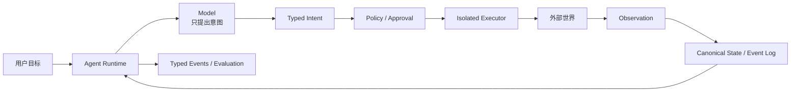

# 核心综合实践：设计一个最小可靠 Agent Runtime

> 先修章节：第 1–7 章。完成后可继续学习第 8–10 章的多 Agent 与企业编排；扩展参考见[AI Agent 设计、源码与文献综合参考](13-integrated-synthesis.md)。

## 实践目标

前七章分别讲解了 loop、Runner、checkpoint、浏览器状态、安全执行、事件化平台和人类注意力。本章不再引入新框架，而是把这些机制组合成一个可以解释、实现和测试的最小运行时。多 Agent 不是本实践的前置条件：先证明一个 Agent 能可靠地运行、暂停和恢复，再决定是否需要多个 Agent。

完成后，你应该拥有一个小型 Agent，它能够：

- 让模型提出 typed tool intent；
- 用确定性 reducer 合并并行读取结果；
- 让 action 绑定版本化 observation，并在状态过期后重新观察；
- 在副作用前执行 policy 与人工审批；
- 保存 canonical history；
- 在进程重启后恢复未完成动作；
- 区分正常完成、预算耗尽、取消和失败；
- 对外部副作用使用幂等键、执行日志与对账，并能显式保留 `UNKNOWN`；
- 输出足够的 typed event 来解释发生了什么。

## 1. 先画边界，再写循环



先写下每层不负责什么：

| 层 | 负责 | 不负责 |
|---|---|---|
| Model | 理解目标、提出结构化动作 | 决定最终权限、直接操作环境 |
| Runtime | 循环、预算、状态、恢复、取消 | 替业务系统保证事务一致性 |
| Governance | policy、approval、权限上限 | 生成任务计划或业务结果 |
| Executor | 在明确环境中执行动作 | 修改授权规则、重写模型意图 |
| State/Event | 保存已发生事实 | 猜测未落盘的远端副作用是否成功 |
| Evaluation | 判断结果、成本和边界 | 充当运行时事实源 |

如果一个模块同时拥有“模型意图、权限决定和系统执行”，先拆开再继续。

## 2. 定义最小状态模型

不要从 `messages: list` 开始。先定义运行时需要区分的事实：

```python
class RunState:
    run_id: str
    status: Literal[
        "running", "waiting_approval", "waiting_reconciliation", "completed",
        "cancelled", "budget_exhausted", "failed",
    ]
    canonical_items: list[RunItem]
    committed_version: int
    evidence: list[Evidence]
    pending_writes: list[StateWrite]
    pending_tool_calls: dict[str, ToolCall]
    approvals: dict[str, AuthorizationReceipt]
    observations: dict[str, Observation]
    effect_journal: dict[str, EffectRecord]
    iteration: int
    budgets: Budgets

class RunItem:
    id: str
    kind: Literal[
        "user_input", "model_output", "observation", "state_commit",
        "tool_intent", "approval", "effect_status",
        "tool_result", "error", "final",
    ]
    payload: dict
    created_at: datetime
```

必须能回答：

- 哪条 tool call 已经由模型提出？
- 哪条已经批准、拒绝或执行？
- 哪条存在 intent 但没有 result？
- action 依据的是哪个 observation 版本？
- 哪些并行写入已经 committed，哪些仍是 pending？
- 当前终止是成功、取消、预算耗尽还是错误？
- 重新构造模型输入时，哪些 canonical facts 可以压缩，哪些必须逐字保留？

## 3. 加入确定性状态合并与领域 Observation

不需要复刻完整图运行时，但必须把第 3、4 章的两个核心能力带入项目。

先让并行读取节点只读取同一份 committed snapshot，再用显式 reducer 合并结果：

```python
async def collect_evidence(state):
    snapshot = state.committed_view()
    writes = await gather(
        read_repository(snapshot),
        read_external_docs(snapshot),
    )
    merged = evidence_reducer(state.evidence, writes)
    commit(state, evidence=merged)  # 整批写入一次提交。
```

再让领域动作绑定产生它的 observation，而不是只保存一个脆弱 selector：

```python
class Observation:
    id: str
    world_version: str
    facts: dict
    action_refs: dict[str, ActionRef]

async def execute_domain_action(state, intent):
    observation = state.observations[intent.observation_id]
    current = await environment.version()
    if current != observation.world_version:
        append_and_persist(state, stale_observation(intent.id))
        return await observe_again(state)
    return await environment.execute(observation.action_refs[intent.ref])
```

本阶段验收：

- 交换两个读取分支的完成顺序，合并结果保持一致；
- 失败尝试的 pending writes 不进入 committed state；
- 环境版本变化后，旧 action ref 被拒绝，并产生新的 observation；
- checkpoint 同时保存 committed state 和 observation identity。

## 4. 实现有界 Agent Loop

```python
async def run(state):
    while state.status == "running":
        if state.iteration >= state.budgets.max_iterations:
            state.status = "budget_exhausted"
            persist(state)
            return state

        outbound = build_model_view(state.canonical_items)
        turn = await model.generate(outbound, tool_schemas())
        append_and_persist(state, model_item(turn))

        if turn.final is not None:
            append_and_persist(state, final_item(turn.final))
            state.status = "completed"
            persist(state)
            return state

        await process_tool_calls(state, turn.tool_calls)
        state.iteration += 1
```

本阶段验收：

- 每个失败 observation 都进入下一轮模型输入；
- max iterations 与正常 final 使用不同状态；
- cancel 能停止模型流和未开始的工具；
- tool call 在执行前已经进入 canonical state。

## 5. 把授权和执行分开

```python
async def process_tool_call(state, call):
    intent = register_intent(state, call)
    decision = policy.evaluate(intent)

    if decision.needs_user:
        persist_approval_item(state, intent)
        state.status = "waiting_approval"
        persist(state)
        return

    if decision.denied:
        append_and_persist(state, tool_error(call.id, decision.reason))
        return

    result = await executor.run(
        intent,
        sandbox=decision.sandbox,
        network=decision.network,
    )
    append_and_persist(state, tool_result(call.id, result))
```

本阶段验收：

- 模型不能传入或覆盖 sandbox policy；
- rejected、forbidden、command failure 与 sandbox denial 可区分；
- approval item 绑定稳定 tool-call id；
- 批准一次不会隐式批准参数不同的新动作。

## 6. 实现真正可推演的恢复

恢复函数不应直接重新调用模型：

```python
async def resume(run_id):
    state = load(run_id)
    pending = find_intents_without_results(state.canonical_items)

    for call in pending:
        receipt = state.approvals.get(call.id)
        if receipt is None:
            state.status = "waiting_approval"
            return state

        # 历史票据只证明当时允许；恢复前必须按当前上下文重验。
        decision = policy.revalidate(
            intent=call,
            receipt=receipt,
            current_policy_version=policy.version,
            auth_context=current_auth_context(),
        )
        if not decision.allowed:
            append_and_persist(state, authorization_invalid(call.id, decision.reason))
            continue

        await execute_resolved_call(state, call, decision)

    state.status = "running"
    return await run(state)
```

至少测试四个崩溃窗口：

| 崩溃点 | 恢复后期望行为 |
|---|---|
| tool intent 落盘前 | 允许重新采样，因为系统没有保存该事实 |
| intent 已落盘、等待审批 | 继续等待原 approval item，不重新采样 |
| 已批准、工具尚未执行 | 不重新采样；先按当前 policy、票据有效期与 auth context 重验，再决定执行或终止 |
| 远端成功、result 未落盘 | 进入对账；只在同 key 幂等、确认未执行或安全补偿成立时自动处理，否则保留 `UNKNOWN` |

## 7. 为副作用建立第二种身份

`tool_call_id` 只能标识模型提出的动作，不能自动标识远端系统中的提交。为外部副作用增加独立 `effect_id`：

```python
effect_id = stable_hash(run_id, tool_call_id, target, normalized_args)
journal.prepare(effect_id, intent, status="PENDING")
journal.mark(effect_id, status="EXECUTING")
result = remote_api.send_message(..., idempotency_key=effect_id)
journal.commit(effect_id, result, status="SUCCEEDED")

# 若进程死在远端成功与 commit 之间，磁盘上会留下 EXECUTING。
# 启动恢复将它视为 UNKNOWN，先 reconcile，不能直接重放。
```

恢复 `EXECUTING/UNKNOWN` 时先查询远端状态。只有工具声明同 key 幂等、对账证明未执行，或存在经过独立授权的安全补偿时，系统才能自动继续。其他情况必须保留 `UNKNOWN` 并交给人工，不能把重放伪装成 exactly-once。

## 8. 分离 Canonical State 与模型视图

完整历史用于审计、恢复和 UI；模型只需要受预算约束的派生视图：

```python
def build_model_view(items):
    system = stable_system_items(items)
    summary = summarize_old_completed_work(items)
    tail = recent_items_after_boundary(items)
    pending = unresolved_constraints_and_intents(items)
    return system + [summary] + pending + tail
```

压缩时必须保留：

- 未完成 tool intent；
- approval 与权限约束；
- 用户最新 steering；
- 外部 artifact 的稳定引用；
- 当前终止预算与恢复身份。

## 9. 加入可观测与评测

至少输出以下事件：

- `model_started / model_completed`；
- `tool_proposed / approval_requested / approval_resolved`；
- `tool_started / tool_completed / tool_failed`；
- `run_suspended / run_resumed`；
- `observation_stale / observation_refreshed`；
- `effect_unknown / effect_reconciled`；
- `run_completed / cancelled / budget_exhausted / failed`。

一次任务不能只记录“最后答案正确”。还要检查：

| 维度 | 问题 |
|---|---|
| Outcome | 目标是否真正完成？ |
| Process | 是否调用了不必要或禁止的工具？ |
| Recovery | 崩溃后是否重复模型调用或副作用？ |
| Evidence | 结果能否追到 observation 和 artifact？ |
| Cost | 使用了多少模型轮次、工具调用和墙钟时间？ |

## 10. 毕业验收

只有下面条件全部满足，项目才算完成：

- [ ] 能画出正常路径、审批路径和崩溃恢复路径；
- [ ] 模型无法绕过 policy 或自行选择更高权限；
- [ ] 并行读取使用稳定快照和确定性 reducer，改变完成顺序不改变结果；
- [ ] action 绑定 observation identity，环境变化后会拒绝 stale action 并重新观察；
- [ ] canonical state 可以在新进程中恢复；
- [ ] 已完成 tool call 不会在普通 resume 中重跑；
- [ ] 恢复旧 approval 前会重新验证 policy version、scope、expiry、revocation 与 auth context；
- [ ] 外部副作用具备幂等键、可靠对账、安全补偿之一；都不具备时能持久保留 `UNKNOWN` 并人工升级；
- [ ] 正常 final、失败、取消和预算耗尽可区分；
- [ ] 至少一次故意崩溃测试通过；
- [ ] 能解释哪些安全和一致性问题仍未解决。

## 11. 进入多 Agent 前的门槛

只有同时满足下面条件，才值得把第 8–10 章的机制加入项目：

- 已有单 Agent baseline，且瓶颈确实来自可并行或需专业隔离的工作；
- 子任务可以独立验收，handoff 能携带来源、artifact 和未决问题；
- 新拓扑不会模糊状态 owner、权限上限和外部副作用责任；
- 能用质量、延迟、成本和重复工作证明 multi-agent 带来稳定净收益。

## 检查理解

1. 为什么 Agent runtime 不能只保存 messages？
2. `tool_call_id` 与 `effect_id` 为什么需要分开？
3. approval 和 sandbox 分别解决什么问题，为什么不能互相替代？
4. canonical history 与 model view 为什么不应是同一个可变数组？
5. 哪些终止状态不能被统一表示成一段 final text？
6. 为什么历史 approval receipt 不能在恢复时自动视为当前批准？
7. 满足什么条件后，引入 multi-agent 才不是用复杂度掩盖单 Agent 缺陷？

---

[返回课程目录](agents/00-learning-guide.md) · [下一专题：CrewAI](agents/08-crewai.md) · [扩展阅读：综合参考](13-integrated-synthesis.md)
