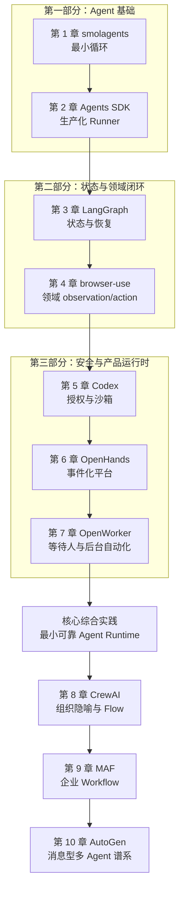

# AI Agent 源码课程：学习路线与章节目录

这是一套从 Agent 最小循环逐步走向可恢复、安全、可运营系统的源码课程。每个项目负责讲清一个具体设计问题；主线顺序同时考虑知识依赖、认知负荷和机制之间的对照价值。

## 学完这套课程，你应该能做什么

- 从源码中找出 Agent 的 `observe → decide → act → record → continue` 主循环；
- 判断状态由 transcript、checkpoint、event log 还是外部环境持有；
- 解释暂停、重试、崩溃恢复时哪些代码会重跑，哪些副作用可能重复；
- 把模型提出的动作放进 tool schema、policy、approval、sandbox 和执行日志之间；
- 判断一个领域是否需要重新设计 observation 与 action，而不是增加更多通用工具；
- 区分 handoff、agent-as-tool、manager、workflow 和消息型多 Agent 的所有权；
- 为自己的项目画出一套最小、可恢复、可审计的 Agent 运行时。

## 先修知识

开始前只需要：

- 能阅读 Python；
- 理解一次 LLM 请求和结构化 tool call；
- 知道异常、异步任务和持久化的大致含义。

Rust、事件溯源、浏览器 CDP、分布式 checkpoint 会在相应章节中按需引入，不要求预先掌握。

## 课程地图

下图是**推荐学习顺序**。实线表示教材的连续阅读路径，不等同于全部硬先修关系；需要快速进入某个方向时，可以依据后面的先修表和支线路径跳读。

## 硬先修与推荐前置

| 内容 | 硬先修 | 推荐但可后补 |
|---|---|---|
| 第 1 章 smolagents | Python 与结构化 tool call | 无 |
| 第 2 章 Agents SDK | 第 1 章 | 无 |
| 第 3 章 LangGraph | 第 1–2 章 | 无 |
| 第 4 章 browser-use | 第 1 章、DOM 基础 | 第 3 章的状态术语 |
| 第 5 章 Codex | 第 1–2 章 | 第 4 章的领域 action 失效语义 |
| 第 6 章 OpenHands | 第 5 章 | 第 3 章的恢复语义 |
| 第 7 章 OpenWorker | 第 5–6 章 | 第 4 章的浏览器边界 |
| 核心综合实践 | 第 1–7 章 | 无 |
| 第 8 章 CrewAI | 第 1–3 章 | 先完成核心综合实践 |
| 第 9 章 MAF | 第 2、3、5 章 | 核心综合实践与第 8 章 |
| 第 10 章 AutoGen | 第 8–9 章 | 无 |

## 第一部分：先看懂一个 Agent 怎样运行

### 第 1 章：[smolagents——最小 ReAct / CodeAct 循环](01-smolagents.md)

核心问题：一个 Agent 最少需要哪些状态和控制流？

你将学习：

- task、plan、action、observation、memory 和 final 的基本关系；
- `ToolCallingAgent` 与 `CodeAgent` 只是 action language 不同；
- max steps、validator 和 fallback 为什么属于不同终止语义；
- 为什么限制 Python imports 不等于安全沙箱。

完成标准：能够脱离框架写出一个约 150 行的最小 tool loop，并让失败 observation 进入下一轮模型输入。

### 第 2 章：[OpenAI Agents SDK——从教学循环到生产 Runner](02-openai-agents-sdk.md)

核心问题：如何在保持 API 简洁的同时加入 handoff、guardrail、session、trace 和暂停恢复？

你将学习：

- `Agent` 是配置，`Runner` 才拥有控制流；
- ordinary tool、agent-as-tool 与 handoff 的所有权差异；
- 输入、输出和工具 guardrail 应放在不同副作用边界；
- `RunState` 为什么比单纯保存聊天记录更接近恢复闭包。

完成标准：能够判断一次中断恢复是否会重新调用模型、重复工具，或改变 current agent。

## 第二部分：让 Agent 拥有明确状态和领域闭环

### 第 3 章：[LangGraph——状态合并、Checkpoint 与 Interrupt](03-langgraph.md)

核心问题：当工作变成长程、并发、可暂停流程时，状态如何确定性地合并和恢复？

你将学习：

- state schema 与 reducer 如何定义合并语义；
- superstep 为什么让并行结果与协程完成顺序解耦；
- checkpoint 保存的不是聊天记录，而是版本化执行状态；
- interrupt 恢复为什么可能从节点开头重跑。

完成标准：实现一个包含并行分支、reducer 和人工审批的图，并说明外部副作用的幂等责任。

### 第 4 章：[browser-use——为什么垂直 Agent 必须重做世界表示](04-browser-use.md)

核心问题：为什么给通用 Agent 增加 Playwright 工具，仍然不等于一个可靠的浏览器 Agent？

你将学习：

- DOM、selector map、截图、tabs 与 URL 如何组成 observation；
- selector identity 为什么只对当前页面状态有效；
- multi-action 在导航或 focus 变化后为何必须截断；
- failure、loop 与 step budget 为什么必须分别统计。

完成标准：能够为一个固定网页设计最小 observation/action schema，并处理一次 stale DOM 失败。

## 第三部分：让模型安全地影响真实世界

### 第 5 章：[Codex——从模型意图到受控副作用](05-codex.md)

核心问题：模型提出一条 shell 命令后，系统应经过哪些边界才能真正执行？

你将学习：

- typed intent、ToolRouter、ToolOrchestrator 的职责分离；
- approval、sandbox、network policy 与执行 attempt 的顺序；
- forbidden、rejected、command failure、sandbox denial 为什么不能混为一类；
- 并发执行为何不能改变 conversation history 的稳定顺序。

完成标准：实现 `ToolIntent → Router → ApprovalDecision → SandboxPolicy → ExecutionResult` 五层链，并覆盖 allow、ask、forbidden 和升级四条路径。

### 第 6 章：[OpenHands——事件化 Conversation 与完整 Agent 平台](06-openhands.md)

核心问题：完整 Agent 产品怎样跨 UI、Server、Conversation、Agent、Tool 和 Workspace 维持一致状态？

你将学习：

- event log 是事实源，conversation view 是派生状态；
- action 与 observation 如何配对；
- 未匹配 action 为什么应恢复执行，而不是重新采样；
- 资源级锁如何避免文件、终端和浏览器并发冲突。

完成标准：能够从事件序列重建会话，并让危险 action 在重启后继续等待确认。

### 第 7 章：[OpenWorker——耐久 Inbox 与人类注意力控制面](07-openworker.md)

核心问题：当 Agent 在后台运行、需要跨会话等待用户时，怎样保持权限和动作身份不漂移？

你将学习：

- approval item 如何绑定 `(session_id, tool_call_id)`；
- attended / unattended 为什么只能改变交互位置，不能提高权限上限；
- canonical transcript 与 outbound compaction 为什么必须分离；
- exact-target standing grant 如何限制定时自动化；
- durable approval 为什么仍不等于副作用 exactly-once。

完成标准：覆盖 tool call 落盘但 Inbox item 未建立、两个表面同时回答、远端成功但 result 未落盘三个窗口；分别证明 prompt 补建、first-responder-wins 与 effect 对账。

### 三次累计实践

不要等到第 7 章后才第一次整合。始终在同一个小型 runtime 上增量实现：

1. **完成第 2 章**：实现最小 loop、typed tool 和可序列化 RunState；保存一条正常 trace 与一条工具失败 trace。
2. **完成第 4 章**：加入确定性 reducer、两个并行读取分支，以及带版本号的领域 observation；验证分支完成顺序不改变合并结果，stale action 会触发重新观察。
3. **完成第 7 章**：加入 policy、approval、sandbox、durable Inbox、授权重验和独立 `effect_id`；在三个不同崩溃窗口恢复同一个 runtime。

三次实践的产物直接演进为下面的核心综合实践，而不是互相独立的示例项目。

## 核心综合实践：先把前七章组合成系统

完成第 7 章后，进入[综合实践：设计一个最小可靠 Agent Runtime](../14-capstone-agent-runtime.md)。此时已经具备完成项目所需的全部主线知识：

1. typed tool loop；
2. reducer、稳定快照与确定性并行合并；
3. 版本化 observation、action identity 与失败后重新观察；
4. canonical history 与模型输入视图分离；
5. policy、approval 与 sandbox 边界；
6. 持久暂停、授权重验、恢复与崩溃窗口；
7. 独立的 `tool_call_id` 与 `effect_id`；
8. typed event、终止原因与失败预算。

综合实践的目标是把知识变成一个可运行、可故障注入、可解释的系统。完成它以后，再进入多 Agent 章节，能避免用角色数量掩盖单 Agent runtime 的基础缺口。

## 进阶专题：最后再学习多 Agent 与企业编排

### 第 8 章：[CrewAI——组织隐喻何时应让位给 Flow](08-crewai.md)

核心问题：角色、任务和 manager 解决了什么，又有哪些问题必须交给显式 Flow？

你将学习：

- Crew 的高层组织模型如何映射到真正的 Agent executor；
- hierarchical manager 增加的是真实调度还是更多 prompt；
- Crew checkpoint、Flow checkpoint 与 `@persist` state 的 owner；
- 为什么可靠系统通常让 Flow 拥有端到端生命周期。

完成标准：用同一任务比较纯 Crew 与 Flow 调 Crew 两种实现，说明状态、错误和恢复由谁负责。

### 第 9 章：[Microsoft Agent Framework——企业 Workflow 与横切治理](09-microsoft-agent-framework.md)

核心问题：单 Agent、工具 middleware、Workflow、checkpoint、HITL 和 OTel 怎样进入同一个治理面？

你将学习：

- Agent middleware、function middleware 与 Workflow runtime 的边界；
- middleware 顺序为什么会改变审批、缓存和重试语义；
- `WorkflowCheckpoint` 如何保存图签名、executor state 与 committed state；
- AgentSession 与 Workflow state 为什么不能混为一层。

完成标准：实现一个可 checkpoint 的并行 Workflow，并通过 trace 解释审批 middleware 的实际执行顺序。

### 第 10 章：[AutoGen——消息型多 Agent 的历史基线](10-autogen-historical.md)

核心问题：topic、subscription、group manager 和 selector 给多 Agent 留下了哪些长期概念？

你将学习：

- direct send 与 publish 的不同完成语义；
- team termination 与 runtime idle 的区别；
- 模型 selector 的候选过滤、重试与降级；
- AutoGen 的概念如何在 MAF 中被 workflow、session 和 middleware 重新表达。

完成标准：能够解释消息型拓扑的状态保存边界，并说明为什么 2026 年学习它是为了理解谱系，而不是从旧 API 开始新项目。

## 每章的学习方法

不要从头到尾被动阅读。每章采用四遍法：

1. **第一遍看边界**：只看本章目标、架构图和两条调用链；
2. **第二遍追源码**：按“建议源码阅读顺序”打开固定 SHA；
3. **第三遍做推演**：在纸上写出一次正常路径和一次失败路径；
4. **第四遍做练习**：完成本章练习，并用不变量检查结果。

如果不能回答“谁决定下一步、谁拥有事实状态、失败后重跑什么、副作用如何获权、什么才算完成”，说明本章还没有真正掌握。

所有练习使用统一的[课程实验协议](../exercises/README.md)：本地确定性 fixture、正常/失败两条 JSONL trace、固定故障注入点和显式断言。练习涉及 secret、消息或外部发布时必须使用合成数据与 stub connector。

每章完成后复制 [Learning Record 模板](../learning-records/_template.md)，先关闭原文完成检索，再链接实验 trace。按照 +1 天、+7 天、+30 天节奏重新解释失败路径，避免把“刚读懂”误当成长期掌握。

## 按目标选择支线

| 你的目标 | 建议章节 |
|---|---|
| 快速理解 Agent 基础 | 1 → 2 → 3 |
| 构建编码 Agent | 1 → 2 → 5 → 6 |
| 构建浏览器 Agent | 1 → 2 → 4 → 5 |
| 构建桌面个人 Agent | 1 → 2 → 5 → 6 → 7 |
| 构建可靠 Agent Runtime | 1 → 2 → 3 → 4 → 5 → 6 → 7 → 综合实践 |
| 快速研究企业 Workflow | 1 → 2 → 3 → 5 → 9；综合实践与第 8 章可后补 |
| 系统研究多 Agent | 主线 1–7 → 综合实践 → 8 → 9 → 10 |

## 研究附录

以下文档用于核验来源、比较项目和理解研究边界，不属于第一次学习的必读正文：

- [研究方法与源码冻结规则](../00-methodology.md)
- [候选池与社区快照](../01-candidate-pool.md)
- [评分证据账本](../02-scoring-ledger.md)
- [横向机制比较](../10-comparison.md)
- [闭源与部分开源前沿方案](../11-proprietary-agent-landscape.md)
- [论文与权威资料导读](../12-authoritative-literature-guide.md)
