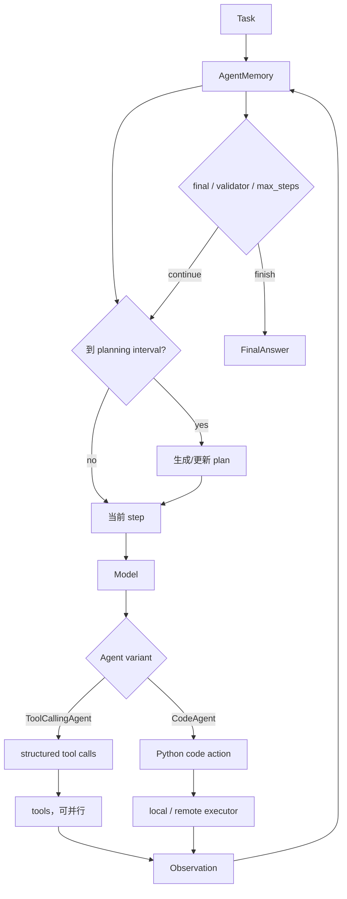

# 第 1 章 smolagents：看懂最小 Agent 循环

> 参考实现：[huggingface/smolagents](https://github.com/huggingface/smolagents)，冻结提交 [`e3a5b89`](https://github.com/huggingface/smolagents/tree/e3a5b8994b301983b91c0325546e9dc82eab8cf0)，Apache-2.0。

## 本章要解决的问题

学习 Agent 的第一步不是多 Agent、长期记忆或复杂规划，而是看清一个循环：模型读取当前状态，提出动作，环境返回 observation，运行时记录结果并决定是否继续。

smolagents 把这条路径集中在少量核心类型中，并用 `ToolCallingAgent` 和 `CodeAgent` 展示两种 action language。本章先建立后续所有章节都会复用的最小心智模型。

## 本章目标

| 问题 | 建议 |
|---|---|
| 本章重点 | 最小 ReAct/CodeAct 循环，以及 action language 如何改变表达力与攻击面 |
| 前置知识 | 能阅读 Python，并理解一次结构化 tool call；ReAct 心智模型由本章建立 |
| 第一遍重点 | `MultiStepAgent._run_stream`、两种 Agent 的 step 差异、memory 写入规则 |
| 可以后看 | model/provider 适配、remote executor 供应商与多模态扩展 |
| 完成后应能回答 | tool call 与代码动作共享什么循环？为什么 authorized imports 不是 sandbox？max steps 后的答案是什么语义？ |

## 核心设计



### 1. MultiStepAgent 显示最小公共循环

[`MultiStepAgent`](https://github.com/huggingface/smolagents/blob/e3a5b8994b301983b91c0325546e9dc82eab8cf0/src/smolagents/agents.py#L268) 提供 memory、model、tools、planning、callbacks 与 max steps；[`run()`](https://github.com/huggingface/smolagents/blob/e3a5b8994b301983b91c0325546e9dc82eab8cf0/src/smolagents/agents.py#L436) 初始化任务和流式状态；[`_run_stream()`](https://github.com/huggingface/smolagents/blob/e3a5b8994b301983b91c0325546e9dc82eab8cf0/src/smolagents/agents.py#L540) 展开 planning—step—observation—memory—final 的完整循环。

### 2. 两种动作语言共享同一骨架

[`ToolCallingAgent`](https://github.com/huggingface/smolagents/blob/e3a5b8994b301983b91c0325546e9dc82eab8cf0/src/smolagents/agents.py#L1215) 使用模型原生 tool calls，易做 schema 校验；[`CodeAgent`](https://github.com/huggingface/smolagents/blob/e3a5b8994b301983b91c0325546e9dc82eab8cf0/src/smolagents/agents.py#L1505) 用 Python 组合多个工具、变量和控制流，表达力更强。二者差别是 action language，而非整体 Agent loop。

### 3. 代码执行必须区分“限制”与“隔离”

[`LocalPythonExecutor`](https://github.com/huggingface/smolagents/blob/e3a5b8994b301983b91c0325546e9dc82eab8cf0/src/smolagents/local_python_executor.py#L1688) 限制 imports 并跨 step 保留状态，但源码在 [L1693](https://github.com/huggingface/smolagents/blob/e3a5b8994b301983b91c0325546e9dc82eab8cf0/src/smolagents/local_python_executor.py#L1693) 明确说它不是 security sandbox；不可信代码应使用远程隔离 executor。

## 两条源码调用链

1. **正常路径与两种 action language**：`run → _run_stream → step → model emits tool call or code → tool/PythonExecutor → observation → memory → next step → final`。分叉只改变动作表达，公共 loop 与 memory/termination 骨架不变。
2. **失败与终止路径**：`tool/code parse or execution failure → structured error observation → memory → next model step`；若模型产出 final，则进入 validator，拒绝后继续循环；耗尽 max steps 后走 fallback，而不是伪装成正常 final。

## 建议源码阅读顺序

1. 先读 `MultiStepAgent.run()` 与 `_run_stream()`，手画 planning—step—observation—memory—final 循环。
2. 再读 `ToolCallingAgent`，观察结构化调用如何校验参数、执行工具并稳定回填结果。
3. 然后读 `CodeAgent`，只比较 action language 改变了什么，避免把两套循环误认为两个 runtime。
4. 最后阅读 `LocalPythonExecutor` 的安全警告，把“语法限制、进程隔离、文件网络权限”分成三个层次。

## 一个 step 的状态与终止语义

| 对象 | 作用 | 持久性 / 边界 |
|---|---|---|
| `AgentMemory` | 保存 task、plan、每步 action/observation/error | 主要是进程内运行事实，不是一等跨进程 checkpoint |
| ActionStep | 记录模型输出、工具/代码动作、日志与错误 | 成功和失败都必须写入，防止模型无依据地重复 |
| executor state | CodeAgent 跨 step 的变量与执行上下文 | 可能跨 step，但不等于安全隔离或 durable resume |
| final result | 正常完成、校验后完成或预算耗尽降级 | 调用方必须区分来源，不能只看返回了文本 |

| 情况 | runtime 行为 | 调用方应如何理解 |
|---|---|---|
| 模型产出 final 且 validators 通过 | 正常终止 | 可作为候选成功结果 |
| final validator 拒绝 | 把反馈写入 memory，继续下一步 | “模型说完成”不等于完成 |
| step 执行失败 | 将 error/observation 记录后继续或触发上限 | 失败事实必须进入下一轮 prompt |
| 达到 max steps | 生成 fallback/best-effort answer | 这是预算耗尽的降级结果，不是任务完成证明 |

执行安全需要再分三层：authorized imports 只是语言能力限制；独立进程/容器才提供资源隔离；文件、网络、secret 仍需额外权限策略。把第一层称为 sandbox 会产生错误安全感。

## 关键源码骨架（等价伪代码）

以下伪代码根据冻结提交重写；它刻意保留了 smolagents 适合教学的主循环形状。

### 1. MultiStepAgent 的完整 ReAct 骨架

```python
def run(self, task, stream=False, reset=True, max_steps=None):
    if reset:
        self.memory.reset()
        self.monitor.reset()

    self.task = substitute_additional_args(task)
    self.memory.steps.append(TaskStep(task=self.task, images=images))

    generator = self._run_stream(max_steps or self.max_steps)
    if stream:
        return generator

    for step_or_output in generator:
        last = step_or_output
    return build_run_result(last, self.memory, self.monitor)


def _run_stream(self, max_steps):
    final_answer = None

    for step_number in range(1, max_steps + 1):
        if should_plan(step_number, self.planning_interval):
            planning_step = self.planning_step(self.task, self.memory)
            self.memory.steps.append(planning_step)
            yield planning_step

        action_step = ActionStep(step_number=step_number)
        try:
            final_answer = self.step(action_step)
        except AgentError as error:
            action_step.error = error
        finally:
            action_step.end_time = now()
            self.memory.steps.append(action_step)
            run_callbacks(action_step)
            yield action_step

        if final_answer is not None:
            if all(check(final_answer, self.memory) for check in self.final_answer_checks):
                yield FinalOutput(final_answer)
                return

    yield FinalOutput(self.provide_final_answer_after_max_steps())
```

`ActionStep` 即使失败也进入 memory，这是下一轮模型理解失败原因的基础。callback/monitor 放在 `finally`，保证成功和失败都有观测记录。

### 2. ToolCallingAgent：结构化动作与并行执行

```python
def tool_calling_step(memory):
    messages = memory.write_memory_to_messages()
    model_message = model.generate(messages, tools=tool_schemas)
    calls = model_message.tool_calls

    if not calls:
        raise AgentGenerationError("model emitted no tool call")

    if any(call.name == "final_answer" for call in calls):
        return extract_final_answer(calls)

    def execute(call):
        tool = tools[call.name]
        arguments = resolve_state_references(call.arguments, self.state)
        return ToolOutput(id=call.id, output=tool(**arguments))

    # 多个相互独立的 tool calls 可在线程池中并行。
    completed = parallel_emit_as_completed(execute, calls) if len(calls) > 1 else [execute(calls[0])]

    # 流式输出可按完成顺序，但持久 memory 按 call.id 排序，避免调度时序污染上下文。
    memory.current_step.tool_calls = sorted(calls, key=lambda call: call.id)
    memory.current_step.observations = sorted(completed, key=lambda output: output.id)
    return None
```

并行调用默认假设工具相互独立；如果两个工具写同一文件或共享浏览器，调用者必须自己提供串行化/锁。

### 3. CodeAgent：代码是 action language

```python
def code_agent_step(memory):
    code = model.generate(memory_as_messages(), stop_sequences=["<end_code>"])
    parsed_code = extract_code_block(code)

    try:
        output, execution_logs, is_final = python_executor(
            parsed_code,
            authorized_imports=self.authorized_imports,
            state=self.state,  # 变量跨 step 保留
        )
    except Exception as error:
        memory.current_step.error = AgentExecutionError(error)
        return None

    memory.current_step.code_action = parsed_code
    memory.current_step.observations = truncate(execution_logs)
    if is_final:
        return output
    return None
```

CodeAgent 的优势是模型可以用局部变量、循环和条件组合工具；风险是 action language 从有限 schema 扩展为通用 Python。

## 关键不变量与失败路径

- 每个 step 无论成功失败都必须写入 memory，否则模型会重复同一错误动作。
- `final_answer_checks` 失败应继续循环，而不是把“模型说完成”当完成。
- max steps 后的 fallback answer 是降级结果，调用方应能区分正常 final 与预算耗尽。
- tool name/arguments 必须经过 schema 和 state-reference 解析；不可直接 `eval` 模型字符串。
- 并行 tools 只有在无共享可变资源时安全。
- 并行 tool result 可以按完成顺序流给观察者，但写入 memory 时按稳定 call id 排序，确保下一轮 prompt 不随线程调度漂移。
- `authorized_imports` 只限制解释器能力，不提供进程、文件系统、网络级安全隔离。

## 设计收益

- 核心 loop 局部、继承关系少，适合从入口逐行跟到副作用。
- 同一骨架比较 tool calling 与 code-as-action，教学价值高。
- max steps、planning interval、callbacks、monitor、validators 展示最小但必要的运行控制。
- remote executors 为从教学到隔离执行提供扩展方向。

## 适用边界与常见误区

- durable checkpoint、跨进程 resume、HITL approval 不是主抽象。
- CodeAgent 的表达力也扩大攻击面；authorized imports 不是 OS 隔离。
- planning 与 final validator 仍依赖模型，不能代替确定性状态机。
- “约千行核心逻辑”有利学习，不表示完整生态只有千行，也不表示生产复杂性消失。

## 本章练习

先写 `ToolCallingAgent` 解决两步数据处理，再改为 `CodeAgent`；比较模型轮数和中间变量。随后在临时目录创建只含随机 canary 文本的合成 secret 文件，验证 local executor 为什么不是 sandbox，再切到容器/远程 executor 并记录隔离边界。禁止使用真实 `.env`、SSH key、云凭证或系统钥匙串做练习。

### 练习验收

- 产物包含最小 loop、两种 action language 和一份逐轮 trace；
- trace 能区分正常 final、validator 拒绝与 max-step fallback；
- secret 测试依靠执行隔离失败，而不是只靠 prompt 或 import allowlist。

## 检查理解

1. planning、action、observation 和 memory 在最小循环中怎样连接？
2. `ToolCallingAgent` 与 `CodeAgent` 改变的是 action language，还是整个 runtime？
3. 正常 final、validator 拒绝和 max-step fallback 分别意味着什么？

## 本章小结

smolagents 适合作为课程起点，因为主循环局部且两种 action language 可以直接对照。它没有覆盖 durable orchestration 和安全执行，这些问题将在后续章节逐层加入。

---

[返回课程目录](00-learning-guide.md) · [下一章：OpenAI Agents SDK](02-openai-agents-sdk.md)
