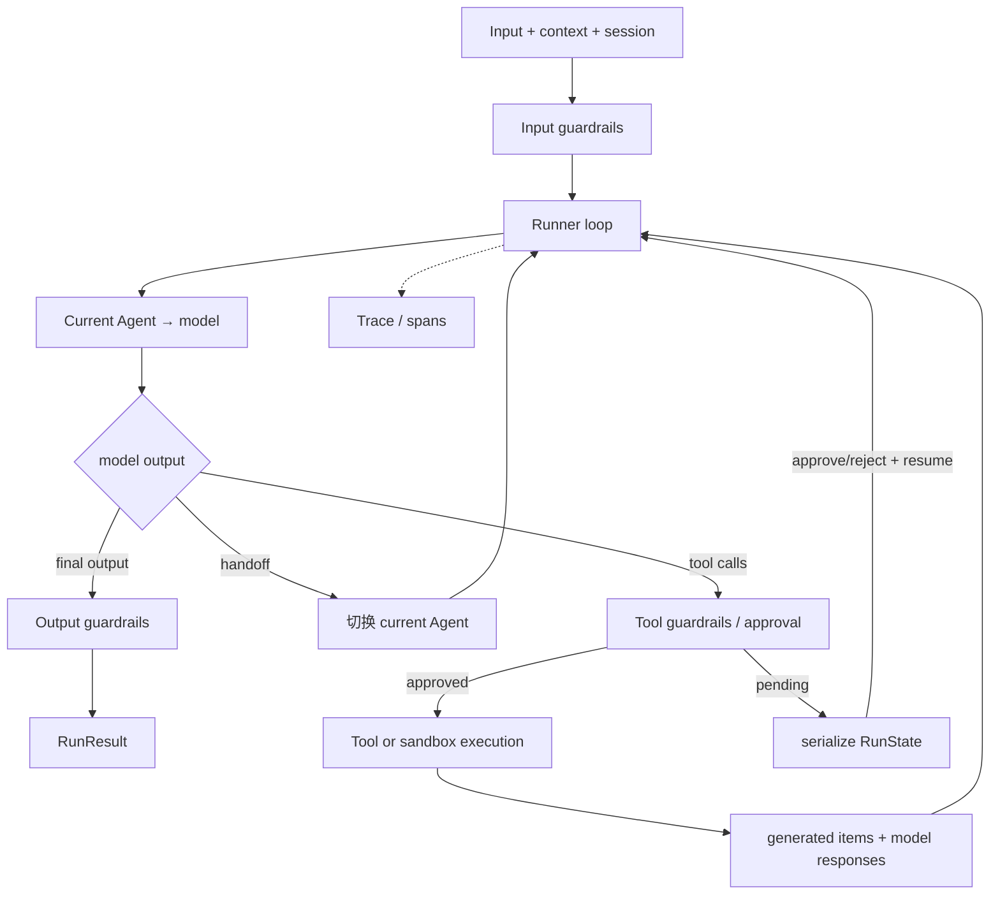

# 第 2 章 OpenAI Agents SDK：从最小循环到生产 Runner

> 参考实现：[openai/openai-agents-python](https://github.com/openai/openai-agents-python)，冻结提交 [`c3f1781`](https://github.com/openai/openai-agents-python/tree/c3f1781d56e8f1249a01674f18ba1f3e44a16dce)，MIT。

## 本章要解决的问题

第 1 章的最小循环足以解释 Agent 的基本形状，但生产运行还会遇到输入/输出检查、工具审批、跨 Agent 交接、session、trace 和中断恢复。本章学习如何用少量公共原语扩展最小循环，而不立即进入复杂图运行时。

关键分工是：`Agent` 描述能力与配置，`Runner` 拥有运行状态机，`RunState` 保存中断恢复所需的闭包。

## 本章目标

| 问题 | 建议 |
|---|---|
| 本章重点 | 用少量原语组织 tool loop、handoff、guardrail 与 durable pause/resume |
| 前置知识 | 完成第 1 章；理解结构化 tool call，异步与序列化概念会在源码路径中按需引入 |
| 第一遍重点 | `Agent` 与 `Runner` 的职责分离、handoff 所有权、`RunState` 恢复闭包 |
| 可以后看 | voice、provider 扩展、trace processor 与 hosted tools 的完整表面积 |
| 完成后应能回答 | handoff 与 agent-as-tool 有何不同？guardrail 应放在哪个副作用边界？恢复时哪些步骤不能重跑？ |

## 核心设计



### 1. Agent 是配置，Runner 拥有控制流

[`Agent`](https://github.com/openai/openai-agents-python/blob/c3f1781d56e8f1249a01674f18ba1f3e44a16dce/src/agents/agent.py#L271) 聚合 instructions、model、tools、handoffs、guardrails 等配置；[`Runner`](https://github.com/openai/openai-agents-python/blob/c3f1781d56e8f1249a01674f18ba1f3e44a16dce/src/agents/run.py#L202) 决定模型响应后是结束、执行工具还是 handoff，并管理 max turns。把“Agent 定义”和“运行状态机”分开，便于同一 Agent 在 sync/async/streaming 路径复用。

### 2. Handoff 改变当前决策者

[`Handoff`](https://github.com/openai/openai-agents-python/blob/c3f1781d56e8f1249a01674f18ba1f3e44a16dce/src/agents/handoffs/__init__.py#L98) 不是普通工具返回文本：它让 Runner 切换 current agent，并可过滤/转换交接输入。与 agent-as-tool 的差异是所有权——handoff 后下一轮由目标 Agent 主导。

### 3. Guardrail 按副作用位置分层

[`InputGuardrail`](https://github.com/openai/openai-agents-python/blob/c3f1781d56e8f1249a01674f18ba1f3e44a16dce/src/agents/guardrail.py#L72) 和 [`OutputGuardrail`](https://github.com/openai/openai-agents-python/blob/c3f1781d56e8f1249a01674f18ba1f3e44a16dce/src/agents/guardrail.py#L134) 位于运行边界；工具还有自己的 guardrail/approval 路径。设计上最重要的是：输入检查、最终输出检查和工具副作用检查不是同一个 hook。

### 4. RunState 承载 durable pause/resume

[`RunState`](https://github.com/openai/openai-agents-python/blob/c3f1781d56e8f1249a01674f18ba1f3e44a16dce/src/agents/run_state.py#L212) 保存模型响应、生成项、session items、审批、trace 和 sandbox state，可序列化后恢复。这修复了早期轻量 Agent SDK 常见的缺口：HITL 不再依赖单进程闭包。

## 两条源码调用链

1. **正常工具与交接路径**：`Runner.run → input guardrail → model response → ordinary tool or handoff → tool guardrail/execute or current_agent switch → output item → next model turn → output guardrail`。
2. **中断与恢复路径**：`tool requires approval → pending step and current agent enter RunState → serialize state → process exits → restore RunState + approval result → continue the original pending step → append tool output → next model turn`。恢复不应把同一动作重新交给模型采样。

## 建议源码阅读顺序

1. 先读 [`Agent`](https://github.com/openai/openai-agents-python/blob/c3f1781d56e8f1249a01674f18ba1f3e44a16dce/src/agents/agent.py#L271) 数据结构，确认它主要是配置，而不是拥有循环的活动对象。
2. 再读 [`Runner`](https://github.com/openai/openai-agents-python/blob/c3f1781d56e8f1249a01674f18ba1f3e44a16dce/src/agents/run.py#L202) 的 next-step 分支，跟踪 final、tool、handoff 和 interruption 四种结果。
3. 对照 [`Handoff`](https://github.com/openai/openai-agents-python/blob/c3f1781d56e8f1249a01674f18ba1f3e44a16dce/src/agents/handoffs/__init__.py#L98) 与普通 tool，记录 current agent 的所有权何时改变。
4. 最后读 [`RunState`](https://github.com/openai/openai-agents-python/blob/c3f1781d56e8f1249a01674f18ba1f3e44a16dce/src/agents/run_state.py#L212) 与 [`guardrail.py`](https://github.com/openai/openai-agents-python/blob/c3f1781d56e8f1249a01674f18ba1f3e44a16dce/src/agents/guardrail.py#L72)，检查序列化恢复所需的最小状态，以及副作用前后的检查顺序。

## 控制权与恢复边界

| 机制 | 谁拥有下一轮决策 | 结果如何进入父上下文 | 适合场景 |
|---|---|---|---|
| ordinary tool | 当前 Agent 不变 | tool output item | 查询或执行一个有界能力 |
| agent-as-tool | 调用方 Agent 仍是 owner | 子 Agent 的最终结果作为 tool output | 委托一个子任务后由父 Agent 汇总 |
| handoff | target Agent 成为 current agent | 过滤/转换后的历史交给 target | 转交会话责任、专业路由或升级处理 |

| 状态对象 | 主要责任 | 是否足以单独恢复 interrupted run |
|---|---|---|
| session items | 保存跨轮对话/生成项 | 否；不包含所有已解析步骤与未决审批 |
| generated items / model responses | 记录本次运行已经产生的事实 | 否；需要与当前 Agent 和审批状态组合 |
| `RunState` | 封装 processed response、审批、sandbox/trace 等恢复闭包 | 是，前提是 Agent/tool identity 与 schema 仍兼容 |
| trace | 观察执行 | 否；可观测记录不是执行事实源 |

判断口诀是：**agent-as-tool 改上下文，不改 owner；handoff 改 owner；RunState 恢复的是未完成运行，不只是聊天记录。**

## 关键源码骨架（等价伪代码）

以下是根据冻结提交抽出的教学伪代码。真实实现还处理 streaming、server-managed conversation、nested agent、trace 与 session persistence。

### 1. Runner 是一个显式的 next-step 状态机

```python
async def run(starting_agent, user_input, session=None, previous_state=None):
    state = previous_state or RunState(
        context=RunContext(),
        original_input=user_input,
        starting_agent=starting_agent,
        max_turns=10,
    )

    if not state.is_resumed:
        await run_input_guardrails(starting_agent, user_input)

    while True:
        agent = state.current_agent

        if state.current_step is Interruption:
            # 恢复未决工具/审批；不重新调用模型，也不增加模型 turn。
            turn = await resolve_interrupted_turn(
                last_model_response=state.model_responses[-1],
                processed_response=state.last_processed_response,
                approvals=state.context.approvals,
            )
        else:
            if state.current_turn >= state.max_turns:
                raise MaxTurnsExceeded(state.max_turns)
            state.current_turn += 1
            response = await call_model(agent, build_input(state))
            state.model_responses.append(response)
            processed = process_model_response(agent, response)
            state.last_processed_response = processed
            turn = await execute_tools_and_side_effects(processed, state)

        next_step = turn.next_step
        if next_step is FinalOutput:
            await run_output_guardrails(agent, next_step.output)
            return RunResult(state)
        if next_step is Handoff:
            state.current_agent = next_step.target_agent
        if next_step is Interruption:
            state.current_step = next_step
            return RunResult(state)  # 调用者序列化 state，稍后恢复。

```

主循环的关键不是 `while`，而是 `NextStepFinalOutput / NextStepHandoff / NextStepRunAgain / NextStepInterruption` 这类状态让“下一步”可测试。

### 2. Handoff 与 agent-as-tool 的所有权不同

```python
def apply_handoff(state, handoff, tool_arguments):
    payload = handoff.input_filter(state.generated_items, tool_arguments)
    handoff.on_handoff(state.context, payload)

    # handoff：替换下一轮的决策者。
    state.current_agent = handoff.target_agent
    state.generated_items = handoff.transform_history(state.generated_items)
    return NextStepRunAgain()


async def call_agent_as_tool(state, nested_agent, tool_arguments):
    # agent-as-tool：父 Agent 仍拥有控制权；子 Agent 的输出只是一个 tool result。
    nested_result = await Runner.run(nested_agent, tool_arguments)
    return ToolResult(content=nested_result.final_output)
```

这一区别决定失败传播和上下文所有权：handoff 后目标 Agent 继续循环；agent-as-tool 完成后控制权回到父 Agent。

### 3. RunState 是恢复所需的最小闭包

```python
@dataclass
class RunState:
    current_turn: int
    current_agent: Agent
    original_input: Input
    model_responses: list[ModelResponse]
    generated_items: list[RunItem]       # 构建下一次模型输入
    session_items: list[RunItem]         # 完整、未过滤历史
    current_step: Interruption | None
    last_processed_response: ProcessedResponse | None
    guardrail_results: GuardrailResults
    tool_use_tracker_snapshot: dict
    trace_state: TraceState | None
    sandbox: dict | None
    schema_version: str


def resume(serialized_state, approval_decisions):
    state = RunState.from_json(serialized_state)
    assert_schema_compatible(state.schema_version)
    state.context.approvals.update(approval_decisions)
    return Runner.run(state.current_agent, previous_state=state)
```

`generated_items` 与 `session_items` 分开很关键：handoff 可以过滤模型下一轮看到的历史，但审计 session 仍保留完整事实。

### 4. 工具先规划，再有界并发执行

```python
def plan_tools(processed_response, approval_state):
    calls = dedupe_by_invocation_identity(processed_response.tool_calls)
    return ToolExecutionPlan(
        pending_approvals=partition_pending_approvals(calls, approval_state),
        function_calls=approved_function_calls(calls),
        hosted_calls=approved_shell_patch_computer_calls(calls),
        missing_tools=unknown_calls(calls),
    )


async def execute_function_calls(plan, max_concurrency):
    slots = Semaphore(max_concurrency)

    async def run(index, call):
        async with slots:
            tool = resolve_currently_enabled_tool(call.name)
            if tool is None:
                raise ModelBehaviorError("tool became unavailable")
            return index, await execute_with_input_and_output_guardrails(tool, call)

    completed = await gather_or_cancel_siblings(run(i, c) for i, c in enumerate(plan.function_calls))
    return [result for _, result in sorted(completed)]  # 对外顺序仍按模型原始 call 顺序。
```

planning 和副作用执行分离后，approval 可以先把调用分区；若仍有 interruption，Runner 优先返回 `NextStepInterruption`，handoff 和最终输出不会越过未决审批继续推进。

## 关键不变量与失败路径

- 首轮 input guardrail 不应在 resume 时重复运行，否则恢复可能产生与原执行不同的决策。
- 阻塞型 guardrail 必须早于 sandbox/session 创建，才能在 tripwire 时避免不必要副作用。
- 中断恢复必须保留最后一个原始 model response 和已解析 `ProcessedResponse`，否则不能安全继续未完成工具批次。
- `current_turn` 只在即将发生新模型调用时递增；恢复 interrupted turn 不重复计入 turn，也不重跑中断前已完成的副作用。
- handoff 的 Agent identity 必须稳定；同名 Agent 在序列化/恢复时需要可区分身份。
- tool input guardrail、approval、tool execution、tool output guardrail 的顺序不可交换。
- max turns 是运行安全阀，不是任务完成证明；触发时应暴露未完成状态。
- 工具可以按类别和并发上限并行，但公共结果顺序必须按模型原始调用顺序重建；任一 fatal sibling failure 要取消并 drain 其余任务。

## 设计收益

- 公共概念少，能覆盖 tool loop、multi-agent、HITL、session 和 trace。
- handoff 与 agent-as-tool 区分明确，避免多 Agent 所有权含糊。
- guardrail 按输入、输出、工具分层，适合把安全检查放到正确边界。
- `RunState`、session、tracing 让“轻量 SDK”不再等于“无生产状态”。

## 适用边界与常见误区

- 运行时拓扑比图框架隐式；复杂分支主要藏在模型选择与 Runner loop 中。
- “支持多 provider”不表示内部数据模型完全 provider-neutral，response item 与模型能力仍会影响行为。
- guardrail 是执行挂点，不自动提供强 sandbox；危险工具仍需 OS/container 级隔离。
- durable state 的存储、加密、版本迁移与 exactly-once 副作用由集成方完成。
- 随功能增长，内部 `run_internal` 已明显复杂于最初的“小循环”叙事。

## 本章练习

写一个 triage agent：普通问题 handoff 给 support，退款 handoff 给 billing；退款 tool 设置审批；序列化 pending `RunState`，在新进程中批准并恢复；为输入、工具参数和最终输出分别加 guardrail，并对 trace 验证执行顺序。

### 练习验收

- handoff 后的下一轮 owner 与 agent-as-tool 调用后的 owner 明确不同；
- pending `RunState` 能在新进程恢复，且不会重新采样已提出的退款动作；
- trace 能指出三类 guardrail 分别在副作用前后的哪个位置运行。

## 检查理解

1. `Agent` 与 `Runner` 分别负责配置和控制流中的哪些部分？
2. handoff 与 agent-as-tool 对下一轮 owner 的影响有什么不同？
3. 为什么只保存 session messages 不足以恢复一个 interrupted run？

## 本章小结

本章展示了如何在不引入图运行时的情况下，为最小 loop 加入 handoff、guardrail、session、trace 和恢复状态。当流程拓扑、并行合并与重放语义成为主问题时，下一章的 LangGraph 会更直接。

---

[上一章：smolagents](01-smolagents.md) · [课程目录](00-learning-guide.md) · [下一章：LangGraph](03-langgraph.md)
