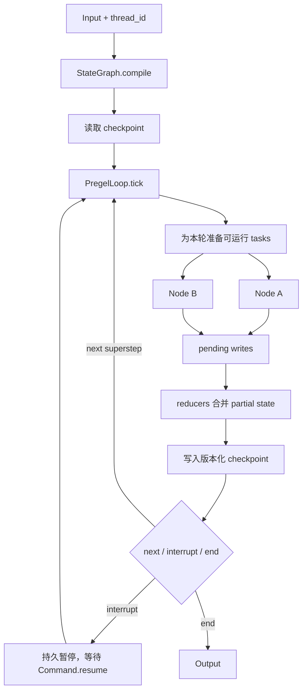

# 第 3 章 LangGraph：图状态机与可恢复 Agent 运行时

> 参考实现：[langchain-ai/langgraph](https://github.com/langchain-ai/langgraph)，冻结提交 [`b2926a0`](https://github.com/langchain-ai/langgraph/tree/b2926a0ff9589c28c7e01fe7cdbb337b86d5a4b4)，MIT。

## 本章要解决的问题

前两章中的 Agent 主要沿线性循环前进。一旦任务出现并行分支、人工审批、跨进程暂停和长时间恢复，仅靠不断追加 messages 就很难说明“当前进行到哪里”。本章用 LangGraph 学习另一种模型：**带 reducer 的共享状态图 + 批同步 superstep + 版本化 checkpoint**。

重点不是学会画图，而是理解运行时如何回答三个问题：并行写入怎样合并、暂停后从哪里继续、恢复时哪些节点和副作用会重跑。

## 本章目标

| 问题 | 建议 |
|---|---|
| 本章重点 | reducer、superstep、checkpoint 与 interrupt 如何共同构成 durable execution |
| 前置知识 | 完成第 1–2 章；了解 DAG 有帮助，并发合并与持久化快照由本章引入 |
| 第一遍重点 | 核心图、两条调用链、superstep 伪代码、interrupt 重放语义 |
| 可以后看 | checkpointer 后端、store/cache、子图与大量便捷 API |
| 完成后应能回答 | 并行节点如何合并状态？恢复会重跑什么？哪些外部副作用仍需业务幂等？ |

## 核心设计



### 1. StateGraph 是“合并规则”，不是节点列表

[`StateGraph`](https://github.com/langchain-ai/langgraph/blob/b2926a0ff9589c28c7e01fe7cdbb337b86d5a4b4/libs/langgraph/langgraph/graph/state.py#L130) 规定节点读取共享 state，返回 partial state；每个 state key 可声明 reducer。这个细节解决了并行节点写入时最容易被忽略的问题：不是“最后写入胜出”，而是由类型/字段定义合并语义。

`StateGraph` 只是 builder；[`compile()`](https://github.com/langchain-ai/langgraph/blob/b2926a0ff9589c28c7e01fe7cdbb337b86d5a4b4/libs/langgraph/langgraph/graph/state.py#L1164) 才生成可运行图，并装配 checkpointer、interrupt、cache 与 store。API 把构图期错误和运行期状态分开。

### 2. PregelLoop 用 superstep 固化并发语义

[`PregelLoop`](https://github.com/langchain-ai/langgraph/blob/b2926a0ff9589c28c7e01fe7cdbb337b86d5a4b4/libs/langgraph/langgraph/pregel/_loop.py#L158) 管理 channel、pending writes、checkpoint 和 task；[`tick()`](https://github.com/langchain-ai/langgraph/blob/b2926a0ff9589c28c7e01fe7cdbb337b86d5a4b4/libs/langgraph/langgraph/pregel/_loop.py#L599) 以轮次准备任务、应用上一轮写入，并在边界检查 interrupt。一个 superstep 内的节点可并行，写入在边界统一生效，因此结果不依赖某个协程碰巧先完成。

### 3. interrupt 是可恢复控制流

[`interrupt(value)`](https://github.com/langchain-ai/langgraph/blob/b2926a0ff9589c28c7e01fe7cdbb337b86d5a4b4/libs/langgraph/langgraph/types.py#L811) 不只是抛异常：它要求 checkpointer，把值暴露给调用方，并用 [`Command`](https://github.com/langchain-ai/langgraph/blob/b2926a0ff9589c28c7e01fe7cdbb337b86d5a4b4/libs/langgraph/langgraph/types.py#L759) 的 resume 数据继续。这是 HITL、审批和外部事件等待的统一机制。

## 两条源码调用链

1. **构建到执行**：`StateGraph.add_node/add_edge → compile → CompiledStateGraph → PregelLoop.tick → node task → reducer writes → checkpoint`。
2. **暂停到恢复**：`node → interrupt(value) → checkpoint + Interrupt → caller → Command(resume=...) → thread_id 加载 checkpoint → 重放当前 task`。

## 建议源码阅读顺序

1. 先读 `StateGraph` 与 `compile()`，只回答“声明式图最终交给了什么 runtime”。
2. 再读 `PregelLoop.tick()`，画出一个 superstep 的输入、pending writes 与提交边界。
3. 接着读 `interrupt()` 与 `Command`，明确 resume 为什么不是从 Python 调用栈原地继续。
4. 最后结合重试伪代码检查外部副作用：框架能重放状态，不会替你提供业务事务。

## 状态对象关系：不要把 checkpoint 当聊天记录

| 对象 | 由谁产生 | 何时可见 | 是否进入恢复依据 | 学习重点 |
|---|---|---|---|---|
| state schema / reducer | 图作者 | 编译期 | 以图结构兼容性间接约束恢复 | 定义同一 key 的并行写入如何合并 |
| channel value | runtime 根据已提交写入计算 | 当前 superstep 开始时 | 是 | 节点读取的是稳定快照，不是兄弟节点的即时结果 |
| pending writes | 本轮 task | superstep 提交后才对下一轮可见 | 是，成功 task 的 writes 可用于恢复 | 失败尝试的 partial writes 必须清空 |
| checkpoint / channel versions | `PregelLoop` 与 checkpointer | superstep 边界 | 是，属于主要事实源 | 恢复的是版本化执行状态，而非只恢复 messages |
| interrupt / resume value | 节点与调用方 | 暂停时暴露，恢复时注入 | 是 | 当前节点通常从开头重跑，外部副作用必须可重放 |

最重要的崩溃切片是：节点先调用外部 API，随后才到 checkpoint 边界。如果此时进程退出，恢复会再次运行节点；LangGraph 可以恢复图状态，却无法知道远端副作用是否已经成功。因此应把幂等键、事务 outbox 或“先记录意图再提交”设计放在业务节点中。

## 关键源码骨架（等价伪代码）

以下代码是依据冻结提交重写的教学伪代码，不是仓库原文。

### 1. 编译阶段：把声明式图变成 channel runtime

```python
class StateGraph:
    nodes: dict[NodeName, NodeSpec]
    edges: set[tuple[NodeName, NodeName]]
    branches: dict[NodeName, dict[BranchName, BranchSpec]]
    channels: dict[StateKey, Channel]

    def compile(self, checkpointer=None, interrupt_before=(), interrupt_after=()):
        validate_graph(nodes, edges, branches)

        # 每个 state key 被编译成 channel；reducer 决定并行写入的合并方式。
        channels = build_channels_from_state_schema(self.state_schema)

        runtime = CompiledStateGraph(
            channels=channels,
            input_channels=START,
            output_channels=self.output_schema,
            checkpointer=checkpointer,
            interrupt_before=interrupt_before,
            interrupt_after=interrupt_after,
        )

        for name, node in self.nodes.items():
            runtime.attach_node(name, node)
        for source, target in self.edges:
            runtime.attach_edge(source, target)
        for source, branch in self.branches.items():
            runtime.attach_branch(source, branch)

        return runtime.validate()
```

关键点不是 `compile` 返回另一个对象，而是**构图期与执行期的数据模型不同**：builder 保存 nodes/edges；runtime 保存 channels、trigger、checkpoint 和可执行 task。

### 2. 一个 superstep 如何保证并行写入可重放

```python
def tick(loop) -> bool:
    if loop.step > loop.stop:
        loop.status = "out_of_steps"
        return False

    tasks = prepare_next_tasks(
        checkpoint=loop.checkpoint,
        pending_writes=loop.checkpoint_pending_writes,
        updated_channels=loop.updated_channels,
    )
    if not tasks:
        loop.status = "done"
        return False

    # 恢复时，已成功 task 的 writes 直接回填；失败 task 保持空 writes，等待重跑。
    if pending_writes and not loop.is_replaying:
        reapply_writes_to_succeeded_tasks(tasks, pending_writes)

    if should_interrupt_before(tasks):
        raise GraphInterrupt()

    execute_all_tasks_with_empty_writes(tasks)  # 同一 superstep 可并行
    return True


def after_tick(loop):
    # 所有 task 完成后才在 barrier 处统一提交。
    loop.updated_channels = apply_writes(
        checkpoint=loop.checkpoint,
        channels=loop.channels,
        tasks=loop.tasks,
        get_next_version=loop.checkpointer_get_next_version,
    )
    loop.checkpoint_pending_writes.clear()
    loop.put_checkpoint(source="loop")

    if should_interrupt_after(loop.tasks):
        raise GraphInterrupt()
```

`task.writes` 同时承担“输出”和“该 task 已完成”的标记。因此恢复时不能盲目重跑所有节点：成功 task 的 writes 会回填，失败/中断 task 才重新执行。

### 3. interrupt 为什么会从节点开头重跑

```python
def approval_node(state):
    # 第一次执行：没有 resume value，持久化 Interrupt 后停止。
    # 恢复执行：节点从头开始，interrupt() 按调用顺序取出对应 resume value。
    decision = interrupt({"question": "是否发布？", "draft": state["draft"]})
    return {"approved": decision == "yes"}

config = {"configurable": {"thread_id": "research-42"}}
graph.stream(input_state, config)                 # -> Interrupt
graph.stream(Command(resume="yes"), config)      # -> 重新进入 approval_node
```

这带来一个容易漏掉的不变量：`interrupt()` 之前的代码必须可重入。发送邮件、扣款等副作用不能放在 interrupt 前且没有幂等保护，否则恢复时会重复发生。

### 4. 节点重试先清空失败尝试的 writes

```python
def run_with_retry(task, graph_retry_policy):
    attempts = 0
    while True:
        task.writes.clear()  # 失败尝试不能把 partial writes 带入下一次。
        try:
            return invoke_node(task)
        except GraphBubbleUp:
            raise              # interrupt/父图控制信号不是普通失败。
        except Exception as error:
            policy = first_matching_policy(task.retry_policy or graph_retry_policy, error)
            attempts += 1
            if policy is None or attempts >= policy.max_attempts:
                raise
            sleep(backoff_with_optional_jitter(policy, attempts))
            mark_child_graphs_as_resuming(task)
```

成功但没有业务写入的 task 仍需要提交 `NO_WRITES` 完成标记；否则恢复逻辑无法区分“已成功但无输出”和“尚未执行”。一个未处理的普通异常会取消仍运行的兄弟 task；多个 `GraphInterrupt` 则应合并成控制流结果，而不是选第一个当 fatal error。

## 关键不变量与失败路径

- 同一 superstep 中，节点只能看到 step 开始时的 channel 状态；不能依赖另一个并行节点的即时写入。
- 同一个 state key 接受多个并行写入时必须有 reducer，否则应视为冲突，而不是接受协程完成顺序。
- checkpoint 恢复依赖稳定的 `thread_id` 与兼容图结构；更改节点/状态 schema 后要设计迁移。
- step limit 产生 `out_of_steps`，它是受控终止，不应与模型正常 final 混为一谈。
- 节点重试只能重放框架内状态；数据库、支付、消息队列等外部副作用需要幂等键或事务 outbox。
- 每次 retry 前必须清空该 task 上一次失败尝试的 writes；`GraphInterrupt`、父图 bubble-up 和取消信号不能走普通 retry policy。

## 设计收益

- 执行语义明确：节点、channel、reducer、superstep 各有职责。
- durable execution 是运行时核心，不需要把 transcript 当数据库。
- 状态时间点可检查，适合调试长程 Agent、审批和 time travel。
- 业务节点仍是普通函数，图运行时不侵入模型/provider 选择。

## 适用边界与常见误区

- 学习成本高于线性 Runner：用户必须理解 state schema、reducer、thread、checkpoint 与 replay。
- 图保证调度与恢复，不保证业务副作用幂等。节点调用支付、发信、写数据库时，仍需 outbox/idempotency key。
- 工具安全、sandbox 与 secret policy 主要由集成层负责；不能因为运行时可恢复就推断执行安全。
- 复杂动态图如果滥用 conditional edge，会把业务规则分散在节点、路由和 state 中。

## 本章练习

实现一个“研究—审阅—发布”图：两个研究节点并行写 `evidence`，reducer 去重；审阅节点 `interrupt()`；重启进程后用相同 `thread_id` 和 `Command.resume` 继续。再让发布节点故意失败，检查重试是否会重复外部副作用。

### 练习验收

- 改变两个研究节点的完成顺序，不会改变 reducer 的最终语义；
- 审批恢复能说明节点哪些代码重跑、checkpoint 哪些状态被复用；
- 发布失败测试能展示 checkpoint 恢复与外部副作用幂等是两个问题。

## 检查理解

1. 为什么同一 superstep 的节点不能读取兄弟节点刚刚完成的写入？
2. `interrupt()` 恢复后，当前节点为什么可能从开头执行？
3. checkpoint 能恢复图状态，为什么仍不能保证发送消息 exactly-once？

## 本章小结

本章建立的核心心智模型是：长程 Agent 需要明确的状态合并、提交边界和恢复语义。短工具循环不必使用图运行时；一旦出现并行、暂停和跨进程恢复，就必须回答这些问题。

---

[上一章：OpenAI Agents SDK](02-openai-agents-sdk.md) · [课程目录](00-learning-guide.md) · [下一章：browser-use](04-browser-use.md)
