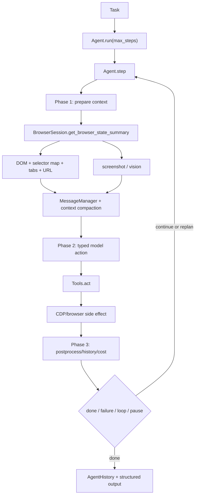

# 第 4 章 browser-use：浏览器 Agent 的领域闭环

> 参考实现：[browser-use/browser-use](https://github.com/browser-use/browser-use)，冻结提交 [`f0aa3a8`](https://github.com/browser-use/browser-use/tree/f0aa3a8bb03779c71a5aa262d389e3bfe6b77cdc)，MIT。

## 本章要解决的问题

通用 tool loop 能调用浏览器，却不知道 selector 何时过期、导航是否改变动作前提、截图和 DOM 如何互补，也不知道连续失败与循环有什么区别。浏览器 Agent 因此需要自己的世界表示和恢复策略。

本章用 browser-use 学习垂直 Agent 的核心原则：真正的领域化不只是增加工具，而是同时重构 observation、action、state 和 recovery。

## 本章目标

| 问题 | 建议 |
|---|---|
| 本章重点 | 垂直 Agent 如何重做 observation、action 与 recovery，而不是给通用 Agent 增加一个浏览器工具 |
| 前置知识 | 完成第 1 章；理解 DOM 与页面导航的基本含义，不要求先会 Playwright/CDP API |
| 第一遍重点 | `run → step` 三阶段、BrowserStateSummary、selector 生命周期、失败与循环预算 |
| 可以后看 | provider、云浏览器、profile/storage 的长尾配置 |
| 完成后应能回答 | 页面变化后为何必须重新观察？DOM 与 screenshot 如何互补？哪些预算分别控制失败、循环和总步骤？ |

## 核心设计



### 1. step 明确分三阶段

[`Agent`](https://github.com/browser-use/browser-use/blob/f0aa3a8bb03779c71a5aa262d389e3bfe6b77cdc/browser_use/agent/service.py#L133) 持有 task、browser session、tools、message manager、state 和 history；[`step()`](https://github.com/browser-use/browser-use/blob/f0aa3a8bb03779c71a5aa262d389e3bfe6b77cdc/browser_use/agent/service.py#L1029) 把一次执行拆为 context preparation、model/actions、postprocess。异常清理与 finalize 集中处理，避免半完成 step 污染 history。

### 2. observation 是浏览器领域模型

[`BrowserSession`](https://github.com/browser-use/browser-use/blob/f0aa3a8bb03779c71a5aa262d389e3bfe6b77cdc/browser_use/browser/session.py#L134) 管理 CDP/session/tab 与 browser policy；[`get_browser_state_summary()`](https://github.com/browser-use/browser-use/blob/f0aa3a8bb03779c71a5aa262d389e3bfe6b77cdc/browser_use/browser/session.py#L1587) 汇总 DOM、selector map、截图与页面状态。模型看到的是为动作选择压缩后的可交互世界，不是原始 HTML dump。

### 3. typed action 将模型与浏览器执行解耦

[`Tools`](https://github.com/browser-use/browser-use/blob/f0aa3a8bb03779c71a5aa262d389e3bfe6b77cdc/browser_use/tools/service.py#L441) 注册动作 schema 与上下文；[`act()`](https://github.com/browser-use/browser-use/blob/f0aa3a8bb03779c71a5aa262d389e3bfe6b77cdc/browser_use/tools/service.py#L2164) 执行具体 action。页面变化后 selector 会失效，因此 action 不能只依赖长寿命 CSS 字符串；每步重建/校验状态是正确性的一部分。

### 4. run 是操作性保护层

[`run()`](https://github.com/browser-use/browser-use/blob/f0aa3a8bb03779c71a5aa262d389e3bfe6b77cdc/browser_use/agent/service.py#L2506) 管理 max steps、pause event、consecutive failures、history、cost 与结束。浏览器会遇到导航、弹窗、验证码、加载延迟和 DOM 漂移，所以失败预算与重规划不是附加功能。

## 两条源码调用链

1. **观察到动作**：`Agent.run → step → BrowserSession.get_browser_state_summary → selector map/screenshot → MessageManager → model AgentOutput → Tools.act → CDP/browser`。
2. **失败恢复**：`action/browser error → step postprocess → history + consecutive failure count → context nudge/replan → fresh browser summary → retry or terminate`。

## 建议源码阅读顺序

1. 先读 `Agent.run()`，识别 max steps、pause、failure budget 与 loop detection 的外层保护。
2. 再读 `Agent.step()`，把 prepare、decide/act、postprocess 三阶段画成事务边界。
3. 进入 `BrowserSession.get_browser_state_summary()`，理解 DOM、selector map、截图与错误降级如何组成 observation。
4. 最后读 `Tools.act()` 与 multi-action 截断逻辑，验证导航、focus 变化或失败后为何不能继续使用旧 selector。

## Observation anatomy 与 stale DOM 时间线

| 状态 | 生命周期 | 用途 | 失效条件 |
|---|---|---|---|
| DOM / selector map | 每次 observation 重建 | 给模型稳定的可交互索引与结构摘要 | 导航、DOM mutation、frame/tab/focus 变化 |
| screenshot / vision summary | 当前页面状态 | 补充布局、图像和非结构化视觉语义 | 页面重绘、滚动、弹窗或 viewport 变化 |
| URL、tabs、focused target | 当前 browser snapshot | 判断页面身份与 multi-action 是否仍安全 | 导航、新 tab、focus 切换 |
| Agent history | 跨 step | 记录动作、结果、错误与上下文压缩依据 | 不应因一次 observation 失败而丢失 |
| failure / loop / step budgets | 整次 run | 区分连续失败、重复轨迹和总成本 | 达到各自阈值时产生不同终止原因 |

一次典型 stale DOM 防护时间线：

1. step N 观察页面，生成 selector map `S1`；
2. 模型基于 `S1` 返回 `[click(index=4), type(index=9), submit(index=12)]`；
3. 第一个 click 导航或改变 focused target；
4. runtime 保留 click 的成功结果，但立即截断剩余动作；
5. step N+1 重新观察得到 `S2`，模型再决定 type/submit 是否仍合理。

这里“少执行两个动作”不是性能损失，而是正确性边界。继续消费基于 `S1` 生成的 index，会把模型的旧意图应用到一个新世界。

## 关键源码骨架（等价伪代码）

以下伪代码依据冻结提交重写。真实实现还包含 GIF、cloud sync、telemetry、file system、planner 与多模型兼容。

### 1. 一个 step 是 prepare—decide/act—postprocess 事务边界

```python
async def step(self, step_info=None):
    step_start = now()
    model_output = None
    result = []

    try:
        # Phase 1：始终重新观察，不能默认上一轮 selector 仍有效。
        context = await self._prepare_context(step_info)
        # context = browser state + screenshot + DOM selector map
        #         + message history + page-specific actions + file state

        # Phase 2：模型输出是由当前 action model 约束的 typed structure。
        model_output = await self._get_next_action(context)
        result = await self.multi_act(model_output.action)

    except ModelOutputValidationError as error:
        result = [ActionResult(error=validation_feedback(error))]
    except BrowserStateError as error:
        result = [ActionResult(error=str(error), include_in_memory=True)]
    except CancelledError:
        raise
    except Exception as error:
        result = self._handle_step_error(error)
    finally:
        # Phase 3：无论成功失败都形成完整 history item 和 telemetry。
        await self._post_process_step(
            browser_state=context.state if context else None,
            model_output=model_output,
            result=result,
            duration=now() - step_start,
        )
```

step 的 `finally` 很关键：如果只有成功 action 写 history，模型看不到网络超时、selector 失效等失败证据，会重复动作。

### 2. BrowserStateSummary 是有降级路径的 observation

```python
async def get_browser_state_summary(self, include_screenshot=True):
    try:
        target = await get_current_target()
        tabs = await list_tabs()
        dom_state = await dom_watchdog.build_clickable_elements(target)
        screenshot = await screenshot_watchdog.capture(target) if include_screenshot else None
        errors = await collect_recent_browser_errors()

        summary = BrowserStateSummary(
            url=target.url,
            title=await target.title(),
            tabs=tabs,
            dom_state=dom_state,          # 含 selector map + LLM representation
            screenshot=screenshot,
            browser_errors=errors,
        )
        self.cached_summary = summary
        return summary
    except TimeoutError as error:
        # 观察失败也返回结构化空状态，保留 URL/tab/error，而不是 None。
        self.cached_selector_map.clear()
        self.dom_watchdog.selector_cache.clear()
        summary = BrowserStateSummary(
            url=safe_current_url(),
            tabs=safe_tab_list(),
            dom_state=empty_dom_state(),
            screenshot=None,
            state_error=str(error),
        )
        self.cached_summary = summary
        return summary
```

返回“带错误的空 observation”比抛掉整个 Agent loop 更有恢复空间；但下游必须检查 `state_error`，不能把空 DOM 当页面真的没有元素。

### 3. run 用多个预算共同控制循环

```python
async def run(self, max_steps=100):
    self.state.stopped = False
    self.state.paused = False

    try:
        await browser_session.start()
        for step_number in range(max_steps):
            await wait_while_paused()
            if self.state.stopped:
                break

            await self.step(AgentStepInfo(step_number, max_steps))
            last = self.history.last()

            if last.is_done:
                return validate_structured_final_result(last)

            if last.has_error:
                self.state.consecutive_failures += 1
            else:
                self.state.consecutive_failures = 0

            if self.state.consecutive_failures >= self.max_failures:
                return failure_result("too many consecutive failures")

            if loop_detector.detect(self.history):
                inject_replanning_nudge()

        return failure_result("max steps reached")
    finally:
        await finalize_history_cost_and_browser()
```

`max_steps` 限制总长度，`consecutive_failures` 限制局部故障，loop detector 处理“每步都成功但目标没有推进”。三者覆盖不同失败模式。

### 4. watchdog 把浏览器生命周期拆出 Agent

```python
async def attach_all_watchdogs(session):
    if session.watchdogs_attached:
        return

    attach(DownloadsWatchdog(session.event_bus))
    if profile.storage_state or profile.user_data_dir:
        attach(StorageStateWatchdog(auto_save_interval=60))
    attach(LocalBrowserWatchdog(session.event_bus))
    attach(SecurityWatchdog(session.event_bus, allowed_domains=profile.allowed_domains))
    attach(PopupsWatchdog(session.event_bus))
    attach(CaptchaWatchdog(session.event_bus))
    session.watchdogs_attached = True
```

watchdog 的价值是让下载、弹窗、权限、认证态、验证码等异步浏览器事件不必全部塞入 `Agent.step`。

### 5. multi-action 批次必须防止 stale DOM

```python
async def multi_act(actions):
    results = []
    for index, action in enumerate(actions):
        if index > 0 and action.is_done:
            break  # done 只允许单独出现。

        check_pause_or_stop()
        before = (browser.current_url, browser.focused_target)
        result = await tools.act(action, timeout=single_action_timeout)
        results.append(result)

        if result.is_done or result.error or index == len(actions) - 1:
            break
        if tool_registry[action.name].terminates_sequence:
            break

        after = (browser.current_url, browser.focused_target)
        if after != before:
            break  # 剩余动作基于旧页面生成，必须停止并重新观察。

    return results  # 后续异常也保留已经成功的前缀结果。
```

静态 `terminates_sequence` 与运行时 URL/focus 变化是双重保护：即使一个工具忘了声明自己会导航，实际页面变化也会阻止继续使用同一批旧 selector。

## 关键不变量与失败路径

- selector map 只对生成它的 browser state 有效；导航或 DOM mutation 后必须重新观察。
- observation timeout 必须同时清 session selector lookup 和 DOM watchdog cache；复用旧 selector 比返回空 DOM 更危险。
- typed action 的 index/selector 必须回查当前 map，不能直接执行模型提供的任意 JS/CSS。
- observation 失败与空页面不同，`state_error` 必须进入下一轮模型上下文和 telemetry。
- pause 停止新 step，不保证已经发出的 CDP action 可回滚。
- consecutive failure、global step budget、loop detection 必须分别统计。
- allowed domains 要覆盖重定向和新 tab；只检查最初 URL 会留下越界导航。
- 下载与 storage state 会把网页副作用落到本地，需单独的文件与 secret policy。
- 一个 multi-action 中任一 action 报错、完成、触发导航或切换 focus 后，都必须停止剩余序列；已成功的前缀结果仍要保留。

## 设计收益

- observation/action 都为浏览器领域重新设计，而非通用工具拼装。
- DOM 与 vision 互补：结构用于精确动作，截图用于视觉语义。
- typed output、history、cost、pause、failure budget 形成可运营 loop。
- BrowserSession 把域名、下载、tab、CDP 等浏览器生命周期从 Agent 决策中剥离。
- 页面特定动作和动态工具减少当前页面不可能动作的搜索空间。

## 适用边界与常见误区

- Web 环境本质脆弱：A/B、动画、iframe、shadow DOM、验证码和反自动化都会破坏假设。
- `service.py` 表面积大，context heuristic、prompt 与执行策略耦合较多。
- 截图和 DOM 同时进入上下文会增加 token/延迟，需要积极裁剪。
- domain allowlist 不是完整安全边界；跨站重定向、下载文件、认证态和 prompt injection 仍需额外策略。
- 公开采用规模不能证明高风险网页任务的可靠性；仍需按站点、动作和失败类型做实际评测。

## 本章练习

为一个本地、可重置的静态表单 fixture 只定义 6 个动作；fixture 用固定按钮主动替换 DOM 并递增 `world_version`。每步生成 selector map 和截图摘要；在点击前触发 DOM 变化，要求 action 失败后重新观察而不是复用旧 selector；再加入 localhost allowlist、最大失败数与模拟下载确认。

### 练习验收

- fixture 每次重置得到相同初始 DOM 与相同预期 trace；
- 每个 selector 都能追溯到生成它的 observation 版本；
- 导航或 DOM 变化后，剩余 action batch 被截断并重新观察；
- trace 能分别标出 stale DOM、连续失败、循环与 step budget 终止。

## 检查理解

1. selector map 为什么只能绑定生成它的那次 browser state？
2. multi-action 中第一个动作发生导航后，为什么必须丢弃剩余动作？
3. consecutive failure、loop detection 和 max steps 各自控制什么问题？

## 本章小结

本章说明了垂直 Agent 的关键不是模型调用，而是把 observation、action 和 recovery 一起变成领域模型。任何复刻都应从页面状态与动作失效条件开始。

---

[上一章：LangGraph](03-langgraph.md) · [课程目录](00-learning-guide.md) · [下一章：Codex](05-codex.md)
