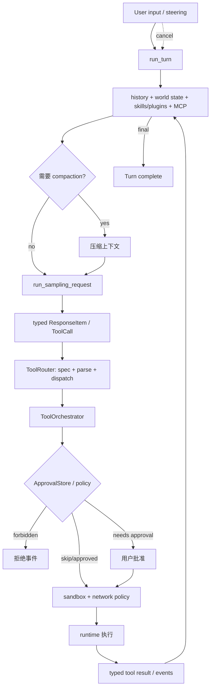

# 第 5 章 Codex：从模型意图到受控副作用

> 参考实现：[openai/codex](https://github.com/openai/codex)，冻结提交 [`ef293f7`](https://github.com/openai/codex/tree/ef293f7ac9d756f793f3e952a790f9bec16a6eeb)，Apache-2.0；核心实现使用 Rust。

## 本章要解决的问题

模型能够生成 shell、文件修改和网络工具调用，但“模型提出动作”不能等于“系统直接执行动作”。生产 Agent 必须在两者之间建立结构化意图、授权策略、人工审批、sandbox、network policy、取消和结果记账。

本章沿一条真实 shell tool call 学习这些边界怎样串联，以及为什么 Router 只能解释意图，Orchestrator 才能决定执行权限。

## 本章目标

| 问题 | 建议 |
|---|---|
| 本章重点 | 模型意图如何经过 typed protocol、审批、sandbox 与执行，最终成为可审计副作用 |
| 前置知识 | 完成第 1–2 章；理解进程权限的基本含义，Rust async 与 sandbox 细节按伪代码阅读即可 |
| 第一遍重点 | `run_turn`、ToolRouter/ToolOrchestrator 分层、approval → sandbox → escalation |
| 可以后看 | UI 协议长尾、provider 兼容、MCP/skills/plugins 的全部实现 |
| 完成后应能回答 | 模型能决定什么、系统保留什么权力？哪些失败允许提权重试？并发为何不能改变 history 顺序？ |

## 核心设计



### 1. Turn 入口同时管理模型上下文与运行控制

[`run_turn`](https://github.com/openai/codex/blob/ef293f7ac9d756f793f3e952a790f9bec16a6eeb/codex-rs/core/src/session/turn.rs#L150) 在采样前处理 compaction、MCP server、world-state/context snapshot、skills/plugins、hooks 与 history；循环还吸收 steering/cancel。Agent loop 因此不是简单 `while tool_call`，而是会话、环境和并发输入的协调器。

[`run_sampling_request`](https://github.com/openai/codex/blob/ef293f7ac9d756f793f3e952a790f9bec16a6eeb/codex-rs/core/src/session/turn.rs#L1309) 复用 model client、处理 streaming 与可重试错误。把采样生命周期从 turn orchestration 拆开，有利于错误恢复与遥测。

### 2. Router 只解释意图，Orchestrator 才控制执行

[`ToolRouter`](https://github.com/openai/codex/blob/ef293f7ac9d756f793f3e952a790f9bec16a6eeb/codex-rs/core/src/tools/router.rs#L68) 管理模型可见 tool specs、deferred namespace、并行能力、解析和 dispatch。它回答“模型想调用什么”。

[`ToolOrchestrator`](https://github.com/openai/codex/blob/ef293f7ac9d756f793f3e952a790f9bec16a6eeb/codex-rs/core/src/tools/orchestrator.rs#L40) 统一审批、sandbox 选择、首次执行和必要时的升级重试。它回答“系统允许以什么权限执行”。二者分开是最重要的安全不变量。

### 3. 审批是可缓存策略，不是散落弹窗

[`ApprovalStore`](https://github.com/openai/codex/blob/ef293f7ac9d756f793f3e952a790f9bec16a6eeb/codex-rs/core/src/tools/sandboxing.rs#L41) 保存 session 内已批准决策；[`ExecApprovalRequirement`](https://github.com/openai/codex/blob/ef293f7ac9d756f793f3e952a790f9bec16a6eeb/codex-rs/core/src/tools/sandboxing.rs#L156) 区分 skip、needs approval、forbidden。这样拒绝、一次批准和会话批准能被一致处理。

## 两条源码调用链

1. **安全工具路径**：`run_turn → model ResponseItem → ToolRouter.build_tool_call → dispatch → ToolOrchestrator.run → approval requirement/store → sandbox policy → runtime → tool result item`。
2. **拒绝、隔离失败与升级路径**：`ToolOrchestrator → policy says forbidden/rejected → typed denial result`；或 `sandboxed attempt → sandbox denial eligible for escalation → new approval → broader sandbox attempt`。普通 command failure 只写回 tool result，不能借机进入权限升级。

## 建议源码阅读顺序

1. 从 `run_turn` 开始，只标记 sampling、tool handling、steering/cancel 与 compaction 四个边界。
2. 再读 `ToolRouter`，确认它只解析 typed intent，不持有最终授权权力。
3. 进入 `ToolOrchestrator` 与 `ExecApprovalRequirement`，画出 allow、ask、forbidden、sandbox denial 四条路径。
4. 最后检查 `ApprovalStore`、并发 gate 和 history 回填顺序，理解性能优化不能改变可重放语义。

## 一次 shell tool call 的安全轨迹

| 阶段 | 产生的对象/决定 | 谁拥有权力 | 失败后的语义 |
|---|---|---|---|
| 模型采样 | typed `ResponseItem` / tool intent | 模型只能提出动作 | malformed intent 成为模型行为错误，不能直接执行字符串 |
| 记入历史 | tool call item | session/runtime | 取消后仍保留“模型曾提出该动作”的事实 |
| Router | tool spec、解析后的参数、dispatch target | `ToolRouter` 解释意图 | 未知工具或参数错误返回受控失败 |
| Approval | skip / needs approval / forbidden | policy、ApprovalStore、用户 | forbidden 与 rejected 都不能自动提权 |
| Sandbox policy | 文件、网络、工作目录与 OS 隔离配置 | 系统执行层 | 用户批准不应移除独立的 deny-read 等限制 |
| First attempt | sandboxed execution | runtime | 命令自身失败是普通 tool failure；sandbox denial 才可能进入升级判断 |
| Escalation | 更高权限 attempt 是否允许 | orchestrator + policy/用户 | 只能沿显式策略升级，不能把任意失败解释为权限不足 |
| Result | typed output / error event | session 记录后交给模型 | 普通失败可供模型修复；fatal runtime failure 才中止 turn |

这条链最值得复刻的不是 Rust 结构，而是权力分离：**模型选择 intent，Router 解释 intent，policy 授权，sandbox 限制能力，runtime 执行，session 记录事实。**任意两层合并，都会让测试、审计或最小权限变得更困难。

## 关键源码骨架（等价伪代码）

以下用接近 Rust 语义的伪代码重写冻结提交。真实代码还覆盖多种 tool runtime、network proxy、hooks、OTel 与不同 OS sandbox。

### 1. run_turn 不是简单工具循环

```rust
async fn run_turn(session, turn_context, input, cancel) -> TurnResult {
    session.append_user_input(input).await;
    let mut client_session = session.model_client.new_session();
    let mut world_state = session.current_world_state().await;

    loop {
        cancel.check()?;

        // sampling 间隙接收用户 steering；它会进入同一条 conversation history。
        let pending_input = session.drain_steering_input().await;
        session.append_input(pending_input).await;

        let required_mcp = required_mcp_servers_for_current_input(session).await?;
        let step_context = session.capture_step_context(required_mcp, cancel).await?;
        world_state = session.record_world_state_if_changed(world_state, step_context).await?;

        if session.context_window_needs_compaction().await {
            session.compact_history().await?;
        }

        let prompt_items = session.clone_history().await.for_prompt();
        let sampled = run_sampling_request(
            session, step_context, &mut client_session, prompt_items, cancel.child_token()
        ).await?;

        match process_streamed_response_items(sampled).await? {
            ContinueWithToolResults(items) => session.append_items(items).await,
            ContinueAfterModelRewrite(items) => session.replace_context(items).await,
            Final(answer) => return Ok(answer),
        }
    }
}
```

`step_context` 是一次 sampling 的稳定环境快照；world state 只有变化时才写入历史，避免每轮重复注入大块环境描述。

### 2. ToolRouter 与 ToolOrchestrator 的职责边界

```rust
async fn handle_model_tool_call(item: ResponseItem) -> ToolResult {
    // Router：只负责模型协议和工具注册表。
    let call = router.build_tool_call(item)?;       // name + call_id + typed payload
    let handler = router.registry.handler(call.name)?;

    // Handler 将 payload 变成具体 ToolRuntime request。
    return handler.dispatch(call, |runtime, request, tool_ctx| async {
        // Orchestrator：决定这个 request 是否、以及以何权限执行。
        orchestrator.run(runtime, request, tool_ctx, turn_ctx, approval_policy).await
    }).await;
}
```

若把 approval 放进每个 handler，新增工具很容易漏审；集中 Orchestrator 让“任何能产生副作用的 ToolRuntime 都经过同一策略”成为结构性约束。

### 3. approval → sandbox → attempt → escalation

```rust
async fn orchestrate(tool, request, ctx, policy) -> Result<Output> {
    let fs_policy = ctx.permissions.file_system_policy();
    let requirement = tool.exec_approval_requirement(request)
        .unwrap_or(default_requirement(policy, fs_policy));

    match requirement {
        Forbidden(reason) => return Err(Rejected(reason)),
        NeedsApproval(reason) => {
            resolve_approval(tool, request, reason, reviewer_for_turn(ctx)).await?;
        }
        Skip { .. } => record_policy_approval(),
    }

    let first_sandbox = select_sandbox(
        tool.sandbox_permissions(request),
        requirement,
        fs_policy,
    );
    let result = run_attempt_with_network_approval(tool, request, first_sandbox).await;

    match result {
        Ok(output) => Ok(output),
        Err(SandboxDenied(reason)) if unsandboxed_execution_allowed(fs_policy) => {
            // 审批按序列化 key 缓存；升级重试不重复询问同一批准。
            resolve_escalation_approval_once(request, reason).await?;
            run_attempt(tool, request, Unsandboxed).await
        }
        Err(error) => Err(error),
    }
}
```

网络批准还有 immediate/deferred 两种完成时机：deferred approval 只有工具成功后才随结果交给后续完成逻辑，工具失败则立即收尾，防止悬空授权。

### 4. session approval cache 的粒度

```rust
async fn with_cached_approval(keys, ask_user) -> ReviewDecision {
    if !keys.is_empty() && keys.all(|key| store.get(key) == ApprovedForSession) {
        return ApprovedForSession;
    }

    let decision = ask_user().await;
    telemetry.count("approval.requested", decision);

    if decision == ApprovedForSession {
        for key in keys {
            store.put(serialize(key), ApprovedForSession);
        }
    }
    return decision;
}
```

`apply_patch` 可能触及多个文件，因此 approval keys 是向量；只有所有 key 都已批准才跳过询问，批准后则逐 key 缓存，未来修改其中任意子集也能正确命中。

### 5. 工具可并发执行，但 history 按模型顺序回填

```rust
async fn consume_response_stream(stream, runtime, cancel) {
    let mut in_flight = FuturesOrdered::new();

    while let Some(event) = stream.next().await {
        match event {
            OutputItemDone(item) if item.is_tool_call() => {
                let call = router.build_tool_call(item)?;
                session.record_tool_call_before_execution(call.clone()).await;
                in_flight.push_back(runtime.handle(call, cancel.child_token()));
            }
            OutputItemDone(item) => session.record_turn_item(item).await,
            Completed(usage, end_turn) => {
                session.record_usage(usage).await;
                needs_follow_up |= !end_turn;
                break;
            }
        }
    }

    // FuturesOrdered 允许实际并发，但 output 仍按模型发出 call 的顺序写回 history。
    while let Some(tool_output) = in_flight.next().await {
        session.record_tool_output(tool_output).await;
    }
}

async fn run_tool_with_gate(call) {
    let _permit = if call.supports_parallel {
        tool_gate.read().await   // 多个 parallel tools 共享读锁。
    } else {
        tool_gate.write().await  // 非并行 tool 与所有其他 tool 互斥。
    };
    select! {
        result = dispatch(call) => model_visible_or_fatal(result),
        _ = cancellation.cancelled() => aborted_tool_output(call),
    }
}
```

tool call 在执行前先写入 history，保证取消后 rollout 仍忠实记录模型已经发出的意图。普通 tool failure 被转换为 model-visible `success: false` 结果，让模型可修复；只有 fatal runtime failure 才中止整个采样。

## 关键不变量与失败路径

- 模型只能构造 typed tool intent，不能直接选择 sandbox 或绕过 approval。
- `Forbidden` 与用户 `Rejected` 都不能作为普通 tool error 自动升级权限。
- 文件系统 deny-read 是生效权限的一部分；即使用户批准，也不能用 unsandboxed 执行悄悄丢掉该限制。
- sandbox denial 才可能进入升级路径；命令自身退出失败不能被误判成“需要更多权限”。
- approval cache key 必须包含会影响风险的参数；过粗会越权，过细会反复询问。
- cancellation token 要传入 sampling、MCP、tool/network approval；只停止 UI 流不能算取消副作用。
- compaction 必须保存约束、批准与未完成工具事实，否则压缩后行为会漂移。
- 工具执行完成顺序不能改变 conversation history 顺序；并发只优化墙钟时间，不应改变下一轮模型输入。

## 设计收益

- 模型、路由、授权、隔离、执行各层独立，权限边界清楚。
- typed protocol 让 CLI、IDE/应用层、日志与测试共享事件语义。
- Rust async 与统一 orchestrator 适合并发工具、取消和流式输出。
- skills、plugins、MCP 被注入明确上下文，而不是任意拼 prompt。
- compaction、world state、steering 表明长程交互被视为运行时问题。

## 适用边界与常见误区

- 仓库巨大且跨多个 crate；应在完成前四章后只沿本章给出的安全调用链阅读，不从完整目录开始。
- 与 OpenAI 模型/protocol/产品特性存在自然耦合，抽取为通用 SDK 成本高。
- 产品协议、模型能力和多前端需求使代码表面积很大；不要为了理解安全链而追踪全部产品分支。
- sandbox 能减少主机风险，但网络、挂载、凭证和用户批准仍可能扩大权限。
- 自动重试若跨越非幂等工具边界，必须确保 orchestrator/tool 自己处理重复副作用。

## 本章练习

不要复刻整个 Codex。只复刻“ToolIntent → Router → ApprovalDecision → SandboxPolicy → ExecutionResult”五个关键边界；用同一 shell tool 测试 allow、ask、forbidden、sandbox failure 后升级四条路径，并让每一步输出 typed event。

### 练习验收

- policy 由运行时生成，模型参数不能覆盖 sandbox 或 network 权限；
- forbidden、用户拒绝、命令失败与 sandbox denial 在状态和事件中可区分；
- 只有允许升级的 sandbox 失败进入二次审批，普通命令失败不会借机提权。

## 检查理解

1. ToolRouter 与 ToolOrchestrator 为什么不能合成一个直接执行工具的函数？
2. 哪类失败允许进入权限升级，哪类失败只能作为普通 tool result？
3. 工具可以并发完成，为什么写回 history 时仍要保持模型调用顺序？

## 本章小结

本章最重要的结论是：模型只能提出结构化意图，不能直接拥有执行权限。生产 Agent 应把路由、授权、隔离、执行和记账拆成可独立验证的边界。

---

[上一章：browser-use](04-browser-use.md) · [课程目录](00-learning-guide.md) · [下一章：OpenHands](06-openhands.md)
