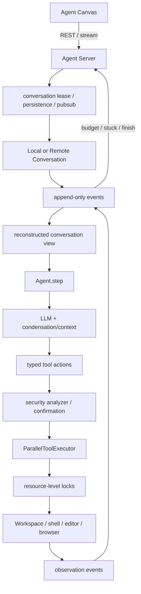

# 第 6 章 OpenHands：事件化 Conversation 与完整 Agent 平台

> 参考实现：[OpenHands/OpenHands](https://github.com/OpenHands/OpenHands)，冻结 [`a139a6c`](https://github.com/OpenHands/OpenHands/tree/a139a6c35579901e4848d8d9d2fd6ca4a0dbbf26)；执行核心位于 [OpenHands/software-agent-sdk](https://github.com/OpenHands/software-agent-sdk)，冻结 [`6d597ff`](https://github.com/OpenHands/software-agent-sdk/tree/6d597ff7d5d3c89ef8ba0c8e3b3c6a09169da07c)，MIT。

## 本章要解决的问题

前一章聚焦一次工具调用的安全链。本章把视野扩大到完整产品：UI 如何连接 Agent Server，会话如何持久化，Agent 如何从当前 view 产生 action，Workspace 如何执行副作用，事件又怎样回到用户界面。

OpenHands 的学习重点是事实所有权。event log、conversation view、Agent、Workspace 和前端各自拥有不同责任；把它们混在一起会让恢复、并发和远程观察失去依据。

## 本章目标

| 问题 | 建议 |
|---|---|
| 本章重点 | 完整 Agent 产品如何跨 UI、Server、Conversation、Agent、Tool 与 Workspace 建立事件化边界 |
| 前置知识 | 完成第 5 章；第 3 章的恢复术语有帮助，event log、资源锁与远程执行边界由本章建立 |
| 第一遍重点 | Conversation event/view、`Agent.step`、action/observation 配对、资源级锁 |
| 可以后看 | 前端组件、部署适配、插件与 workspace 后端的全部变体 |
| 完成后应能回答 | 哪一层是事实源？未匹配 action 如何恢复？为什么工具并发需要资源声明而非简单 `gather`？ |

## 核心设计



### 1. 主仓是前端，Agent Server 是执行边界

主仓 README [明确说明](https://github.com/OpenHands/OpenHands/blob/a139a6c35579901e4848d8d9d2fd6ca4a0dbbf26/README.md#L126) Agent Canvas 由 software-agent-sdk 中的 Agent Server 驱动；Server 以 REST API 在一个 host/port 上运行多个 agents。部署时 UI 可连接多个 Server，执行、持久化和资源隔离不应放进浏览器前端。

### 2. Conversation 以事件重建状态

SDK 的 [`LocalConversation`](https://github.com/OpenHands/software-agent-sdk/blob/6d597ff7d5d3c89ef8ba0c8e3b3c6a09169da07c/openhands-sdk/openhands/sdk/conversation/impl/local_conversation.py#L161) 管理 event store、agent、workspace、plugins、budget、stuck detection 与生命周期；[`run()`](https://github.com/OpenHands/software-agent-sdk/blob/6d597ff7d5d3c89ef8ba0c8e3b3c6a09169da07c/openhands-sdk/openhands/sdk/conversation/impl/local_conversation.py#L1800) 驱动会话。状态来自事件序列与 view，而非只有一个不断增长的 messages 数组。

### 3. Agent.step 从当前 view 生成下一动作

[`Agent`](https://github.com/OpenHands/software-agent-sdk/blob/6d597ff7d5d3c89ef8ba0c8e3b3c6a09169da07c/openhands-sdk/openhands/sdk/agent/agent.py#L353) 组合 prompt、LLM、tools、condensation、critic/dispatch；[`step()`](https://github.com/OpenHands/software-agent-sdk/blob/6d597ff7d5d3c89ef8ba0c8e3b3c6a09169da07c/openhands-sdk/openhands/sdk/agent/agent.py#L613) 处理 pending confirmation、读取 view、压缩上下文、调用 LLM 并生成 action。Agent 不直接修改 workspace，而是产出事件化动作。

### 4. 并行工具用资源声明避免冲突

[`ParallelToolExecutor`](https://github.com/OpenHands/software-agent-sdk/blob/6d597ff7d5d3c89ef8ba0c8e3b3c6a09169da07c/openhands-sdk/openhands/sdk/agent/parallel_executor.py#L40) 基于工具声明的资源做锁定。相比“所有 tool calls 都 `gather`”，资源级互斥更适合文件、终端和浏览器这类共享可变对象。

## 两条源码调用链

1. **产品到副作用**：`Agent Canvas → Agent Server REST/stream → Conversation lease → Local/RemoteConversation.run → Agent.step → tool action → security/confirmation → workspace → observation event`。
2. **恢复与观察**：`persisted event log → reconstruct conversation view → budget/stuck/plugin hooks → next Agent.step → new events → server publishes to Canvas`。

## 建议源码阅读顺序

1. 先用主仓 README 确认 Canvas 与 Agent Server 的边界，避免把前端仓误当执行核心。
2. 再读 `LocalConversation.run()`，记录 event store、status、budget、stuck 与 workspace 的生命周期。
3. 进入 `Agent.step()`，跟踪 view → LLM → action，以及 pending confirmation/unmatched action 的优先处理。
4. 最后读 `ParallelToolExecutor`，验证资源 key、稳定加锁顺序和 observation 回填顺序。

## 跨仓边界与事实所有权

| 层 | 主要责任 | 是否是执行事实源 | 恢复时的角色 |
|---|---|---|---|
| Agent Canvas | 用户交互、显示事件与控制请求 | 否 | 重新订阅/加载服务端会话 |
| Agent Server | 会话租约、API、持久化与发布 | 管理事实源的访问边界 | 找到 Conversation 并协调远程观察/继续 |
| Conversation / event store | 生命周期、status、action/observation 事件 | 是 | 从 append-only events 重建当前 view |
| Agent | 从 view 产生下一 action | 否 | 只有没有未匹配 action 时才应重新采样 |
| Workspace / tool runtime | 文件、终端、浏览器等外部状态 | 是，但不完全由 event log 控制 | 需要隔离、资源锁与副作用幂等 |
| conversation view | 提供给 Agent 的当前派生状态 | 否，是缓存/投影 | 损坏时从 event log 重建 |

典型恢复轨迹是：`ActionEvent 已持久化 → 等待确认/执行 → 进程中断 → 从 event log 重建 view → 发现 unmatched action → 继续该 action → 追加 ObservationEvent`。关键不变量是不要在已有未匹配 action 时重新调用模型，否则同一个意图可能被重新采样并产生第二次副作用。

## 关键源码骨架（等价伪代码）

以下伪代码依据 software-agent-sdk 冻结提交重写，省略同步/异步双实现中的重复兼容代码。

### 1. Conversation.run 是带显式状态的外层生命周期

```python
def run(self):
    ensure_agent_and_plugins_ready()
    self.cancel_token = CancellationToken()

    if state.status in {IDLE, PAUSED, ERROR, STUCK}:
        state.status = RUNNING

    iteration = 0
    try:
        while True:
            with state.lock:  # pause/send_message 与 step 串行修改状态
                if state.status in {PAUSED, STUCK}:
                    break

                if state.status == FINISHED:
                    should_stop, feedback = hooks.run_stop("agent_finished")
                    if should_stop:
                        break
                    append_event(EnvironmentFeedback(feedback))
                    state.status = RUNNING
                    continue

                if stuck_detector.is_stuck():
                    state.status = STUCK
                    continue

                if state.status == WAITING_FOR_CONFIRMATION:
                    state.status = RUNNING  # 下一次 run 表示用户已确认。

                self.step_holds_state_lock = True
                try:
                    agent.step(self, on_event=append_event, on_token=emit_token)
                finally:
                    self.step_holds_state_lock = False

                iteration += 1
                if state.status == WAITING_FOR_CONFIRMATION:
                    break
                if budget_exceeded():
                    append_event(MaxBudgetReached())
                    break
                if iteration >= max_iteration_per_run and state.status != FINISHED:
                    state.status = ERROR
                    append_event(MaxIterationsReached())
                    break
    except Exception as error:
        state.status = ERROR
        append_typed_error_unless_already_reported(error)
        raise ConversationRunError(state.id, error)
    finally:
        self.cancel_token = None
```

结束状态要在下一轮锁内再次确认，因为 Agent 标记 FINISHED 后，用户消息可能正在等待同一 FIFO lock；过早 `break` 会丢掉并发输入。

### 2. Agent.step 优先处理未匹配 action，再采样

```python
def step(self, conversation, on_event):
    state = conversation.state

    pending = state.get_unmatched_actions(state.active_branch())
    if pending:
        # confirmation mode 的第二次 run：不重新问模型，执行已记录 action。
        execute_actions(conversation, pending, on_event)
        return

    if blocked_reason := state.pop_blocked_last_user_message():
        state.status = FINISHED
        return

    messages_or_condensation = prepare_llm_messages(
        state.view, condenser=self.condenser, llm=self.llm
    )
    if isinstance(messages_or_condensation, Condensation):
        on_event(messages_or_condensation)
        return

    try:
        response = llm.complete(messages_or_condensation, tools=self.tools)
    except FunctionCallValidationError as error:
        on_event(UserMessageEvent(str(error)))  # 作为可见反馈让下一轮修正。
        return
    except MalformedHistoryError:
        state.rebuild_view()
        on_event(CondensationRequest())
        return
    except ContextWindowExceeded:
        on_event(CondensationRequest())
        return

    match classify(response.message):
        case TOOL_CALLS:
            record_action_events(response)
            if confirmation_mode:
                state.status = WAITING_FOR_CONFIRMATION
            else:
                execute_actions(conversation, actions, on_event)
        case CONTENT:
            record_message_or_finish(response)
        case EMPTY | REASONING_ONLY:
            record_recovery_feedback(response)
```

“pending action 先于新采样”是确认模式的核心不变量：恢复后若重新调用模型，原来被批准的动作可能被模型换成另一个动作，审批对象就失效了。

### 3. 并行工具按资源集合上锁

```python
def execute_batch(action_events, tools, cancel_token):
    def execute_one(action):
        if cancel_token.cancelled:
            return [AgentErrorEvent("cancelled")]

        tool = tools[action.tool_name]
        declaration = tool.declared_resources(action.arguments)

        if declaration is missing:
            resources = {"tool:" + tool.name}  # 保守降级：同名 tool 串行。
        elif declaration.explicitly_declared:
            resources = declaration.keys       # 显式空集合才表示无需锁。

        # 多个 resource key 使用稳定排序，防止 A→B / B→A 死锁。
        with lock_manager.acquire_all(sorted(resources)):
            if cancel_token.cancelled:
                return [AgentErrorEvent("cancelled")]
            return tool_runner(action)

    return thread_pool.map(execute_one, action_events, max_workers=self.max_workers)
```

每个 `ParallelToolExecutor` 有独立 thread pool 与 lock manager，子 Agent 的嵌套执行不会等待父 Agent 持有的同一把 manager 锁。

## 关键不变量与失败路径

- conversation events 是事实源，view 是可重建缓存；缓存异常时应从事件重建而非继续信任脏 view。
- action 与 observation 必须配对；未匹配 action 表示待确认/待执行，不应丢弃或重新采样。
- status 修改和 step 在同一锁下，防止 pause、用户消息和工具回调互相覆盖。
- 未声明资源会保守退化为 `tool:<name>` 互斥，并不会自动无锁；真正危险的是不同工具共享资源却声明成不同 key，或错误地显式声明空资源。
- 同一批工具的完成时间可不同，但 observation 按原 action 顺序发射；取消运行中的线程会调用 executor interrupt，已经产生的副作用仍不能回滚。
- content filter、malformed history、context overflow 的恢复策略不同，不能统一吞成普通模型错误。
- budget/stuck/max iterations 是三种不同终止原因，应产生不同 typed event。
- stop hook 可以否决完成；因此 `FINISHED` 是候选终止状态，hook 通过后才真正退出。

## 设计收益

- 展示完整 Agent 产品边界：UI、API server、会话租约、SDK、workspace、事件流。
- event sourcing 便于持久化、回放、远程观察和状态重建。
- budget、max iterations、stuck detection、condensation 把长程失败当运行时问题。
- 安全 analyzer、确认与资源锁位于动作和副作用之间。
- 本地/远程 Conversation 与 workspace 支持不同部署拓扑。

## 适用边界与常见误区

- 多仓拆分和快速演进使旧文章/旧路径很容易过时；必须记录 SHA 和仓库边界。
- 完整部署包含 Server、存储、workspace/container、模型、secret，运维成本高。
- event sourcing 提高可恢复性，也带来事件 schema 演进、存储增长和 view 一致性成本。
- security analyzer 仍可能依赖模型/规则，不能替代最小权限容器和网络策略。
- 资源锁正确性依赖工具准确声明跨工具共享资源；未声明会造成同名工具过度串行，错误的显式空声明或错误 key 才会重新引入竞态。

## 本章练习

实现一个最小 event-sourced coding loop：`MessageEvent → ActionEvent → ObservationEvent`；从日志重建 view；两个读文件工具并行，一个写文件工具独占 workspace；危险 shell action 先产生 confirmation event，重启后仍能批准并继续。

### 练习验收

- 删除内存 view 后，仍能仅凭 event log 重建同一会话状态；
- unmatched action 在重启后继续执行，不会触发新的模型采样；
- 两个只读工具可并行，写工具必须与冲突资源互斥。

## 检查理解

1. event log、conversation view 与 Workspace 哪些是事实源，哪些是派生状态？
2. 为什么存在 unmatched action 时不应重新调用模型？
3. 资源级锁相比“所有工具一起 gather”解决了什么问题？

## 本章小结

本章把单次工具调用扩展成完整产品生命周期：前端不是事实源，Agent 不直接拥有 Workspace，当前 view 可以从事件重建。阅读时必须同时追踪主仓、Agent Server 和 SDK。

---

[上一章：Codex](05-codex.md) · [课程目录](00-learning-guide.md) · [下一章：OpenWorker](07-openworker.md)
