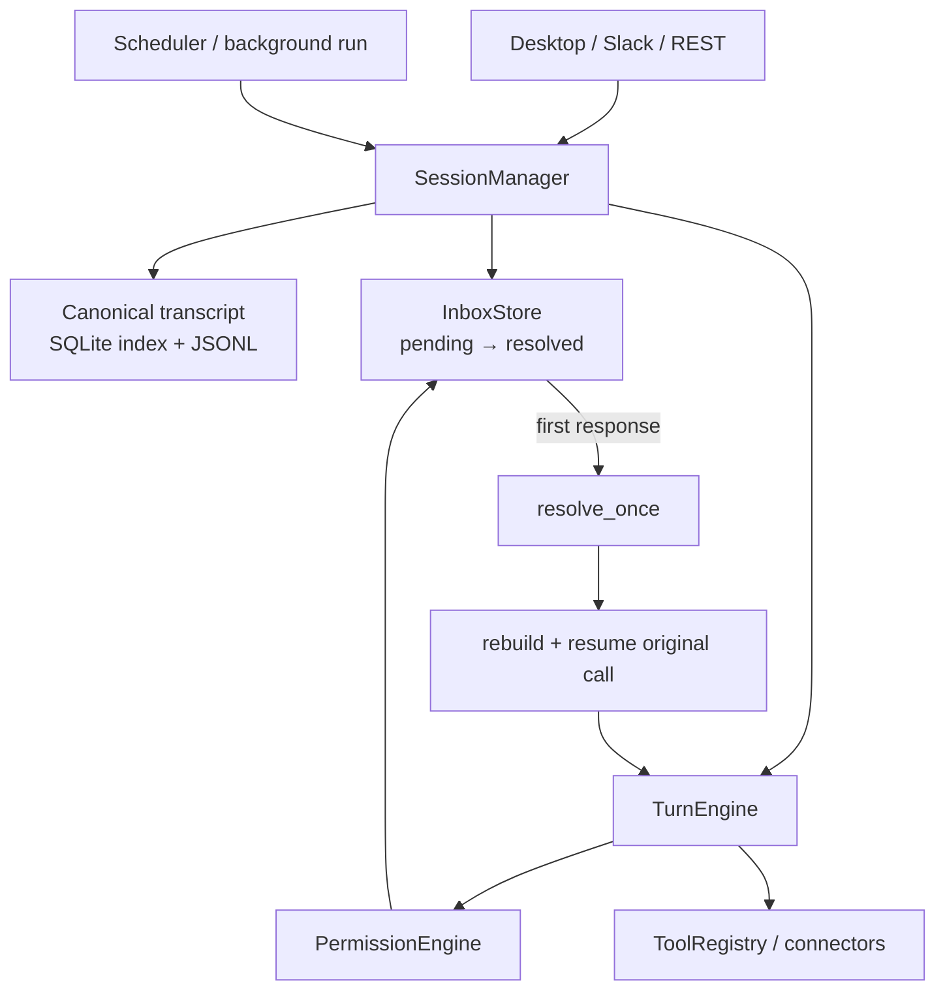

# 第 7 章 OpenWorker：耐久 Inbox 与人类注意力控制面

> 参考实现：[andrewyng/openworker](https://github.com/andrewyng/openworker)，冻结提交 [`01b6f83`](https://github.com/andrewyng/openworker/tree/01b6f83b3927e02912dda84bb392942c13ca70d1)，MIT；该提交对应项目仍处 [Open Beta](https://github.com/andrewyng/openworker/blob/01b6f83b3927e02912dda84bb392942c13ca70d1/README.md#L8)。

## 本章要解决的问题

第 5、6 章已经说明模型怎样获权执行，以及事件化产品怎样恢复未完成 action。本章继续处理一个更窄的问题：Agent 在后台运行时，用户可能不在当前窗口，审批、问题或目录请求怎样跨表面等待数小时，并在进程重启后仍绑定原动作？

OpenWorker 的独特价值不在连接器数量，而在 human-attention control plane：Inbox item 绑定稳定 tool-call identity，App 与 Slack 可以竞争回答同一请求，前台与后台只改变送达位置，不改变权限上限。

## 本章目标

| 问题 | 建议 |
|---|---|
| 本章重点 | durable Inbox、first-responder-wins、autonomy ceiling、exact-target standing grant，以及 prompt/effect identity |
| 前置知识 | 完成第 5–6 章；理解 tool call/result 配对和 approval/sandbox 分层 |
| 第一遍重点 | `InboxStore.add`、`SessionManager.resolve_inbox`、`TurnEngine.resume`、`CompactionState` |
| 可以后看 | provider adapter、Plan 子 Agent、Browser connector、GUI 和完整连接器目录 |
| 完成后应能回答 | 等待人的状态怎样持久化？后台运行为什么不能自动提权？prompt identity 为什么不能解决重复副作用？ |

## 核心架构



图中需要长期保留的边界是：transcript 证明模型提出过什么，Inbox 证明人类请求处于什么状态，PermissionEngine 决定当前是否仍允许，connector 才负责外部副作用。

## 核心设计

### 1. Inbox item 绑定稳定动作身份

[`InboxStore`](https://github.com/andrewyng/openworker/blob/01b6f83b3927e02912dda84bb392942c13ca70d1/coworker/inbox.py#L1-L12) 把 approval、question、notification、directory request 与 plan proposal 统一为 `pending → resolved` item。[`add()`](https://github.com/andrewyng/openworker/blob/01b6f83b3927e02912dda84bb392942c13ca70d1/coworker/inbox.py#L115-L160) 使用 `(session_id, tool_call_id)` 作为幂等身份，因此同一恢复请求不会创建多个逻辑 prompt。

只按 tool name 幂等是不够的：同一轮可能包含两个参数不同的 `send_message`，它们必须拥有不同 prompt identity。

### 2. 多个表面共享同一个等待状态

attended 与 unattended 的差异只在 delivery channel：

- attended：当前会话 inline 显示；
- unattended/background：进入跨会话 Inbox，可从 App 或 Slack 处理；
- 任一表面首先成功解决 item 后，其他回答必须成为 no-op。

这个 first-responder-wins 规则避免两次批准产生两个恢复任务。更重要的是，后台模式只改变“在哪里问人”，不能改变 autonomy ceiling；是否允许仍由同一个 PermissionEngine 决定。

### 3. 恢复原 tool call，而不是重新采样

审批前，assistant tool call 已进入 canonical transcript。任一表面解决 item 后，[`SessionManager.resolve_inbox()`](https://github.com/andrewyng/openworker/blob/01b6f83b3927e02912dda84bb392942c13ca70d1/coworker/server/manager.py#L861-L886) 重建 engine，并调用 [`TurnEngine.resume()`](https://github.com/andrewyng/openworker/blob/01b6f83b3927e02912dda84bb392942c13ca70d1/coworker/engine.py#L270-L312)。resume 查找尾部尚未配对 tool result 的调用，已经回答的调用被跳过。

这能避免“用户批准 A，重启后模型重新采样成 B”。但参考实现的 transcript 与 Inbox 是两个持久化步骤：若进程死在 tool call 已落盘、Inbox item 尚未建立之间，启动恢复还需要扫描 unmatched prompt 并幂等补建 item。本章把它作为必须补齐的设计缺口，而不是把 pending item 之后的恢复误写成完整 prompt lifecycle。

### 4. Canonical transcript 与模型压缩视图分离

[`ConversationStore`](https://github.com/andrewyng/openworker/blob/01b6f83b3927e02912dda84bb392942c13ca70d1/coworker/conversations.py#L1-L9) 保存完整消息历史；[`CompactionState`](https://github.com/andrewyng/openworker/blob/01b6f83b3927e02912dda84bb392942c13ca70d1/coworker/compaction.py#L85-L113) 单独保存 boundary、summary 和 mechanical state。[`apply_to_outbound()`](https://github.com/andrewyng/openworker/blob/01b6f83b3927e02912dda84bb392942c13ca70d1/coworker/compaction.py#L524-L540) 只生成 provider 输入，不原地删除 canonical history。

因此 UI、审计与恢复仍读取完整事实；摘要只是可重新生成的模型视图。未完成 tool call、授权限制和 waiting item 不能只存在于摘要里。

### 5. Standing grant 必须绑定 exact target

[`PermissionEngine.evaluate()`](https://github.com/andrewyng/openworker/blob/01b6f83b3927e02912dda84bb392942c13ca70d1/coworker/permissions.py#L120-L178) 对自动化的 EXTERNAL action 生成 `tool → exact target` standing rule，例如只允许发送到某个固定频道。

这表达了重复自动化的最小权限：批准“以后发到频道 A”，不能推出“以后调用任意 Slack 写工具”，换目标或改变关键参数仍需重新判断。

## 两条源码调用链

1. **后台等待人的正常路径**：`scheduler/session input → TurnEngine persists assistant tool_call → PermissionEngine needs_user → InboxStore.add(session_id, tool_call_id) → App/Slack displays one durable item → resolve_once → append tool result → continue loop`。
2. **崩溃与恢复路径**：`startup scans unmatched prompt → ensure Inbox item idempotently → user resolves → SessionManager rebuilds engine → revalidate current authorization → TurnEngine.resume original unanswered call → connector effect/reconciliation → append result`。

第二条链的“startup scan”和“恢复前授权重验”是从参考实现边界推导出的可靠性补强；阅读源码时应明确区分“仓库已经实现”和“教材要求自己的 runtime 补齐”。

## 建议源码阅读顺序

1. 读 [`InboxStore.add`](https://github.com/andrewyng/openworker/blob/01b6f83b3927e02912dda84bb392942c13ca70d1/coworker/inbox.py#L115-L160)，确认 item identity、状态转换和 resolve-once 合同。
2. 串起 [`resolve_inbox`](https://github.com/andrewyng/openworker/blob/01b6f83b3927e02912dda84bb392942c13ca70d1/coworker/server/manager.py#L861-L886) 与 [`TurnEngine.resume`](https://github.com/andrewyng/openworker/blob/01b6f83b3927e02912dda84bb392942c13ca70d1/coworker/engine.py#L270-L312)，列出重启后哪些事实来自 transcript，哪些来自 Inbox。
3. 读 [`ConversationStore`](https://github.com/andrewyng/openworker/blob/01b6f83b3927e02912dda84bb392942c13ca70d1/coworker/conversations.py#L1-L9) 与 [`apply_to_outbound`](https://github.com/andrewyng/openworker/blob/01b6f83b3927e02912dda84bb392942c13ca70d1/coworker/compaction.py#L524-L540)，验证压缩不改变恢复事实。
4. 最后读 [`PermissionEngine.evaluate`](https://github.com/andrewyng/openworker/blob/01b6f83b3927e02912dda84bb392942c13ca70d1/coworker/permissions.py#L120-L178)，测试 unattended mode 和 standing rule 都不能扩大权限范围。

## Crash-window matrix：Prompt Identity 不等于 Effect Identity

| 崩溃窗口 | 恢复时已知事实 | 正确处理 |
|---|---|---|
| assistant tool call 落盘前 | 系统无法证明模型提出过动作 | 允许重新采样 |
| tool call 已落盘、Inbox item 未建立 | 存在 unmatched prompt | 启动扫描并用同一 `(session_id, tool_call_id)` 幂等补建 item |
| Inbox item 为 pending | 动作与等待状态都存在 | 继续等待；不得因 unattended 自动批准 |
| 两个表面同时回答 | 可能收到两个 resolution | 只允许第一次状态转换成功 |
| item resolved、工具未执行 | 历史批准与原动作存在 | 不重新采样；按当前 policy、expiry 与 auth context 重验 |
| 远端成功、tool result 未落盘 | 本地无法仅凭 transcript 判断结果 | 使用独立 `effect_id` 对账；不能安全判断时保留 `UNKNOWN` |
| tool result 已落盘 | action/result 已配对 | resume 跳过该调用并继续下一轮 |

前五行主要由 prompt identity 处理；远端副作用需要另一种 effect identity、幂等键、执行日志或对账协议。

## 关键源码骨架（等价伪代码）

### 1. 创建或修复 Durable Prompt

```python
async def request_approval(session_id, call):
    append_canonical_assistant_call(session_id, call)
    item = inbox.ensure(
        session_id=session_id,
        tool_call_id=call.id,
        kind="approval",
        visibility="inline" if attended() else "inbox",
    )
    return await inbox.wait(item.id)

async def repair_prompts_on_startup(session_id):
    for call in unmatched_calls_requiring_human(session_id):
        inbox.ensure(  # 与正常路径使用同一幂等键。
            session_id=session_id,
            tool_call_id=call.id,
            kind=prompt_kind(call),
        )
```

参考实现展示了 `ensure/add` 后的耐久等待；启动扫描用于闭合两个持久化步骤之间的崩溃窗口。

### 2. First-responder-wins 与恢复重验

```python
async def resolve(item_id, answer):
    item = inbox.get(item_id)
    if not inbox.resolve_once(item_id, answer):
        return already_resolved()

    engine = rebuild_from_canonical_transcript(item.session_id)
    call = engine.find_unanswered_call(item.tool_call_id)
    decision = permissions.revalidate(
        call,
        receipt=item.authorization_receipt,
        auth_context=current_auth_context(),
    )
    if not decision.allowed:
        return engine.append_tool_error(call.id, decision.reason)
    return await engine.execute_without_resampling(call, decision)
```

### 3. 压缩只生成派生视图

```python
def outbound_view(canonical_messages, state):
    if state is None:
        return canonical_messages
    return (
        stable_system_messages(canonical_messages)
        + [compacted_summary(state)]
        + unresolved_constraints(canonical_messages)
        + verbatim_tail(canonical_messages, state.boundary)
    )
```

canonical transcript、Inbox 状态和 authorization receipt 不应被摘要替代。

## 关键不变量与失败路径

- assistant tool call 必须先进入 canonical transcript，恢复才知道模型提出过什么。
- transcript 与 Inbox 之间的创建窗口必须通过事务或启动扫描闭合。
- Inbox item 只能从 `pending` 成功转换为 `resolved` 一次。
- attended/unattended 只能改变 delivery，不得提升 autonomy ceiling。
- 恢复原 call 不等于永久复用旧授权；执行前仍需按当前上下文重验。
- compaction 是 provider view，不得删除 canonical history、pending call 或授权限制。
- standing grant 必须绑定 exact target 与关键参数范围。
- prompt identity 只防止重复询问和重新采样；effect identity 才处理远端重复提交。
- Stop、拒绝和授权失效都必须为原 tool call 写入终态 result，避免留下孤儿调用。

## 设计收益

- 把“等待人”从 UI 弹窗提升为可持久、可路由、可恢复的运行时状态。
- 多个交互表面共享同一 item identity，不会各自创建独立批准流程。
- 后台自动化沿用相同权限上限，并通过 exact-target grant 收紧重复授权。
- canonical/outbound 分离让恢复、审计和上下文压缩不再争用同一个可变 messages 数组。
- prompt/effect 双重身份迫使设计者分别推演“是否重新问人”和“是否重复做事”。

## 适用边界与常见误区

- OpenWorker 展示的是 human-attention control plane，不替代 Codex 的 OS sandbox/network policy。
- [`LocalExecutor`](https://github.com/andrewyng/openworker/blob/01b6f83b3927e02912dda84bb392942c13ca70d1/coworker/tools/shell.py#L1-L20) 仍继承宿主权限；审批通过不代表执行已隔离。
- 参考实现的两个持久化步骤没有自动证明 durable prompt 创建 exactly-once，必须显式处理启动修复。
- durable approval recovery 不保证 connector effect exactly-once。
- Browser、provider 和 Plan mode 是产品的其他能力，不应挤占本章的人类注意力主线。

## 本章练习

只实现一个 stub `send_message` connector，不连接真实 Slack、邮件或生产频道：

1. 用 JSONL 保存 canonical tool call/result，用 SQLite 保存 Inbox item；
2. 在 tool call 已落盘、Inbox item 创建前强制退出，重启后扫描并幂等补建 item；
3. 同时从“App”和“Slack stub”提交不同答案，断言只有一个 resolution 生效；
4. 用 attended inline 与 unattended Inbox 两种 delivery 运行同一 call，断言权限决定完全一致；
5. 生成 compaction 后删除内存 view，断言仍能从 canonical transcript 与 Inbox 恢复；
6. standing grant 只允许 `send_message → channel:test-a`，改成 `channel:test-b` 必须重新询问；
7. 让 stub 在“远端记录成功”后、tool result 落盘前退出，恢复时通过 `effect_id` 对账，而不是直接重发。

### 练习验收

- 两次启动修复只产生一个 `(session_id, tool_call_id)` Inbox item；
- 并发回答只有一个成功状态转换，另一个得到 already-resolved；
- attended/unattended 的 policy trace 完全相同；
- compaction 前后 pending call、授权限制和恢复结果一致；
- exact-target grant 拒绝目标漂移；
- effect 状态未知时保留 `UNKNOWN`，stub 对账完成前不会自动重放。

## 检查理解

1. 为什么 Inbox item 必须绑定 tool-call identity，而不能只绑定 tool name？
2. tool call 已落盘、Inbox item 未建立的崩溃窗口怎样修复？
3. first-responder-wins 解决了什么并发问题？
4. attended 与 unattended 为什么不能使用不同权限上限？
5. prompt identity 与 effect identity 分别阻止什么重复？
6. canonical transcript 与 outbound compaction 合成一个数组会破坏哪些能力？

## 本章小结

本章只保留一个心智模型：**等待人本身就是耐久运行时状态**。稳定 prompt identity、first-responder-wins、权限重验与 canonical history 共同保证恢复原动作；独立 effect identity 再负责判断外部世界是否已经发生变化。

---

[上一章：OpenHands](06-openhands.md) · [课程目录](00-learning-guide.md) · [核心综合实践：最小可靠 Agent Runtime](../14-capstone-agent-runtime.md)
