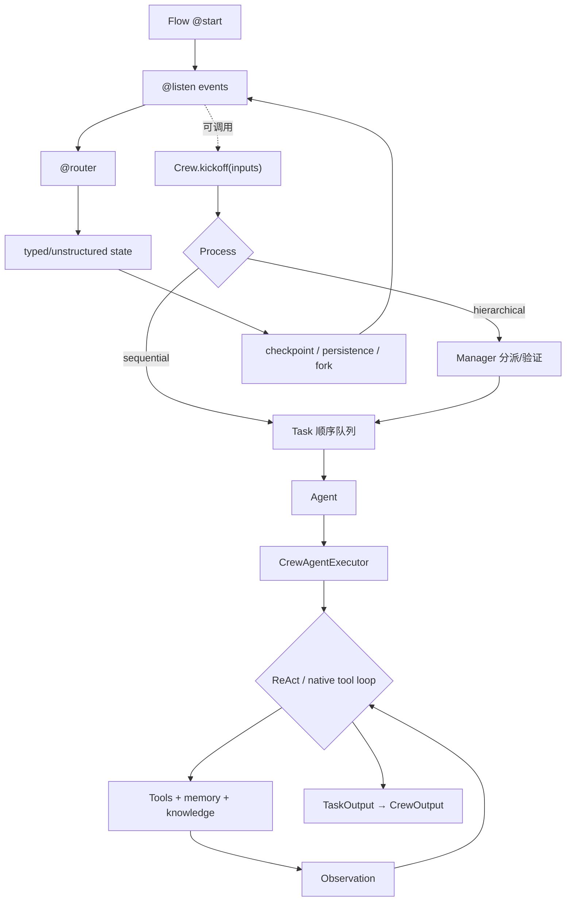

# 第 8 章 CrewAI：组织隐喻与显式 Flow

> 参考实现：[crewAIInc/crewAI](https://github.com/crewAIInc/crewAI)，冻结提交 [`ebe0082`](https://github.com/crewAIInc/crewAI/tree/ebe0082acaafd2559152a37a0d201e167a5f280a)，MIT。

## 本章要解决的问题

多 Agent 框架常用“角色、任务、团队”描述系统，但这些概念并不会自动提供状态所有权、错误恢复和确定性调度。CrewAI 同时提供高层 Crew 和低层 Flow，正好可以用来比较组织隐喻与显式控制流的边界。

本章不以“如何多写几个角色”为目标，而是学习何时应让 Flow 拥有端到端生命周期，只把 Crew 当成局部开放式能力。

## 本章目标

| 问题 | 建议 |
|---|---|
| 本章重点 | 高层 Crew 组织隐喻与低层 Flow 控制流如何共存，以及两套抽象何时应分工 |
| 前置知识 | 完成第 1–3 章；推荐先完成核心综合实践，至少要能指出单 Agent 的状态 owner 与恢复边界 |
| 第一遍重点 | `Crew.kickoff` 的 process 分支、`CrewAgentExecutor` 主循环、Flow state/persistence |
| 可以后看 | memory/knowledge/provider 集成、CLI 与企业扩展 |
| 完成后应能回答 | Crew 与 Flow 谁拥有生命周期？manager 增加了什么真实调度语义？三种持久化状态能否混用？ |

## 核心设计



### 1. Crew 层把组织隐喻变成调度输入

[`Crew`](https://github.com/crewAIInc/crewAI/blob/ebe0082acaafd2559152a37a0d201e167a5f280a/lib/crewai/src/crewai/crew.py#L160) 聚合 agents、tasks、process、memory 和 manager；[`kickoff()`](https://github.com/crewAIInc/crewAI/blob/ebe0082acaafd2559152a37a0d201e167a5f280a/lib/crewai/src/crewai/crew.py#L988) 根据 sequential 或 hierarchical process 选择执行路径。高层语义自然，但“manager 是否真正改善结果”是模型与 prompt 的经验问题，不是类型系统保证。

[`Task`](https://github.com/crewAIInc/crewAI/blob/ebe0082acaafd2559152a37a0d201e167a5f280a/lib/crewai/src/crewai/task.py#L120) 封装 description、expected output、assigned agent、context 与 guardrail；[`_execute_core()`](https://github.com/crewAIInc/crewAI/blob/ebe0082acaafd2559152a37a0d201e167a5f280a/lib/crewai/src/crewai/task.py#L806) 进入 Agent executor。

### 2. Agent executor 才是真正的工具循环

[`CrewAgentExecutor`](https://github.com/crewAIInc/crewAI/blob/ebe0082acaafd2559152a37a0d201e167a5f280a/lib/crewai/src/crewai/agents/crew_agent_executor.py#L98) 的 [`_invoke_loop()`](https://github.com/crewAIInc/crewAI/blob/ebe0082acaafd2559152a37a0d201e167a5f280a/lib/crewai/src/crewai/agents/crew_agent_executor.py#L309) 在 ReAct、native tool 与 no-tool 路径间分流；循环负责迭代上限、解析、tool observation 与 final answer。理解 CrewAI 时不能只看 `Agent(role=...)` 示例。

### 3. Flow 是更可靠的控制面

[`Flow`](https://github.com/crewAIInc/crewAI/blob/ebe0082acaafd2559152a37a0d201e167a5f280a/lib/crewai/src/crewai/flow/runtime/__init__.py#L429) 通过 `@start`、`@listen`、`@router` 形成事件图；[`kickoff()`](https://github.com/crewAIInc/crewAI/blob/ebe0082acaafd2559152a37a0d201e167a5f280a/lib/crewai/src/crewai/flow/runtime/__init__.py#L1982) 驱动事件；[`fork()`](https://github.com/crewAIInc/crewAI/blob/ebe0082acaafd2559152a37a0d201e167a5f280a/lib/crewai/src/crewai/flow/runtime/__init__.py#L636) 与 persistence 支持从状态分支。适合把关键业务控制从开放式多 Agent 对话移入确定性结构。

## 两条源码调用链

1. **Crew 与 Flow 的正常路径**：`Crew.kickoff → process selector → task/executor tool loop → TaskOutput`；或 `Flow.kickoff → start/listen/router → explicit state mutation → next listener/end`。
2. **失败与恢复路径**：`listener/task starts from committed state → failure before persistence → discard uncommitted mutation → reload Flow checkpoint/@persist state → resume explicit stage`。若失败跨越外部副作用，Flow checkpoint 只能恢复框架状态，工具仍需 effect identity 或幂等处理。

## 建议源码阅读顺序

1. 先从 `Crew.kickoff()` 看 sequential/hierarchical 的真实分流，不从角色声明示例开始。
2. 顺着 `Task._execute_core()` 进入 `CrewAgentExecutor._invoke_loop()`，找到真正的 tool/observation 循环。
3. 单独阅读 `Flow.kickoff()`、listener 与 router，把它视为另一套 runtime，而不是 Crew 的小插件。
4. 最后比较 checkpoint、`@persist` 与 `fork()`，为组合使用时选出唯一的生命周期 owner。

## Crew / Flow 如何选择

| 形态 | 下一步由谁决定 | 状态 owner | 适合 | 主要风险 |
|---|---|---|---|---|
| 纯 Crew | process、manager 与 Agent 输出 | Crew / Task 执行上下文 | 快速表达角色分工、开放式协作 | 控制流藏在 prompt 和默认行为中 |
| 纯 Flow | listener、router 与显式 state | Flow runtime | 有确定阶段、恢复、分支和审计要求的业务流程 | 需要自己定义节点内的 Agent 行为 |
| Flow 调 Crew | Flow 决定阶段，Crew 处理局部开放任务 | Flow 应作为外层 owner | 既要可靠阶段又要多角色探索 | 两层都尝试拥有恢复与重试时会重复执行 |

| 状态对象 | 表达什么 | 不应被误当成什么 |
|---|---|---|
| `TaskOutput` / `CrewOutput` | 一次任务或 Crew 的产出 | 完整 workflow checkpoint |
| Crew checkpoint | Crew 内部任务进度与继续执行依据 | Flow 的事件/业务状态 |
| Flow checkpoint | Flow invocation 的控制状态与分支依据 | Crew 内部每个工具副作用的事务日志 |
| `@persist` state | 被明确选择持久化的业务/方法状态 | 自动统一所有 Crew、Flow 与外部系统状态 |

组合时最稳妥的规则是：**Flow 拥有端到端生命周期，Crew 是一个可重试但需幂等的节点能力。**如果 Crew 和 Flow 都在失败后自动恢复同一段工作，工具副作用可能被重复执行。

## 关键源码骨架（等价伪代码）

以下伪代码根据冻结提交重写，重点展示 Crew 与 Flow 两套运行语义。

### 1. Crew.kickoff：高层组织模型的真实分流点

```python
def kickoff(self, inputs=None, from_checkpoint=None):
    restored_crew = apply_checkpoint(self, from_checkpoint)
    if restored_crew:
        return restored_crew.kickoff(inputs)

    if self.stream:
        # 后台执行非流式核心，把 chunk/error/end 写入共享 StreamingContext。
        return create_streaming_wrapper(lambda: self.copy(stream=False).kickoff(inputs))

    runtime_scope = event_bus.enter_runtime_scope()
    trace_context = attach_crew_context(self.id)
    try:
        prepared_inputs = interpolate_tasks_and_agents(inputs)

        if self.process == SEQUENTIAL:
            result = self._run_sequential_process()
        elif self.process == HIERARCHICAL:
            manager = self._create_manager_agent()
            result = self._run_hierarchical_process(manager)
        else:
            raise NotImplementedError(self.process)

        for callback in self.after_kickoff_callbacks:
            result = callback(result)
        self.usage_metrics = calculate_usage_metrics()
        return result
    except Exception as error:
        emit(CrewKickoffFailedEvent(error))
        raise
    finally:
        drain_deferred_memory_writes()
        clear_temporary_input_files(self.id)
        detach(trace_context)
        event_bus.exit_runtime_scope(runtime_scope)
```

这里的 `finally` 是关键工程细节：模型/工具失败也必须排空 memory writes、清理输入文件和 contextvars，否则下一次 Crew 运行会继承脏上下文。

### 2. Executor 在 native tool 与 ReAct 文本之间选择

```python
def invoke_loop(self):
    if llm.supports_function_calling() and self.original_tools:
        return invoke_native_tool_loop()
    return invoke_react_loop()


def invoke_react_loop(self):
    result = None
    while not isinstance(result, AgentFinish):
        if self.iterations >= self.max_iter:
            return synthesize_best_answer_from_messages()

        rpm_limiter.wait_if_needed()
        raw = llm.call(messages=self.messages, response_model=effective_schema())

        try:
            parsed = parse_as_finish_or_action(raw)
        except OutputParserError as error:
            self.messages.append(parser_feedback(error))
            self.iterations += 1
            continue

        if isinstance(parsed, AgentAction):
            tool_result = execute_tool_and_check_finality(
                action=parsed,
                tools=self.tools,
                security_fingerprint=self.agent.security_config.fingerprint,
            )
            result = handle_action_result(parsed, tool_result)
        else:
            result = parsed

        step_callback(result)
        self.messages.append(result.text)
        self.iterations += 1

    return result
```

parser error 被写回 messages 后重试，这使文本 ReAct 能自修复；但同样意味着错误提示是控制流的一部分，改变 prompt/解析器会改变循环行为。

### 3. Flow 有两套不同的恢复语义

```python
def flow_kickoff(inputs, from_checkpoint=None, restore_from_state_id=None):
    if from_checkpoint and restore_from_state_id:
        raise ValueError("two restore systems cannot be combined")

    if from_checkpoint:
        restored_flow = apply_checkpoint(self, from_checkpoint)
        return restored_flow.kickoff(inputs)

    if restore_from_state_id:
        # 复制已持久化业务 state，但为新运行分配新 id，形成分叉历史。
        self.state = persistence.load_latest(restore_from_state_id)
        self.state.id = inputs.get("id", new_uuid())

    emit(FlowStartedEvent(self.state.id))
    try:
        outputs = execute_all_start_methods()
        # 方法返回值触发 @listen；@router 返回 route name 决定下一批 listener。
        while pending_events:
            event = pending_events.pop()
            outputs += dispatch_listeners_and_routers(event, self.state)
        emit(FlowFinishedEvent(outputs[-1]))
        return outputs[-1]
    except Exception as error:
        emit(FlowFailedEvent(error))
        raise
```

`from_checkpoint` 恢复执行现场；`restore_from_state_id` 复制业务 state 并创建新运行。两者不能混用，因为“继续原执行”和“从旧状态分叉”是不同语义。

### 4. Task scheduler 在同步任务前设置并发屏障

```python
def execute_tasks(tasks):
    outputs = []
    async_batch = []

    for task in tasks:
        prepared = prepare_task_execution(task)
        if prepared.should_skip:
            outputs.append(prepared.existing_output)
            continue

        if task.is_conditional:
            outputs += wait_futures_in_submission_order(async_batch)
            async_batch.clear()
            if not task.predicate(outputs[-1]):
                outputs.append(skipped_output(task))
                continue

        if task.async_execution:
            # async task 只拿最近同步结果作为即时上下文。
            async_batch.append(start_in_thread(task, context=last_sync_output(outputs)))
        else:
            outputs += wait_futures_in_submission_order(async_batch)
            async_batch.clear()
            outputs.append(execute_sync(task, context=all_committed_outputs(outputs)))

    outputs += wait_futures_in_submission_order(async_batch)
    return create_crew_output(outputs)
```

异步 task 可以并发完成，但结果按提交顺序归档，保持下游 context 稳定；conditional/sync task 都是屏障，不能越过尚未收敛的前置异步批次。

### 5. Task guardrail 是有界“校验—反馈—再生成”循环

```python
def enforce_guardrail(task_output, max_retries):
    accumulated_tool_failures = list(task_output.tool_failures)

    for attempt in range(max_retries + 1):  # 初始输出 + 最多 max_retries 次再生成
        verdict = guardrail(task_output, retry_count=attempt)
        if verdict.success:
            if verdict.result is None:
                raise InvalidGuardrailResult()
            accepted = normalize_to_task_output(verdict.result)
            accepted.tool_failures = merge(accumulated_tool_failures, accepted.tool_failures)
            return accepted

        if attempt == max_retries:
            raise GuardrailFailure(verdict.error)

        feedback = verdict.error + "\nPrevious output:\n" + task_output.raw
        task_output = normalize_to_task_output(agent.execute_task(feedback, tools))
        accumulated_tool_failures += task_output.tool_failures
```

guardrail 拒绝后的再生成可能再次调用工具，所以之前尝试的 `tool_failures` 不能被新 `TaskOutput` 覆盖掉。

## 关键不变量与失败路径

- sequential/hierarchical 是 Crew 的唯一显式 process 分支；manager prompt 不能替代未实现的调度语义。
- `max_iter` 到达后生成“当前最佳答案”，不能误标为原任务已正确完成。
- parser retry 前没有工具副作用；工具执行后再发生异常时，重试需要工具幂等。
- streaming 包装层必须转发 error/end，否则消费者会永久等待。
- Flow 的 event listener 可能重入，同一 Flow 实例的 usage aggregation 与 contextvars 必须按 invocation 隔离。
- Crew checkpoint、Flow checkpoint、`@persist` state 是不同层的状态；组合时应选一个生命周期 owner。
- “最大 guardrail 重试 3 次”表示最多检查 4 个候选输出；最后仍失败必须向上抛出，不能返回最新但未通过的文本。

## 设计收益

- 角色、目标、任务、期望输出是业务人员也能读懂的建模语言。
- 可从 Crew 原型逐步下沉到 Flow，而不必一开始自建事件运行时。
- ReAct 与 native tool calling 都有明确 executor 路径。
- Crew 与 Flow 共处一个框架，便于用同一业务比较开放式 Agent 协作和确定性控制流。

## 适用边界与常见误区

- `crew.py`、executor、Flow runtime 都较大，修改或调试默认行为需要跨文件追踪。
- Crew 与 Flow 的状态、事件和恢复概念并不完全同构；组合后要明确谁拥有生命周期。
- 角色描述容易让人高估多 Agent：多 prompt 不自动带来隔离、恢复或验证。
- 安全主要依赖具体 tool 和部署；高层 guardrail 不能替代 sandbox。
- hierarchical manager 会增加 token、延迟和非确定性，应与简单顺序基线对照。

## 本章练习

同一个“资料收集—事实核验—发布”任务做两版：A 版纯 hierarchical Crew；B 版用 Flow 固定阶段，只在收集节点调用 Crew。两版使用同一模型、工具、输入和完成条件，并分别在“收集完成但未持久化”和“发布成功但结果未记录”两个边界注入失败。根据 trace 比较 token、重放范围、状态 owner 和错误传播，不预设哪一版获胜。

### 练习验收

- 两版使用同一输入、模型、工具与完成条件；
- 结果记录 token、恢复位置、重复工作和错误传播，并包含两个固定故障点的事件序列；
- 能明确指出 Crew、Flow 与被调用 Agent 中谁拥有端到端生命周期。

## 检查理解

1. `Crew.kickoff()` 与 `CrewAgentExecutor._invoke_loop()` 分别位于哪一层？
2. 纯 Crew、纯 Flow、Flow 调 Crew 三种形态中，谁应拥有端到端生命周期？
3. Crew checkpoint、Flow checkpoint 与 `@persist` state 为什么不能默认视为同一种状态？

## 本章小结

CrewAI 是业务可读的多 Agent 原型层；真正需要可靠状态与恢复时，应把关键控制迁入 Flow，而不是继续堆角色 prompt。

---

[上一部分：核心综合实践](../14-capstone-agent-runtime.md) · [课程目录](00-learning-guide.md) · [下一章：Microsoft Agent Framework](09-microsoft-agent-framework.md)
