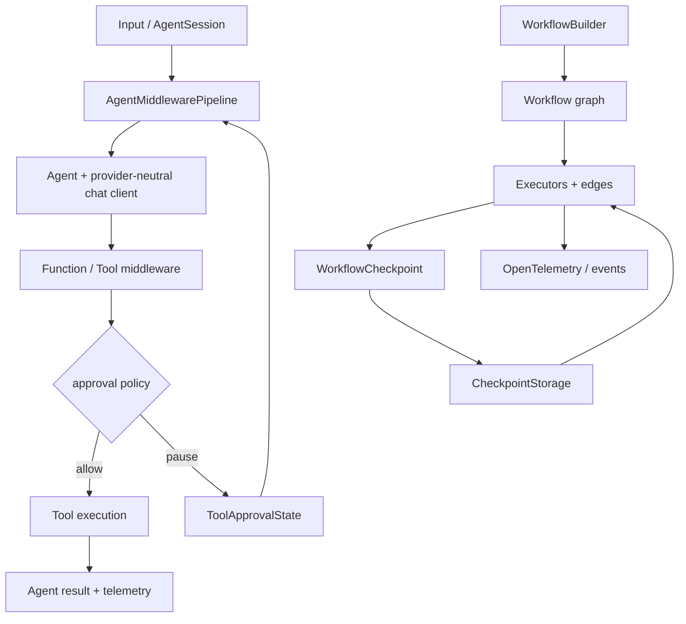

# 第 9 章 Microsoft Agent Framework：企业 Workflow 与横切治理

> 参考实现：[microsoft/agent-framework](https://github.com/microsoft/agent-framework)，冻结提交 [`e39a8a2`](https://github.com/microsoft/agent-framework/tree/e39a8a2e79c8c8987a0b9082d3ccb8665734b897)，MIT。

## 本章要解决的问题

前面的章节分别处理了 Agent loop、图状态、审批和产品运行时。企业系统还需要把这些能力变成可复用治理面：多个团队应共享 middleware、session、checkpoint、HITL、遥测和 hosting，而不是在每个 Agent 中重复实现。

Microsoft Agent Framework（MAF）把单 Agent 与图 Workflow 放在同一体系中。本章重点学习三种执行面如何分工，以及 middleware 顺序为什么会改变系统语义。

## 本章目标

| 问题 | 建议 |
|---|---|
| 本章重点 | 企业 Agent 如何把 middleware、workflow、checkpoint、审批和 OTel 放到同一治理面 |
| 前置知识 | 完成第 2、3、5 章；核心综合实践与第 8 章便于迁移和比较，但不是硬前置 |
| 第一遍重点 | Agent middleware、WorkflowCheckpoint、ToolApprovalState 三条状态边界 |
| 可以后看 | Azure hosting、跨语言细节、A2A/MCP 长尾集成 |
| 完成后应能回答 | 哪些状态属于 AgentSession，哪些属于 Workflow？middleware 顺序为何会改变安全语义？ |

## 核心设计



### 1. Middleware 是横切能力的正式扩展点

[`AgentMiddlewarePipeline`](https://github.com/microsoft/agent-framework/blob/e39a8a2e79c8c8987a0b9082d3ccb8665734b897/python/packages/core/agent_framework/_middleware.py#L847) 用 chain-of-responsibility 包裹 Agent 调用；函数和 chat client 也有对应 pipeline。审批、日志、策略、缓存不必塞进 Agent loop，适合企业中多个团队共享治理。

### 2. Workflow 是一等图运行时

[`WorkflowBuilder`](https://github.com/microsoft/agent-framework/blob/e39a8a2e79c8c8987a0b9082d3ccb8665734b897/python/packages/core/agent_framework/_workflows/_workflow_builder.py#L53) 构造 executor 与 edge；[`Workflow`](https://github.com/microsoft/agent-framework/blob/e39a8a2e79c8c8987a0b9082d3ccb8665734b897/python/packages/core/agent_framework/_workflows/_workflow.py#L208) 承载可执行图。它不仅支持“多个 Agent 对话”，还支持 sequential、concurrent、handoff、group 等 workflow 形态。

### 3. Checkpoint 保存的是执行结构

[`WorkflowCheckpoint`](https://github.com/microsoft/agent-framework/blob/e39a8a2e79c8c8987a0b9082d3ccb8665734b897/python/packages/core/agent_framework/_workflows/_checkpoint.py#L31) 包括 graph signature、lineage、pending messages、executor states 与 superstep iteration；这比只保存 chat history 更接近可恢复状态机。存储抽象允许内存、文件或外部后端承接。

### 4. 工具审批需要 session 状态

[`ToolApprovalMiddleware`](https://github.com/microsoft/agent-framework/blob/e39a8a2e79c8c8987a0b9082d3ccb8665734b897/python/packages/core/agent_framework/_harness/_tool_approval.py#L343) 是 opt-in middleware，依赖 AgentSession 保存 pending approval 与规则。这个设计承认审批是跨轮状态，而不是每次工具调用前弹窗的无状态 hook。

## 两条源码调用链

1. **Agent 调用**：`Agent.run → AgentMiddlewarePipeline → chat client middleware → model → function middleware → tool → result/OTel`。
2. **Workflow 恢复**：`WorkflowBuilder → WorkflowExecutor → executors/edges → WorkflowCheckpoint → CheckpointStorage → restore graph signature + pending messages + executor state`。

## 建议源码阅读顺序

1. 从 [`AgentMiddlewarePipeline`](https://github.com/microsoft/agent-framework/blob/e39a8a2e79c8c8987a0b9082d3ccb8665734b897/python/packages/core/agent_framework/_middleware.py#L847) 入手，跟一次 `call_next()`，理解治理能力如何包裹 Agent 而非侵入其实现。
2. 再看 [`WorkflowBuilder`](https://github.com/microsoft/agent-framework/blob/e39a8a2e79c8c8987a0b9082d3ccb8665734b897/python/packages/core/agent_framework/_workflows/_workflow_builder.py#L53) → [`Workflow`](https://github.com/microsoft/agent-framework/blob/e39a8a2e79c8c8987a0b9082d3ccb8665734b897/python/packages/core/agent_framework/_workflows/_workflow.py#L208)，只追 executor、edge 与 superstep，不先展开全部 workflow 形态。
3. 读取 [`WorkflowCheckpoint`](https://github.com/microsoft/agent-framework/blob/e39a8a2e79c8c8987a0b9082d3ccb8665734b897/python/packages/core/agent_framework/_workflows/_checkpoint.py#L31)，列出 committed state、pending messages 与 graph signature 的恢复责任。
4. 最后读 [`ToolApprovalMiddleware`](https://github.com/microsoft/agent-framework/blob/e39a8a2e79c8c8987a0b9082d3ccb8665734b897/python/packages/core/agent_framework/_harness/_tool_approval.py#L343)，验证 pending approval 为什么必须落到 session，而不是停留在回调闭包。

## 三个执行面与状态归属

| 执行面 | 包裹什么 | 主要状态 | 适合放什么 | 常见误用 |
|---|---|---|---|---|
| Agent / chat middleware | 一次 Agent 或模型调用 | request、messages、result、trace context | 日志、策略、缓存、模型前后处理 | 忘记 `call_next()`；把工具副作用审批放得太晚 |
| function middleware | 一次函数/工具调用 | tool identity、arguments、approval request/result | 参数策略、审批、工具遥测、重试边界 | 先执行再审批；缓存包住非幂等重试 |
| Workflow runtime | executor、edge 与 superstep | committed shared state、pending messages、executor state、checkpoint lineage | 确定性业务阶段、并发、HITL 与跨进程恢复 | 把临时 pending state 当成已提交 checkpoint |

一个高风险的顺序例子是 `cache → approval → retry → tool`：若 cache 位于审批之外，可能复用一个旧批准结果；若 retry 位于审批之外，用户可能只看到一次提示却触发多次副作用。MAF 的扩展性来自 middleware，但**顺序本身就是程序语义**，应通过 trace 和失败注入验证，而不是只看组件是否注册。

## 关键源码骨架（等价伪代码）

以下代码依据冻结提交重写，保留控制流而省略框架兼容层。

### 1. Workflow runner 使用 pending/committed 双缓冲

```python
async def run_until_convergence(runner):
    while runner.iteration < runner.max_iterations:
        emit(SuperstepStarted(runner.iteration))

        # 本轮开始时一次性取出消息；不同 edge runners 可并发。
        messages = runner.drain_all_messages()
        iteration_task = route_and_deliver(messages)
        async for event in drain_runtime_events_while(iteration_task):
            yield event

        await iteration_task  # 失败事件先 drain，异常随后传播。
        runner.state.commit_pending_to_committed()
        await runner.try_checkpoint_committed_state()
        emit(SuperstepCompleted(runner.iteration))

        if runner.message_queue.empty():
            return Converged
        runner.iteration += 1

    raise WorkflowConvergenceException()
```

共享 state 分成 `_pending` 和 `_committed`：executor 在 superstep 内只产生 pending change，整轮成功后才 commit，再 checkpoint。因此失败轮的局部写入不会伪装成可恢复事实。

### 2. Middleware pipeline 是递归洋葱模型

```python
class AgentMiddlewarePipeline:
    def __init__(self, middleware):
        self.middleware = normalize(middleware)

    async def execute(self, context, final_handler):
        async def invoke(index):
            if index == len(self.middleware):
                context.result = await maybe_await(final_handler(context))
                return

            current = self.middleware[index]

            async def call_next():
                await invoke(index + 1)

            await current.process(context, call_next)

        try:
            await invoke(0)
        except MiddlewareTermination:
            pass  # 中间件可有意短路，不进入后续 handler。

        attach_stream_hooks(context.result, context)
        return context.result
```

如果注册顺序是 `[auth, retry, trace]`，进入顺序为 auth → retry → trace → model，返回顺序相反。审批 middleware 必须位于会产生副作用的函数执行之前；重试 middleware 放错位置可能重复已执行工具。

### 3. Checkpoint 保存图签名和已提交状态

```python
@dataclass
class WorkflowCheckpoint:
    workflow_name: str
    graph_signature_hash: str
    checkpoint_id: str
    previous_checkpoint_id: str | None
    messages: list[PendingMessage]
    state: dict                 # 用户状态 + _executor_state
    pending_request_events: list[RequestInfo]
    iteration_count: int


async def restore(workflow, checkpoint_id, storage):
    cp = await storage.read(checkpoint_id)

    if cp.workflow_name != workflow.name:
        raise IncompatibleCheckpoint("wrong workflow")
    if cp.graph_signature_hash != workflow.graph_signature_hash():
        raise IncompatibleCheckpoint("graph topology changed")

    runtime = WorkflowExecutor(workflow.graph)
    runtime.state = copy(cp.state)
    runtime.pending_messages = copy(cp.messages)
    runtime.pending_requests = copy(cp.pending_request_events)
    runtime.iteration = cp.iteration_count
    return runtime
```

保存 `graph_signature_hash` 是很重要的防错：没有它，旧 checkpoint 可能被错误灌入已经变更边/节点的新 workflow。

### 4. 工具审批是可持久化的循环

```python
async def approval_middleware(context, call_next):
    if context.session is None:
        raise RuntimeError("approval requires AgentSession")

    state = load_approval_state(context.session)

    while True:
        context.messages = inject_collected_responses(context.messages, state)
        state.collected_responses.clear()

        await call_next()  # model 可能返回普通消息或 approval requests
        requests = extract_approval_requests(context.result)

        if not requests:
            save(context.session, state)
            return

        all_auto_approved = apply_rules(requests, state.rules)
        save(context.session, state)

        if not all_auto_approved:
            context.result = response_containing(requests)  # 暂停给调用者
            return

        # 自动批准后，把批准结果注入下一轮，而不是执行一个新的用户任务。
        context.messages = []
        context.result = None
```

## 关键不变量与失败路径

- middleware 必须调用 `call_next()` 才会继续；有意短路和忘记调用在行为上相似，需测试覆盖。
- streaming result 的 transform/result/cleanup hooks 要挂在同一个流对象上，否则中间件只观察创建流，观察不到消费结果。
- checkpoint 只包含 committed state；pending state change 不能伪装成已提交状态。
- approval request 必须绑定 `AgentSession`，否则重启后无法证明哪个请求被谁批准。
- tool 名称或 approval source id 冲突会造成规则误命中；注册期应保证稳定、唯一身份。
- workflow 恢复不保证外部副作用 exactly-once，executor 仍需幂等。
- checkpoint 保存失败不会回滚已经成功的 superstep；实现保留最后成功 checkpoint 链并发出告警，因此“workflow 继续”与“最新状态已持久化”必须分别监控。
- function loop 的 `max_iterations` 限制模型往返；`max_function_calls` 在一整批工具完成后才检查，是 best-effort 上限，单个并行批次可能超过阈值。模型轮次耗尽时实现会禁用 tools 再请求一次最终文本。

## 设计收益

- 横向治理能力完整：middleware、session、approval、OTel、hosting 是同一体系。
- Agent 与确定性 workflow 并存，能把模型决策限制在明确节点。
- checkpoint 捕获图级执行状态，适合跨进程长任务。
- Python/.NET、多 provider、MCP/A2A 让架构边界较开放。

## 适用边界与常见误区

- 项目仍在快速演进，API、hosting 与跨语言能力可能继续调整；实现时需要固定版本并验证迁移路径。
- API 面广：Agent、workflow、harness、hosting、Azure 集成会增加选择成本。
- middleware 顺序本身是语义；审批、重试、缓存位置错误会改变安全性。
- checkpoint 能恢复框架状态，但工具副作用的幂等性仍由业务负责。
- 企业级功能多不等于默认安全；工具注册、secret、网络与远端 executor 仍需部署策略。

## 与第 10 章 AutoGen 的连接

[AutoGen README](https://github.com/microsoft/autogen/blob/027ecf0a379bcc1d09956d46d12d44a3ad9cee14/README.md#L177) 的措辞是“builds on the lessons learned”。学习时应把它理解为经验承接，而不是逐模块重写或代码直接继承。

## 本章练习

实现一个并行资料收集 workflow：两个 executor 并发，汇总前 checkpoint；危险发布工具由 approval middleware 暂停；进程重启后恢复 pending approval。固定同一个 logical tool call，分别运行 `retry → approval → tool` 与 `approval → retry → tool`，记录 approval 请求次数、tool attempt 次数和最终事件顺序。

### 练习验收

- checkpoint 恢复后只使用 committed state，不把 pending mutation 当成已提交；
- 调换 retry 与 approval middleware 后，断言能显示 approval 次数、tool attempt 次数和事件顺序的实际差异；
- trace 同时关联 workflow、executor、session 和 tool approval 身份。

## 检查理解

1. Agent middleware、function middleware 与 Workflow runtime 分别包裹哪段生命周期？
2. 为什么 `retry → approval → tool` 与 `approval → retry → tool` 可能产生不同副作用？
3. `WorkflowCheckpoint` 保存了什么，外部数据库或消息发送又为什么仍需幂等？

## 本章小结

本章把 Agent middleware、工具治理和 Workflow checkpoint 放进同一张图。完成核心综合实践后，可以用它检验自己的运行时怎样扩展为企业 Workflow 与统一治理面。

---

[上一章：CrewAI](08-crewai.md) · [课程目录](00-learning-guide.md) · [下一章：AutoGen](10-autogen-historical.md)
