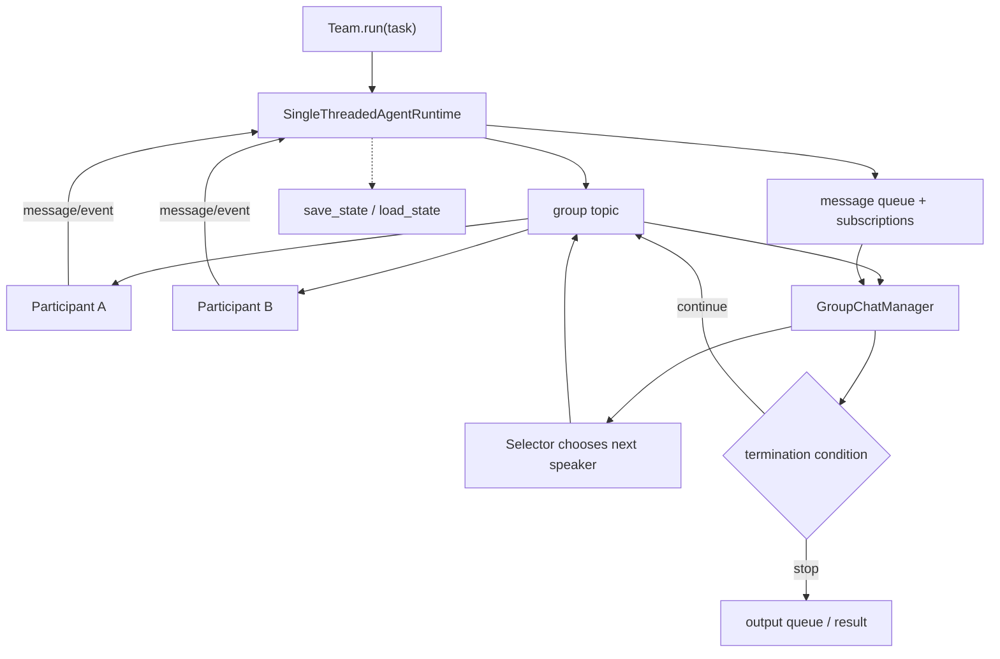

# 第 10 章 AutoGen：消息型多 Agent 的历史基线

> 参考实现：[microsoft/autogen](https://github.com/microsoft/autogen)，冻结提交 [`027ecf0`](https://github.com/microsoft/autogen/tree/027ecf0a379bcc1d09956d46d12d44a3ad9cee14)；官方已标记为 [maintenance mode](https://github.com/microsoft/autogen/blob/027ecf0a379bcc1d09956d46d12d44a3ad9cee14/README.md#L21)。代码主要为 MIT，复用时仍应核对具体路径。

## 本章要解决的问题

完成 CrewAI 与 MAF 后，再回看 AutoGen，才能把“多 Agent 对话”理解为消息运行时问题，而不是多个角色 prompt。AutoGen 的 identity、topic、subscription、group manager 和 selector 对后续框架影响很大，也暴露了消息拓扑、终止和状态保存的典型难题。

本章以历史和迁移为目标：理解长期有效的概念，并判断这些概念在 MAF 中如何被 workflow、session 和 middleware 重新表达。

## 本章目标

| 问题 | 建议 |
|---|---|
| 本章重点 | 消息型多 Agent 的 identity、topic、subscription、group manager 与 speaker selection 谱系 |
| 前置知识 | 完成第 8–9 章；消息队列、pub/sub 与 actor model 有帮助，但本章只要求理解其最小语义 |
| 第一遍重点 | send 与 publish 的完成语义、runtime envelope 分发、SelectorGroupChat 状态边界 |
| 可以后看 | Studio、provider 适配与已进入维护状态的外围扩展 |
| 完成后应能回答 | 团队停止与 runtime idle 有何区别？`save_state()` 没保存什么？模型 selector 失败时如何降级？ |

## 核心设计



### 1. Runtime 把 Agent 当消息参与者

[`SingleThreadedAgentRuntime`](https://github.com/microsoft/autogen/blob/027ecf0a379bcc1d09956d46d12d44a3ad9cee14/python/packages/autogen-core/src/autogen_core/_single_threaded_agent_runtime.py#L149) 提供 agent registry、message queue、send、publish、subscriptions 与状态保存。Agent 不是被固定函数栈逐层调用，而是由 runtime 按 identity/topic 分发消息。

这种模型的优势是解耦与分布式演进路径；代价是控制流不再局部。一次输出可能来自订阅、manager 选择和其他 Agent 回应的组合。

### 2. GroupChat 用 topic 组织团队

[`BaseGroupChat`](https://github.com/microsoft/autogen/blob/027ecf0a379bcc1d09956d46d12d44a3ad9cee14/python/packages/autogen-agentchat/src/autogen_agentchat/teams/_group_chat/_base_group_chat.py#L40) 为 participants 和 manager 建立 topic/subscription，并通过 output queue 对外流式输出。嵌入 runtime 让高层 AgentChat 建立在 Core 消息语义上，而非另写一套循环。

### 3. Selector 把发言权变成模型决策

[`SelectorGroupChatManager`](https://github.com/microsoft/autogen/blob/027ecf0a379bcc1d09956d46d12d44a3ad9cee14/python/packages/autogen-agentchat/src/autogen_agentchat/teams/_group_chat/_selector_group_chat.py#L50) 保存/加载 manager state，并根据 conversation history、candidate roles 和模型输出选 speaker。它比 round-robin 灵活，但把调度正确性部分交给模型。

### 4. Maintenance mode 改变学习方式

官方在 [README L21](https://github.com/microsoft/autogen/blob/027ecf0a379bcc1d09956d46d12d44a3ad9cee14/README.md#L21) 说明不再增加新特性，在 [L177](https://github.com/microsoft/autogen/blob/027ecf0a379bcc1d09956d46d12d44a3ad9cee14/README.md#L177) 推荐 MAF，并说明其承接 AutoGen 经验。因此本章应提取长期有效的消息与所有权概念，具体实现则与第 9 章 MAF 对照理解。

## 两条源码调用链

1. **正常消息与群聊路径**：`send/publish → queue → recipient/subscription resolution → handler/event`；GroupChat 在同一 runtime 上通过 group topic、participants 和 manager 选择下一 speaker，直到 termination 输出结果。
2. **降级与不完整恢复路径**：`selector parse/candidate failure → bounded retry → fallback speaker`；若进程在 queue 未排空时崩溃，`save_state` 只能恢复已实例化 Agent state，不能恢复 subscription 与在途 envelope，必须由外部 durable broker/event log 重建或显式报告丢失边界。

## 建议源码阅读顺序

1. 先读 `SingleThreadedAgentRuntime` 的 send、publish 与 queue envelope，分清请求响应和广播完成语义。
2. 再读 `BaseGroupChat`，观察 participant、manager、topic 与 output queue 如何映射到底层 runtime。
3. 进入 `SelectorGroupChatManager`，记录候选过滤、模型选择、重试与 fallback。
4. 最后检查 `save_state/load_state`，列出 agent state、subscription 与在途 queue 中哪些能恢复、哪些不能。

## 从 AutoGen 到 MAF：概念迁移而非一一改名

| AutoGen 学习概念 | 在 MAF 中更接近的方向 | 延续了什么 | 发生了什么变化 |
|---|---|---|---|
| Agent identity + runtime | Agent/session/hosting | Agent 不只是一个 prompt，需要运行身份与生命周期 | MAF 更强调统一企业运行面，而非只暴露消息 runtime |
| topic / subscription | Workflow edges、messages 与 executor routing | 参与者通过显式通道解耦 | 控制流更偏向可检查的 workflow，而不是开放 pub/sub 拓扑 |
| GroupChat manager / selector | group、handoff 与 workflow patterns | 多参与者需要明确下一步 owner | 模型 selector 不再是唯一中心模式，可用确定性边约束流程 |
| runtime/team state | AgentSession + WorkflowCheckpoint | 多 Agent 也必须保存状态 | checkpoint 更明确包含图签名、executor state 与 committed shared state |
| handler/hook 扩展 | middleware pipeline | 横切治理应与 Agent 逻辑分离 | middleware 顺序与 OTel 成为更正式的产品接口 |

这不是代码级逐模块继承表。官方只明确说明 MAF 建立在 AutoGen 等经验之上。学习 AutoGen 的正确方式是保留 identity、message ownership、termination 和 selector 风险这些概念，再到 MAF 检查哪些问题已经由 workflow、checkpoint 与 middleware 重新表达。

## 关键源码骨架（等价伪代码）

以下伪代码根据冻结提交重写，展示 AutoGen Core 的 queue runtime 与 AgentChat selector 如何衔接。

### 1. send 与 publish 有不同完成语义

```python
async def send_message(message, recipient, sender=None, cancellation=None):
    if recipient.type not in known_agent_types:
        raise RecipientNotFound(recipient)

    future = event_loop.create_future()
    envelope = SendMessageEnvelope(
        message=message,
        recipient=recipient,
        sender=sender,
        future=future,
        cancellation_token=cancellation or CancellationToken(),
        message_id=uuid4(),
        telemetry=current_trace_metadata(),
    )
    await message_queue.put(envelope)
    envelope.cancellation_token.link_future(future)
    return await future  # RPC-like：等待 recipient handler 的响应。


async def publish_message(message, topic_id, sender=None, cancellation=None):
    envelope = PublishMessageEnvelope(
        message=message,
        topic_id=topic_id,
        sender=sender,
        cancellation_token=cancellation or CancellationToken(),
        message_id=uuid4(),
    )
    await message_queue.put(envelope)
    # Pub/sub：这里只保证进入 runtime queue，不等待所有 subscriber 的业务结果。
```

把两者混用会产生背压问题：`send` 的 caller 可等待/取消 future；`publish` 的发布者不知道每个 subscriber 是否完成，需要 runtime 级 idle/drain 机制。

### 2. runtime 逐 envelope 分发

```python
async def process_next(runtime):
    envelope = await runtime.message_queue.get()
    try:
        match envelope:
            case SendMessageEnvelope():
                agent = await runtime.get_agent(envelope.recipient)
                response = await agent.on_message(
                    envelope.message,
                    MessageContext(sender=envelope.sender, is_rpc=True),
                )
                envelope.future.set_result(response)

            case PublishMessageEnvelope():
                recipients = subscriptions.resolve(envelope.topic_id)
                await gather(
                    deliver_to_subscriber(recipient, envelope)
                    for recipient in recipients
                    if recipient != envelope.sender
                )

            case ResponseMessageEnvelope():
                envelope.future.set_result(envelope.message)
    except Exception as error:
        if hasattr(envelope, "future"):
            envelope.future.set_exception(error)
        else:
            log_unhandled_publish_error(error)
    finally:
        runtime.message_queue.task_done()
```

真实 runtime 对 tracing、intervention handlers、serialization、agent factory 做了更多处理，但核心仍是 single-threaded queue：handler 可 async，envelope 的取出与调度顺序受单队列控制。

### 3. SelectorGroupChat 的候选过滤与模型纠错

```python
async def select_speaker(thread):
    if selector_func:
        selected = await maybe_await(selector_func(thread))
        if selected is not None:
            assert selected in participant_names
            return selected

    candidates = await maybe_await(candidate_func(thread)) if candidate_func else participant_names
    assert candidates and all(name in participant_names for name in candidates)

    if previous_speaker and not allow_repeated_speaker:
        candidates = [name for name in candidates if name != previous_speaker]

    if len(candidates) == 1:
        return candidates[0]

    prompt = format_roles_history_and_candidates(candidates, thread)
    for attempt in range(max_selector_attempts):
        response = await model.create(prompt)
        mentions = find_participant_names(response.text)

        if exactly_one_valid_candidate(mentions, candidates):
            previous_speaker = mentions[0]
            return mentions[0]
        if len(mentions) == 0:
            prompt += "No valid name; choose exactly one candidate."
        else:
            prompt += "Multiple names found; choose only one candidate."

    return previous_speaker if previous_speaker is not None else candidates[0]
```

selector 不是一次分类调用，而是带候选约束、重复发言限制、解析反馈和重试预算的小 Agent loop。

### 4. save_state 的边界比名字更窄

```python
async def save_state(runtime):
    return {
        str(agent_id): await runtime.get_agent(agent_id).save_state()
        for agent_id in runtime.instantiated_agents
    }

async def load_state(runtime, snapshot):
    for id_string, agent_state in snapshot.items():
        agent_id = AgentId.from_str(id_string)
        if agent_id.type in runtime.known_agent_types:
            await runtime.get_agent(agent_id).load_state(agent_state)

# 该版本不保存 subscription state，也不表示 queue 中 envelope 已被持久化。
```

因此它是“已实例化 Agent 的业务状态快照”，不是完整消息 broker checkpoint。进程在 queue 未排空时崩溃，恢复 Agent state 并不能重建所有在途消息。

## 关键不变量与失败路径

- direct send 的 future 必须在成功、异常、取消三条路径上完成，否则 caller 永久挂起。
- publish 的完成不代表 subscribers 完成；关闭 runtime 前必须显式 drain queue。
- topic subscription 与 Agent state 是两种状态；当前 `save_state` 不保存前者。
- selector/candidate function 返回值必须验证在 participant set 内，不能信任模型或用户 hook。
- 禁止连续 speaker 后，候选集仍必须非空；单 participant 团队需要特殊处理。
- selector 重试耗尽会降级到 previous speaker，若没有则选第一个 candidate；这保证终止，但可能在降级路径违反“不连续重复”的用户期待。
- group termination 与 runtime idle 不相同：团队停止后仍可能有在途 event。
- maintenance mode 下应把这些机制当历史模式学习，不继续围绕旧 API 构建新基础设施。

## 设计收益

- runtime、identity、topic、subscription 给多 Agent 明确的消息系统语义。
- AgentChat 建立在 Core 上，展示高层团队抽象如何映射到底层 runtime。
- selector、round-robin、termination 等模式影响了后续多 Agent 讨论。
- save/load state 说明消息型 Agent 也需要 durable 生命周期。

## 适用边界与常见误区

- maintenance mode：新能力、安全增强和生态重心已转向 MAF。
- 消息拓扑隐藏控制流，debug 时需要关联 topic、sender、recipient、manager state。
- 模型 selector 会增加 token、延迟、循环和错误发言者风险。
- 保存 runtime/team state 不自动解决外部工具副作用的 exactly-once。
- 仓库含代码与文档的不同许可范围，复用时要核对具体路径，不能只看 API 单字段。

## 本章练习

写一个极小 topic runtime：两个 workers 订阅任务 topic，一个 manager 订阅结果 topic；实现 round-robin 与 model selector 两版；加入 termination、message id、save/load。对比 selector 出错时，如何从事件日志解释“为什么轮到这个 Agent”。

### 练习验收

- direct send、publish、team termination 与 queue drained 分别有独立测试；
- `save_state()` 后主动丢弃在途 queue，能观察到恢复边界而不是假设完整 checkpoint；
- selector 解析失败、重试耗尽和 fallback 都能从事件日志解释。

## 检查理解

1. direct send 完成与 publish 完成分别承诺了什么？
2. team termination、runtime idle 和 queue drained 为什么不是同一个状态？
3. `save_state()` 没有保存哪些消息运行时事实，这些概念在 MAF 中如何重新表达？

## 本章小结

本章应留下的是 identity、topic、subscription、selector 和 termination 等消息型运行时概念。新系统是否采用这些机制，应回到 MAF 等当前实现中重新判断，而不是沿用旧 API。

---

[上一章：Microsoft Agent Framework](09-microsoft-agent-framework.md) · [课程目录](00-learning-guide.md) · [综合参考：参考架构与开放问题](../13-integrated-synthesis.md)
