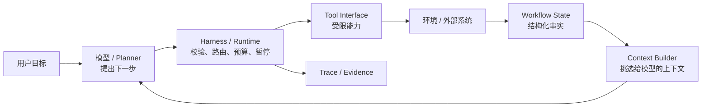

# Agent Runtime 与工作流设计：学习索引

> 目标：从“模型会调用工具”走到“能判断一套 Agent 运行时如何约束工具、状态与副作用”。本文是学习材料，不是某个框架的安装手册。

## 先给结论

Agent 不是 Prompt 加几个 API。一个可靠的 Agent 至少由六个可分离的部分组成：模型/规划、运行时 Harness、上下文与状态、工具接口、治理与安全、证据与验证。

最重要的边界是：**模型提议动作；Harness 决定能否执行；业务系统维护事实与权限。**

## 阅读路线

1. [01-最小-Agent-循环与职责边界](<./01-最小-Agent-循环与职责边界.md>)：先建立 Agent loop 心智模型。
2. [02-Tool-契约、注册与调用](<./02-Tool-契约、注册与调用.md>)：理解工具如何成为“模型可见、运行时可执行”的能力。
3. [03-Context、Memory、Metadata 与 Workflow State](<./03-Context、Memory、Metadata 与 Workflow State.md>)：区分模型上下文和系统事实源。
4. [04-Harness：把模型提议变成受控执行](<./04-Harness：把模型提议变成受控执行.md>)：理解为什么 prompt 不能单独保证安全与顺序。
5. [05-状态机、前置条件与工具依赖](<./05-状态机、前置条件与工具依赖.md>)：把 A 必须先于 B 写成确定性规则。
6. [06-副作用、审批、幂等与恢复](<./06-副作用、审批、幂等与恢复.md>)：处理退款、发信、写库等不可逆或不确定动作。
7. [07-安全执行、最小权限与工具隔离](<./07-安全执行、最小权限与工具隔离.md>)：理解工具与代码执行的攻击面。
8. [08-Trace、可观测性与行为验证](<./08-Trace、可观测性与行为验证.md>)：知道怎样证明系统实际按设计运行。
9. [09-贯穿案例：受控退款工作流](<./09-贯穿案例：受控退款工作流.md>)：将前述概念合成一个教学案例。

## 三种材料标记

- **[框架事实]**：某官方文档或固定源码的具体行为，链接到来源。
- **[设计归纳]**：跨框架可迁移的工程原则；不是任何单一 API 的承诺。
- **[教学伪代码]**：用于展示边界和控制流，不是可以直接复制的生产实现。

## 什么时候该用 Agent，什么时候该用工作流？

| 问题特征 | 更合适的控制方式 |
|---|---|
| 信息不完整、路径开放、错误可重试 | Agent loop，模型选择低风险工具 |
| A 必须早于 B、分支清晰 | 显式工作流 / 状态机 |
| 付款、删除、权限变化 | 确定性业务服务 + 审批 + 幂等，不由模型决定结果 |
| 长任务、可能中断 | 持久状态、检查点与恢复协议 |

## 完成标准

读完后，你应能回答：

1. 工具注册和用户意图路由为什么不是同一件事？
2. 为什么关键 ID 不能只保存在聊天历史里？
3. 为什么 `validate_*` 不能是模型可选调用的唯一安全措施？
4. 如何让超时后的退款操作不被盲目重复执行？

## 资料与边界

权威来源清单在 [RESOURCES](<./RESOURCES.md>)。本包优先使用官方 SDK/框架文档、官方工程文章和 OWASP 材料；不同框架的 API 会变化，文中以设计机制而非版本排名为主。

## 相关笔记

- [AI Agent 设计与源码研究（2026）](<../AI Agent 设计与源码研究（2026）/README.md>)
- [01-smolagents](<../AI Agent 设计与源码研究（2026）/agents/01-smolagents.md>)
- [02-openai-agents-sdk](<../AI Agent 设计与源码研究（2026）/agents/02-openai-agents-sdk.md>)
- [03-langgraph](<../AI Agent 设计与源码研究（2026）/agents/03-langgraph.md>)
- [AI Agent Evaluation](<../AI Agent Evaluation/README.md>)
