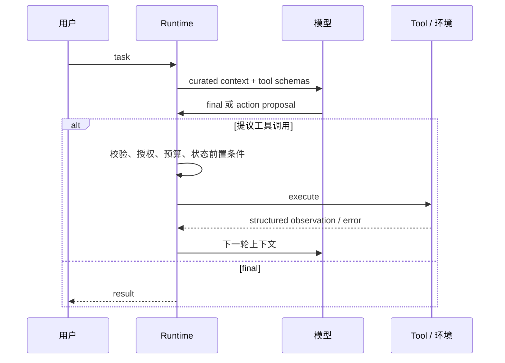

# 01：最小 Agent 循环与职责边界

> 一句话结论：Agent 的核心不是“模型回答”，而是反复执行 **读取事实 → 提议动作 → 受控执行 → 写回 observation → 决定是否继续** 的运行循环。

## 最小循环



**[框架事实]** smolagents 将多步运行保存为 task、action、planning 等 memory steps；OpenAI Agents SDK 的 Runner 则持续运行模型/工具 loop，直到结束、handoff 或中断。两者 API 不同，但都把“模型输出”与“实际执行”隔开。见 [smolagents AgentMemory](https://huggingface.co/docs/smolagents/main/reference/agents) 与 [OpenAI Agents SDK running agents](https://openai.github.io/openai-agents-python/running_agents/)。

## 六层职责

| 层 | 负责什么 | 不负责什么 |
|---|---|---|
| 模型 / Planner | 理解目标、提出候选下一步、生成自然语言 | 作为业务事实源或安全裁判 |
| Context Builder | 决定本轮给模型哪些历史、摘要、工具说明 | 取代持久业务状态 |
| Harness / Runtime | 调度、校验、路由、重试、暂停、预算 | 直接承载所有领域规则 |
| Tool Adapter | 将 Agent 参数映射到受控应用接口 | 绕过权限或直接信任模型 |
| Domain Service | 权限、状态转移、幂等与真实副作用 | 理解自然语言意图 |
| Trace / Evaluator | 记录证据、验证结果与回归 | 替代线上控制 |

## `final` 不是成功证明

模型产生 final 文本只是一个候选结束信号。运行时仍可：

- 运行确定性 final check；
- 因未完成审批暂停；
- 因步数或预算到顶返回明确的降级状态；
- 要求用户澄清多个候选对象。

**[设计归纳]** 调用方至少应区分 `COMPLETED`、`NEEDS_INPUT`、`WAITING_APPROVAL`、`BUDGET_EXHAUSTED`、`FAILED`；不要把“返回了一段文本”统一显示成完成。

## 教学伪代码

```python
# 教学伪代码：loop 与业务执行刻意分离
while run.status == "RUNNING":
    context = context_builder.for_model(run)
    proposal = model.respond(context, tool_schemas=runtime.exposed_tools(run))

    if proposal.is_final:
        run.finish_if_valid(proposal)
        continue

    decision = harness.authorize_and_route(proposal, run.state, run.metadata)
    observation = runtime.execute(decision)
    run.append_observation(observation)
```

这里 `authorize_and_route` 是关键 seam：模型可以建议 `refund`，却不能直接触达支付网关。

## 不变量与失败路径

- 每一轮 action、observation、错误和控制决定都应可追踪；否则无法解释重试或错误调用。
- 错误应转换为模型可理解但不泄密的 observation；不能悄悄吞掉。
- 无限 loop 必须有 step、时间、token、费用或业务进度限制。
- 未知的外部副作用结果不是“失败后重试”这么简单；见 [06-副作用、审批、幂等与恢复](<./06-副作用、审批、幂等与恢复.md>)。

## 自检

当模型输出 `delete_customer(id)` 时，哪一层负责阻止它越权？答案不应是“system prompt”。

## 下一章

[02-Tool-契约、注册与调用](<./02-Tool-契约、注册与调用.md>)

