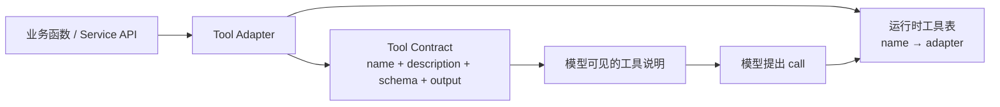

# 02：Tool 契约、注册与调用

> 一句话结论：注册 Tool 是在启动时定义 Agent **可能拥有的能力**；路由是运行时决定本轮 **应否使用其中某项能力**。两者不能混为一谈。

## 工具为何不只是函数？

一个普通函数只能被 Python 调用；一个 Agent Tool 还需要向模型说明如何调用它。



**[框架事实]** smolagents 的 `Tool` 以 `name`、`description`、`inputs`、`output_type` 与 `forward` 构成面向模型和执行器的接口；简单场景可由 `@tool` 从函数签名和 docstring 生成。OpenAI Agents SDK 也可从 Python 函数生成 schema，并用 Pydantic 做参数验证。见 [smolagents tools](https://huggingface.co/docs/smolagents/main/tutorials/tools) 与 [OpenAI Agents SDK](https://openai.github.io/openai-agents-python/)。

## 注册发生在什么时候？

```python
# 启动 / 创建 agent 时：确定能力上限
agent = SupportAgent(
    tools=[find_refund_case, get_refund_detail, request_refund],
)
```

概念上运行时建立：

```python
tool_registry = {
    "find_refund_case": find_refund_case_adapter,
    "get_refund_detail": get_refund_detail_adapter,
    "request_refund": request_refund_adapter,
}
```

这并不表示每一个请求都能调用所有工具。Harness 可根据用户身份、工作流阶段、风险等级或专用 Agent，将实际暴露集合缩小为一个子集。

## 从意图到工具：不是硬编码关键词匹配

基础 Agent 常让模型在用户请求和 tool description 的共同上下文中选择工具：

```text
“上海明天气温” + get_weather schema → get_weather(city, date)
```

这是一种**隐式语义路由**，不是可靠的安全机制。更强的设计有三种：

| 模式 | 谁决定候选工具 | 用途 |
|---|---|---|
| 自由工具箱 | 模型 | 搜索、研究、低风险探索 |
| Router + 专用 Agent | 规则/模型先选域，再给窄工具集 | 多业务域服务 |
| 显式工作流 | 状态机决定下一节点 | 退款、开户、审批 |

## 契约设计清单

```python
# 教学伪代码：Agent-facing adapter，不是领域服务本身
@tool
def get_refund_detail(refund_case_id: str) -> dict:
    """读取当前用户有权查看的退款单详情。

    Args:
        refund_case_id: 由查找步骤或工作流 state 提供的退款单 ID。
    """
    return refund_service.get_detail(
        refund_case_id=refund_case_id,
        principal=current_principal(),  # 不是模型输入
    )
```

- 名称描述行为，不暴露底层数据库实现；
- schema 表达必填字段、枚举与范围；
- `user_id`、`tenant_id`、credential 从认证上下文注入，不能让模型填写；
- 输出优先使用稳定、结构化的字段和 artifact reference；
- 对写操作显式标注副作用和审批需要。

## 工具描述不是权限控制

“仅在审批后退款”写入 description 可以帮助模型，但无法阻止模型跳过步骤。真正的控制在业务服务和 Harness：即便模型直接调用 `request_refund`，服务仍检查状态、权限和幂等键。详见 [04-Harness：把模型提议变成受控执行](<./04-Harness：把模型提议变成受控执行.md>)。

## 常见错误

- 工具池过大：模型难以正确选择，且最小权限失效。
- 同名覆盖：注册表按 name 查找时容易无意替换。
- 把数据库客户端直接注册为 Tool：模型获得过宽的查询/写入能力。
- 用自然语言错误提示替代 schema 和业务校验。

## 下一章

[03-Context、Memory、Metadata 与 Workflow State](<./03-Context、Memory、Metadata 与 Workflow State.md>)

