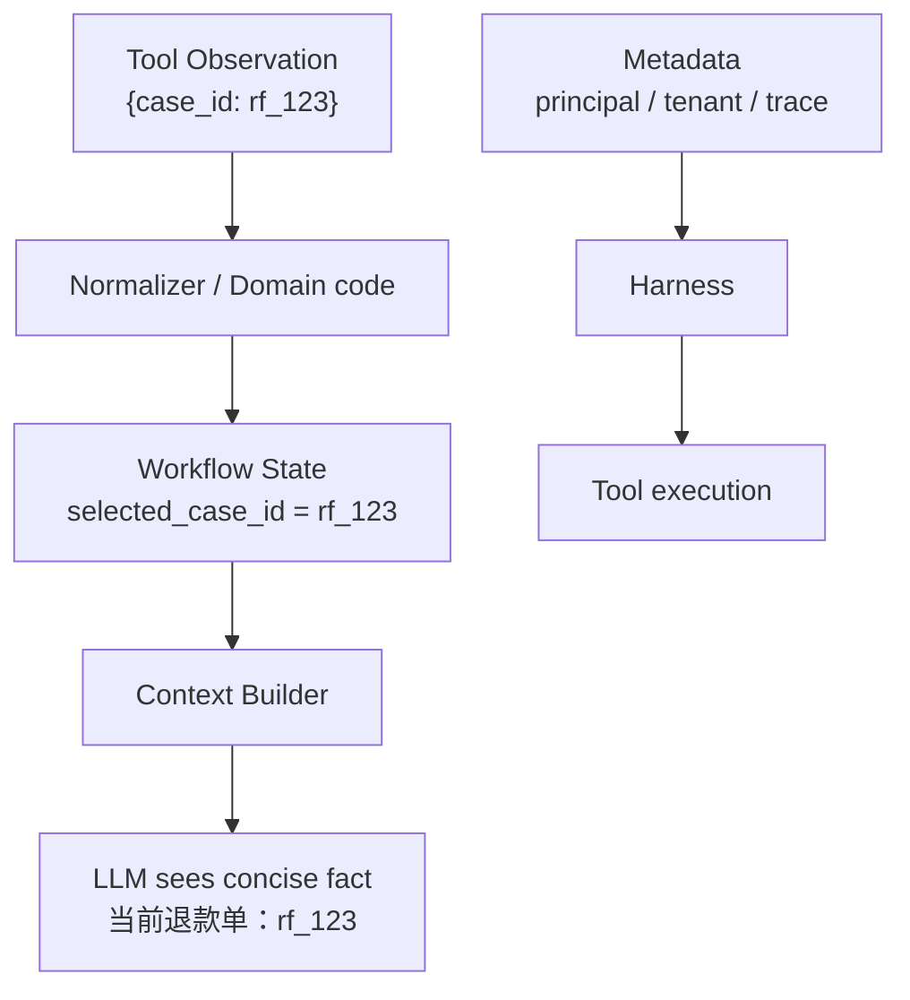

# 03：Context、Memory、Metadata 与 Workflow State

> 一句话结论：模型上下文用于推理，Workflow State 保存系统事实，Metadata 固定本次运行的身份与追踪边界；不要用聊天历史充当关键 ID 的唯一存储。

## 四个容易混淆的对象

| 对象 | 典型内容 | 是否给模型 | 是否应是事实源 |
|---|---|---|---|
| Context | system instructions、精选历史、工具说明、摘要 | 是 | 否 |
| Agent Memory | action/observation/planning 轨迹 | 通常部分给 | 不应独自承担关键业务事实 |
| Metadata | request_id、trace_id、principal、tenant、版本 | 按需最小化 | 身份/追踪边界 |
| Workflow State | 阶段、选中的 ID、审批、artifact refs、版本 | 经筛选给 | 是，需持久化 |



**[框架事实]** smolagents 的 `AgentMemory` 记录任务、action 和 planning steps，适合重放与调试；LangGraph 将图 state 作为节点共享数据，并可将其 checkpoint 到 thread。二者都说明“模型历史”和“可恢复运行状态”应被明确建模，而不是只保留一段聊天文本。见 [smolagents memory](https://huggingface.co/docs/smolagents/main/reference/agents) 与 [LangGraph persistence](https://docs.langchain.com/oss/python/langgraph/persistence)。

## 推荐的最小 schema

```python
# 教学伪代码
@dataclass(frozen=True)
class RunMetadata:
    request_id: str
    trace_id: str
    principal_id: str
    tenant_id: str
    workflow_version: int

@dataclass
class RefundState:
    stage: Literal["STARTED", "CASE_SELECTED", "APPROVED", "REFUNDED"]
    selected_refund_case_id: str | None = None
    approval_id: str | None = None
    refund_id: str | None = None
    artifact_refs: list[str] = field(default_factory=list)
    version: int = 0
```

`RunMetadata` 在单次 run 中应近似不可变。权限是否仍然有效是实时外部事实：执行副作用前必须重新鉴权，不能因为 metadata 中有旧 `principal_id` 就跳过。

## A 产出 ID，B 消费 ID

不可靠方式：Tool A 返回文本“已找到 rf_123”，模型下一轮自行抄写 ID 调 Tool B。

可靠方式：

```python
result = find_refund_case(...)
state.selected_refund_case_id = result["refund_case_id"]

# B 的真实参数由 harness 读取 state；模型不必重抄关键 ID
detail = refund_service.get_detail(
    case_id=state.selected_refund_case_id,
    principal=metadata.principal_id,
)
```

模型仍能看到适量摘要以理解当前任务，但系统执行从结构化 state 读取真实值。

## 防止 state 膨胀

**[设计归纳]** state 应保存小型、可验证的业务事实和引用，不保存无限增长的正文与完整原始响应：

```python
# 推荐：保存引用与摘要
state.artifact_refs.append("search-result:art_001")
state.summary = "找到两笔待审核退款单"
```

原始文档、网页、附件存到 artifact/object storage；event log 保存完整过程；Context Builder 在每轮挑选最相关的少量信息。Anthropic 将此称为 context engineering：上下文是有限资源，需要在每轮从持续增长的信息集合中筛选。见 [Effective context engineering](https://www.anthropic.com/engineering/effective-context-engineering-for-ai-agents)。

## 并发与演进

- 给 state 加 `version`，用乐观锁或事务避免两个 worker 覆盖彼此更新；
- 给 schema 加版本和迁移，不让模型随意增加关键字段；
- 多个候选退款单时保存集合与 `selected_*`，没有唯一选择时请求澄清；
- event log 是追加事实；state 是当前快照，二者不要混为一张无限大的 JSON。

## 下一章

[04-Harness：把模型提议变成受控执行](<./04-Harness：把模型提议变成受控执行.md>)

