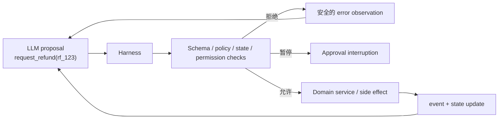

# 04：Harness：把模型提议变成受控执行

> 一句话结论：Harness 是包围模型的确定性运行时；它把“模型建议调用 B”变成“在当前身份、状态、预算和策略下是否允许执行 B”。

## Harness 不是什么？

它不是另一段更长的 prompt，也不是让模型任选一个 `validate_*` 工具。Prompt 有助于模型规划，不能构成强制执行边界。



**[框架事实]** OpenAI Agents SDK 支持 agent/tool guardrails，且工具 approval 可使运行暂停、将待批准调用写入 `RunState`，在批准或拒绝后恢复原 run；guardrails 在工作流中发生的位置不同，逐个 function tool 的控制不能只依赖 agent 级输入/输出 guardrail。见 [Guardrails](https://openai.github.io/openai-agents-python/guardrails/) 与 [Human-in-the-loop](https://openai.github.io/openai-agents-python/human_in_the_loop/)。

## Harness 的最小职责

| 控制 | 要回答的问题 | 例子 |
|---|---|---|
| Exposure | 本轮模型能看到哪些工具？ | 未审批时不暴露 `execute_refund` |
| Parse | proposal 是否符合 schema？ | `order_id` 是否为合法格式 |
| Authorization | 当前主体能做这件事吗？ | 订单是否属于当前 tenant/user |
| Preconditions | 当前 state 允许动作吗？ | 是否已进入 `APPROVED` |
| Budget | 还允许继续吗？ | max steps、金额上限、重试上限 |
| Execution | 如何调用并捕获错误？ | timeout、idempotency key、审计 |
| Observation | 模型下一轮应知道什么？ | “审批未完成”，不泄露内部凭证 |

## 正确的校验位置

```python
# 教学伪代码：模型不能绕过的执行门
def dispatch(proposal, ctx):
    tool = registry.lookup(proposal.name)
    args = tool.validate_schema(proposal.arguments)

    policy.assert_tool_exposed(tool, ctx.metadata)
    domain.assert_transition_allowed(ctx.state, tool.name, args)

    if policy.needs_human_approval(tool, args, ctx):
        return pause_with_pending_action(tool, args, ctx)

    return tool.execute(args, ctx)  # Tool 内仍调用 domain service
```

这里有**双层校验**：Harness 防止不该进入执行器的请求；Domain Service 作为最终业务边界，再次检查权限、状态和幂等。第二层不可省，因为未来可能有 API、后台任务或人工界面绕过 Agent Tool。

## “校验工具”什么时候有用？

`check_refund_eligibility()` 可以是只读工具，帮助模型解释和规划。但 `request_refund()` 内部仍必须自行检查 eligibility。换言之：

```text
模型可选择查询资格；系统必须强制执行资格校验。
```

## Harness 与业务服务的边界

```text
Harness：动作是否允许进入某个领域入口？
Domain Service：这个订单在真实业务规则下能否退款？
Repository/Gateway：原子写入或调用外部支付系统。
```

OpenAI 对 harness engineering 的工程经验同样强调：把结构、可验证边界和反馈回路编码进环境，而不是仅向 agent 堆叠说明文字。见 [Harness engineering](https://openai.com/index/harness-engineering/)。

## 自检

若模型没有调用 `check_refund_eligibility`，它还能成功退款吗？正确系统的答案是：不能，因为退款入口会自行拒绝。

## 下一章

[05-状态机、前置条件与工具依赖](<./05-状态机、前置条件与工具依赖.md>)

