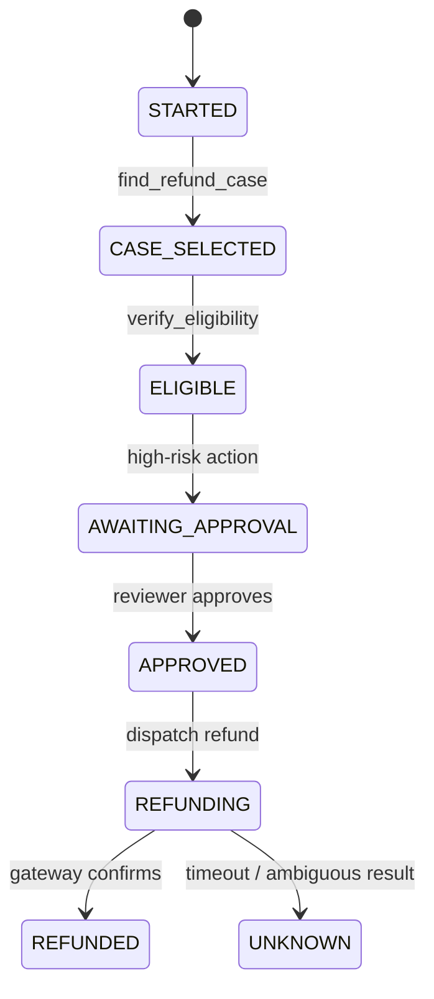

# 05：状态机、前置条件与工具依赖

> 一句话结论：A 必须先于 B，不应只写成“请先调用 A”的 prompt；应由显式 state、确定性 transition 和工具前置条件共同保证。

## 链式调用的两种含义

| 类型 | 谁控制顺序 | 风险 |
|---|---|---|
| 模型驱动的跨轮链 | 模型读取 A 的 observation 后提议 B | 适合低风险、可重试探索 |
| 系统驱动的工作流链 | 状态机只允许 `A → B` | 适合明确依赖和高风险副作用 |

ToolCallingAgent 的多次调用并不自动形成业务依赖图。同轮独立 calls 可并行；如果 B 需要 A 的 ID，B 应等待 A 的结构化结果进入 state，或由工作流强制先运行 A。



## State、Node、Edge 的通用模型

**[框架事实]** LangGraph 将工作流表示为共享 `State`、执行逻辑的 `Nodes` 和决定下一节点的 `Edges`；edge 可以是固定或根据当前 state 的条件路由。其 persistence 能为 thread 保存 checkpoint，并在中断、人工介入或故障后恢复。见 [Graph API overview](https://langchain-ai.github.io/langgraph/how-tos/state-reducers/) 与 [Persistence](https://docs.langchain.com/oss/python/langgraph/persistence)。

这是一种通用模型，不意味着每个 Agent 都需要采用 LangGraph。

## 用 transition 代替“希望模型遵守”

```python
# 教学伪代码
ALLOWED = {
    "STARTED": {"find_refund_case"},
    "CASE_SELECTED": {"verify_eligibility", "get_refund_detail"},
    "ELIGIBLE": {"request_approval"},
    "APPROVED": {"execute_refund"},
}

def assert_transition_allowed(state, tool_name):
    if tool_name not in ALLOWED[state.stage]:
        raise ToolError(f"当前阶段 {state.stage} 不允许 {tool_name}")
```

当模型错误地先调用 `execute_refund` 时，它得到的是可解释的拒绝 observation，而不是已经发生的退款。

## 依赖参数如何传递？

```python
# A 的可信结构化输出进入 state
state.selected_refund_case_id = find_result.refund_case_id

# B 从 state 取 ID；模型不必从长文本抄写 rf_123
get_detail(case_id=state.selected_refund_case_id)
```

如果有多个候选对象，必须让用户选择或由确定性规则选择；禁止“看起来像第一个就处理”。

## 并行的安全条件

只有满足以下条件才考虑并行：

- 调用间没有数据依赖；
- 不写同一资源，或具有可靠并发控制；
- 结果写回 state 的 merge 规则明确；
- 单个失败不会让另一个结果失去业务意义。

否则应串行，或将并发分支汇合到一个明确的 join/validator 节点。

## 不变量

- 任何状态转换都能指出触发它的 event、主体和时间；
- `APPROVED` 只能由审批系统/规则写入，模型不能自写；
- state 更新与外部副作用需要定义原子性或补偿/对账策略；
- 无法判定的结果进入 `UNKNOWN`，不能伪装为失败或成功。

## 下一章

[06-副作用、审批、幂等与恢复](<./06-副作用、审批、幂等与恢复.md>)

