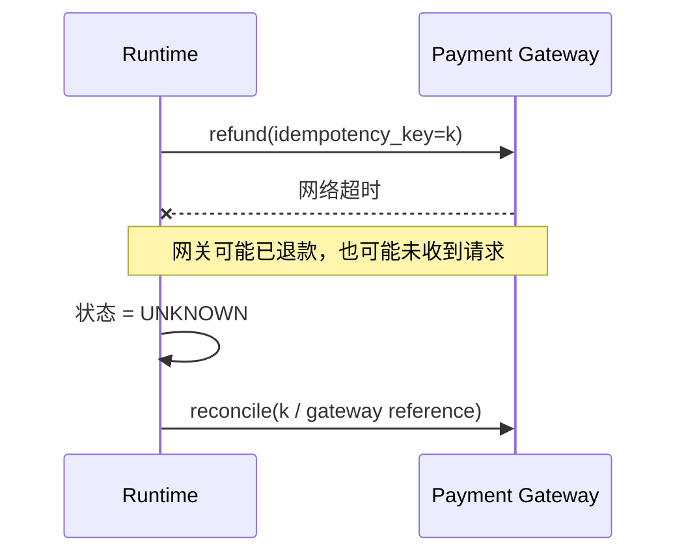

# 06：副作用、审批、幂等与恢复

> 一句话结论：对外部世界的写操作，最危险的状态不是失败，而是“我不知道是否已经成功”；`UNKNOWN` 必须触发对账，而不是盲目重试。

## 为什么模型重试会出事？



若直接重发 refund，可能造成重复扣款/退款。正确设计要有：

- durable action record；
- action ID / idempotency key；
- 可查询的外部 locator；
- `PENDING → EXECUTING → APPLIED/FAILED/UNKNOWN` 状态；
- `UNKNOWN` 的 reconcile 流程；
- 独立授权的补偿动作，而非模型自动“反向操作”。

## 审批不是一段聊天回复

**[框架事实]** OpenAI Agents SDK 的 HITL 机制把待审批 tool call 作为 interruption 暴露，并可序列化 `RunState`，在决策后恢复原运行；approval 与特定 tool call 绑定，而不是模糊的“用户刚才说可以”。见 [Human-in-the-loop](https://openai.github.io/openai-agents-python/human_in_the_loop/)。

**[设计归纳]** 生产审批记录至少应绑定：

```text
action_id、工具名、规范化参数、申请人、审批人、策略版本、过期时间、状态快照
```

执行时重新校验审批是否仍适用于当前参数与权限范围；不要批准 `refund(100)` 后让模型换成 `refund(10_000)`。

## 教学伪代码：可恢复动作

```python
def execute_refund(action_id: str, ctx):
    action = action_repo.get(action_id)
    assert action.status == "APPROVED"
    assert action.approval_matches_current_scope(ctx)

    action_repo.mark_executing(action_id)  # durable write
    try:
        receipt = gateway.refund(
            payment_id=action.payment_id,
            idempotency_key=action_id,
        )
    except TimeoutError:
        action_repo.mark_unknown(action_id)
        return {"status": "UNKNOWN", "action_id": action_id}

    action_repo.mark_applied(action_id, receipt.id)
    return {"status": "APPLIED", "receipt_id": receipt.id}
```

恢复时的第一步不是把同一动作重新交给模型采样，而是：

```python
def resume_unknown_action(action_id):
    external = gateway.lookup_by_idempotency_key(action_id)
    return merge_reconciliation_result(action_id, external)
```

## 补偿不是 rollback

许多外部动作不可真正回滚：邮件已经发出、退款已到账、库存已通知。补偿是一个**新的、可审计、需要独立授权的动作**，如发送更正通知或做对账调整；不能由模型在失败后随意执行。

## 下一章

[07-安全执行、最小权限与工具隔离](<./07-安全执行、最小权限与工具隔离.md>)

