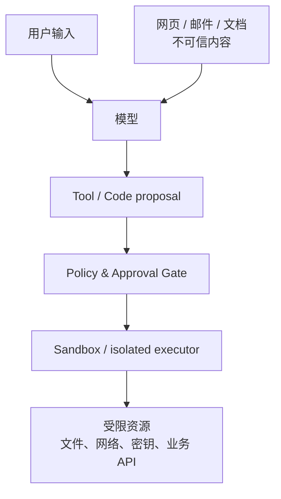

# 07：安全执行、最小权限与工具隔离

> 一句话结论：工具 schema、import allowlist 和 prompt 都只能降低误用概率；真正的安全边界来自最小权限、独立执行环境、可验证授权和对外部副作用的治理。

## 威胁从哪里进入？



攻击并不只来自用户。浏览到的网页、上传文档、工具返回值、远程 Tool 代码都可能把恶意指令或不可信数据带入模型上下文。

**[框架事实]** smolagents 明确指出本地 CodeAgent 执行模型生成代码存在风险；其 LocalPythonExecutor 只能提供缓解措施，强隔离需要远程执行选项（如 Docker/E2B 等）。见 [Secure code execution](https://huggingface.co/docs/smolagents/main/tutorials/secure_code_execution)。

## 四层防线

| 层 | 解决什么 | 典型措施 |
|---|---|---|
| 工具能力 | 模型最多能提出什么 | 窄工具、强 schema、最小参数 |
| 身份授权 | 谁能访问什么 | server-side principal、scoped token、tenant filter |
| 执行隔离 | 即使代码恶意，能伤害什么 | 容器/远程 sandbox、只读挂载、网络 egress 控制 |
| 业务治理 | 是否允许产生副作用 | state gate、审批、金额/频率限制、审计 |

这四层不能互相替代。例如禁止 `import os` 不会自动限制某个已授权包读写文件；容器也不能替代“此用户是否有退款权限”的业务校验。

## 最小权限的 Tool 设计

```python
# 差：把万能数据库执行器给模型
sql(query: str)

# 好：给出窄的、受服务端约束的业务动作
get_current_user_orders()
get_refund_detail(refund_case_id)
request_refund(refund_case_id)
```

第二种设计使权限、参数范围、审计和测试都可集中在领域服务中。模型永远不应获得长期主密钥、跨租户查询能力或任意 shell 的默认权限。

## Prompt injection 的正确理解

Prompt injection 不是“模型不听话”这么简单。它可使不可信内容影响模型的工具选择与参数。防护策略包括：

- 将不可信内容标为 data，而非可信 instruction；
- 不把网页正文直接升级为系统规则；
- 对每次高影响工具调用独立做 server-side 授权；
- 让 Tool 返回经过规范化的结构化数据，避免将原文直接作为命令；
- 记录工具 proposal 和最终执行参数，便于复盘。

**[框架事实]** OWASP 的 Agentic AI 安全材料将目标劫持、工具误用、身份/权限滥用、意外代码执行、memory/context poisoning 列为独立风险类别。见 [OWASP Top 10 for Agentic Applications](https://genai.owasp.org/2025/12/09/owasp-top-10-for-agentic-applications-the-benchmark-for-agentic-security-in-the-age-of-autonomous-ai/)。

## 自检

若模型被网页诱导调用 `delete_all_files()`，系统有哪些独立机制会阻止它？若答案只有“prompt 写了不要删除”，设计尚未形成安全边界。

## 下一章

[08-Trace、可观测性与行为验证](<./08-Trace、可观测性与行为验证.md>)

