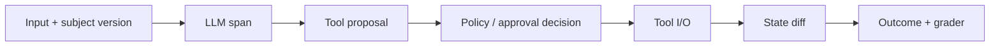

# 08：Trace、可观测性与行为验证

> 一句话结论：Agent 的最终回答不足以证明系统正确；必须保留“它看到了什么、提议了什么、Harness 为什么允许/拒绝、环境最终如何变化”的证据链。

## 一次运行应留下什么？



建议至少记录：

| 证据 | 用途 |
|---|---|
| request / task ID、主体、版本 | 定位是谁在哪个版本运行 |
| 模型输入摘要与输出 | 解释模型决策，注意脱敏 |
| tool proposal 与规范化参数 | 发现模型选择/参数错误 |
| guardrail、审批、路由决定 | 解释为何未执行或被暂停 |
| tool output、错误、耗时 | 诊断执行层问题 |
| state diff 与外部 receipt | 证明环境实际变化 |
| final outcome 与评分 | 区分“回答好看”和“任务成功” |

**[框架事实]** OpenAI Agents SDK 提供 tracing 用于查看、调试和监控 workflow；LangGraph 的 checkpoint 可恢复/检查 thread state，也支持回看运行轨迹。见 [OpenAI Agents SDK](https://openai.github.io/openai-agents-python/) 与 [LangGraph persistence](https://docs.langchain.com/oss/python/langgraph/persistence)。

## Trace 不等于泄露全部上下文

可观测性必须与隐私并存：

- 不记录原始密钥、完整 PII、未经脱敏的敏感附件；
- 用 artifact ID、哈希、字段级 redaction 代替大段原文；
- Trace 访问本身也应受权限和保留期控制；
- 记录 policy decision 的输入摘要与 policy version，避免只有“denied”。

## 怎么验证 A 必须先于 B？

写行为测试而非只看最终文本：

```python
def test_refund_cannot_skip_approval():
    run = start_run(order_id="ord_1")
    result = dispatch("execute_refund", run)

    assert result.kind == "REJECTED"
    assert run.state.stage != "REFUNDED"
    assert payment_gateway.calls == []
```

再为正常路径、审批拒绝、超时 `UNKNOWN`、恢复后对账、重复提交（幂等）分别保留 fixture 与 expected trace。

## 评价对象要版本化

Agent 的行为会受多个变量影响：

```text
model + prompt + tool schema + harness + policy + environment + evaluator
```

改变任一项，结果就不一定可比较。对回归测试至少固定任务、工具 stub/环境、模型配置、运行预算、评分器版本和随机性控制。现有 [AI Agent Evaluation](<../AI Agent Evaluation/README.md>) 知识包可作为这部分的延伸阅读。

## 不变量

- 副作用的“成功”应由环境/业务 receipt 证明，而不只是模型说成功；
- 被拒绝的 proposal 与已执行动作必须可区分；
- 每个状态变化可以追到 causation event；
- 评测中的 sandbox/harness 与生产运行时不要混称为同一个组件。

## 下一章

[09-贯穿案例：受控退款工作流](<./09-贯穿案例：受控退款工作流.md>)
