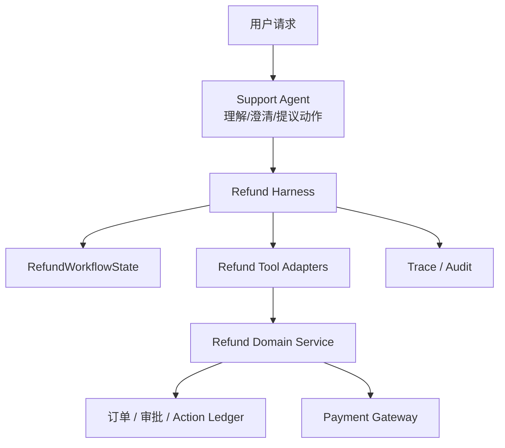

# 09：贯穿案例：受控退款工作流

> 本章把前面概念接成一个最小但完整的设计。它是教学模型，不应直接连接真实支付环境。

## 需求

用户说：“帮我处理订单 `ord_456` 的退款。”

系统应能：查找退款单、读取详情、验证资格、申请审批、执行退款、在超时时对账；同时不能让模型跨用户操作或绕过审批。

## 架构



## State 与 metadata

```python
# 教学伪代码
metadata = {
    "request_id": "req_001",
    "principal_id": "user_7",       # 来自认证层
    "tenant_id": "tenant_a",
    "trace_id": "trace_9",
}

state = {
    "stage": "STARTED",
    "order_id": "ord_456",
    "refund_case_id": None,
    "eligibility": "UNKNOWN",
    "approval_id": None,
    "action_id": None,
    "refund_receipt_id": None,
}
```

模型可看到“当前订单 `ord_456`，尚未选择退款单”的简短 context；真实 `principal_id` 只由服务端注入。

## 确定性状态转换

```python
def allowed_tools(stage):
    return {
        "STARTED": {"find_refund_case"},
        "CASE_SELECTED": {"get_refund_detail", "verify_eligibility"},
        "ELIGIBLE": {"request_approval"},
        "APPROVED": {"execute_refund"},
        "UNKNOWN": {"reconcile_refund"},
    }[stage]
```

每次模型 proposal 都先经过：

```python
assert proposal.tool_name in allowed_tools(state["stage"])
assert policy.authorized(metadata["principal_id"], proposal)
```

不通过就返回 observation，例如“当前退款单尚未审批；已记录为等待审批”，而非调用支付网关。

## 关键工具接口

```python
def find_refund_case(order_id, *, principal, tenant) -> dict: ...
def verify_eligibility(refund_case_id, *, principal, tenant) -> dict: ...
def request_approval(action_id, *, principal, tenant) -> dict: ...
def execute_refund(action_id, *, principal, tenant) -> dict: ...
def reconcile_refund(action_id, *, principal, tenant) -> dict: ...
```

`principal`、`tenant` 不由模型填写。`execute_refund` 不接受一个“我已经审批了”的 Boolean；它只接受 durable `action_id`，并在服务端读取并验证审批记录。

## 一条正常 trace

```text
1. find_refund_case(ord_456) → {refund_case_id: rf_123}
2. state: STARTED → CASE_SELECTED
3. verify_eligibility(rf_123) → {eligible: true}
4. state: CASE_SELECTED → ELIGIBLE
5. request_approval(action_9) → WAITING_APPROVAL
6. 人工批准 action_9 → state: APPROVED
7. execute_refund(action_9, idempotency_key=action_9) → receipt_5
8. state: APPROVED → REFUNDED
```

## 三条必须测试的失败 trace

| 失败 | 正确结果 |
|---|---|
| 模型跳过审批直接退款 | Harness 拒绝；支付网关零调用 |
| 网关超时 | state 进入 `UNKNOWN`；先 `reconcile`，不重新采样退款动作 |
| 模型提供其他用户的退款单 ID | Domain Service 根据 server-side principal 拒绝 |

## 课程小结

在这个案例里，模型的价值是理解表达、选择低风险查询、解释状态和请求澄清；确定性系统的价值是保护身份、顺序、审批、外部副作用与可恢复性。二者不是竞争关系，而是各守自己擅长的边界。

## 继续学习

- [06-副作用、审批、幂等与恢复](<./06-副作用、审批、幂等与恢复.md>)
- [08-Trace、可观测性与行为验证](<./08-Trace、可观测性与行为验证.md>)
- [02-openai-agents-sdk](<../AI Agent 设计与源码研究（2026）/agents/02-openai-agents-sdk.md>)
- [03-langgraph](<../AI Agent 设计与源码研究（2026）/agents/03-langgraph.md>)

