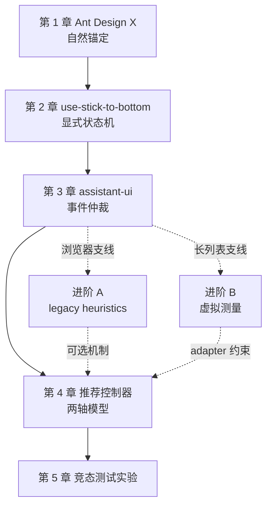

# Bubble List 自动滚动：学习路线与章节目录

## 学完后应该能做什么

- 区分几何到底、承诺跟随和程序化 pending intent；
- 判断一次 scroll 来自用户、动画、内容 resize、浏览器 anchoring 还是虚拟测量；
- 在用户上滚后稳定停止跟随，并在明确条件下恢复；
- 处理流式 token、代码块展开、图片晚加载和 prepend 历史消息；
- 为 column-reverse、普通布局和虚拟列表选择不同锚定策略；
- 用状态机、不变量、fake geometry 和真实浏览器 E2E 验证竞态；
- 实现“回到底部”按钮、unread badge 与主动发送后的显式回底。

## 先修知识

开始前只需要：

- 理解 DOM 的 `scrollTop`、`scrollHeight`、`clientHeight`；
- 能阅读 React hook；
- 知道 ResizeObserver 和 IntersectionObserver 的大致用途。

虚拟列表、浏览器 scroll anchoring、pointer/wheel/selection 竞态会在对应章节中引入。

## 课程地图

## 第 1 章：[Ant Design X](01-ant-design-x.md)

核心问题：怎样利用 `column-reverse`、sentinel 和 ResizeObserver，让普通消息列表自然保持底部，同时保护用户阅读位置？

完成标准：能解释 10px sentinel、50ms scroll window 和 Safari 补偿分别解决什么，并说明 `autoScroll=true` 不等于运行时始终 following。

## 第 2 章：[use-stick-to-bottom](02-use-stick-to-bottom.md)

核心问题：如果不用反向布局，怎样把跟随、逃逸、近底恢复和动画取消写成显式状态机？

完成标准：先还原项目的 locked/escaped 语义，再映射为课程规范的 `FOLLOWING → USER_SCROLLING → DETACHED → FOLLOWING`，并处理 wheel、selection 和 streaming resize。

## 第 3 章：[assistant-ui](03-assistant-ui.md)

核心问题：程序化滚到底部尚未完成时，怎样区分用户上滚和内容增长造成的 synthetic scroll？

完成标准：能解释 pending intent、稳定高度判定和 pointerdown 的职责差异。

## 第 4 章：[推荐的两轴控制器](04-controller-model.md)

将五种实现组合为：

- 跟随轴：FOLLOWING / USER_SCROLLING / DETACHED；
- 几何轴：atBottom；
- 独立 pending intent；
- 输入来源：user / program / content / viewport / virtualizer。

完成标准：实现推荐骨架，并能解释每个转换的触发证据。

## 第 5 章：[浏览器竞态测试实验](05-scroll-race-testing-lab.md)

MVP 先用 fake geometry 与 Chromium 验证普通列表；WebKit/软键盘属于主线正确性扩展。选读进阶 A 后再做时间窗口实验，选读进阶 B 后再做 prepend 和虚拟测量实验。

## 进阶支线

### 进阶 A：[react-scroll-to-bottom](advanced-a-react-scroll-to-bottom.md)

理解浏览器事件来源不可直接观察时，sticky、atEnd、animation 和时间窗口怎样形成 best-effort 分类。

### 进阶 B：[React Virtuoso](advanced-b-react-virtuoso.md)

理解虚拟列表的数据末尾、渲染末尾和测量稳定为何不是同一时刻，以及 adapter 必须等待什么。

## 每章四遍法

1. **看几何**：当前位置、最大滚动距离和近底阈值怎样计算？
2. **看意图**：系统是否承诺继续跟随？是否存在 pending programmatic scroll？
3. **看事件来源**：user、content、animation、viewport、virtualizer 怎样仲裁？
4. **做竞态测试**：改变事件顺序，状态和视窗仍应满足不变量。

## 按目标选择支线

| 目标 | 建议路径 |
|---|---|
| 普通聊天 UI（推荐主线） | 1 → 2 → 3 → 4 → 5 |
| Ant Design X 项目 | 1 → 2 → 3 → 4 → 5 |
| 浏览器事件不可观测 | 1 → 2 → 3 → 进阶 A → 4 → 5 |
| 超长历史与双向加载 | 1 → 2 → 3 → 进阶 B → 4 → 5 |

## 维护参考

- [章节模板](_chapter-template.md)
- [练习答案与状态 Trace](SOLUTIONS.md)
- [学习资源与待验证边界](RESOURCES.md)
