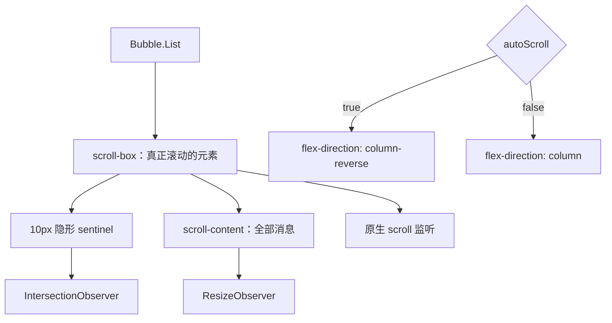
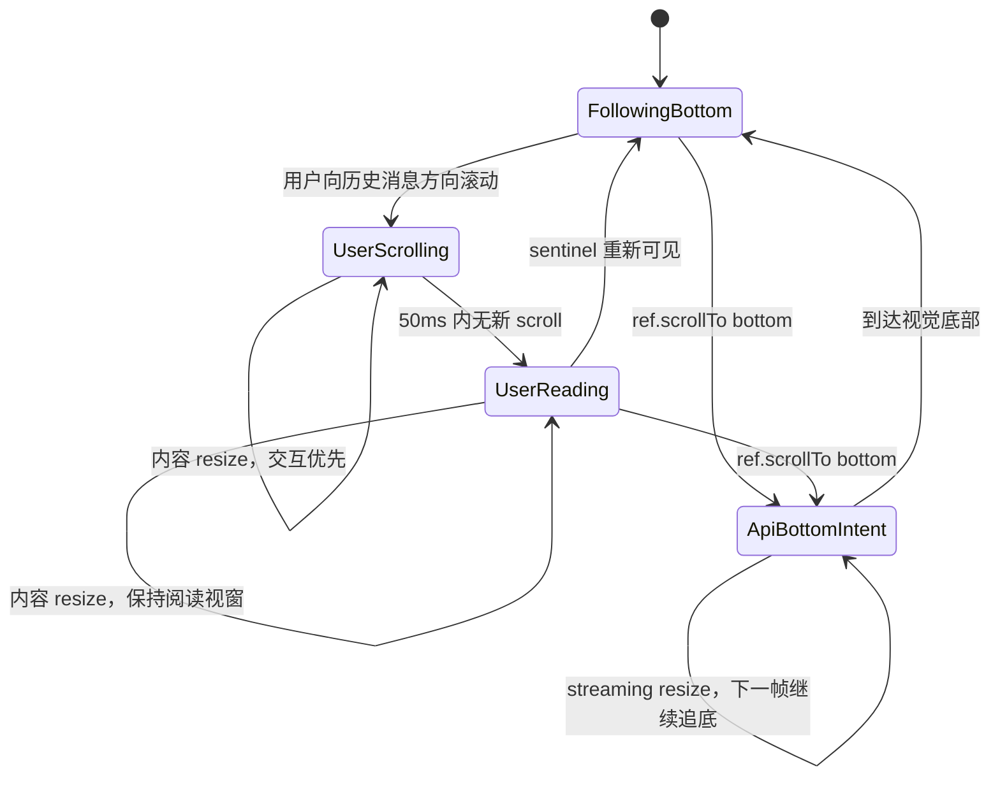

# 第 1 章 Ant Design X：用反向布局建立自然锚点

> 仓库：[`ant-design/x`](https://github.com/ant-design/x)
>
> 源码快照：[`b529d8e`](https://github.com/ant-design/x/commit/b529d8e96d5b35fe81ec68922fedb1ea124c7235)
>
> 研究对象：`Bubble.List`、`useCompatibleScroll`、列表样式与滚动测试。

## 本章要解决的问题

如果不在每个 token 到达后都执行 `scrollToBottom()`，消息列表还能怎样自然贴住底部？用户向上阅读历史消息后，内容继续变高时又怎样避免把视窗拉走？

## 本章目标

- 理解 `column-reverse`、sentinel、`IntersectionObserver` 和 `ResizeObserver` 如何协作。
- 能沿着“内容 resize → 判断是否贴底 → 跟随或锁定视窗”的路径阅读源码。
- 能解释 Safari 为什么需要独立的反向滚动补偿。

## 概念起步：先建立中立不变量

在进入 Ant Design X 的反向布局前，先用普通正向列表记住四条课程不变量：

```ts
const distanceToBottom = scrollHeight - clientHeight - scrollTop;
const atBottom = distanceToBottom <= threshold;
```

1. `atBottom` 只描述当前几何事实；`following` 描述未来内容增长时是否继续到底部。
2. 位于底部且仍 following 时，内容增长应保持底部。
3. 用户主动上滚后，内容增长不能夺回阅读位置。
4. 显式“发送消息”或“回到底部”可以建立新的到底意图。

`column-reverse`、sentinel 和 50ms 窗口都只是满足这些不变量的一种实现策略，不是课程本身的定义。

## 1. 核心心智模型

`Bubble.List autoScroll` 并不是一个“items 更新后执行 `scrollToBottom()`”的 effect。它由四部分组成：

1. `column-reverse` 把视觉底部变成稳定锚点。
2. 10px sentinel 通过 `IntersectionObserver` 判断用户是否离开底部。
3. `ResizeObserver` 在内容高度变化后决定跟随底部还是保持阅读视窗。
4. 50ms scroll-event 窗口让正在发生的滚动优先于内容变化和 Safari 兼容性修正。

用户手动上滚后，`autoScroll` prop 仍是 `true`。变化的是运行时行为：从“贴底”进入“保持当前阅读位置”。

## 2. 组件结构



源码入口：

- [`BubbleList.tsx#L128-L215`](https://github.com/ant-design/x/blob/b529d8e96d5b35fe81ec68922fedb1ea124c7235/packages/x/components/bubble/BubbleList.tsx#L128-L215)
- [`style/list.ts#L29-L47`](https://github.com/ant-design/x/blob/b529d8e96d5b35fe81ec68922fedb1ea124c7235/packages/x/components/bubble/style/list.ts#L29-L47)
- [`useCompatibleScroll.ts`](https://github.com/ant-design/x/blob/b529d8e96d5b35fe81ec68922fedb1ea124c7235/packages/x/components/bubble/hooks/useCompatibleScroll.ts)

## 3. 为什么使用 `column-reverse`

普通列表的视觉底部坐标约为：

```text
scrollHeight - clientHeight
```

反向 flex 中，视觉底部接近 `scrollTop = 0`，向历史消息方向滚动时可能得到负 `scrollTop`。这样内容在底部持续增长时，浏览器布局本身就能维持底部锚定，不必在每个 token 到达时重复写 scrollTop。

代价是所有公开滚动坐标都要适配：

| 调用目标 | 普通布局 | 反向布局 |
|---|---:|---:|
| 视觉底部 | `scrollHeight` | `0` |
| 视觉顶部 | `0` | `-scrollHeight` |
| 数字 `top` | 原值 | `-scrollHeight + clientHeight + top` |

证据：[`BubbleList.tsx#L174-L201`](https://github.com/ant-design/x/blob/b529d8e96d5b35fe81ec68922fedb1ea124c7235/packages/x/components/bubble/BubbleList.tsx#L174-L201)。

## 4. 带注释的核心代码

下面是依据源码重构的教学版伪代码，不是源码逐行复制。变量名刻意强调职责。

### 4.1 底部检测与内容监听

```ts
function installScrollObservers(viewport: HTMLElement, content: HTMLElement) {
  // sentinel 放在反向 flex 的第一个位置，对应视觉底部。
  const bottomSentinel = createInvisibleSentinel({ height: 10 });
  viewport.prepend(bottomSentinel);

  let shouldPreserveReadingViewport = false;

  const intersection = new IntersectionObserver(
    ([entry]) => {
      // sentinel 可见：用户在底部，不需要做“离底视窗保护”。
      // sentinel 不可见：用户正在阅读历史消息，后续 resize 必须保护视窗。
      shouldPreserveReadingViewport = !entry.isIntersecting;
    },
    { root: viewport, threshold: 0 },
  );

  intersection.observe(bottomSentinel);

  const resize = new ResizeObserver(() => {
    if (isScrollingNow()) {
      // 一般滚动期间不执行反向视窗锁定，避免争抢和抖动。
      // 例外：显式到底意图仍有效时，会继续用 instant 追底。
      continueExplicitBottomScrollIfNecessary(viewport);
      return;
    }

    if (isColumnReverse(viewport) && shouldPreserveReadingViewport) {
      preserveReverseViewport(viewport);
    }
  });

  resize.observe(content);
}
```

对应源码：[`useCompatibleScroll.ts#L18-L78`](https://github.com/ant-design/x/blob/b529d8e96d5b35fe81ec68922fedb1ea124c7235/packages/x/components/bubble/hooks/useCompatibleScroll.ts#L18-L78)。

### 4.2 scroll-event 窗口

这个窗口本身不区分用户滚动与程序化滚动；它表示“最近仍有原生 `scroll` 事件发生”。程序化到底由另一个 `isScrollToBottom` ref 单独标记。

```ts
let scrollingTimer: ReturnType<typeof setTimeout> | undefined;
let lockedBottomCoordinate = 0;
let ignoreNextInternalScroll = false;

function onViewportScroll(viewport: HTMLElement) {
  // 反向布局中 scrollTop 可能为负数。
  // 保存两者之和，可以在 scrollHeight 改变后反推出新的 scrollTop。
  lockedBottomCoordinate = viewport.scrollHeight + viewport.scrollTop;

  if (ignoreNextInternalScroll) {
    // preserveReverseViewport 自己写 scrollTop 也会触发 scroll。
    // 忽略这一次，避免把内部补偿误识别成新的用户交互。
    ignoreNextInternalScroll = false;
    return;
  }

  clearTimeout(scrollingTimer);
  scrollingTimer = setTimeout(() => {
    scrollingTimer = undefined;
    clearExplicitBottomIntent();
  }, 50);
}
```

对应源码：[`useCompatibleScroll.ts#L82-L113`](https://github.com/ant-design/x/blob/b529d8e96d5b35fe81ec68922fedb1ea124c7235/packages/x/components/bubble/hooks/useCompatibleScroll.ts#L82-L113)。

### 4.3 Safari 视窗锁定

```ts
function preserveReverseViewport(viewport: HTMLElement) {
  // 假设旧高度 H0、旧位置 T0，记录值为 H0 + T0。
  // 高度变为 H1 后，新位置 T1 = H0 + T0 - H1。
  // 因此内容增长多少，scrollTop 就向负方向补偿多少。
  const nextScrollTop = lockedBottomCoordinate - viewport.scrollHeight;

  viewport.scrollTop = nextScrollTop;
  ignoreNextInternalScroll = true;
}
```

对应源码：[`useCompatibleScroll.ts#L115-L132`](https://github.com/ant-design/x/blob/b529d8e96d5b35fe81ec68922fedb1ea124c7235/packages/x/components/bubble/hooks/useCompatibleScroll.ts#L115-L132)。

### 4.4 程序化滚到底部

```ts
function scrollToAdapted(options: ScrollOptions) {
  const targetsVisualBottom = isBottomTarget(options);

  // 内容还在 streaming 时，必须记住“持续追到底部”的显式意图。
  explicitBottomIntent = targetsVisualBottom;

  // 立即进入滚动态，防止同一帧的 ResizeObserver 抢先执行视窗锁定。
  startOrRefreshScrollingTimer();

  if (options.element) {
    options.element.scrollIntoView(options.intoView);
  } else {
    viewport.scrollTo(convertReverseCoordinates(options));
  }
}
```

内容持续增长时，显式 bottom intent 会在下一帧使用即时滚动继续追底；这也是官方 demo 说明 `smooth` 可能降级为 `instant` 的原因。

对应源码：[`useCompatibleScroll.ts#L139-L181`](https://github.com/ant-design/x/blob/b529d8e96d5b35fe81ec68922fedb1ea124c7235/packages/x/components/bubble/hooks/useCompatibleScroll.ts#L139-L181)、[`list-scroll.md`](https://github.com/ant-design/x/blob/b529d8e96d5b35fe81ec68922fedb1ea124c7235/packages/x/components/bubble/demo/list-scroll.md)。

## 5. 状态转换



## 6. 版本演进

- [PR #1392](https://github.com/ant-design/x/pull/1392)：加入 Safari 反向滚动视窗锁定。
- [PR #1545](https://github.com/ant-design/x/pull/1545)：移除“新增 item 默认强制跳到底部”，让显式 `ref.scrollTo` 表达调用方意图。

第二个 PR 是理解当前行为的关键，但这里不能简化成一条绝对优先级链：

- 没有显式到底意图时，普通内容增长会尊重 sentinel 表示的用户脱离状态，并保护阅读视窗。
- `ref.scrollTo` 建立的 `isScrollToBottom` 意图仍在 50ms 窗口内时，ResizeObserver 会用 `instant` 继续追底。
- 用户 scroll event 会刷新 50ms timer，但不会同步清除显式到底意图；只有滚动事件静默 50ms 后才清除。

因此更准确的表述是：自然内容增长尊重用户脱离，但短时有效的显式到底意图可以覆盖 resize 补偿路径。

## 7. 测试证据

独立测试覆盖：

- 滚动中内容 resize 不锁视窗。
- 用户离底后内容增高或变矮仍保持位置。
- 显式滚到底部与内容增长同时发生时继续追底。
- 正向/反向布局下的 `scrollIntoView`。

证据：[`list-scroll.test.tsx#L218-L399`](https://github.com/ant-design/x/blob/b529d8e96d5b35fe81ec68922fedb1ea124c7235/packages/x/components/bubble/__tests__/list-scroll.test.tsx#L218-L399)。

hook 的 cleanup 路径会断开两个 observer、清除 timer 并移除 sentinel，但该快照的测试没有直接断言这些清理动作。现有测试以 JSDOM 和 mocked geometry 为主，仍应补真实 WebKit/iOS 的惯性滚动、图片晚加载和 streaming E2E。

## 8. 优点与局限

优点：

- 普通消息列表中实现成本低，不需要每个 token 都主动滚动。
- 用户阅读位置保护自然，Safari 补偿公式明确。
- 明确处理程序化到底意图与内容增长的竞态，并保留上述短时例外。

局限：

- `autoScroll` 不是公开的运行时 `following` 状态，命名容易误解。
- 没有公开 `isAtBottom`，做“回到底部”按钮时需要自己计算。
- 50ms 是启发式窗口。
- 不提供虚拟化，超长会话仍会受 DOM 规模影响。

## 9. 使用建议

不要在每次 items/token 更新时调用 `scrollTo({ top: 'bottom' })`，否则会重新引入 PR #1545 移除的滚动争抢。

只在以下明确事件中调用：

- 用户发送新消息，产品要求回到底部。
- 用户点击“回到底部”。
- 切换会话后产品要求定位最新消息。

若需要 unread badge，应额外维护 `isAtBottom`/`isFollowing`，不要复用 `autoScroll` 表示运行时状态。

## 本章练习

画出 `scroll-box → sentinel → scroll-content` 的 DOM 结构，并对下面四步逐步记录 `scrollTop`、`scrollHeight`、sentinel 是否相交以及系统应采取的动作：

1. 初始内容不足一屏。
2. 位于底部时，流式文本连续增高。
3. 用户向上滚动，使 sentinel 离开视口。
4. 历史消息中的图片晚加载并增高。

然后删除你实验代码中“items 变化就滚到底部”的 effect，只保留显式的“发送消息”和“回到底部”命令，观察四步行为有何变化。

### 练习验收

- 四步 trace 都能说明“几何事实”和“程序化到底意图”是不同信息。
- 用户离底后，第 4 步不会把阅读位置强制拉回底部。
- 能指出 50ms 窗口在保护哪一种竞态，以及它为什么只能是启发式。

## 检查理解

1. `autoScroll=true` 为什么不等于运行时始终处于 following？
2. sentinel 比单纯判断 `scrollTop` 多解决了什么问题？
3. 如果改回普通正向布局，Safari 补偿公式中的哪些前提会失效？

## 本章小结

Ant Design X 展示了最容易入门的一条路径：先用布局建立自然锚点，再用观察器保护用户视窗。它适合帮助我们认识自动滚动的几何层，但还没有把“用户是否愿意继续跟随”完整暴露为状态。

[课程目录](00-learning-guide.md) · [下一章：use-stick-to-bottom](02-use-stick-to-bottom.md)
