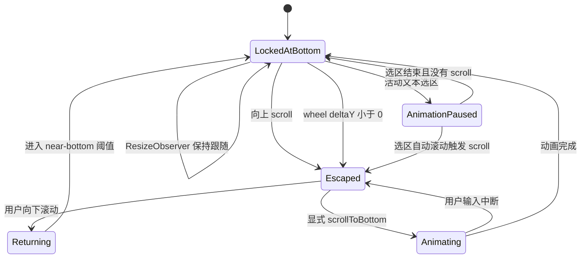
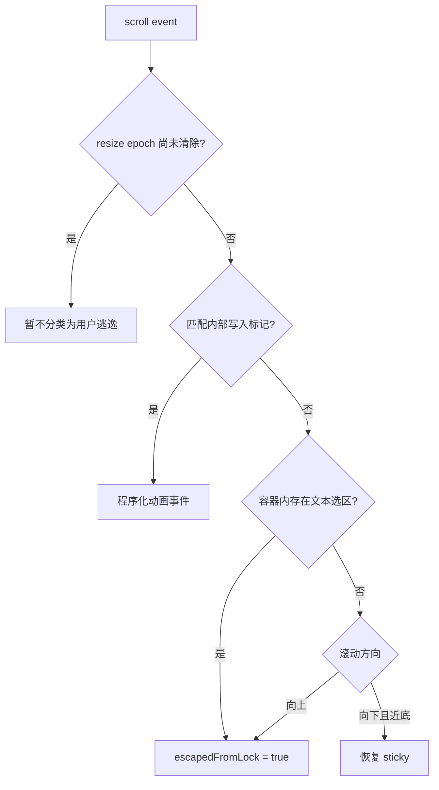

# 第 2 章 use-stick-to-bottom：显式跟随与用户逃逸

> 仓库：[`stackblitz-labs/use-stick-to-bottom`](https://github.com/stackblitz-labs/use-stick-to-bottom)
>
> 源码快照：[`8d6a19a`](https://github.com/stackblitz-labs/use-stick-to-bottom/commit/8d6a19a0ca6ab632830588073e6a29312a06a088)
>
## 本章要解决的问题

几何位置接近底部，并不代表用户仍愿意自动跟随。怎样把“继续跟随”“用户主动逃逸”“重新接近底部”建模成可复用的状态机，并允许动画被输入立即打断？

## 本章目标

- 区分 `isAtBottom`、`isNearBottom`、`escapedFromLock` 和动画目标。
- 理解 wheel、scroll、resize 与文本选择为何需要不同的来源标记。
- 能把事件处理代码还原成一张跟随/逃逸状态转换表。

## 1. 核心心智模型

这个包把聊天列表的自动跟随直接建模成“锁定/逃逸”问题：

- 位于或接近底部时保持 sticky。
- 用户向上滚动或滚轮向上时逃逸；活动文本选区会暂停动画，选区操作实际引发 scroll 时才进入逃逸。
- 用户向下回到 70px 近底范围后恢复跟随。
- streaming resize、程序化动画和用户输入分别留下不同标记，降低误判。

它比 Ant Design X 更像一个独立的、可复用的滚动状态机；也比 assistant-ui 更少绑定聊天业务事件。

## 2. 核心状态

源码内部维护的关键量包括：

| 状态 | 含义 |
|---|---|
| `isAtBottom` | 当前是否被认为处于跟随状态 |
| `isNearBottom` | 是否进入底部附近的恢复区间 |
| `escapedFromLock` | 用户是否主动逃离自动锁定 |
| 动画目标 | 当前 spring/scroll 动画的目标位置 |
| `resizeDifference` | 内容 resize 造成的高度差 |
| `ignoreScrollToTop` | 忽略内部写 scrollTop 产生的事件 |

证据：[`useStickToBottom.ts#L131-L154`](https://github.com/stackblitz-labs/use-stick-to-bottom/blob/8d6a19a0ca6ab632830588073e6a29312a06a088/src/useStickToBottom.ts#L131-L154)。

## 3. 状态机



## 4. 带注释的核心代码

以下为基于源码行为重构的教学版代码。

### 4.1 向上滚动立即逃逸

```ts
function onScroll(viewport: HTMLElement) {
  const currentTop = viewport.scrollTop;
  const movedUp = currentTop < previousTop;
  const movedDown = currentTop > previousTop;

  if (movedUp && !isInternalScrollEvent()) {
    // 用户向历史消息方向移动：立即解除自动锁定。
    state.escapedFromLock = true;
    state.isAtBottom = false;
    stopCurrentAnimation();
  } else if (movedDown) {
    // 用户主动往底部返回时，可以清理逃逸标记。
    // 但只有进入 near-bottom 阈值才真正恢复 sticky。
    state.escapedFromLock = false;

    if (distanceToBottom(viewport) <= 70) {
      state.isNearBottom = true;
      state.isAtBottom = true;
    }
  }

  previousTop = currentTop;
}
```

70px 近底范围让恢复跟随不要求精确命中 0/1px，适合触摸和惯性滚动。

对应源码：[`useStickToBottom.ts#L412-L479`](https://github.com/stackblitz-labs/use-stick-to-bottom/blob/8d6a19a0ca6ab632830588073e6a29312a06a088/src/useStickToBottom.ts#L412-L479)。

### 4.2 为什么还要监听 wheel

```ts
function onWheel(event: WheelEvent) {
  if (event.deltaY >= 0) return;

  // 浏览器可能在边界、动画或特殊滚动容器中吞掉后续 scroll event。
  // wheel 向上已经足以表达用户想脱离底部，因此提前逃逸。
  if (!currentAnimation.ignoreEscapes) {
    state.escapedFromLock = true;
    state.isAtBottom = false;
    stopCurrentAnimation();
  }
}
```

`ignoreEscapes` 允许某些强制程序化动作暂时阻止用户逃逸，但默认应尊重用户。

对应源码：[`useStickToBottom.ts#L481-L516`](https://github.com/stackblitz-labs/use-stick-to-bottom/blob/8d6a19a0ca6ab632830588073e6a29312a06a088/src/useStickToBottom.ts#L481-L516)。

### 4.3 内容增长与 resize 来源标记

```ts
const resizeObserver = new ResizeObserver(([entry]) => {
  // 源码使用 ResizeObserverEntry.contentRect.height，
  // 而不是假设 content.scrollHeight 与被观察盒子的高度恒等。
  const nextHeight = entry.contentRect.height;

  // 记录本次内容尺寸变化量。
  // 只要这个 resize epoch 尚未清除，随后到达的 scroll event 就暂不分类，
  // 并不要求 scroll 位移数值等于 difference。
  const difference = nextHeight - (previousHeight ?? nextHeight);
  state.resizeDifference = difference;
  previousHeight = nextHeight;

  if (difference >= 0) {
    // 源码总会发起 preserve-position 请求；scrollToBottom 的动画帧
    // 再根据 state.isAtBottom 决定继续还是立即退出。
    scrollToBottom({ preserveScrollPosition: true });
  } else if (state.isNearBottom) {
    // 内容缩短可能把用户自然带回近底区。
    state.escapedFromLock = false;
    state.isAtBottom = true;
  }

  // 源码先等一帧，再等 1ms；这是为了跨过 scroll handler 自己的
  // 1ms 延迟分类窗口，避免过早清除 resize 来源标记。
  requestAnimationFrame(() => {
    setTimeout(() => {
      if (state.resizeDifference === difference) {
        state.resizeDifference = 0;
      }
    }, 1);
  });
});
```

对应源码：[`useStickToBottom.ts#L528-L590`](https://github.com/stackblitz-labs/use-stick-to-bottom/blob/8d6a19a0ca6ab632830588073e6a29312a06a088/src/useStickToBottom.ts#L528-L590)。

### 4.4 动画循环的第一道门

```ts
function animateTowardBottom(timestamp: number): boolean {
  if (!state.isAtBottom) {
    // 源码只以 isAtBottom 作为动画门槛。
    // 用户逃逸会先把 isAtBottom 设为 false，从而间接终止动画。
    return false;
  }

  if (userIsSelectingTextInsideViewport()) {
    // 活动选区只暂停这一帧并等待下一帧，不会在这里直接设置 escape。
    return scheduleNextAnimationFrame();
  }

  const nextTop = springStep({
    from: viewport.scrollTop,
    to: viewport.scrollHeight - viewport.clientHeight,
    timestamp,
  });

  markNextScrollAsInternal(nextTop);
  viewport.scrollTop = nextTop;

  return !springHasSettled();
}
```

显式 `scrollToBottom()`（未启用 `preserveScrollPosition`）会把 `isAtBottom` 重新设为 true，从而允许动画恢复；它不要求先同步清除 `escapedFromLock`。这正是动画门槛不能额外写成 `!escapedFromLock` 的原因。

对应源码：[`useStickToBottom.ts#L305-L325`](https://github.com/stackblitz-labs/use-stick-to-bottom/blob/8d6a19a0ca6ab632830588073e6a29312a06a088/src/useStickToBottom.ts#L305-L325)、[`useStickToBottom.ts#L544-L562`](https://github.com/stackblitz-labs/use-stick-to-bottom/blob/8d6a19a0ca6ab632830588073e6a29312a06a088/src/useStickToBottom.ts#L544-L562)。

### 4.5 文本选择为何影响滚动

当用户按下鼠标并选择聊天文本时，浏览器可能自动滚动选区。源码在 document 上监听 `mousedown`、`mouseup` 和 `click`，只用来维护 `mouseDown`；它再结合 `window.getSelection()` 判断当前是否存在容器内活动选区。

```ts
function classifyScrollAfterResizeWindow() {
  // scroll handler 延迟 1ms 后读取选区，并检查选区与容器的包含关系。
  // 只有选择操作确实产生了 scroll，才在这里进入逃逸。
  if (userIsSelectingTextInsideViewport()) {
    state.escapedFromLock = true;
    state.isAtBottom = false;
    stopCurrentAnimation();
    return;
  }

  classifyByScrollDirection();
}
```

另一路径发生在动画循环：检测到活动选区时只暂停并调度下一帧，不直接设置 `escapedFromLock`。

对应源码：[`useStickToBottom.ts#L435-L467`](https://github.com/stackblitz-labs/use-stick-to-bottom/blob/8d6a19a0ca6ab632830588073e6a29312a06a088/src/useStickToBottom.ts#L435-L467)。

## 5. 事件来源分类



## 6. 公开能力

源码公开了跟随状态与控制方法，可用于构建：

- “回到底部”按钮。
- 新消息提示。
- 外部停止滚动动画。
- 自定义 smooth/spring 行为。
- 调试 `escapedFromLock`。

需要注意，hook 对外返回的 `isAtBottom` 不是纯粹的 0px 几何事实，而是内部 `isAtBottom || isNearBottom`；进入 70px 恢复区间时，对外即可视为“在底部”。因此若产品需要精确像素意义的到底状态，应另外计算距离。

证据：[`useStickToBottom.ts#L596-L618`](https://github.com/stackblitz-labs/use-stick-to-bottom/blob/8d6a19a0ca6ab632830588073e6a29312a06a088/src/useStickToBottom.ts#L596-L618)。

## 7. 与 Ant Design X 的差异

| 维度 | use-stick-to-bottom | Ant Design X |
|---|---|---|
| 布局 | 普通正向滚动 | `column-reverse` |
| 用户取消 | 显式 escape 状态 | sentinel 离底 + 视窗锁定效果 |
| 恢复阈值 | 70px near-bottom | 10px sentinel 是否相交 |
| 动画 | 可取消 spring/自定义动画 | 原生 scroll + streaming 时 instant |
| 公开状态 | 丰富 | 未公开 `isAtBottom` |
| 文本选择 | 专门处理 | 无专门分支 |
| Safari 反向补偿 | 不需要反向 flex 公式 | 专门实现 |

## 8. 优点与局限

优点：

- 跟随、逃逸、近底、动画意图语义清晰。
- 针对 streaming resize、wheel、文本选择和程序化 scroll 做了细分。
- 包边界小，便于集成到自定义聊天 UI。

局限：

- 状态及时序明显复杂于普通 hook。
- document 级鼠标监听只维护模块级 `mouseDown`，多实例及测试隔离需要额外留意。
- 不负责虚拟化。
- 70px 阈值适合聊天，但不一定适合所有列表。

## 9. 适用场景

推荐用于：

- 自研聊天界面但不想自研滚动状态机。
- 流式 token、代码块展开、图片加载导致内容持续 resize。
- 需要平滑 spring 动画且必须能被用户立即打断。
- 需要直接获得 `isAtBottom`/escape 状态。

若消息数量达到虚拟化门槛，应优先评估 React Virtuoso，而不是在该 hook 外再拼一套窗口化系统。

## 本章练习

实现一个不操作 DOM 的纯函数 `transition(state, event)`。先把上游 `escapedFromLock` 映射为课程规范状态：`FOLLOWING`、`USER_SCROLLING`、`DETACHED`。事件至少包含：

- `CONTENT_RESIZED`
- `WHEEL_UP`
- `SCROLL_NEAR_BOTTOM`
- `SCROLL_TO_BOTTOM_REQUESTED`
- `SELECTION_SCROLL`

为每个事件写出“当前状态、前置几何、下一个状态、是否启动动画”四列 trace。最后再把 70px 恢复阈值改成参数，比较阈值过大和过小时的体验。

### 练习验收

- `WHEEL_UP` 能在动画尚未结束时进入 `USER_SCROLLING`，scroll-end 且未到底后进入 `DETACHED`。
- 普通 `CONTENT_RESIZED` 不会被误判为用户逃逸。
- 只有重新进入近底区或收到显式请求时才恢复 following。
- 能说明文本选择为什么不能简单等同于取消跟随。

## 检查理解

1. 为什么只保留 `isAtBottom` 一个 boolean 无法表达 escape lock？
2. wheel 信号和 scroll 方向信号各自弥补了什么盲区？
3. spring 动画的目标为什么也属于状态，而不只是视觉效果？

## 本章小结

这一章把第 1 章隐含的行为提升成显式状态机：几何决定“在哪里”，上游 escape lock 映射为课程的 `DETACHED`，动画元数据帮助系统识别自己的写入。下一章会继续加入业务事件和 pending intent。

[上一章：Ant Design X](01-ant-design-x.md) · [课程目录](00-learning-guide.md) · [下一章：assistant-ui](03-assistant-ui.md)
