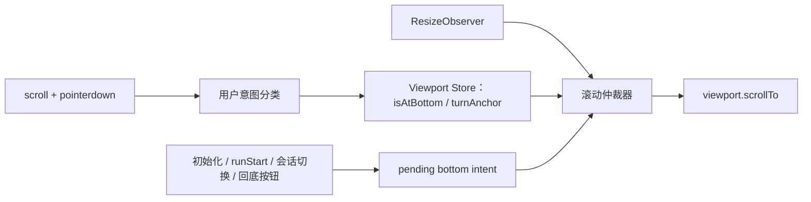
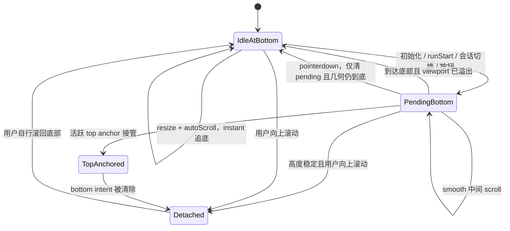

# 第 3 章 assistant-ui：pending intent 与事件仲裁

> 仓库：[`assistant-ui/assistant-ui`](https://github.com/assistant-ui/assistant-ui)
>
> 源码快照：[`3a7d091`](https://github.com/assistant-ui/assistant-ui/commit/3a7d0912a04234eb5440a53e52e6a59ffb0fc6b9)
>
> 研究对象：`useThreadViewportAutoScroll`、`ThreadViewport` 和 viewport store。

## 本章要解决的问题

初始化、发送消息、切换会话和点击回底按钮都可能要求滚到底部，但 DOM 尺寸当下未必稳定。怎样保存一个尚未完成的命令意图，并让用户输入、内容 resize 与 top anchor 对它进行仲裁？

## 本章目标

- 区分 `isAtBottom` 几何事实与 pending bottom intent。
- 理解“高度稳定时向上滚动”为什么是识别用户意图的重要证据。
- 能按业务事件、DOM 事件和 resize 事件三个来源重建仲裁顺序。

## 1. 核心心智模型

assistant-ui 没有依赖反向 flex，而是显式维护两个关键概念：

- `isAtBottom`：当前几何位置是否在底部。
- `scrollingToBottomBehaviorRef`：是否存在尚未完成的程序化滚到底部意图。

用户向上滚动只有在 `scrollHeight` 保持稳定时才会取消意图。这个附加条件用于排除内容增长导致的合成 scroll，是整个实现最值得学习的判定。

## 2. 核心结构



源码入口：

- [`useThreadViewportAutoScroll.ts`](https://github.com/assistant-ui/assistant-ui/blob/3a7d0912a04234eb5440a53e52e6a59ffb0fc6b9/packages/react/src/primitives/thread/useThreadViewportAutoScroll.ts)
- [`ThreadViewport.tsx`](https://github.com/assistant-ui/assistant-ui/blob/3a7d0912a04234eb5440a53e52e6a59ffb0fc6b9/packages/react/src/primitives/thread/ThreadViewport.tsx)
- [`ThreadViewport.ts` store](https://github.com/assistant-ui/assistant-ui/blob/3a7d0912a04234eb5440a53e52e6a59ffb0fc6b9/packages/react/src/context/stores/ThreadViewport.ts)

## 3. 带注释的核心代码

以下是基于源码重构的教学版代码，不是逐行复制。

### 3.1 建立程序化滚动意图

```ts
let pendingBottomBehavior: ScrollBehavior | null = null;
let scheduledFrame: number | null = null;

function requestBottomScroll(viewport: HTMLElement, behavior: ScrollBehavior) {
  // 先记录意图，再操作 DOM。
  // smooth 滚动会产生多个中间 scroll event；意图必须跨越这些事件保存。
  pendingBottomBehavior = behavior;
  viewport.scrollTo({ top: viewport.scrollHeight, behavior });
}

function scheduleBottomScroll(viewport: HTMLElement, behavior: ScrollBehavior) {
  pendingBottomBehavior = behavior;

  if (scheduledFrame !== null) cancelAnimationFrame(scheduledFrame);

  scheduledFrame = requestAnimationFrame(() => {
    scheduledFrame = null;
    requestBottomScroll(viewport, behavior);
  });
}
```

对应源码：[`useThreadViewportAutoScroll.ts#L65-L94`](https://github.com/assistant-ui/assistant-ui/blob/3a7d0912a04234eb5440a53e52e6a59ffb0fc6b9/packages/react/src/primitives/thread/useThreadViewportAutoScroll.ts#L65-L94)。

### 3.2 判断到底与用户向上滚动

```ts
function handleScroll(viewport: HTMLElement) {
  const nextAtBottom =
    Math.abs(
      viewport.scrollHeight - viewport.scrollTop - viewport.clientHeight,
    ) <= 1 || viewport.scrollHeight <= viewport.clientHeight;

  const movingDownBeforeLanding =
    !nextAtBottom && previousScrollTop < viewport.scrollTop;

  if (movingDownBeforeLanding) {
    // smooth scroll 正在经过中间位置。
    // 此时不能因为“暂时不在底部”就清掉程序化意图。
    return rememberGeometry(viewport);
  }

  if (nextAtBottom) {
    // 内容尚未溢出时，“位于底部”可能只是因为没有可滚空间。
    // 等真正溢出后再清 pending intent，避免下一次展开内容时丢失定位意图。
    if (viewport.scrollHeight > viewport.clientHeight + 1) {
      pendingBottomBehavior = null;
    }
  } else {
    const userMovedUp = previousScrollTop > viewport.scrollTop;
    const contentHeightStable = previousScrollHeight === viewport.scrollHeight;

    if (userMovedUp && contentHeightStable) {
      // 高度相等排除了 streaming/折叠展开引发的内容驱动位移。
      // 这是“用户取消自动滚动”的严格判定。
      pendingBottomBehavior = null;
    }
  }

  updatePublicAtBottomStateWhenSafe(nextAtBottom, pendingBottomBehavior);
  rememberGeometry(viewport);
}
```

对应源码：[`useThreadViewportAutoScroll.ts#L112-L151`](https://github.com/assistant-ui/assistant-ui/blob/3a7d0912a04234eb5440a53e52e6a59ffb0fc6b9/packages/react/src/primitives/thread/useThreadViewportAutoScroll.ts#L112-L151)。

### 3.3 内容 resize 仲裁

```ts
function onContentResize(viewport: HTMLElement) {
  if (!geometryActuallyChanged(viewport)) return;

  if (pendingBottomBehavior && hasActiveTopAnchor()) {
    // top-anchor 正在控制视窗时，bottom intent 主动让位，避免两个控制器竞争。
    pendingBottomBehavior = null;
  } else if (pendingBottomBehavior) {
    // 初始化、runStart、会话切换或按钮留下的显式意图优先。
    requestBottomScroll(viewport, pendingBottomBehavior);
  } else if (autoScroll && isAtBottom && !runningWithTopAnchor()) {
    // 没有显式意图，但用户仍贴底：streaming 内容增长时即时追底。
    requestBottomScroll(viewport, 'instant');
  }

  // resize 可能同步改变几何状态，统一重新分类。
  handleScroll(viewport);
}
```

对应源码：[`useThreadViewportAutoScroll.ts#L153-L183`](https://github.com/assistant-ui/assistant-ui/blob/3a7d0912a04234eb5440a53e52e6a59ffb0fc6b9/packages/react/src/primitives/thread/useThreadViewportAutoScroll.ts#L153-L183)。

### 3.4 `pointerdown` 为什么单独处理

```ts
function onPointerDown() {
  // 场景：内容当前没有溢出，pending intent 因而还没被“到达底部”清除；
  // 随后用户点击/拖动一个可展开区域。
  // 如果不先取消，展开后的 resize 会被旧 intent 强行拉到底部。
  pendingBottomBehavior = null;
}
```

对应源码：[`useThreadViewportAutoScroll.ts#L187-L202`](https://github.com/assistant-ui/assistant-ui/blob/3a7d0912a04234eb5440a53e52e6a59ffb0fc6b9/packages/react/src/primitives/thread/useThreadViewportAutoScroll.ts#L187-L202)。

## 4. 事件级策略

`ThreadPrimitive.Viewport` 把不同业务事件分开配置：

| 事件 | 默认行为 | 可配置项 |
|---|---|---|
| 初始历史消息出现 | 即时到底 | `scrollToBottomOnInitialize` |
| 新 run 开始 | 自动到底 | `scrollToBottomOnRunStart` |
| 切换 thread | 即时到底 | `scrollToBottomOnThreadSwitch` |
| streaming 内容增长 | 仅 `autoScroll && isAtBottom` 时跟随 | `autoScroll` |
| `turnAnchor='top'` | top anchor 获得优先权 | `turnAnchor` |

若 `autoScroll` 没有显式传值，源码默认使用 `turnAnchor !== 'top'`；top-anchor 模式不会隐式开启 bottom auto-scroll。

证据：[`ThreadViewport.tsx#L24-L75`](https://github.com/assistant-ui/assistant-ui/blob/3a7d0912a04234eb5440a53e52e6a59ffb0fc6b9/packages/react/src/primitives/thread/ThreadViewport.tsx#L24-L75)。

## 5. 状态机



这张图是行为摘要，不应把 pending intent 和几何状态理解成同一个变量。尤其是 `pointerdown` 只清空 pending ref，不直接修改共享 `isAtBottom`；若后续没有离底，几何状态仍可能保持在底部。

## 6. 为什么它比简单 `isAtBottom` 更可靠

仅使用 `isAtBottom` 会出现三个问题：

1. smooth 动画中间暂时不在底部，容易误判为用户取消。
2. 内容高度增长可能产生 scroll event，容易误判为用户移动。
3. 内容尚未溢出时，到底状态无法证明程序化意图已经完成。

assistant-ui 用 pending intent、前后高度快照和 viewport 是否溢出共同解决。

## 7. 测试证据

已覆盖：

- 同步初始消息挂载后定位到底部。
- 异步历史消息在可测量前保持 pending，ResizeObserver 后完成滚动。
- 空 thread 第一条消息保留 runStart 的 `auto` 行为，不被初始化逻辑降级。
- 活跃 top anchor 运行期间阻止 bottom scroll。
- 关闭初始化滚动时不移动。

证据：[`useThreadViewportAutoScroll.test.tsx#L231-L405`](https://github.com/assistant-ui/assistant-ui/blob/3a7d0912a04234eb5440a53e52e6a59ffb0fc6b9/packages/react/src/primitives/thread/useThreadViewportAutoScroll.test.tsx#L231-L405)。

这些也是 JSDOM 几何 mock 测试。该快照没有直接回归测试“高度稳定时向上滚动清 pending”和“pointerdown 清 pending”两个核心取消分支；本文对它们的描述来自实现本身。真实触控、浏览器 scroll anchoring 和长时间 smooth streaming 仍值得做 E2E。

## 8. 优点与局限

优点：

- 显式建模程序化意图，不会把所有 scroll 混为一类。
- 对 AI chat 生命周期划分细致。
- `isAtBottom` 进入共享 store，可直接驱动“回到底部”UI。
- `pointerdown` 与高度稳定性判定覆盖了少见但真实的竞态。

局限：

- 状态和业务事件耦合较深，不是独立通用 hook。
- 1px 阈值是内部常量。
- 普通列表不提供虚拟化。
- top anchor 与 bottom follow 并存使整体理解成本较高。

## 9. 适用场景

最适合：

- AI streaming 聊天。
- 需要区分初始化、发送、切会话等业务行为。
- 需要公开 `isAtBottom`、回底按钮或 unread 状态。
- 产品有“用户消息固定在顶部、回答向下增长”的 top-anchor 模式。

如果只需要一个轻量通用滚动 hook，`use-stick-to-bottom` 的依赖边界更小。

## 本章练习

为以下事件序列建立 trace 表，列出每一步的 `isAtBottom`、pending behavior、`scrollHeight` 是否稳定、是否允许执行 bottom scroll：

1. 切换到一条尚未完成布局的长会话。
2. 初始化逻辑发出 `auto` 到底意图。
3. `ResizeObserver` 第一次回调。
4. 用户 `pointerdown` 后向上拖动。
5. 流式回答继续增长。
6. 用户点击“回到底部”。

再交换第 3、4 步的顺序，解释为什么结果必须不同。

### 练习验收

- pending intent 可以跨越一次尚未稳定的布局，而不是在首次调用失败后丢失。
- 用户明确输入后，旧的 pending intent 不会在下一次 resize 时重新夺回视窗。
- 能解释 top anchor 与 bottom follow 为什么需要仲裁，而不能同时执行。

## 检查理解

1. 为什么“向上滚动”还必须附加 `scrollHeight` 稳定条件？
2. `pointerdown` 清理的是几何状态还是命令意图？
3. assistant-ui 为什么比通用 hook 更依赖聊天生命周期事件？

## 本章小结

assistant-ui 的关键贡献是把“还没执行完的滚到底部命令”单独保存，并让多类事件仲裁它。学到这里，自动滚动已经不再只是几何状态机，而是一个带业务意图的并发控制问题。

[上一章：use-stick-to-bottom](02-use-stick-to-bottom.md) · [课程目录](00-learning-guide.md) · [下一章：两轴控制器](04-controller-model.md)
