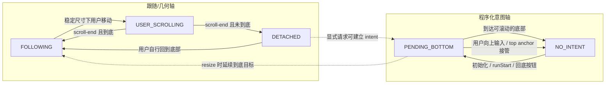
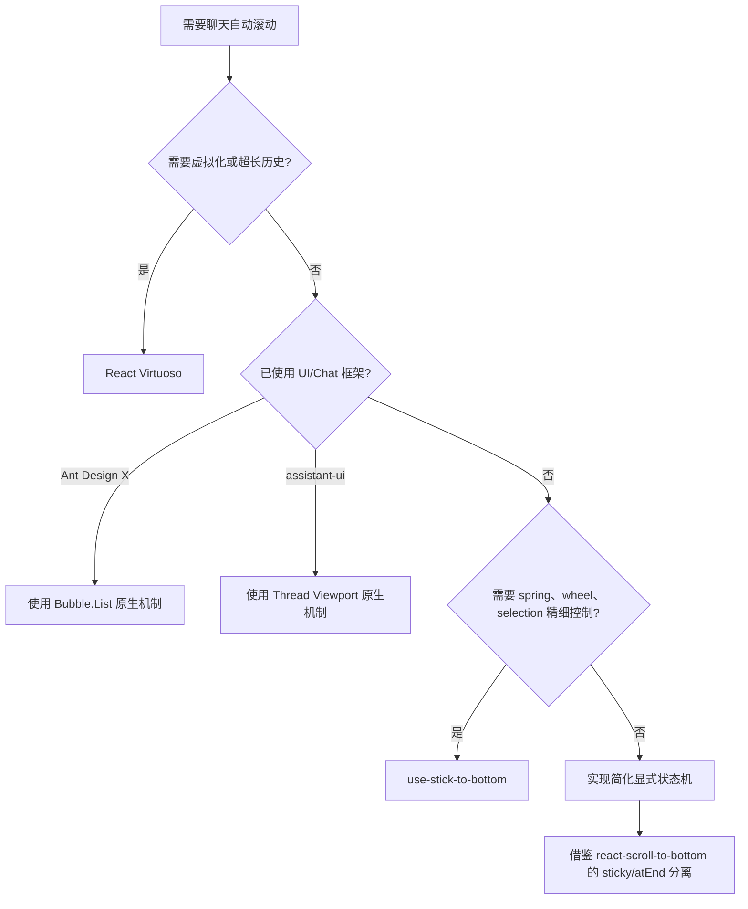

# 第 4 章 两轴状态模型与推荐控制器

> 必修先修：第 1–3 章。进阶 A/B 提供浏览器启发式和虚拟测量扩展，但不阻塞普通列表控制器。

## 本章要解决的问题

前三章已经给出几何锚定、用户逃逸和 pending intent。怎样把它们收敛为一套普通列表控制器，并为浏览器启发式与虚拟测量保留清晰 adapter？

## 本章目标

- 从前三个核心案例中抽取共同状态、事件和不变量。
- 建立“三状态跟随轴 + 独立 pending intent 轴”。
- 能根据列表规模、业务生命周期和测量方式选择实现边界。
- 为第 5 章竞态实验准备一份可观察、可验证的控制器。

## 1. 核心心智模型

“自动滚动”不应该实现成一个监听消息变化的 effect，而应该实现成一份可被用户中断、能区分内容重排、可由显式操作恢复的滚动意图状态机。

核心三章与两条进阶支线分别帮助理解不同约束：

| 学习或工程场景 | 优先借鉴 |
|---|---|
| 已使用 Ant Design X、消息规模普通 | `Bubble.List autoScroll` |
| 完整 AI Chat 生命周期、需要 top anchor | assistant-ui |
| 自定义聊天 UI、需要通用 sticky hook | use-stick-to-bottom |
| 超长历史、动态高度、双向加载 | React Virtuoso |
| 学习浏览器 synthetic scroll 与 sticky 语义 | react-scroll-to-bottom |

## 2. 文档索引

- 核心主线：
  - [`@ant-design/x`](./01-ant-design-x.md)：反向布局、sentinel、Safari 视窗锁。
  - [`use-stick-to-bottom`](./02-use-stick-to-bottom.md)：escape lock、近底恢复、spring 动画。
  - [`@assistant-ui/react`](./03-assistant-ui.md)：pending intent、稳定高度判定、业务事件仲裁。
- 进阶支线：
  - [`react-scroll-to-bottom`](./advanced-a-react-scroll-to-bottom.md)：sticky/atEnd 分离、synthetic scroll 启发式。
  - [`react-virtuoso`](./advanced-b-react-virtuoso.md)：虚拟测量、离底原因、`followOutput`。

## 3. 项目术语与课程规范术语

| 项目术语 | 课程规范术语 | 含义 |
|---|---|---|
| sticky / locked / `isAtBottom`（部分项目混用） | `FOLLOWING` | 系统承诺未来内容增长时继续到底部 |
| wheel/scroll 活跃、动画被用户接管 | `USER_SCROLLING` | 用户输入正在发生，暂不做最终归类 |
| escaped / not sticky / scrolling upwards | `DETACHED` | 用户已离底，内容增长保持阅读位置 |
| near-bottom / 回到底部 | `FOLLOWING` 的恢复条件 | 不是第四个长期状态 |
| programmatic behavior/ref/animation target | `PENDING_BOTTOM` | 与跟随状态正交的命令意图 |

后续章节和答案统一使用右侧术语；左侧只用于解释上游源码。

> 第一次学习普通列表时，可先跳过第 4–6 节的跨项目矩阵，直接进入第 7 节两轴状态模型；完成进阶 A/B 后再回来补比较。

## 4. 五种实现的核心差异（进阶支线未读可跳过）


| 维度 | Ant Design X | assistant-ui | use-stick-to-bottom | React Virtuoso | react-scroll-to-bottom |
|---|---|---|---|---|---|
| 布局基础 | `column-reverse` | 普通正向 | 普通正向 | 虚拟列表 | 普通正向 |
| 跟随状态 | 内部几何效果 | `isAtBottom` + pending intent | `isAtBottom` + escape | `isAtBottom` + reason | `sticky` + `atEnd` |
| 用户取消 | sentinel 离底，保护视窗 | 高度稳定下向上滚；pointerdown 仅清 pending | 向上 scroll/wheel/选区滚动 | `SCROLLING_UPWARDS` | 尺寸稳定且不在末端 |
| 恢复 | 回到底部 sentinel 可见 | 回到底部或显式事件 | 进入 70px 近底区/显式 API | 回到底部/函数式策略 | 回末端/scrollToEnd |
| 内容变化 | ResizeObserver | ResizeObserver | ResizeObserver | 测量 system + listRefresh | scroll + 尺寸快照 + interval |
| 程序化意图 | `isScrollToBottom` | behavior ref | 动画目标与 ignore 标记 | `scrollingInProgress` | `animateTo='100%'` |
| Safari/反向滚动分支 | 专门的反向视窗补偿 | 无专门分支 | 不使用反向 flex | 由虚拟列表滚动层处理 | 无专门反向分支 |
| 同一 item 持续变高 | 反向锚定 + ResizeObserver | ResizeObserver + instant | ResizeObserver + spring | 短时 size-increase trap | 尺寸快照 + interval 修复 |
| 公开跟随状态 | 无 | 有 | 有 | 有 | 有 |
| 虚拟化 | 无 | 无 | 无 | 原生 | 无 |

## 5. 最关键的设计分歧

### 5.1 自然布局锚定还是显式 scroll

Ant Design X 使用 `column-reverse`，依赖布局自然保持底部。优点是 streaming 时少写 DOM；代价是负 `scrollTop`、坐标换算和 Safari 差异。

其他四个方案使用普通坐标，通过状态判断决定何时滚动。API 语义更直观，但必须精确处理 resize 和程序化滚动产生的 scroll event。

### 5.2 “在底部”与“承诺跟随”是否分离

这是最重要的建模问题：

```text
isAtBottom：当前几何事实
isFollowing：未来内容增长时是否继续到底部
pendingIntent：是否有尚未完成的程序化滚动
```

三个概念不能用同一个 boolean 表达。

- assistant-ui 明确保留 pending intent。
- use-stick-to-bottom 明确保留 escape 状态。
- react-scroll-to-bottom 明确区分 sticky 和 atEnd。
- Virtuoso 用 isAtBottom、scrollingInProgress 和 reason 组合表达。
- Ant Design X 的 public `autoScroll` 更接近布局配置，不是运行时 following。

### 5.3 如何判断用户真的在上滚

可组合的证据层次如下；后几项不是严格线性排名，而是针对不同误判来源增加信号：

1. 只监听 `scroll`：容易误判。
2. 比较 scrollTop 方向：仍会被内容变化影响。
3. 方向 + `scrollHeight/clientHeight` 是否稳定：assistant-ui 和旧库的关键策略。
4. 增加输入或上下文信号：assistant-ui 使用 `pointerdown`；use-stick-to-bottom 使用 `wheel`，并在 scroll 分类时检查文本选区。
5. 记录离底原因：Virtuoso 用尺寸和方向变化产生 reason，方便补偿与诊断。

没有一种浏览器 API 能直接告诉你“这次 scroll 一定由用户触发”，因此生产实现必须组合证据。

## 6. 基于源码证据的能力矩阵

每个单元格只描述源码中可定位的机制；“应用层”表示包本身不提供该能力，并不意味着实现存在缺陷。

| 能力 | AntD X | assistant-ui | use-stick-to-bottom | Virtuoso | react-scroll-to-bottom |
|---|---|---|---|---|---|
| 用户离底后停止自然跟随 | sentinel + 反向视窗锁；显式到底意图是例外 | 稳定高度向上滚动 | 向上 scroll/wheel + escape | `SCROLLING_UPWARDS` + `followOutput` | 尺寸稳定且不在末端时取消 sticky |
| pending 程序化意图 | `isScrollToBottom`，50ms 静默后清除 | 独立 behavior ref | animation 元数据 + `isAtBottom` | `scrollingInProgress` 参与 follow 决策 | `animateTo`，末端使用 `'100%'` |
| 输入侧辅助信号 | 无专门 pointer/wheel 分支 | `pointerdown` 清 pending | `wheel` + document 鼠标状态 + selection | 无专门 pointer/wheel 分支 | 主要依赖 scroll 与尺寸快照 |
| 内容 resize 分类 | ResizeObserver + sentinel | ResizeObserver + 高度快照 | ResizeObserver epoch 标记 | reason + listRefresh + size trap | offset/scrollHeight 快照 + interval |
| 对外到底/跟随状态 | 应用层补充 | store 中公开 `isAtBottom` | 公开近底语义的 `isAtBottom` 与 escape | `atBottomStateChange` | Context hooks 公开 sticky/atEnd |
| 超长列表窗口化 | 应用层补充 | 应用层补充 | 应用层补充 | 原生能力 | 应用层补充 |

## 7. 推荐的两轴状态模型

若自研实现，不要把程序化滚动做成第四个互斥状态。更稳妥的是“三状态跟随轴 + 独立 pending intent 轴”；几何状态和命令意图可以同时存在。



### 两个轴的含义

| 状态/意图 | 未来内容增长 | UI |
|---|---|---|
| `FOLLOWING` | 没有 pending 时即时跟随底部 | 通常隐藏回底按钮 |
| `USER_SCROLLING` | 不抢滚动条，等待 scroll-end 分类 | 暂不做强制动作 |
| `DETACHED` | 保持阅读位置 | 显示回底/新消息提示 |
| `PENDING_BOTTOM` | 无论当前几何是否到底，都延续显式目标 | 可显示滚动进行中状态 |

## 8. 推荐的核心数据模型

```ts
type FollowMode =
  | 'FOLLOWING'
  | 'USER_SCROLLING'
  | 'DETACHED';

type DetachReason =
  | 'USER_SCROLL_UP'
  | 'POINTER_TAKEOVER'
  | 'TEXT_SELECTION'
  | 'NOT_SHOWING_LAST_ITEM';

type ScrollController = {
  followMode: FollowMode;
  detachReason: DetachReason | null;
  isAtBottom: boolean;
  // pending intent 与 followMode 正交；不能编码成互斥状态。
  pendingBehavior: ScrollBehavior | null;
  lastScrollTop: number;
  lastScrollHeight: number;
  lastClientHeight: number;
  contentResizeDelta: number;
  scrollEndTimer: ReturnType<typeof setTimeout> | null;
};
```

为什么保留 reason：调试“列表为什么停止跟随”时，单一 false 几乎没有诊断价值。

## 9. 带中文注释的推荐实现骨架

这是综合五个包优点的非虚拟列表教学版骨架。

```ts
const BOTTOM_EPSILON = 4;

function distanceToBottom(el: HTMLElement) {
  return Math.max(0, el.scrollHeight - el.scrollTop - el.clientHeight);
}

function classifyScroll(el: HTMLElement, model: ScrollController) {
  const atBottom =
    el.scrollHeight <= el.clientHeight ||
    distanceToBottom(el) <= BOTTOM_EPSILON;

  const contentHeightStable = el.scrollHeight === model.lastScrollHeight;
  const viewportHeightStable = el.clientHeight === model.lastClientHeight;
  const movedUp = el.scrollTop < model.lastScrollTop;

  if (atBottom) {
    // 用户回到底部，重新允许未来内容跟随。
    model.followMode = 'FOLLOWING';
    model.detachReason = null;

    // 真正出现可滚空间后，才能认为程序化意图已经完成。
    if (el.scrollHeight > el.clientHeight + BOTTOM_EPSILON) {
      model.pendingBehavior = null;
    }
  } else if (movedUp && contentHeightStable && viewportHeightStable) {
    // 尺寸稳定 + 向上移动，才有足够证据认为是用户接管。
    model.followMode = 'USER_SCROLLING';
    model.detachReason = 'USER_SCROLL_UP';
    model.pendingBehavior = null;
    scheduleScrollEnd(model);
  } else if (model.followMode === 'USER_SCROLLING') {
    // 惯性滚动或拖动会连续产生事件；每次都刷新 scroll-end 窗口。
    scheduleScrollEnd(model);
  }

  model.isAtBottom = atBottom;
  model.lastScrollTop = el.scrollTop;
  model.lastScrollHeight = el.scrollHeight;
  model.lastClientHeight = el.clientHeight;
}

function scheduleScrollEnd(model: ScrollController) {
  if (model.scrollEndTimer) clearTimeout(model.scrollEndTimer);

  model.scrollEndTimer = setTimeout(() => {
    model.scrollEndTimer = null;
    model.followMode = model.isAtBottom ? 'FOLLOWING' : 'DETACHED';
  }, 80);
}

function onPointerDown(model: ScrollController) {
  // pointerdown 比 scroll 更早表达用户可能接管。
  // 它先撤销尚未完成的程序化意图，但不凭一次点击伪造“已经离底”。
  model.pendingBehavior = null;

  if (!model.isAtBottom) {
    // 只有几何已经离底时才进入用户滚动轴；仍在底部则继续 FOLLOWING。
    model.followMode = 'USER_SCROLLING';
    model.detachReason = 'POINTER_TAKEOVER';
    scheduleScrollEnd(model);
  }
}

function onWheel(event: WheelEvent, model: ScrollController) {
  if (event.deltaY >= 0) return;

  // 向上的 wheel 是比 scroll event 更早的用户接管证据。
  model.pendingBehavior = null;
  model.followMode = 'USER_SCROLLING';
  model.detachReason = 'USER_SCROLL_UP';
  scheduleScrollEnd(model);
}

function onContentResize(el: HTMLElement, model: ScrollController) {
  const delta = el.scrollHeight - model.lastScrollHeight;
  model.contentResizeDelta = delta;

  if (model.pendingBehavior) {
    const behavior = model.pendingBehavior;
    requestAnimationFrame(() => {
      el.scrollTo({
        top: el.scrollHeight,
        behavior,
      });
    });
  } else if (model.followMode === 'FOLLOWING') {
    // streaming 目标持续移动时用 instant，避免不断重启 smooth 动画。
    requestAnimationFrame(() => {
      el.scrollTo({ top: el.scrollHeight, behavior: 'instant' });
    });
  } else {
    // USER_SCROLLING / DETACHED 时不滚到底部。
    // 若浏览器自身 scroll anchoring 不可靠，可保存可见元素 anchor 并补偿 delta。
    preserveReadingAnchorIfRequired(el, delta);
  }

  model.lastScrollHeight = el.scrollHeight;
}

function requestScrollToBottom(
  el: HTMLElement,
  model: ScrollController,
  behavior: ScrollBehavior,
) {
  model.pendingBehavior = behavior;
  el.scrollTo({ top: el.scrollHeight, behavior });
}
```

生产实现还需处理：

- effect cleanup 与 stale closure。
- `ResizeObserver` 回调合并。
- iOS overscroll 的负值/超范围值。
- window scroll 与嵌套滚动容器。
- 虚拟列表测量完成事件。
- prefers-reduced-motion。
- focus/selection 引发的 `scrollIntoView`。

## 10. 决策树



## 11. 测试清单

无论选哪个方案，至少验证：

### 基础行为

- 初始消息是否按产品策略定位。
- 用户向上滚动后 streaming 不拉回。
- 用户回到底部后恢复跟随。
- 回底按钮重新建立程序化意图。

### 竞态

- smooth 滚动中新增 token。
- scroll 与 ResizeObserver 同一帧发生。
- 图片、代码块、折叠工具结果异步变高。
- viewport 因软键盘/输入框变矮。
- 会话切换与历史数据异步加载。
- 内容尚未溢出时建立 pending，随后内容增长到可滚动。
- pending smooth 过程中 pointerdown/向上 wheel 取消意图。
- 连续 scroll 停止后，从 `USER_SCROLLING` 落到正确的最终状态。

### 用户输入

- wheel、触摸惯性、拖动滚动条。
- PageUp/Home/键盘滚动。
- 文本选择跨越 viewport 边缘。
- 点击内部可展开内容。

### 浏览器

- Chromium。
- Firefox。
- WebKit/Safari。
- iOS Safari 真机或 WebKit 自动化。

## 12. 将模型落到不同场景

### 已使用 Ant Design X

保留 `Bubble.List autoScroll`，不要添加 `items` effect 强制回底；自行增加 `isAtBottom` 才能驱动 unread UI。

### 新建普通 AI Chat

若希望开箱即用且需要完整聊天生命周期，选择 assistant-ui；若已有自己的 UI 和数据层，选择 use-stick-to-bottom。

### 超长会话

选择 React Virtuoso，让跟随逻辑与虚拟测量协同，不要在虚拟列表外层再写独立 scrollHeight hook。

### 自研

采用本文“两轴模型”，并至少吸收三条规则：

1. 尺寸稳定后再把向上移动认定为用户滚动。
2. `isAtBottom`、`isFollowing`、pending intent 分开。
3. 用户输入优先于任何自动滚动。

## 本章练习

基于第 8 节骨架实现一个最小控制器，并把 DOM 读写隔离在 `GeometryAdapter` 中。控制器至少接收以下事件：

- `CONTENT_RESIZED`
- `USER_SCROLL_STARTED`
- `USER_SCROLL_ENDED`
- `BOTTOM_REQUESTED`

必做只实现普通列表 adapter，并用事件 trace 验证状态机与 DOM 读写分离。

### 进阶 B 扩展练习

完成 React Virtuoso 支线后，再写一个不真正渲染 DOM 的虚拟列表 adapter，增加 `MEASUREMENT_STABLE` 事件，并验证控制器语义不随测量来源改变。

### 练习验收

- `isAtBottom`、following 状态和 pending intent 可被独立观察。
- 任意时刻只有测量层能读取/写入 DOM 几何，状态机保持纯净。
- 内容 resize、用户上滚和显式回底的所有排列都满足“用户输入优先”。
- 进阶 B：虚拟列表 adapter 会等待 `MEASUREMENT_STABLE`，普通列表 adapter 不伪造该约束。

## 检查理解

1. 为什么 pending intent 不适合作为第四个互斥跟随状态？
2. 哪些机制属于状态机，哪些必须留在浏览器或虚拟测量 adapter？
3. 如果产品增加 unread badge，应该从哪几个状态派生？

## 本章小结

核心三章与两条进阶支线最终收敛为三层：几何/测量层提供事实，跟随状态机保存用户承诺，pending intent 保存尚未完成的命令。下一章不再继续增加抽象，而是用事件排列和真实浏览器把这套模型推到失败边界。

[上一章：assistant-ui](03-assistant-ui.md) · [课程目录](00-learning-guide.md) · [下一章：竞态测试实验](05-scroll-race-testing-lab.md)
