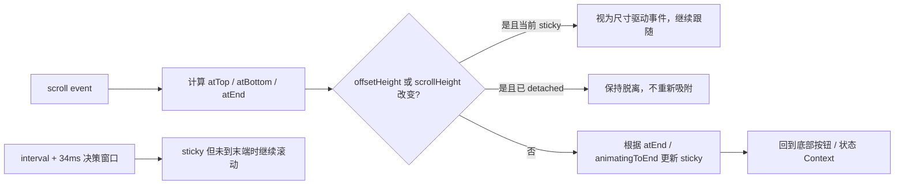
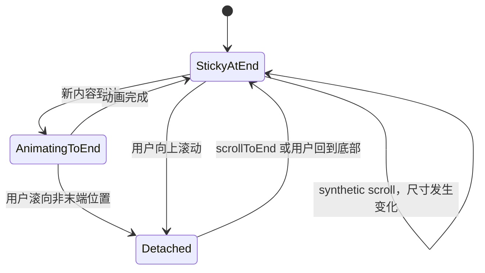

# 进阶 A react-scroll-to-bottom：识别 synthetic scroll

> 仓库：[`compulim/react-scroll-to-bottom`](https://github.com/compulim/react-scroll-to-bottom)
>
> 源码快照：[`53844f5`](https://github.com/compulim/react-scroll-to-bottom/commit/53844f5bcad22763c75a7903212b26716fd4d333)
>
## 本章要解决的问题

浏览器只派发 `scroll`，却不会可靠告诉我们它来自用户手势、程序动画还是内容尺寸变化。缺少直接来源信息时，怎样用时间、几何快照和 sticky 状态做可解释的 best-effort 分类？

## 本章目标

- 理解 `sticky`、`atEnd` 与 `animatingToEnd` 不能合并的原因。
- 能解释尺寸快照、时间窗口和周期检查分别修复哪类不可观测事件。
- 学会把启发式当作可测试的假设，而不是浏览器保证。

## 1. 核心心智模型

这个较早的库有一个仍然很重要的设计：`sticky` 不等于 `atEnd`。

- `atEnd`：当前几何位置已经到达末端。
- `sticky`：系统仍承诺跟随末端。
- `animatingToEnd`：正在向末端动画，虽然暂时还没到，但仍应保持 sticky。

源码明确承认无法只凭 `scroll` 事件可靠区分用户手势、程序滚动和 Chrome 因尺寸变化产生的 synthetic scroll，因此使用尺寸快照、时间戳和延迟决策做 best-effort 分类。

## 2. 核心结构



源码入口：

- [`Composer.js`](https://github.com/compulim/react-scroll-to-bottom/blob/53844f5bcad22763c75a7903212b26716fd4d333/packages/component/src/ScrollToBottom/Composer.js)
- [README 状态与 API](https://github.com/compulim/react-scroll-to-bottom/blob/53844f5bcad22763c75a7903212b26716fd4d333/README.md#L226-L244)
- [`use-sticky.html` 浏览器测试](https://github.com/compulim/react-scroll-to-bottom/blob/53844f5bcad22763c75a7903212b26716fd4d333/__tests__/use-sticky.html)

## 3. 带注释的核心代码

以下为基于源码行为改写的教学版代码。

### 3.1 几何状态

```ts
const NEAR_END_THRESHOLD = 1;

function computeViewState(viewport: HTMLElement, mode: 'top' | 'bottom') {
  const atBottom =
    viewport.scrollHeight - viewport.scrollTop - viewport.offsetHeight <
    NEAR_END_THRESHOLD;

  const atTop = viewport.scrollTop < NEAR_END_THRESHOLD;

  return {
    atBottom,
    atTop,
    // 同一套组件可工作在“贴底”或“贴顶”模式。
    atEnd: mode === 'top' ? atTop : atBottom,
    atStart: mode === 'top' ? atBottom : atTop,
  };
}
```

对应源码：[`Composer.js#L17-L45`](https://github.com/compulim/react-scroll-to-bottom/blob/53844f5bcad22763c75a7903212b26716fd4d333/packages/component/src/ScrollToBottom/Composer.js#L17-L45)。

### 3.2 识别 synthetic scroll

```ts
function handleScroll(viewport: HTMLElement, eventTime: number) {
  if (eventTime <= ignoreScrollBefore) {
    // 内部动画刚结束后，debounce 的旧 scroll 可能迟到。
    // 这些事件不能拿来判断用户是否取消 sticky。
    return;
  }

  const view = computeViewState(viewport, mode);

  const viewportSizeChanged = viewport.offsetHeight !== previousOffsetHeight;
  const contentSizeChanged = viewport.scrollHeight !== previousScrollHeight;

  rememberSizes(viewport);

  if (!viewportSizeChanged && !contentSizeChanged) {
    // 尺寸完全稳定，scroll 更可能来自用户或内部动画。
    // 正在向末端动画时即使还没到，也继续保持 sticky。
    const nextSticky =
      (isAnimating && animationTargetIsEnd()) || view.atEnd;

    setSticky(nextSticky);
  } else if (sticky) {
    // Chrome 可能在 resize 或插入元素时合成 scroll。
    // 不把它误判为用户上滚，而是继续完成 sticky 行为。
    scrollToStickyTarget();
  }
}
```

对应源码：[`Composer.js#L309-L410`](https://github.com/compulim/react-scroll-to-bottom/blob/53844f5bcad22763c75a7903212b26716fd4d333/packages/component/src/ScrollToBottom/Composer.js#L309-L410)。

### 3.3 为什么需要周期检查

Firefox 拖动滚动条时可能先更新 `scrollTop`，约几十毫秒后才发 scroll event。若 interval 恰好夹在两者之间，组件会误以为 sticky 状态自然偏离并立即拉回。

```ts
const MIN_INTERVAL = 17; // 约一帧
const DECISION_DELAY = 34; // 约两帧

setInterval(() => {
  if (!sticky) return;

  if (isAtEnd(viewport)) {
    stickyButNotAtEndSince = null;
    return;
  }

  stickyButNotAtEndSince ??= Date.now();

  if (
    Date.now() - stickyButNotAtEndSince > DECISION_DELAY &&
    !isAnimating
  ) {
    // 给真正的 scroll event 两帧时间到达。
    // 若仍是 sticky 且没有动画，再执行修复。
    scrollToStickyTarget();
    stickyButNotAtEndSince = null;
  }
}, Math.max(configuredInterval, MIN_INTERVAL));
```

对应源码：[`Composer.js#L430-L495`](https://github.com/compulim/react-scroll-to-bottom/blob/53844f5bcad22763c75a7903212b26716fd4d333/packages/component/src/ScrollToBottom/Composer.js#L430-L495)。

### 3.4 特殊的 `'100%'` 目标

源码不用固定数字表示持续滚到底部，而使用特殊目标 `'100%'`：

```ts
function scrollToStickyTarget() {
  // maxValue 是“从当前 scrollTop 到末端还剩多少”，不是末端绝对坐标。
  const remainingToEnd = Math.max(
    0,
    viewport.scrollHeight - viewport.offsetHeight - viewport.scrollTop,
  );
  const minimumDelta = Math.max(
    0,
    animationStartScrollTop - viewport.scrollTop,
  );

  const rawDelta = scroller({
    maxValue: remainingToEnd,
    minValue: minimumDelta,
    scrollTop: viewport.scrollTop,
    scrollHeight: viewport.scrollHeight,
    offsetHeight: viewport.offsetHeight,
  });

  // 源码把调用方结果夹在 0 与 remainingToEnd 之间。
  const nextDelta = Math.max(0, Math.min(remainingToEnd, rawDelta));

  if (nextDelta === remainingToEnd) {
    // 不保存当前数字终点，因为内容仍可能继续增长。
    animateTo = '100%';
  } else {
    animateTo = viewport.scrollTop + nextDelta;
  }
}
```

这样 streaming/快速插入内容时，动画目标始终代表“最新末端”，不是某个已经过时的像素值。

## 4. `sticky` 与 `atEnd` 的状态关系



## 5. 用户取消行为

当以下条件成立时，sticky 会变为 false：

```text
尺寸没有变化
AND 当前不是正在动画到末端
AND 当前几何位置不在末端
```

真实浏览器测试通过鼠标滚轮向上移动后断言 `useSticky()` 变为 false。

证据：[`use-sticky.html`](https://github.com/compulim/react-scroll-to-bottom/blob/53844f5bcad22763c75a7903212b26716fd4d333/__tests__/use-sticky.html)。

## 6. 可定制 `scroller`

调用方可控制内容增长时移动多少：

```ts
scroller({ maxValue, minValue, offsetHeight, scrollHeight, scrollTop }) => number
```

- 返回 `Infinity`：默认一直滚到底部。
- 返回 `0`：停止这次内容增长滚动。
- 返回小于 `maxValue`：动画结束后失去 sticky。

官方说明：[Programmatically pausing scroll](https://github.com/compulim/react-scroll-to-bottom/blob/53844f5bcad22763c75a7903212b26716fd4d333/README.md#L404-L420)。

## 7. 真实浏览器竞态测试的价值

仓库使用 HTML 测试页面而非只依赖 JSDOM，覆盖：

- 鼠标滚轮导致 sticky 解除。
- `scrollTo`/`scrollIntoView` 与 interval 的竞态。
- 高负载下滚到顶部后不被错误拉回。

证据：[`race-condition-scroll-into-view.html`](https://github.com/compulim/react-scroll-to-bottom/blob/53844f5bcad22763c75a7903212b26716fd4d333/__tests__/race-condition-scroll-into-view.html)。

这是该项目即使架构较老仍值得研究的主要原因。

## 8. 优点与局限

优点：

- `sticky`、`atEnd`、`animatingToEnd` 概念区分准确。
- 坦率处理浏览器事件来源不可观测的问题。
- 有真实浏览器竞态测试。
- 支持 top/bottom 两种模式和可定制滚动距离。

局限：

- `Composer.js` 较单体，理解和维护成本高。
- 持续 interval 会带来周期性检查开销；实际影响需按 `checkInterval`、实例数量和设备测量。
- 时间戳、17ms/34ms 窗口均是启发式。
- 本章快照中的实现与现代 Observer 风格不同，迁移时需要重新验证时间窗口和浏览器行为。
- 不提供虚拟化。

## 9. 适用建议

新项目不一定要直接采用该依赖，但应借鉴两个设计：

1. `following/sticky` 必须和 `atBottom/atEnd` 分开。
2. 不能看到 `scroll` 就认定用户滚动；至少要对比内容与 viewport 尺寸。

现代实现可用 `ResizeObserver + pending intent + pointer/wheel signal` 取代大部分 polling，同时保留上述语义。

## 本章练习

构造三个会产生 `scroll` 事件但来源不同的场景：用户滚轮上滚、`scrollToEnd()` 动画、图片加载导致内容增高。只允许观察 `scrollTop`、`scrollHeight`、`clientHeight`、最近一次程序化命令时间和当前 sticky 状态，写出你的分类器。

然后故意把图片加载安排在程序动画的 17ms、34ms 和 100ms 后，记录误判并说明哪些结果无法仅靠时间窗口彻底消除。

### 练习验收

- 三类事件的判定依据可以逐项说清，而不是依赖事件名称猜测。
- 分类器即使误判，也不会违背“用户输入优先”这一不变量。
- 能指出 polling、Observer 和输入信号各自能观察到什么、观察不到什么。

## 检查理解

1. 为什么 `atEnd=false` 时，`sticky` 仍可能为 true？
2. 尺寸变化为什么能帮助识别 synthetic scroll？
3. 真实浏览器竞态测试比只 mock `scrollTop` 多验证了什么？

## 本章小结

本章的价值不在于照搬旧实现，而在于认识浏览器事件来源不可观测这一事实。可靠系统需要组合几何、命令记录、输入信号与时间边界，并用竞态测试暴露启发式的失败区间。

[核心第 3 章：assistant-ui](03-assistant-ui.md) · [课程目录](00-learning-guide.md) · [把启发式映射到控制器](04-controller-model.md)
