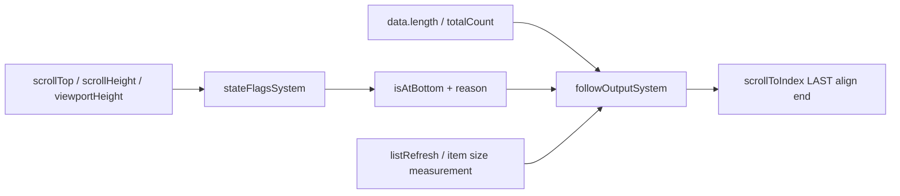
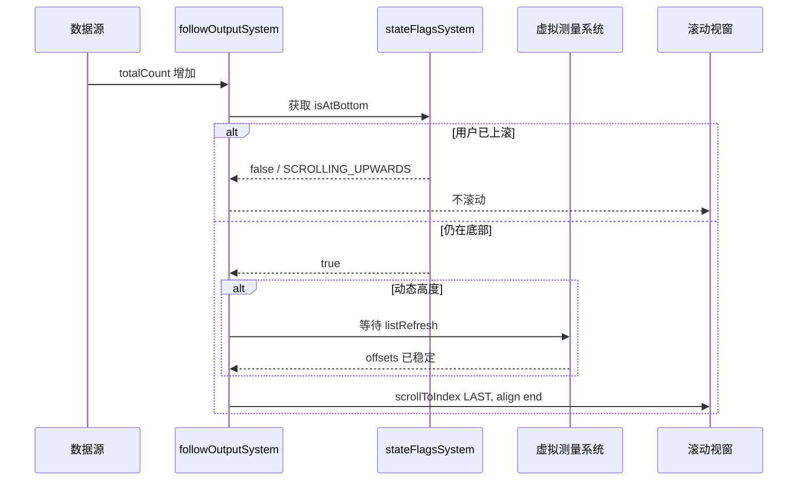

# 进阶 B React Virtuoso：让跟随服从虚拟测量

> 仓库：[`petyosi/react-virtuoso`](https://github.com/petyosi/react-virtuoso)
>
> 源码快照：[`b7feb0c`](https://github.com/petyosi/react-virtuoso/commit/b7feb0c2415044a99c75c7c8d03f5f7c14342038)
>
## 本章要解决的问题

虚拟列表只渲染窗口内的一部分 DOM，最后一项的位置还可能等待动态高度测量。此时“滚到底部”为何不能再依赖 `scrollHeight`，跟随命令又应等待哪些内部状态？

## 本章目标

- 理解 `stateFlagsSystem` 与 `followOutputSystem` 的职责边界。
- 能解释 `listRefresh`、离底原因和 `scrollToIndex(LAST)` 的协作顺序。
- 判断何时应该把自动跟随交给虚拟列表内部，而不是外接普通 scroll hook。

## 1. 核心心智模型

Virtuoso 把自动跟随拆成两个系统：

1. `stateFlagsSystem`：计算是否到底，并记录“为什么离底”。
2. `followOutputSystem`：数据数量变化后，根据到底状态决定是否滚到最后一项。

这比普通聊天列表多了一层“虚拟测量是否刷新完成”的约束。动态高度列表必须等 `listRefresh`，否则最后一项的真实位置尚未稳定。

## 2. 系统结构



源码入口：

- [`stateFlagsSystem.ts`](https://github.com/petyosi/react-virtuoso/blob/b7feb0c2415044a99c75c7c8d03f5f7c14342038/packages/react-virtuoso/src/stateFlagsSystem.ts)
- [`followOutputSystem.ts`](https://github.com/petyosi/react-virtuoso/blob/b7feb0c2415044a99c75c7c8d03f5f7c14342038/packages/react-virtuoso/src/followOutputSystem.ts)
- [`Virtuoso` 接口](https://github.com/petyosi/react-virtuoso/blob/b7feb0c2415044a99c75c7c8d03f5f7c14342038/packages/react-virtuoso/src/component-interfaces/Virtuoso.ts)

## 3. “离开底部”的原因模型

Virtuoso 不只保存 boolean，还保存原因：

| 原因 | 含义 | 是否应恢复到底部 |
|---|---|---|
| `SCROLLING_UPWARDS` | 用户/视窗向上移动 | 否 |
| `SIZE_INCREASED` | 内容高度增加导致离底 | 可补偿 |
| `VIEWPORT_HEIGHT_DECREASING` | viewport 变矮 | 可补偿 |
| `NOT_FULLY_SCROLLED_TO_LAST_ITEM_BOTTOM` | 最后一项未完整到底 | 通常否 |
| `NOT_SHOWING_LAST_ITEM` | 初始/fallback 状态：尚未显示最后一项 | 否 |

证据：[`stateFlagsSystem.ts#L10-L44`](https://github.com/petyosi/react-virtuoso/blob/b7feb0c2415044a99c75c7c8d03f5f7c14342038/packages/react-virtuoso/src/stateFlagsSystem.ts#L10-L44)。

## 4. 带注释的核心代码

以下为保留关键判定顺序的教学版简化逻辑。

### 4.1 到底检测与原因分类

```ts
function classifyBottomState(next: Geometry, previous: BottomState): BottomState {
  const threshold = 4;
  const atBottom =
    next.scrollTop + next.viewportHeight - next.scrollHeight > -threshold;

  if (atBottom) {
    return {
      atBottom: true,
      reason:
        next.scrollTop > previous.geometry.scrollTop
          ? 'SCROLLED_DOWN'
          : 'SIZE_DECREASED',
      geometry: next,
    };
  }

  let reason: NotAtBottomReason;

  if (next.scrollHeight > previous.geometry.scrollHeight) {
    // 内容变高导致原本底部位置失效，不等价于用户取消。
    reason = 'SIZE_INCREASED';
  } else if (next.viewportHeight < previous.geometry.viewportHeight) {
    // 输入框、键盘或布局变化压缩 viewport。
    reason = 'VIEWPORT_HEIGHT_DECREASING';
  } else if (next.scrollTop < previous.geometry.scrollTop) {
    // 只有前两种尺寸原因都不成立时，才归类为向上滚动。
    reason = 'SCROLLING_UPWARDS';
  } else {
    reason = 'NOT_FULLY_SCROLLED_TO_LAST_ITEM_BOTTOM';
  }

  return { atBottom: false, reason, geometry: next };
}
```

判定顺序很重要：先检查内容/viewport 尺寸变化，再判断 scrollTop 方向，避免把布局变化误认为用户上滚。

对应源码：[`stateFlagsSystem.ts#L87-L133`](https://github.com/petyosi/react-virtuoso/blob/b7feb0c2415044a99c75c7c8d03f5f7c14342038/packages/react-virtuoso/src/stateFlagsSystem.ts#L87-L133)。

### 4.2 `followOutput` 行为归一化

```ts
type FollowDecision = false | 'auto' | 'smooth';

function decideFollow(
  option: boolean | 'auto' | 'smooth' | ((atBottom: boolean) => FollowDecision),
  atBottom: boolean,
): FollowDecision {
  if (typeof option === 'function') {
    return normalize(option(atBottom));
  }

  // 标量配置默认只在已经位于底部时生效。
  // 用户上滚导致 atBottom=false，新增数据不会拉回。
  return atBottom ? normalize(option) : false;
}
```

对应源码：[`followOutputSystem.ts#L13-L26`](https://github.com/petyosi/react-virtuoso/blob/b7feb0c2415044a99c75c7c8d03f5f7c14342038/packages/react-virtuoso/src/followOutputSystem.ts#L13-L26)。

### 4.3 新数据到达后的滚动

```ts
function onTotalCountChanged(totalCount: number) {
  const canEvaluate = didMount && initialItemScrollCompleted;
  if (!canEvaluate) return;

  // 已有 scrollToIndex 仍在进行时，继续把它视为 follow 流程的一部分，
  // 不因动画的中间位置暂时离底而中断。
  const behavior = decideFollow(
    followOutput,
    isAtBottom || scrollingInProgress,
  );

  if (behavior === false) return;

  if (fixedItemSize !== undefined) {
    requestAnimationFrame(() => scrollLastItemToEnd(behavior));
  } else {
    // 动态高度列表要等测量系统发布 listRefresh。
    // 否则最后一项的 offset/size 可能还是旧值。
    afterNextListRefresh(() => scrollLastItemToEnd(behavior));
  }
}
```

对应源码：[`followOutputSystem.ts#L44-L91`](https://github.com/petyosi/react-virtuoso/blob/b7feb0c2415044a99c75c7c8d03f5f7c14342038/packages/react-virtuoso/src/followOutputSystem.ts#L44-L91)。

### 4.4 已有 item 异步变高

```ts
function temporarilyWatchForSizeIncrease(shouldFollow: boolean) {
  const cancel = once(nextBottomState => {
    if (
      shouldFollow &&
      !nextBottomState.atBottom &&
      nextBottomState.reason === 'SIZE_INCREASED' &&
      noPendingListRefreshScroll()
    ) {
      scrollLastItemToEnd('auto');
    }
  });

  // 只捕捉紧随其后的尺寸变化，避免长期监听造成意外回底。
  setTimeout(cancel, 100);
}
```

这个 watcher 不是永久监听器。它只会在 `followOutput !== false`、props 已就绪、初始定位已完成且 totalCount 再次发出相同值时短暂 armed，或者由公开的 `autoscrollToBottom()` 主动 armed；收到下一次 bottom state 或 100ms 后即取消。图片加载、最后一项展开和同一数据长度下的尺寸变化是它希望覆盖的场景。

对应源码：[`followOutputSystem.ts#L93-L130`](https://github.com/petyosi/react-virtuoso/blob/b7feb0c2415044a99c75c7c8d03f5f7c14342038/packages/react-virtuoso/src/followOutputSystem.ts#L93-L130)。

## 5. 状态与时序



## 6. API 使用语义

典型配置：

```tsx
<Virtuoso
  data={messages}
  followOutput="auto"
  atBottomStateChange={setIsAtBottom}
  itemContent={renderMessage}
/>
```

若需要特殊策略，可以传函数：

```tsx
followOutput={(isAtBottom) => (isAtBottom ? 'smooth' : false)}
```

不要无条件返回 `'smooth'`，除非产品明确要求用户上滚后仍被强制拉回。

## 7. 与普通滚动 hook 的本质差异

虚拟列表中“滚到底部”不是简单设置 `scrollTop=scrollHeight`：

- 最后一项可能还没被渲染。
- 动态 item 高度可能尚未测量。
- prepend 历史消息需要保持 anchor。
- DOM `scrollHeight` 只代表当前虚拟容器的实现结果，不是完整数据高度的直接事实。

因此跟随逻辑必须与测量、渲染范围和 `scrollToIndex` 在同一个系统里协调。

## 8. 优点与局限

优点：

- 面向需要窗口化的长列表；具体可承载规模取决于 item 复杂度、测量成本和设备，本文没有给出独立 benchmark。
- 离底原因模型比单一 boolean 更能处理竞态。
- 动态高度测量与 follow 行为原生协作。
- 提供 `atBottomStateChange` 和函数式 `followOutput`。

局限：

- 为几十条消息引入完整虚拟化系统可能过重。
- 持续修改同一个 streaming item 的处理不如专用 spring hook 直观。
- 100ms size-increase 捕获仍是时间窗口。
- 调试需要理解响应式流与多个内部 system。

## 9. 适用场景

优先选择 Virtuoso 的条件：

- 超长聊天历史。
- 动态高度、图片、代码块和工具调用结果较多。
- 需要 prepend 历史消息并保持阅读位置。
- 需要窗口化性能，同时还要“用户上滚后停止跟随”。

若不需要虚拟化，assistant-ui 或 use-stick-to-bottom 的状态模型更容易理解和定制。

## 本章练习

对一条包含 10,000 条动态高度消息的虚拟会话，推演以下顺序：

1. 用户位于底部，新消息被追加。
2. 最后一项先以估算高度进入渲染范围。
3. `listRefresh` 完成真实测量。
4. 同一条消息继续流式增高。
5. 用户向上滚动后，顶部 prepend 20 条历史消息。

分别写出每步的“数据已变化”“渲染范围已变化”“测量已稳定”“允许 follow”的真假值，并解释为何外层 `scrollTop = scrollHeight` 会破坏其中至少两步。

### 练习验收

- follow 命令只在测量和渲染范围允许时执行。
- prepend 历史消息后阅读锚点保持稳定，不被误判成需要回底。
- 能区分“新增 item”和“已有 streaming item 变高”两条处理路径。

## 检查理解

1. 虚拟容器的 `scrollHeight` 为什么不是完整数据高度的直接事实？
2. 离底原因比单一 `isAtBottom` 多提供了什么恢复信息？
3. 为什么不应在 Virtuoso 外再叠加一个独立 sticky hook？

## 本章小结

虚拟化增加了第三类约束：除了用户意图和 DOM 几何，还必须等待测量系统确认位置。自动跟随因此应进入虚拟列表内部，与渲染范围、动态高度和锚点恢复共享同一套状态。

[核心第 3 章：assistant-ui](03-assistant-ui.md) · [课程目录](00-learning-guide.md) · [把测量约束接入控制器](04-controller-model.md)
