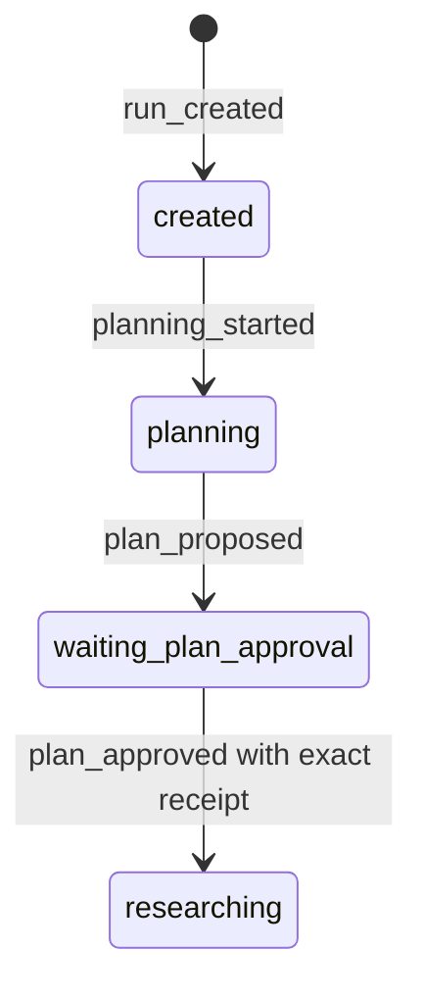

# Issue #3 Versioned Plan Approval Implementation Plan

> **For agentic workers:** REQUIRED SUB-SKILL: Use superpowers:subagent-driven-development (recommended) or superpowers:executing-plans to implement this plan task-by-task. Steps use checkbox (`- [ ]`) syntax for tracking.

**Goal:** Add a durable user-command approval that binds the exact research question, plan artifact, Source Scope, and Run Budget version, then recovers in `researching` without resampling.

**Architecture:** The runtime computes a deterministic `PlanApprovalBinding` from canonical JSON digests when the plan is proposed. A separate `approvePlan` application command accepts only the displayed binding hash, appends one `plan_approved` semantic event containing an `ApprovalReceipt`, and relies on the pure reducer for the transition; repeated approval of the same receipt is idempotent.

**Tech Stack:** Node.js 24+, strict ESM TypeScript, Zod, `better-sqlite3`, Vitest, Node `crypto`, built-in `parseArgs`, Mermaid.

---

### Task 1: Version the approval boundary

**Files:**
- Create: `projects/evidence-research-agent/src/domain/integrity.ts`
- Modify: `projects/evidence-research-agent/src/domain/types.ts`
- Modify: `projects/evidence-research-agent/src/domain/schemas.ts`
- Modify: `projects/evidence-research-agent/src/domain/reducer.ts`
- Modify: `projects/evidence-research-agent/src/application/research-agent-runtime.ts`
- Modify: `projects/evidence-research-agent/src/cli.ts`
- Modify: `projects/evidence-research-agent/tests/runtime/research-agent-runtime.test.ts`
- Modify: `projects/evidence-research-agent/tests/cli/cli.test.ts`

- [x] **Step 1: Write the failing binding test**

Extend the runtime planning test to pass a versioned budget and assert the waiting state exposes exact component hashes plus their aggregate binding:

```ts
const created = await runtime.createRun({
  question: "追加式 Run Journal 如何驱动派生状态投影？",
  sourceScope,
  runBudget: {
    version: "budget-v1",
    maxModelTurns: 8,
    maxToolCalls: 16,
    maxDistinctSources: 6,
    maxSourceBytes: 2_000_000,
    maxWallTimeMs: 120_000,
  },
});

expect(created.state).toMatchObject({
  type: "waiting_plan_approval",
  approvalBinding: {
    budgetVersion: "budget-v1",
    questionHash: expect.stringMatching(/^[a-f0-9]{64}$/),
    planHash: created.state.type === "waiting_plan_approval"
      ? created.state.planArtifact.sha256
      : "unreachable",
    sourceScopeHash: expect.stringMatching(/^[a-f0-9]{64}$/),
    bindingHash: expect.stringMatching(/^[a-f0-9]{64}$/),
  },
});
```

- [x] **Step 2: Run the focused tests and verify RED**

Run: `pnpm exec vitest run tests/runtime/research-agent-runtime.test.ts tests/cli/cli.test.ts`

Expected: FAIL because `CreateRunCommand` has no `runBudget` and the state has no `approvalBinding`.

- [x] **Step 3: Add documented budget and binding types**

Add these shapes with meaningful per-field TSDoc:

```ts
export interface RunBudget {
  readonly version: string;
  readonly maxModelTurns: number;
  readonly maxToolCalls: number;
  readonly maxDistinctSources: number;
  readonly maxSourceBytes: number;
  readonly maxWallTimeMs: number;
}

export interface PlanApprovalBinding {
  readonly questionHash: string;
  readonly planHash: string;
  readonly sourceScopeHash: string;
  readonly budgetVersion: string;
  readonly budgetHash: string;
  readonly bindingHash: string;
}
```

Persist `runBudget` from `run_created`, keep it on `RunProjection`, and attach `approvalBinding` to `plan_proposed` and `WaitingPlanApprovalRunState`.

- [x] **Step 4: Implement deterministic canonical hashing**

Create `integrity.ts` with recursively key-sorted JSON and SHA-256:

```ts
export function hashCanonicalJson(value: unknown): string {
  return createHash("sha256")
    .update(JSON.stringify(sortJsonValue(value)), "utf8")
    .digest("hex");
}

export function createPlanApprovalBinding(input: {
  readonly question: string;
  readonly planHash: string;
  readonly sourceScope: SourceScope;
  readonly runBudget: RunBudget;
}): PlanApprovalBinding {
  const components = {
    questionHash: hashCanonicalJson(input.question),
    planHash: input.planHash,
    sourceScopeHash: hashCanonicalJson(input.sourceScope),
    budgetVersion: input.runBudget.version,
    budgetHash: hashCanonicalJson(input.runBudget),
  };
  return { ...components, bindingHash: hashCanonicalJson(components) };
}
```

Do not hash secrets or provider configuration. Validate all hashes and positive budget limits with Zod.

- [x] **Step 5: Update the CLI planning defaults**

Pass an explicit default `budget-v1` from `runCli`; no model-controlled field may choose or raise these limits.

- [x] **Step 6: Run focused tests, field-doc audit, and typecheck**

Run: `pnpm exec vitest run tests/runtime/research-agent-runtime.test.ts tests/cli/cli.test.ts tests/documentation/field-docs.test.ts`

Run: `pnpm typecheck`

Expected: PASS.

- [x] **Step 7: Commit Task 1**

```bash
git add projects/evidence-research-agent/src projects/evidence-research-agent/tests
git commit -m "feat: version plan approval boundaries"
```

### Task 2: Persist an idempotent Approval Receipt

**Files:**
- Modify: `projects/evidence-research-agent/src/domain/types.ts`
- Modify: `projects/evidence-research-agent/src/domain/schemas.ts`
- Modify: `projects/evidence-research-agent/src/domain/reducer.ts`
- Modify: `projects/evidence-research-agent/src/application/research-agent-runtime.ts`
- Modify: `projects/evidence-research-agent/src/index.ts`
- Create: `projects/evidence-research-agent/tests/runtime/plan-approval.test.ts`

- [x] **Step 1: Write failing public-seam approval tests**

Use real temporary SQLite and Artifact Store, a controlled clock/ID generator, and `ScriptedModel([])` after restart:

```ts
const waiting = await createWaitingRun(runtimeHome);
runtime.close();

const restarted = ResearchAgentRuntime.open({
  runtimeHome,
  model: new ScriptedModel([]),
  clock: fixedClock,
  ids: approvalIds,
});
const approved = await restarted.approvePlan({
  runId: waiting.runId,
  bindingHash: waiting.state.approvalBinding.bindingHash,
});

expect(approved.state).toMatchObject({
  type: "researching",
  approvalReceipt: {
    kind: "plan",
    approvedBy: "user-command",
    bindingHash: waiting.state.approvalBinding.bindingHash,
  },
});
expect(approved.lastEventSequence).toBe(4);
```

Also assert:

```ts
expect(await restarted.approvePlan(sameCommand)).toEqual(approved);
expect((await restarted.traceRun({ runId })).events.map((event) => event.type))
  .toEqual(["run_created", "planning_started", "plan_proposed", "plan_approved"]);
await expect(restarted.approvePlan({ runId, bindingHash: staleHash }))
  .rejects.toThrow(StalePlanApprovalError);
```

Create four waiting Runs that vary only question, plan, scope, or budget version and prove a prior binding hash cannot approve any of them. Include a plan fixture containing fake `approved`, `approvalReceipt`, and tool-like approval arguments; verify it remains waiting until the separate command executes.

- [x] **Step 2: Run the focused test and verify RED**

Run: `pnpm exec vitest run tests/runtime/plan-approval.test.ts`

Expected: FAIL because `approvePlan`, `ApprovalReceipt`, `plan_approved`, and `researching` do not exist.

- [x] **Step 3: Add the exact receipt and state transition**

Add these types exactly, with the repository-required meaningful TSDoc on every field:

```ts
export interface PlanApprovalReceipt {
  readonly approvalId: string;
  readonly kind: "plan";
  readonly approvedBy: "user-command";
  readonly approvedAt: string;
  readonly bindingHash: string;
  readonly questionHash: string;
  readonly planHash: string;
  readonly sourceScopeHash: string;
  readonly budgetVersion: string;
  readonly budgetHash: string;
}

export interface ResearchingRunState {
  readonly type: "researching";
  readonly planArtifact: ArtifactReference;
  readonly approvalReceipt: PlanApprovalReceipt;
}
```

`plan_approved` must carry the complete receipt. The reducer accepts it only from `waiting_plan_approval` when every receipt binding field equals the proposed binding.

- [x] **Step 4: Implement the separate application command**

`approvePlan({ runId, bindingHash })` must:

1. Read the current Projection.
2. Return it unchanged if already `researching` with the same binding hash.
3. Reject all other non-waiting states.
4. Compare the submitted hash with the waiting state's exact binding.
5. Construct `approvedBy: "user-command"` internally; the command has no actor, receipt, model, or tool argument field.
6. Append exactly one event using `expectedLastSequence`.

Use a named `StalePlanApprovalError` whose message contains no artifact payload or secret.

- [x] **Step 5: Run focused and regression tests**

Run: `pnpm exec vitest run tests/runtime/plan-approval.test.ts tests/runtime/research-agent-runtime.test.ts`

Run: `pnpm typecheck`

Expected: PASS.

- [x] **Step 6: Commit Task 2**

```bash
git add projects/evidence-research-agent/src projects/evidence-research-agent/tests/runtime
git commit -m "feat: persist exact plan approval receipts"
```

### Task 3: Expose approval through CLI and architecture docs

**Files:**
- Modify: `projects/evidence-research-agent/src/cli.ts`
- Modify: `projects/evidence-research-agent/tests/cli/cli.test.ts`
- Modify: `projects/evidence-research-agent/docs/architecture.md`
- Modify: `projects/evidence-research-agent/README.md`

- [x] **Step 1: Write the failing CLI restart test**

Extend the CLI smoke flow:

```ts
const bindingHash = created.state.approvalBinding.bindingHash;
expect(await runCli([
  "approve-plan",
  "--runtime-home", runtimeHome,
  "--run-id", created.runId,
  "--binding-hash", bindingHash,
  "--json",
], io)).toBe(0);

expect(JSON.parse(output.pop() ?? "null")).toMatchObject({
  runId: created.runId,
  state: { type: "researching" },
  lastEventSequence: 4,
});
```

- [x] **Step 2: Run the CLI test and verify RED**

Run: `pnpm exec vitest run tests/cli/cli.test.ts`

Expected: FAIL because `approve-plan` and `--binding-hash` are unknown.

- [x] **Step 3: Add the thin CLI command**

Parse `--binding-hash` as a required string, open the Runtime with `ScriptedModel([])`, call `approvePlan`, print the existing projection format, and close in `finally`. Do not accept approval through `run`, model output, tool arguments, or environment variables.

- [x] **Step 4: Update learning docs and Mermaid**

Update the state diagram to:



Document how inspect exposes the binding hash, why the user must echo that exact value, why duplicate approval is idempotent, and that `researching` does not yet execute source tools until Issue #4.

- [x] **Step 5: Run all verification**

Run: `pnpm check`

Run: `pnpm build`

Expected: all tests, field TSDoc audit, Mermaid parse, and TypeScript build pass.

- [x] **Step 6: Commit Task 3 and the plan**

```bash
git add docs/superpowers/plans/2026-08-12-issue-3-versioned-plan-approval.md projects/evidence-research-agent
git commit -m "feat: expose versioned plan approval"
```
