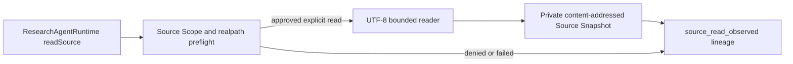

# Issue #4 Private Source Snapshot Implementation Plan

> **For agentic workers:** REQUIRED SUB-SKILL: Use superpowers:subagent-driven-development (recommended) or superpowers:executing-plans to implement this plan task-by-task. Steps use checkbox (`- [ ]`) syntax for tracking.

**Goal:** Let an approved Research Run execute one policy-bounded `read_source`, persist a structured observation, and store the exact full-file bytes in a private content-addressed Source Snapshot.

**Architecture:** `ResearchAgentRuntime` remains the public command seam. A filesystem-facing `PrivateSourceAccess` component separates policy preflight from byte capture: preflight resolves the selected approved root, rejects path/realpath/pattern/type/size violations, and has no authority to create a snapshot. Only a successful explicit read passes exact bytes to the private Artifact Store. The Journal records a sanitized `source_read_observed` fact that links an internally generated tool-call identity to the snapshot identity; the reducer revalidates status-specific invariants and cumulative byte limits.

**Tech Stack:** Node.js 24+ filesystem APIs, strict ESM TypeScript, Zod, `better-sqlite3`, Vitest, Node `crypto`, Mermaid.

---

### Task 1: Enforce Source Scope before private byte capture

**Files:**
- Create: `projects/evidence-research-agent/src/infrastructure/private-source-access.ts`
- Modify: `projects/evidence-research-agent/src/infrastructure/content-addressed-artifact-store.ts`
- Create: `projects/evidence-research-agent/tests/infrastructure/private-source-access.test.ts`

- [x] **Step 1: Write the failing policy matrix**

Use temporary fixture roots and real files. First assert that an approved UTF-8 file produces a 1-based inclusive excerpt while the snapshot contains the complete original byte sequence. Add table-driven denials for:

```ts
[
  "../outside.md",
  absoluteOutsidePath,
  "linked-outside.md",
  "excluded/hidden.md",
  ".env",
  "private.pem",
  "binary.bin",
  "oversized.md",
]
```

Cover both invalid UTF-8 and NUL-containing binary input. Prove that policy preflight/discovery and every denial leave the private snapshot namespace unchanged.

- [x] **Step 2: Run the focused test and verify RED**

Run: `pnpm exec vitest run tests/infrastructure/private-source-access.test.ts`

Expected: FAIL because `PrivateSourceAccess`, policy outcomes, and byte-oriented snapshot persistence do not exist.

- [x] **Step 3: Add separate preflight and capture results**

Define project-owned, per-field-documented types for:

```ts
interface ReadSourceRequest {
  readonly rootIndex: number;
  readonly relativePath: string;
  readonly startLine: number;
  readonly endLine: number;
}

type SourceAccessDenialCode =
  | "invalid_path"
  | "path_escape"
  | "symlink_escape"
  | "excluded_path"
  | "secret_path"
  | "extension_not_allowed"
  | "binary_file"
  | "file_too_large"
  | "source_budget_exceeded"
  | "line_range_too_large";
```

Preflight must select only `SourceScope.roots[rootIndex]`, reject absolute and traversal input before joining, resolve the approved root and candidate with `realpath`, and compare containment with `relative()` rather than string prefixes. Apply exclusions to normalized root-relative paths and a documented built-in secret-path denylist (`.env*`, private keys, credential/config token files) before content is returned. A maximum line-window constant is Harness-owned and cannot be raised by arguments.

- [x] **Step 4: Read exact bytes fail closed**

After preflight, read the candidate through a file handle, verify it is a regular file, check `stat.size` before allocation and actual byte length afterward, decode with fatal UTF-8 semantics, reject NUL-containing content, and derive the excerpt without changing the full bytes. Map expected filesystem outcomes to stable denial/failure codes; never include absolute paths, file bytes, or OS error text in public messages.

- [x] **Step 5: Add byte-oriented private snapshot persistence**

Extend `ContentAddressedArtifactStore` with a narrow method that writes the exact source bytes under a private `source-snapshots/sha256/<prefix>/<hash>` namespace using `wx`. Reuse existing content on identical bytes only after verifying it, and return a dedicated content-addressed `PersistedSourceSnapshot` with `text/plain; charset=utf-8`. Preflight and search/discovery helpers must not receive the snapshot-store capability.

- [x] **Step 6: Run policy, documentation, and type checks**

Run: `pnpm exec vitest run tests/infrastructure/private-source-access.test.ts tests/documentation/field-docs.test.ts`

Run: `pnpm typecheck`

Expected: PASS.

- [x] **Step 7: Commit Task 1**

```bash
git add projects/evidence-research-agent/src/infrastructure projects/evidence-research-agent/tests/infrastructure
git commit -m "feat: enforce approved source read policy"
```

> **最终实现说明：** follow-up hardening 在审批 binding 前把 root 冻结为 canonical path + `device`/`inode`，把 reader/reducer 共用规则拆到 `src/domain/source-policy.ts`，并增加 `private-runtime-home.ts`、专用 Source Snapshot store 与 root/policy/runtime-home 测试。Snapshot 使用独立 `PersistedSourceSnapshot`、`source-sha256:<64-lowercase-hex>` identity，以及同目录 `O_EXCL` 临时文件 + hard-link 原子发布，而不是复用普通 plan artifact identity。

### Task 2: Persist source-read observations and lineage

**Files:**
- Modify: `projects/evidence-research-agent/src/application/ports.ts`
- Modify: `projects/evidence-research-agent/src/application/research-agent-runtime.ts`
- Modify: `projects/evidence-research-agent/src/domain/types.ts`
- Modify: `projects/evidence-research-agent/src/domain/schemas.ts`
- Modify: `projects/evidence-research-agent/src/domain/reducer.ts`
- Modify: `projects/evidence-research-agent/src/application/trace-format.ts`
- Modify: `projects/evidence-research-agent/src/index.ts`
- Create: `projects/evidence-research-agent/tests/runtime/source-read.test.ts`

- [x] **Step 1: Write failing Runtime-seam tests**

Create and approve a Run, restart with `ScriptedModel([])`, then call:

```ts
await runtime.readSource({
  runId,
  request: {
    rootIndex: 0,
    relativePath: "fixture.md",
    startLine: 2,
    endLine: 4,
  },
});
```

Assert the state remains `researching`, one structured success observation contains the exact requested range and excerpt, and Trace links `toolCallId` to `sourceSnapshot.snapshotId`. Close/restart and prove the same facts replay without reading the live file again.

- [x] **Step 2: Prove content identity and non-snapshot outcomes**

Across controlled Runs, read identical bytes from two approved files and assert the same snapshot hash/path is reused. Change the live file and assert a new snapshot identity while the prior snapshot remains readable and unchanged. For every denial plus not-found/not-file/I/O failure, assert a `denied` or `failed` observation is persisted, no Source Snapshot registry metadata is registered, and Source Scope/request arguments are not silently rewritten.

- [x] **Step 3: Run focused tests and verify RED**

Run: `pnpm exec vitest run tests/runtime/source-read.test.ts`

Expected: FAIL because `readSource`, source observations, event schema, and trace lineage do not exist.

- [x] **Step 4: Add documented observation and event types**

Add a discriminated union whose shared fields include an internally generated `observationId`, `toolCallId`, literal `toolName: "read_source"`, request hash, and observed time. A success additionally carries approved root index, normalized relative path, exact inclusive line range, excerpt plus excerpt hash, complete Source Snapshot reference, and full-file byte length. A denial carries only a stable denial code; a failure carries only a stable normalized failure code. Every field requires meaningful TSDoc.

Add `source_read_observed` to `ResearchRunEvent`. Initialize `ResearchingRunState.sourceReadObservations` and `sourceBytesRead` on `plan_approved`. The reducer accepts source observations only while `researching`, validates status-specific fields and Source Snapshot content identity, rejects duplicate observation/tool-call IDs, and enforces both `SourceScope.maxTotalBytes` and `RunBudget.maxSourceBytes` without trusting the event's claimed counter.

- [x] **Step 5: Implement the application command**

`readSource` must:

1. Strictly validate the outer command and structured request.
2. Require the canonical Projection to be `researching` with a durable Plan Approval Receipt.
3. Generate tool-call and observation identities internally; callers cannot provide Receipt, actor, scope, budget, snapshot, or observation status.
4. Run filesystem I/O outside SQLite transactions through `PrivateSourceAccess` with the remaining lower source-byte limit.
5. Append exactly one sanitized `source_read_observed` event and register a Source Snapshot only for a successful explicit read, using `expectedLastSequence`.
6. Map write races to a named application conflict without blindly replaying the filesystem read.

Expected denials and failures return the updated Projection; they are not thrown as runtime failures.

- [x] **Step 6: Expose lineage without source payload leakage**

Extend `RunTraceEvent`/trace formatting with optional `toolCallId`, observation status, and Source Snapshot identity for `source_read_observed`. Do not put full snapshot bytes, absolute realpaths, OS errors, or private Runtime Home paths into Trace.

- [x] **Step 7: Run focused and regression tests**

Run: `pnpm exec vitest run tests/runtime/source-read.test.ts tests/runtime/plan-approval.test.ts tests/domain/reducer.test.ts`

Run: `pnpm check`

Expected: PASS.

- [x] **Step 8: Commit Task 2**

```bash
git add projects/evidence-research-agent/src projects/evidence-research-agent/tests/runtime projects/evidence-research-agent/tests/domain
git commit -m "feat: persist source read observations"
```

> **最终实现说明：** `SqliteRunStore` 最终使用独立、不可变的 `source_snapshots` registry，而不是通用 `artifacts` 表。成功 observation 与匹配 registry 记录必须在同一 SQLite 事务中提交；`denied`/`failed` 事件不能夹带 registry 写入。相关 follow-up 测试覆盖跨 Run 复用、registry 冲突、Journal 对应关系与重建。

### Task 3: Document the private snapshot boundary

**Files:**
- Modify: `projects/evidence-research-agent/docs/architecture.md`
- Modify: `projects/evidence-research-agent/README.md`
- Modify: `docs/superpowers/plans/2026-08-12-issue-4-private-source-snapshot.md`

- [x] **Step 1: Write the architecture documentation assertions**

Extend documentation tests only if current Mermaid checks do not already cover the new diagram. The expected state transition is a `researching` self-loop on `source_read_observed`; it must not imply that a full multi-turn Research Loop exists.

- [x] **Step 2: Update Mermaid and learning documentation**

Show the one-way capability flow:



Explain why search/path discovery cannot create a snapshot, why the full file rather than only the excerpt is frozen, how line ranges remain traceable, why denial is an observation rather than automatic scope expansion, and which remaining semantics belong to Issue #5/#6/#7.

- [x] **Step 3: Mark only completed plan steps**

Check off Task 1–3 steps only after their commands and review evidence actually pass. Do not claim `search_sources`, Evidence Records, Claims, retries, or a multi-turn loop.

- [x] **Step 4: Run final verification**

Run: `pnpm check`

Run: `pnpm build`

Expected: all runtime tests, field TSDoc audit, Mermaid parse, and TypeScript build pass.

- [x] **Step 5: Commit Task 3 and the plan**

```bash
git add docs/superpowers/plans/2026-08-12-issue-4-private-source-snapshot.md projects/evidence-research-agent/docs/architecture.md projects/evidence-research-agent/README.md projects/evidence-research-agent/tests/documentation
git commit -m "docs: explain private source snapshots"
```
