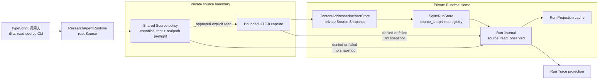
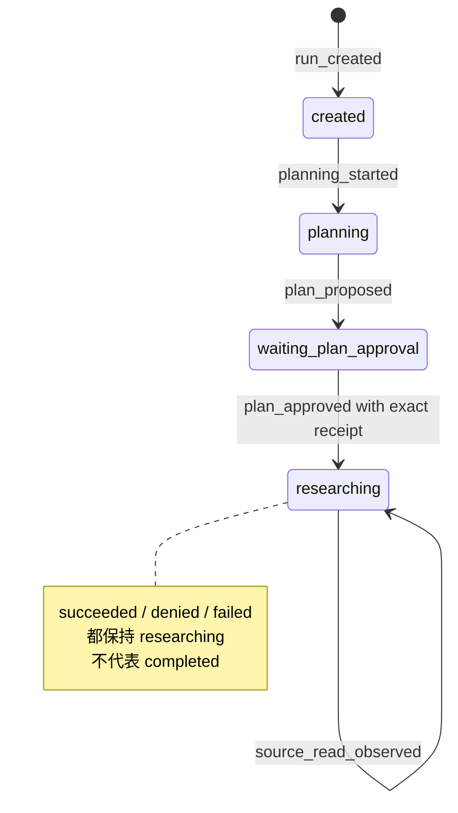

# Evidence Research Agent 架构（Issue #4）

当前 slice 已经能在 durable Plan Approval 之后，通过 `ResearchAgentRuntime.readSource` 明确读取一个批准范围内的本地 UTF-8 文件：受限摘录进入 observation，读取时看到的完整精确字节进入私有 Source Snapshot。这里仍没有 `search_sources`、模型驱动的多轮 Research Loop 或自动工具执行。

## 组件、端口与单向能力流

图中的 `Policy` 是 `PrivateSourceAccess` 与 reducer 共同使用的 Source policy。它没有 Source Snapshot 写入能力：只有 `readSource` 的成功 capture 才把完整字节交给 `ContentAddressedArtifactStore`。成功时，`SqliteRunStore` 在同一 SQLite 事务中登记独立 `source_snapshots` 记录并追加 Journal 事件；`denied` 或 `failed` 只追加已消毒的 observation，不经过 Snapshot 或 registry。图中的 `Journal --> Projection` 表示由纯 reducer 回放派生，不表示 cache 是事实源。

## 一次成功读取如何收窄权限

1. 创建 Run 时，调用方请求的每个 root 会先解析为 canonical path，并把目录的 `device`/`inode` identity 冻结进 Source Scope；Plan Approval binding 因而绑定的不是一段可被事后重新解释的路径字符串。
2. `readSource` 只接受 `runId` 与严格结构化的 `{ rootIndex, relativePath, startLine, endLine }`，并要求 Projection 为 `researching` 且已有 durable Approval Receipt。Receipt、actor、scope、budget、observation status 与 snapshot identity 均由调用方之外的边界决定。
3. `PrivateSourceAccess` 重新验证批准 root identity、相对路径形状、逐段 symlink、realpath containment、exclusion、secret denylist、扩展名、文件类型、单文件大小、累计预算和固定行窗。它通过同一 file handle 做有界读取，并在读取前后复核文件与路径 identity。
4. 完整字节必须通过 fatal UTF-8 解码且不含 NUL；1-based inclusive 行范围只决定返回的 LF 摘录，不改变即将冻结的完整原始字节。冻结全文可让以后 Evidence Record 引用同一个不随 live file 变化的版本，也保留请求范围之外的版本语境。
5. CAS identity 为 `source-sha256:<64-lowercase-hex>`。相同完整字节跨路径、跨 Run 复用同一个 snapshot；live file 字节改变会产生新 identity，旧 snapshot 保持不变。计划 JSON 仍使用通用 `artifacts` namespace，Source Snapshot 元数据则进入独立、不可变的 `source_snapshots` registry。
6. Journal 中的成功 observation（`status: "succeeded"`）保存 `observationId`、`toolCallId`、精确请求 hash、规范相对路径、行范围、摘录及其 hash、全文字节数和 `sourceSnapshot`。Run Trace 只投影安全 lineage：`toolCallId`、`observationStatus` 与 `sourceSnapshotId`，不包含源字节、绝对路径、OS 错误或 Runtime Home 路径。

Snapshot 字节写入发生在 SQLite 短事务之外；registry 与成功事件必须随后以 `expectedLastSequence` 原子对应。若并发推进导致提交冲突，runtime 不会重读 live file 或声称 observation 已持久化；提前写入但未被 Journal 引用的 CAS 对象只可能成为待后续 GC 的 orphan。

## 当前 Run 状态机

每次 `source_read_observed` 都只更新 `state.sourceReadObservations`；仅 `succeeded` 的完整 snapshot 字节数计入由 reducer 重算的 `state.sourceBytesRead`。`denied` 表示策略不授权，`failed` 表示归一化后的文件系统失败；两者都不会自动扩大 Source Scope、改写原请求、创建 snapshot 或推进到 `completed`。

## 恢复与安全边界

- Run Journal 是 canonical history。Projection cache 和 Trace 都可丢弃并从 Journal 重建；重启、inspect、trace 或 `rebuildRunProjection` 不会重新读取 live source。
- Runtime Home、snapshot namespace 目录会收紧为 `0700`，snapshot 文件为 `0600`。这依赖“同一 OS 用户不是 hostile writer”的本地运行假设；权限位不会阻止同用户进程并发改名。
- Node.js 24 没有可移植的 `openat`/`openat2` 能力边界。逐段 symlink 拒绝、`O_NOFOLLOW`、handle `fstat` 和读取前后 path/root identity 复核会对稳定可观测的变化 fail closed，但不能承诺对 hostile same-user concurrent rename 的原子隔离。
- preflight 或未来的路径发现没有 CAS/registry capability，因此路径被看见不等于内容被持久化。Issue #5 才加入 Evidence Record、Claim、最小 Evidence Gate 与发布成功路径；Issue #6 才加入真正的 `search_sources` 和有界多轮 Research Loop；Issue #7 处理错误分类与 retry；Issue #8 接入 live OpenAI-compatible Model Port。
