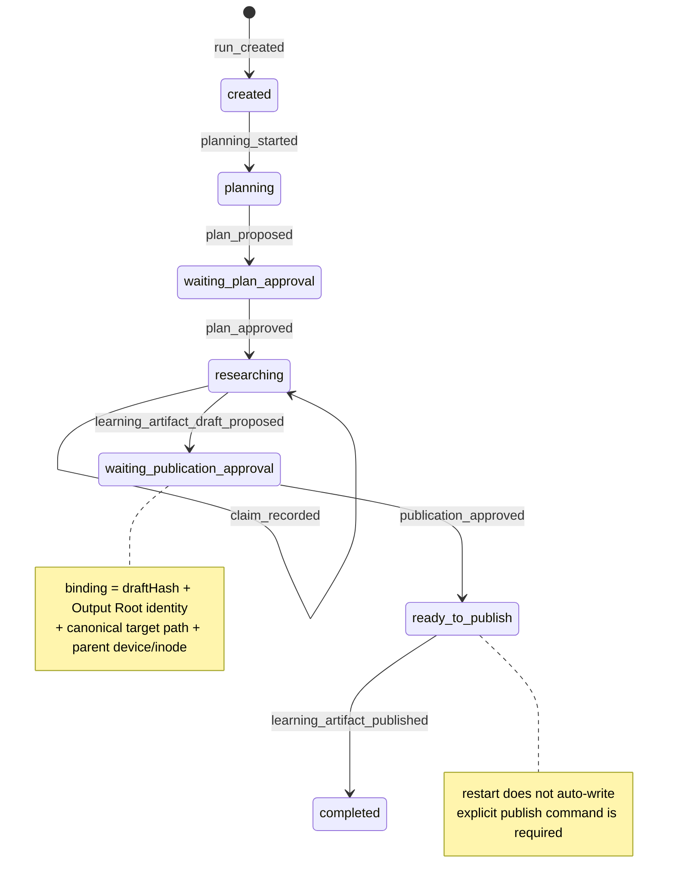

# Evidence Research Agent 架构（Issue #5）

当前 slice 已经走通一条刻意收窄的 Learning Artifact 成功路径：一个 durable approved 的 Run 显式读取来源，先冻结完整 Source Snapshot，再把其中一次成功 observation 登记为 Evidence Record，记录一个分类为 `source_fact` 的 Claim，通过 Evidence Gate 生成私有 Markdown draft，等待用户批准**精确 draft hash、Output Root 与 canonical target identity**，最后以 normal no-clobber 写入完成 publication。

这仍然不是自动研究 Agent：没有 `search_sources`、模型可见工具、自动工具调度、retry、live model 或多轮 Research Loop，也没有 publication crash reconciliation。

## 组件、端口与单向能力流

```mermaid
flowchart LR
  Caller["TypeScript caller<br/>no publication CLI"] --> Runtime["ResearchAgentRuntime"]

  subgraph SourceBoundary["Private source boundary"]
    Policy["Shared Source policy<br/>canonical root + realpath preflight"]
    Reader["Bounded UTF-8 capture"]
  end

  subgraph RuntimeHome["Private Runtime Home"]
    Snapshot["ContentAddressedArtifactStore<br/>private Source Snapshot"]
    Registry["SqliteRunStore<br/>snapshot + artifact registry"]
    Observation["Run Journal<br/>source_read_observed"]
    Evidence["evidence_recorded"]
    Claim["claim_recorded"]
    Draft["Private Markdown draft<br/>learning_artifact_draft_proposed"]
    Approval["User publication receipt<br/>publication_approved"]
    Journal["Run Journal + Projection cache"]
  end

  Gate["Evidence Gate + deterministic renderer"]
  Publisher["LearningArtifactPublisher<br/>same-directory no-clobber publish"]
  Trace["Run Trace projection"]

  Runtime --> Policy
  Policy -->|"approved explicit read"| Reader
  Reader --> Snapshot
  Snapshot --> Registry
  Registry --> Observation
  Policy -->|"denied or failed<br/>no snapshot"| Observation
  Reader -->|"denied or failed<br/>no snapshot"| Observation
  Observation --> Evidence
  Evidence --> Claim
  Claim --> Gate
  Gate --> Draft
  Draft --> Approval
  Approval --> Publisher
  Publisher --> Journal
  Observation --> Journal
  Journal --> Projection["Run Projection cache"]
  Journal --> Trace
```

`readSource` 与 Source Snapshot 的权限边界保持不变：Policy 没有 snapshot 写入能力，只有成功 explicit read 才能冻结完整原始字节；`denied`/`failed` 只落安全 observation。新增加的 Evidence Record 也没有读取 live file 的能力，它只能由 Runtime 根据一个早已持久化的成功 observation 逐字段派生：`observationId`、`toolCallId`、Snapshot identity、规范范围与 excerpt hash 都必须精确匹配。

## Evidence、Claim、Gate 与 draft 的职责分离

1. **Source Snapshot** 解决“当时看到了哪一版完整字节”。完整文件而非仅摘录被冻结，因而以后可以核对读取范围所在的同一版本。
2. **Evidence Record** 解决“哪一个已冻结来源事实可以被引用”。当前 `kind` 固定为 `source_fact`，一个成功 observation 最多登记一次 Evidence。
3. **Claim** 解决“要在学习工件中表达什么”。当前最小 slice 也显式保存 `kind: source_fact`、文本与已有 `evidenceIds`；重复、未知、空引用、未分类文本或预渲染 citation 都会被 reducer 拒绝。
4. **Evidence Gate** 在生成 draft 前检查模型选中的每个 Claim 都能通过结构化 `source_fact` Evidence 回溯，并从 Journal 重算已批准 Run Budget 的 model turns、tool calls、按 Source Snapshot identity 去重的 distinct sources、source bytes 与 wall time。没有有效 Evidence 或预算已耗尽时，Runtime 不创建 draft artifact，也不会触碰 publication target。
5. **确定性 renderer** 是唯一产生 `【Evidence: <id>】` 的位置，并固定输出 `Claims`、`Evidence Index` 和紧凑 `Tool usage` 三个部分。`ModelPort.proposeLearningArtifact` 只能提交标题、摘要和既有 Claim ID 的展示顺序；它不能创建 Claim、Evidence 或 citation ID，且 title/summary/Claim 文本中的预渲染 `【Evidence:` token 会被拒绝。因此每一个可见 citation 都来自被 Gate 选中的结构化 Evidence。

Markdown draft 写入私有通用 artifact namespace，并和引用它的 `learning_artifact_draft_proposed` 事件在同一个 SQLite 事务中注册。store 会拒绝“事件引用却没有匹配 artifact registry 行”的批次；Projection cache 与 Trace 仍从 canonical Journal 派生。

## 运行状态机与用户 publication gate

`publication_approved` 不是“文件已经写好”的断言。用户命令只批准等待状态中显示的 `draftHash`、canonical Output Root、`targetCanonicalPath`、父目录 `device` 和 `inode` 的精确聚合 hash。Runtime 在接受 receipt 前重新捕获 root 与 target parent identity；若目录被替换、target 逃出 root 或 canonical target 改变，旧 binding 失效。receipt 进入 `ready_to_publish` 后，只有显式 `publishLearningArtifact` 才会调用外部 publisher；正常 publisher 返回后才追加 `learning_artifact_published` 并进入 `completed`。

Trace 依次暴露不含源正文的 lineage：`read_source` 的 observation/tool call/Snapshot，**每个 Evidence 的相同 observation/tool call/Snapshot**，再到 Claim ID、draft artifact ID、publication receipt ID 与最终 Markdown SHA-256。这样可以从最终工件反向追到每条结构化证据实际来自哪次 Tool 调用，而不会把绝对来源路径、摘录正文、私有 Runtime Home 或 OS 错误放入 Trace。

## 正常发布语义与未实现的 crash 边界

`LearningArtifactPublisher` 不创建父目录，也不跟随 final symlink。它在经批准的同一父目录内创建 `0600`、`O_EXCL|O_NOFOLLOW` temporary file，写完并 fsync 后再用 hard-link 原子创建最终名称，最后删除 temporary file。这里没有使用普通 `rename`：Node 的可移植 `rename` 会覆盖已存在文件，而 Node 没有暴露 `renameat2(RENAME_NOREPLACE)`；hard-link publication 既保证读者看不到半成品，也能在并发存在不同内容时 fail closed。若 final regular file 已经是完全相同的字节，发布幂等成功；若内容不同则绝不覆盖。

`Output Root` 必须在 Runtime 打开时显式配置，必须是与私有 Runtime Home 不重叠的 canonical directory；publisher 只接受其内 target，并把 root 的 device/inode 绑入 approval。parent identity 与 root identity 会在写入前后复核以检测稳定可观测的替换，但不宣称能够原子隔离 hostile same-user concurrent rename。

更重要的是，本 ticket 只承诺正常返回路径：若进程在外部 publication 尝试与 Journal `learning_artifact_published` 追加之间崩溃，重启不会自动把文件存在推断为完成。Issue #14 将定义 durable effect/operation 记录与 crash reconciliation；当前用户可显式再次调用 publish，publisher 只会接受 exact identical bytes。

## 当前边界与后续 ticket

- Issue #6 才加入真正的 `search_sources`、模型可见 Research Tools 和有界多轮 Research Loop。
- Issue #7 才加入错误分类、attempt、retry/backoff 与恢复策略。
- Issue #8 才用 Vercel AI SDK `streamText` 接入 OpenAI-compatible live Model Port；SDK 类型仍隔离在 `ModelPort` 后。
- Issue #14 才把 publication 外部 effect 的 crash reconciliation 做成 durable protocol。
