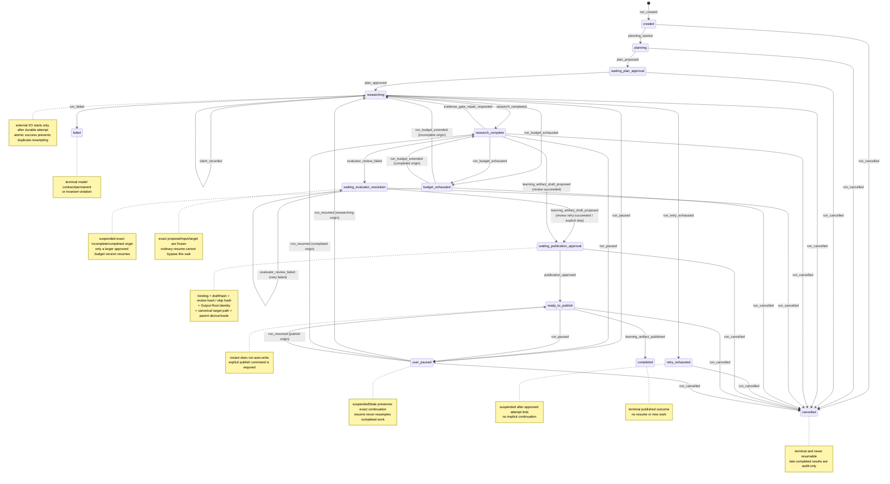
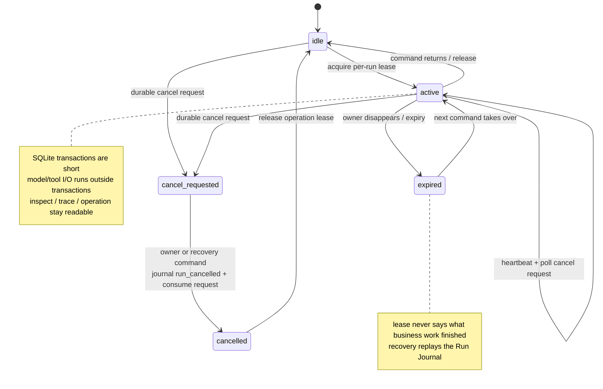

# Evidence Research Agent 架构（Issue #13）

当前 slice 在完整 Claim-to-Evidence Gate 之后增加独立 Evaluator Review：`EvaluatorPort` 只接收用户问题、Gate 选中的 Claims 与各自 cited Evidence 摘录；成功 review 写入私有 JSON CAS，失败进入 durable `waiting_evaluator_resolution`。retry 保持 exact proposal/input/target，显式 skip 记录用户事实但不伪造 verdict。最终 renderer 生成 publish-ready report，并把 review artifact hash 或 skip identity hash 绑定进 publication approval。

外层 workflow 仍由 Harness 确定性控制。Research Model 与 Evaluator 都不能审批计划、选择 Retry Policy、扩大 Source Scope、提高预算、调用 shell、绕过 Evidence Gate 或授权 publication。Evaluator 也不能看到 Model View、Run Journal 或 Research Loop history。

## 组件、端口与单向能力流

```mermaid
flowchart LR
  Caller["TypeScript caller / CLI"] --> Runtime["ResearchAgentRuntime"]
  Runtime --> Operation["Run Operation control plane<br/>lease + heartbeat + cancel request"]
  Runtime --> Harness["Deterministic Harness"]
  Operation --> Journal

  Harness <--> Journal["Run Journal"]
  Journal --> Projection["Run Projection"]
  Projection --> View["Model View Builder<br/>pinned facts + deterministic trimming"]
  View --> Model["Model Port<br/>Scripted Model / OpenAI-compatible adapter"]
  Model --> AiSdk["Vercel AI SDK Core<br/>streamText, one generation"]
  AiSdk --> Provider["OpenAI-compatible provider<br/>environment-injected transport"]
  Provider -->|"text/tool-input deltas + finish + usage"| AiSdk
  AiSdk -->|"completed provider-neutral result"| Model
  Model --> Loop["Bounded Research Loop"]
  Loop --> Attempts["Attempt controller<br/>approved policy + wall time"]
  Attempts -->|"retry_attempt_started"| Journal
  Attempts --> Retry["Retry Scheduler<br/>provider hint + bounded backoff"]
  Retry --> Attempts
  Attempts -->|"failure / exhaustion / failed"| Journal
  Attempts -->|"atomic success + Model Turn"| Journal
  Loop --> Scheduler["Research Tool Scheduler<br/>source-ordered preflight"]
  Scheduler --> SafeBatch["Safe read batch<br/>bounded concurrency"]
  Scheduler --> StateQueue["State tool queue<br/>strict sequence"]

  subgraph ResearchTools["Exactly five model-visible Research Tools"]
    Search["search_sources"]
    Read["read_source"]
    RecordEvidence["record_evidence"]
    ProposeClaim["propose_claim"]
    CompleteResearch["complete_research"]
  end

  SafeBatch --> Search
  SafeBatch --> Read
  StateQueue --> RecordEvidence
  StateQueue --> ProposeClaim
  StateQueue --> CompleteResearch

  subgraph SourceBoundary["Private source boundary"]
    Policy["Shared Source policy<br/>canonical root + realpath preflight"]
    Searcher["Fixed-argument rg<br/>bounded discovery"]
    Reader["Bounded UTF-8 capture<br/>explicit read only"]
  end

  subgraph RuntimeHome["Private Runtime Home"]
    Snapshot["ContentAddressedArtifactStore<br/>private Source Snapshot"]
    SearchArtifact["Bounded search result Artifact<br/>full matches"]
    Registry["SqliteRunStore<br/>snapshot + artifact registry"]
    Evidence["Evidence Records"]
    Claim["Claims"]
    Repair["Evidence Gate repairs<br/>stable code + action"]
    Draft["Private Markdown draft<br/>learning_artifact_draft_proposed"]
    Approval["User publication receipt<br/>publication_approved"]
  end

  Search --> Policy
  SafeBatch --> Attempts
  Policy --> Searcher
  Searcher -->|"bounded matches"| SearchArtifact
  SearchArtifact --> Registry
  Registry -->|"artifact reference + match count"| Journal
  Read --> Policy
  Policy -->|"approved explicit read"| Reader
  Reader --> Snapshot
  Snapshot --> Registry
  Registry -->|"source_read_observed + tool observation"| Journal
  Policy -->|"denied / stale / failed observation"| Journal
  RecordEvidence -->|"evidence_recorded + tool observation"| Journal
  ProposeClaim -->|"claim_recorded + tool observation"| Journal
  CompleteResearch --> Journal
  Journal --> Evidence
  Journal --> Claim
  Journal --> Repair

  Projection --> Budget["Five-dimensional Run Budget"]
  Budget -->|"hard limit"| Exhausted["budget_exhausted"]
  Caller --> Control["pause / resume / cancel<br/>extend-budget"]
  Control --> Journal
  Projection --> ResearchComplete["research_complete"]
  Gate["Deterministic Evidence Gate"]
  Evaluator["Evaluator Port<br/>isolated claims + cited evidence"]
  ReviewArtifact["Private JSON review Artifact<br/>model + prompt + input + content identity"]
  Resolution["Evaluator Resolution<br/>retry exact review / explicit skip"]
  Renderer["Deterministic publish-ready renderer"]
  Publisher["LearningArtifactPublisher<br/>same-directory no-clobber publish"]
  Trace["Run Trace projection"]

  ResearchComplete --> Gate
  Snapshot -->|"verified bytes / range / excerpt"| Gate
  Evidence --> Gate
  Claim --> Gate
  Gate -->|"evidence_gate_repair_requested"| Journal
  Repair --> View
  Gate --> Evaluator
  Evaluator -->|"valid structured verdicts"| ReviewArtifact
  ReviewArtifact --> Registry
  Evaluator -->|"evaluator_review_failed"| Journal
  Journal --> Resolution
  Resolution -->|"retry exact input"| Evaluator
  Resolution -->|"explicit skip identity"| Renderer
  ReviewArtifact --> Renderer
  Gate --> Renderer
  Renderer --> Draft
  Draft --> Approval
  Approval --> Publisher
  Publisher --> Journal
  Journal --> Trace
```

OpenAI-compatible adapter 的工具定义只有 description 与 Zod input schema，没有 AI SDK `execute`。它不设置 `stopWhen`，不使用 `ToolLoopAgent`、automatic multi-step execution、`useChat` 或 SDK message history；`maxRetries` 固定为 0，确保 AI SDK 不在 Harness 的 durable Retry Attempts 外另开隐藏 retry。`AbortSignal` 直接传给 `streamText`。adapter 只有在观察到 terminal `finish`、完整 tool calls 与 usage 后才返回；abort、stream error、缺少 finish 或 tool JSON 无法拼装时，局部 text/input deltas 被丢弃。

真实 provider 的 base URL 与 API key 只存在于环境加载和 provider transport closure。Run Journal 只保存 Experiment Identity：provider、model、adapter version、prompt version 与 Research Tool schema version。该 identity 进入 Plan Approval binding，重启时必须与当前 Model Port 精确匹配；不同模型或版本不能在同一已批准 Run 中静默替换。Trace 显示 Experiment Identity，但不显示 URL、headers、provider message/body 或 API key。

`advanceResearch` 是当前主 seam。每轮开始时，Runtime 只从 Run Journal、derived Projection 和 plan artifact 构造新的 Model View；它不会把 Journal 或完整 `messages[]` 直接传给模型。fixed rules、批准计划、approval binding、预算版本与余额、pending intents、evidence gaps、Evidence Gate repairs 和最新 steering 是 pinned facts。超过 Model View 字节上限时，Builder 先删除最旧 observations，再从尾部删除 Evidence；pinned facts 仍放不下便抛出 `ModelViewTooLargeError`，不请求 LLM 摘要隐藏约束。

Retry Policy 与 question、plan artifact、Source Scope 和 Run Budget 一起在 `run_created` 时成为 durable fact，并由 Plan Approval binding 精确授权。Runtime 重启时即使传入不同或空的本地配置，现有 Run 的下一 Retry Sequence 仍使用 Journal 中已批准的 policy；每个 sequence 的首次 attempt 又把完整 policy 冻结进 attempt，确保 sequence 中途重启时策略也不会变化。

Model generation 与 `search_sources` 都遵循同一个 attempt protocol：外部 I/O 前提交 `retry_attempt_started`；成功 Model Turn/Search observation 与 `succeeded` attempt 同事务提交；瞬时基础设施 failure 追加带 duration、safe code、provider hint 与实际 delay 的失败 attempt；未知 Model error、Model schema error 与 invariant violation 进入 terminal `failed`；达到 attempt 上限进入 suspended `retry_exhausted`。普通只读 Search failure 是 `tool_execution` observation，交回下一轮 Model View，而不是终止 Run。Search retries 共享同一 `toolCallId`，预算只计算一次逻辑调用。

provider hint 是服务端最短等待，不能被本地 backoff 上限截短；本地指数 backoff 本身受 `maxDelayMs` 限制。attempt start 初始化 Research Loop wall-time，等待也消耗该时间；每次等待后、下一外部 I/O 前重新计算批准预算，耗尽则先 durable 进入 `budget_exhausted`。因此 retry 同时受 attempt policy 与 wall-time policy 约束。

Harness 只在完整 generation 返回并通过结构 schema 后追加 `model_turn_completed`。该事件同时把有序 tool intents 变为 durable pending work；重启后的 `advanceResearch` 会先消费这些 pending intents，而不是再次 generation。scheduler 只取开头连续的 safe read intents：schema、root identity、Source Scope 与 read-byte reservation 按模型顺序执行，批准的外部 I/O 再受 `safeReadConcurrency` 限制。Artifact/Snapshot 完成后通过短 commit queue 按真实完成先后进入 Journal；reducer 只在当前 Model Turn 内按 intent ordinal 重排 observations，因而历史 turn 不漂移，下一 Model View 也不受调度影响。后续 Evidence、Claim 与 completion 继续严格顺序。

`ResearchLoopLifecycleHooks` 为测试暴露 Model Turn 以及五个 Research Tool 的命名 Fault Injection Points：Model Turn 有 Journal append 前/后；search/read 有私有 CAS 写入后与 Journal/registry 原子提交后；Evidence、Claim 和 completion 有 Journal commit 前/后。commit 前中断时 pending intent 仍是 canonical work，重启会重试；commit 后中断时 Journal 已消费 intent，重启不会重复工具。search/read 的孤立 CAS 对象不能冒充 Journal 事实。启用 Retry Policy 时 sibling searches 各自先 durable start attempt，completion 可乱序闭合；transient retry 只推进对应 Retry Sequence，并复用原逻辑 `toolCallId`。

`search_sources` 与 `read_source` 共享 Source Scope 权限边界。搜索通过可注入 `SourceSearchPort` 调用默认的固定参数 `rg` adapter，下推 extension、exclusion、secret 与 file-size 过滤，启动前复核批准 root identity，每个命中再过 realpath preflight。完整命中列表写入私有 JSON Artifact；Journal observation 只保存 artifact 引用和 `matchCount`，下一轮 Model View 再按需校验并展开最近结果。搜索仍不创建 Source Snapshot。只有成功 explicit read 才冻结完整原始 UTF-8 字节；`invalid`、`denied`、`stale` 与 `failed` 都只落安全 observation。Evidence Record 也没有读取 live file 的能力，只能由 Runtime 从已持久化的成功 observation 逐字段派生。

## Evidence、Claim、Gate 与 draft 的职责分离

1. **Source Snapshot** 解决“当时看到了哪一版完整字节”。完整文件而非仅摘录被冻结，因而以后可以核对读取范围所在的同一版本。
2. **Evidence Record** 解决“哪一个已冻结来源事实可以被引用”。当前 `kind` 固定为 `source_fact`，一个成功 observation 最多登记一次 Evidence。
3. **Claim** 解决“要在学习工件中表达什么”。`source_fact` 与 `inference` 至少引用一个既有 Evidence；`design_recommendation` 可以无 Evidence，若提供则仍必须有效。分类决定 Gate/renderer 语义，不能把 inference 或 recommendation 渲染成未标注的上游事实。
4. **Evidence Gate** 在 `research_complete` 后先检查 Claim/Evidence IDs、分类与计划审批，再把 Evidence 逐字段连接到 completed `read_source` observation。它随后按 content identity 安全读取私有 Snapshot bytes，独立重算 UTF-8 logical lines、1-based inclusive range 与 excerpt hash；live source 后续变化不参与验证。Gate 同时从 Journal 重算 model turns（包括已完成但失败的 Artifact proposal）、Research Tool calls、不同 Source Snapshots、source bytes 与 Research Loop wall time。
5. **Repair loop** 在 Gate 失败时追加 `evidence_gate_repair_requested`：事实包含稳定 code、确定性 summary/action，以及是否已消耗 Artifact proposal Model Turn。completed result 即使未通过 proposal schema，也会用 `proposal_invalid` 计入模型预算；Source Root path/device/inode 失配则在模型调用前产生 `approval_invalid`，要求新的 Run 与审批。Reducer 验证该映射后把 `research_complete` 恢复为 `researching`；下一 Model View 固定保留 repair，不将它伪装成 Research Tool call 或 runtime failure。
6. **Evaluator Review** 使用独立 port、独立 versioned prompt 和最小输入。每个 Claim 必须恰好得到一个同序 `supported`、`partially_supported`、`unsupported`、`contradicted` 或 `uncertain` verdict。成功结果进入私有 JSON Artifact；identity 同时绑定 evaluator model、prompt version、exact input hash 与 review artifact hash。failure 只持久化安全代码，进入 `waiting_evaluator_resolution`；retry 不重采样 Artifact proposal，skip 只记录 user-command identity。确定性测试也把 `ScriptedModel` 与 `ScriptedEvaluator` 分为两个 port；同一 live adapter 兼任两种能力时，仍通过不同 prompt 和最小 request 隔离 generation。
7. **确定性 renderer** 是唯一产生 `【Evidence: <id>】` 的位置。它要求 proposal summary 恰好一句话并渲染为 Conclusion，同时输出 Scope、分类 Claims/verdict、Uncertainty、Evidence Index 与 compact tool summary。Evidence Index 对共享 Evidence 去重，并展示 Snapshot/range/`read_source` lineage；tool summary 从 Journal 的 durable observations 分别计算五类 Research Tool calls，不能用 selected Evidence 数量代替。publication 执行前会再次读取 CAS Snapshot 和 review JSON，重验 bytes/hash、verdict coverage/order 与 input/review identity。

Search result 与 Markdown draft 都写入私有通用 artifact namespace，并分别和引用它们的 `research_tool_observed` / `learning_artifact_draft_proposed` 事件在同一个 SQLite 事务中注册。store 会拒绝“事件引用却没有匹配 artifact registry 行”的批次；Projection cache 与 Trace 仍从 canonical Journal 派生，且不复制 search 行正文。

## 运行状态机与用户 publication gate

`research_complete` 不是最终 terminal `completed`：它只表示模型通过 `complete_research` 显式结束调查并保存 unresolved questions，可以进入确定性 Gate。Gate failure 也不是 terminal `failed`；durable repair 会回到 `researching`，并把已完成的 Artifact proposal generation 计入模型预算。完成工具返回后 Runtime 会在 completion 的同一个 `occurredAt` 用 canonical budget calculator 再检查 Model Turn 与 wall time，并把 durable `completion.completedAt` 冻结为 Research Loop 的计费终点；之后的用户空闲或重复 `advanceResearch` 不会让合法完成的 Run 追溯耗尽。若 completion 当拍刚好耗尽，`research_completed` 与 `run_budget_exhausted` 会在同一个 SQLite transaction 中追加，最终 Run 直接成为 `budget_exhausted`，并以 `researchOutcome: research_complete` 保留 completion provenance。更早暂停保存 `researchOutcome: incomplete`。新的 Run Budget version 必须逐维不缩减、至少提高一维，并由绑定前后 canonical hashes 的用户 Receipt 授权；恢复后分别回到精确的 `researching` 或 `research_complete` origin，已有 usage 不清零。

`SuspendedRunState` 包含 plan/publication approval waits、`waiting_evaluator_resolution`、`budget_exhausted`、`retry_exhausted` 与 `user_paused`。Evaluator wait 只能由 exact retry 或 explicit skip 继续；普通 `resumeRun` 只接受 `user_paused`。user pause 和 budget exhaustion 的停留时间累加到 `suspendedDurationMs`，不计入 Research Loop wall time。`completed`、`cancelled` 与 `failed` 是不可恢复 terminal states。

取消可以先于并发外部结果成为 Journal fact。`cancelRun` 先在独立 control table 持久化 cancellation request；active owner 的 heartbeat/poll safe-point 原子提交 `run_cancelled` 与 request consumption，再 abort 当前 operation 的 provider signal。若请求者或 owner 崩溃，下一 mutation 在做业务工作前先消费 pending request。若 Model Turn、Search/read observation、Evidence、Claim、completion 或 aborted Retry Attempt 已经完整形成，Runtime 仍可把该结果追加到 `cancelledState` 供审计；reducer 始终保留外层 `cancelled`，不会执行 queued tool、进入 Gate 或推进 publication。partial stream 从未形成 completed result，因而只闭合已 durable started 的 attempt，不持久化 delta。

## Run Operation lease 与 cancellation control plane

mutating public commands validate their input, then acquire one per-run durable lease before external or Journal side effects。竞争 owner 收到 `run_busy`；不同 Runs 仍可并行。heartbeat/expiry 使用独立 control-plane clock，不计入 Run Budget wall time。`createRun` 是唯一没有既有 Run 的命令：初始 `run_created` / `planning_started` 与首个 lease 在同一 SQLite 短事务创建，随后才调用 Model Port。

publication 状态以 `researchOrigin` 判别 provenance：Issue #5 的零 Research Loop Model Turn 显式教学路径只能是 `legacy_explicit`，真正多轮路径只能是 `research_loop` 且结构上必须同时保留非空 Model Turns、tool observations、`researchStartedAt` 与 `completion`。因此 schema 和 reducer 都无法表达“有 Research Loop turns 但没有完成事实”或“零 turn 凭空带 completion”的非法组合。

`publication_approved` 也不是“文件已经写好”的断言。等待状态的 `publicationApprovalSummary` 同时显示 deterministic hard Gate 已通过的 Claim/Evidence 计数，以及 advisory evaluator warnings 或 explicit skip warning；用户无需从 verdict 反推 Gate 是否成功。用户命令批准 `draftHash`、review artifact hash 或 explicit skip identity hash、canonical Output Root、`targetCanonicalPath`、父目录 `device` 和 `inode` 的精确聚合 hash。Runtime 在接受 receipt 前重新捕获 root 与 target parent identity；若任一 component 变化，旧 binding 失效。receipt 进入 `ready_to_publish` 后，只有显式 `publishLearningArtifact` 才会调用外部 publisher；写出前重新读取 CAS review JSON 与 Source Snapshots，正常 publisher 返回后才追加 `learning_artifact_published` 并进入 terminal `completed`。

Trace 先暴露非秘密 Experiment Identity，再依次暴露不含秘密的 lineage：每个 attempt 的 Retry Sequence facts；`read_source` 的 observation/tool call/Snapshot；Evidence 与 Claim lineage；Evidence Gate repair code；Evaluator failure attempt/code/input/model/prompt identity；review artifact 或 explicit skip identity；draft evaluation hash、publication receipt ID 与最终 Markdown SHA-256。它不包含 evaluator request/review正文、绝对来源路径、provider payload、摘录正文、私有 Runtime Home 或 OS 错误。

## 正常发布语义与未实现的 crash 边界

`LearningArtifactPublisher` 不创建父目录，也不跟随 final symlink。它在经批准的同一父目录内创建 `0600`、`O_EXCL|O_NOFOLLOW` temporary file，写完并 fsync 后再用 hard-link 原子创建最终名称，最后删除 temporary file。这里没有使用普通 `rename`：Node 的可移植 `rename` 会覆盖已存在文件，而 Node 没有暴露 `renameat2(RENAME_NOREPLACE)`；hard-link publication 既保证读者看不到半成品，也能在并发存在不同内容时 fail closed。若 final regular file 已经是完全相同的字节，发布幂等成功；若内容不同则绝不覆盖。

`Output Root` 必须在 Runtime 打开时显式配置，必须是与私有 Runtime Home 不重叠的 canonical directory；publisher 只接受其内 target，并把 root 的 device/inode 绑入 approval。parent identity 与 root identity 会在写入前后复核以检测稳定可观测的替换，但不宣称能够原子隔离 hostile same-user concurrent rename。

更重要的是，本 ticket 只承诺正常返回路径：若进程在外部 publication 尝试与 Journal `learning_artifact_published` 追加之间崩溃，重启不会自动把文件存在推断为完成。Issue #14 将定义 durable effect/operation 记录与 crash reconciliation；当前用户可显式再次调用 publish，publisher 只会接受 exact identical bytes。

## 当前边界与后续 ticket

- Issue #14 才把 publication 外部 effect 的 crash reconciliation 做成 durable protocol。
